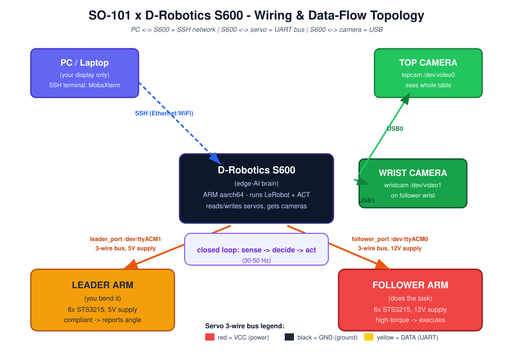

<div align="center">

<style>
@keyframes pulse { 0%{opacity:.4} 50%{opacity:1} 100%{opacity:.4} }
.live { display:inline-block; width:9px; height:9px; border-radius:50%; background:#22C55E; animation:pulse 1.6s infinite; margin-right:6px; vertical-align:middle; }
</style>

<h1 style="font-size:38px; margin-bottom:2px;">🦾 SO-101 × ACT</h1>
<h3 style="font-weight:400; color:#475569; margin-top:0;">Real-Hardware Imitation Learning Pipeline</h3>

<p style="font-size:15px; color:#334155;"><i>SO-101 dual-arm · D-Robotics S600 · HuggingFace LeRobot · ACT (Action Chunking Transformer)</i></p>

<p>
  <a href="#-my-end-to-end-embodied-intelligence-journey">Journey</a> ·
  <a href="#-why-this-is-embodied-intelligence">Why</a> ·
  <a href="#-hardware-stack">Hardware</a> ·
  <a href="#-wiring-diagram--standard-setup-steps">Wiring</a> ·
  <a href="#-software-stack">Software</a> ·
  <a href="#-environment-setup--flashing-how-to-burn">Flash</a> ·
  <a href="#-how-so-101-works--core-principles">Principles</a> ·
  <a href="#-the-teleoperation-loop">Teleop</a> ·
  <a href="#-imitation-learning--how-it-really-works">Imitation</a> ·
  <a href="#-act-deep-dive">ACT</a> ·
  <a href="#-troubleshooting">Fixes</a> ·
  <a href="#-star-for-your-resume">STAR</a>
</p>

<p>
  <span class="live"></span><b>Status: reproducible on real hardware</b>
  &nbsp;·&nbsp; 
  &nbsp; 
  &nbsp; 
</p>

</div>

---

## 🌟 What you will build

A robotic arm that **sees an object with cameras and grasps it autonomously** — learned purely from your own demonstrations, no hand-coded control.

This is the canonical **perceive → decide → act** embodied-AI loop, executed on **physical hardware**, not a simulation.

> ⚑ *Not a tutorial you watch. A pipeline you run. Every command, voltage, and error below are from a real two-day bootcamp — I ran each step myself.*

---

## 🧭 My end-to-end Embodied Intelligence Journey

> The single most important point of this repo: **I did not just read about embodied intelligence — I ran the whole stack on real hardware.** Below is the exact chain of stages I went through. Every later section is one of these stages, written from what I actually did.

```text
 ① ENV       ② FLASH       ③ WIRE        ④ CALIBRATE    ⑤ TELEOP+COLLECT
 装环境  →   烧录固件  →   硬件接线  →    标定关节     →   主从遥操数采
   │                                                              │
   └──────────────────────────────────────────────────────────────┘
                                                                  ▼
 ⑥ IMITATION  ⑦ ALGORITHM    ⑧ DEPLOY + DEBUG
 模仿学习(BC) →  ACT / DP 算法 →   自主部署 + 现场排错
```

| # | Stage | What I actually did | Embodied-AI skill shown |
|---|---|---|---|
| ① | **Environment** | Installed aarch64 Miniconda + LeRobot on the S600 edge board | Edge-AI deployment |
| ② | **Flashing** | Used XBurn to burn `product.zip` (~7.9 GB) onto the S600 | Firmware / OS bring-up |
| ③ | **Wiring** | Hooked leader/follower buses, 5V/12V supplies, dual cameras | Hardware–software interface |
| ④ | **Calibration** | Ran `lerobot-calibrate` on leader & follower | Kinesthetic baseline |
| ⑤ | **Teleop + Collect** | Bent the leader, recorded dozens of demos (cameras + joint angles) | Data collection loop |
| ⑥ | **Imitation Learning** | Understood BC; built the `(obs, action)` dataset | IL / Behavior Cloning |
| ⑦ | **Algorithm** | Trained ACT; compared with BC & Diffusion Policy (DP) | Policy learning |
| ⑧ | **Deploy + Debug** | Launched policy server + ACT client; fixed SSH/arch/pip errors | Closed-loop autonomy |

**Why this matters for an interviewer:** anyone can name "ACT" — far fewer can say *"I flashed the board, wired the servos, collected 40 demos, and watched it grasp."* That is the difference between "heard of it" and "did it." This repo is the proof.

---

## 🧠 Why this IS "Embodied Intelligence"

<div style="background:linear-gradient(135deg,#0f172a,#312e81); padding:22px 26px; border-radius:16px; color:#E2E8F0;">

**Embodied Intelligence** = an agent that carries a *body* and closes the loop **sense → decide → act** in the physical world.

Its key difference from "ordinary AI" (which only processes pixels or text): **the intelligence lives on the body, and it learns by trying with the body.**

| Ordinary AI | Embodied AI |
|---|---|
| Input: image / text | Input: **camera pixels + joint angles (proprioception)** |
| Output: label / sentence | Output: **motor commands (target angle / torque)** |
| Lives in a server | **lives on a physical body** in the real world |
| No consequence of error | Error = the arm hits itself |

The SO-101 pipeline *is* this loop made physical: cameras sense → ACT decides → servos act → cameras sense again.

</div>

> 💡 *The whole journey above is one long answer to "what is embodied intelligence?": a body that perceives, a brain that decides, and an actuator that acts — and a human who ran every link of that chain.*

---

## 🛠️ Hardware Stack

### 🧠 D-Robotics S600 (RDK edge-AI board)
The robot's **"brain computer"** — runs the model, talks to servos, receives cameras.

| Property | Detail | Interview point |
|---|---|---|
| Arch | ARM **aarch64** (64-bit ARM) | Must install **aarch64** Miniconda — x86 build won't run (real pitfall) |
| OS | RDK OS (custom Linux, real-time rt-patch) | Real-time matters for robot control |
| Role | Run LeRobot, load ACT, do inference | All training/inference here; your laptop is just a display |
| I/O | UART (servo bus) · USB (cameras) · Ethernet/WiFi (SSH) | Two media differ: PC↔S⁻S600 = network(SSH), S600↔servo = UART wire |
| AI accel | On-board BPU/NPU | Faster than CPU for real-time vision policy |

**Field milestone:** `XBurn` flash `product.zip` (~7.9 GB firmware) → board reboots → SSH in (MobaXterm / VS Code / serial `plink`) → run LeRobot. That *is* a micro embedded-deployment exercise.

### 🦾 SO-101 manipulator (HuggingFace LeRobot reference arm)
Open-source, desktop-class, 6-DOF, ideal for imitation-learning data collection.

| Param | Value | Note |
|---|---|---|
| DOF | **6 DOF** | 5 arm joints + 1 gripper |
| Actuator | Feetech **STS3215** serial-bus servo | 12-bit magnetic encoder, daisy-chain |
| Reach | ~500 mm | base → gripper tip |
| Payload | ~500 g | light objects — enough for soft grasping |
| Weight | ~800 g | PLA structure |
| Joints | all revolute | URDF open → MuJoCo / PyBullet sim |
| Comm | USB serial `/dev/ttyACM*` | bus baud 1 Mbps |
| Power | see voltage below | Std = 5V all; Pro = leader 5V / follower 12V |

**The 6 joints** (you calibrate these): `shoulder_pan`, `shoulder_lift`, `elbow_flex`, `wrist_flex`, `wrist_roll`, `gripper`. Note `wrist_roll` is continuous-rotation — calibrated separately.

### ⚡ Voltage detail — Leader 5V / Follower 12V (memorize this)

<div style="background:#FEF3C7; border-left:5px solid #F59E0B; padding:14px 18px; border-radius:10px;">

**SO-101 Pro kit (bootcamp standard):** Leader arm = **5V** supply + 7.4V servo; Follower arm = **12V** supply + 12V servo. Standard kit: both 5V.

**Why (must be able to explain):** the *follower* must generate large torque to actually grasp objects → 12V high-torque servo. The *leader* is only guided by your hand and must feel *compliant/smooth* → 5V/7.4V low-voltage servo.

**⚠ Danger:** a 12V servo on 5V = weak; a 7.4V servo on 12V = **burned out!** Always match leader/follower to its correct supply.

**Mnemonic:** *"The mover (follower) needs power → 12V; the one being bent (leader) needs smoothness → 5V."*

</div>

### 🔁 Leader vs Follower — a "demo hand" and an "executor hand"

| | Leader (you bend) | Follower (acts automatically) |
|---|---|---|
| Who moves | your hand | commanded |
| Gripper | usually none | yes (real grasp) |
| Voltage / servo | 5V / 7.4V compliant | 12V / high-torque |
| Servo mode | low torque, reports angle when bent | high torque, rotates to target |
| Role | **sensor** (reports angle) | **actuator** (does motion) |
| Port | `leader_port` (e.g. `/dev/ttyACM1`) | `follower_port` (e.g. `/dev/ttyACM0`) |

The two arms look identical (both 6-joint) and joints pair 1-to-1, but they are **not physically linked** — both connect to the S600, which relays between them.

### 📷 Cameras — the robot's "eyes"
- **Top camera** `topcam`: above the table, `/dev/video0`
- **Wrist camera** `wristcam`: on follower wrist, `/dev/video1`
- Both USB to S600; code uses `cv2.VideoCapture(0)` / `(1)`.
- A camera only turns light into a pixel matrix — **it does not think**. Learning happens in the model, not the camera.

---

## 🔌 Wiring Diagram & Standard Setup Steps

> This is the part most tutorials skip. A wrong wire = a burned servo. Below is the **physical topology** and the **step-by-step order I followed** on the bench.

### Wiring topology at a glance



*Figure 1 — PC ↔ S600 over SSH; S600 ↔ cameras over USB; S600 ↔ arms over the 3-wire UART servo bus (leader = 5V, follower = 12V). Full source: `wiring.svg`.*

### Physical wiring topology (text fallback)

```text
                    ┌──────────────────────────────────────────┐
                    │        D-Robotics S600  (the "brain")      │
                    │   runs LeRobot · ACT · reads/writes servos │
                    └──────┬───────────────┬───────────┬─────────┘
            USB0 (video0) │    USB1 (video1)│           │ UART ×2
                         │                │           │
                  ┌──────▼──────┐  ┌──────▼──────┐  ┌─▼──────────┐  ┌─▼──────────┐
                  │  TOP CAMERA │  │ WRIST CAMERA │  │ leader_port│  │follower_port
                  │  (topcam)   │  │ (wristcam)   │  │ /dev/ttyACM1│ │ /dev/ttyACM0
                  └─────────────┘  └─────────────┘  └─────┬──────┘  └─────┬──────┘
                                                         │ 3-wire bus   │ 3-wire bus
                                                ┌────────▼────────┐   ┌────▼─────────┐
                                                │ LEADER arm      │   │ FOLLOWER arm  │
                                                │ 6× STS3215      │   │ 6× STS3215     │
                                                │ supply = 5V     │   │ supply = 12V   │
                                                │ (you bend it)   │   │ (does the task)│
                                                └─────────────────┘   └───────────────┘
```

The three media, each its own job:
- **PC ↔ S600** = network (SSH)
- **S600 ↔ servo bus** = UART wire (3-wire: red=VCC, black=GND, yellow/white=DATA)
- **S600 ↔ camera** = USB

### Standard wiring steps (do them in this order)

1. **Identify leader vs follower.** Two visually identical 6-joint arms. Pick one as leader (the hand you bend), the other as follower (the hand that executes).
2. **Check the daisy-chain inside each arm.** All six STS3215 servos are chained on one 3-wire ribbon (red=VCC / black=GND / yellow=DATA), with pre-set unique IDs 1–6. Wiggle every connector — a loose ribbon is the #1 silent failure.
3. **Plug the buses into the S600.** Leader bus → `leader_port` (e.g. `/dev/ttyACM1`); follower bus → `follower_port` (`/dev/ttyACM0`).
4. **Power — triple-check the voltage before switching on.** Leader → **5V** supply (7.4V servo); follower → **12V** supply (12V servo). Reversing = burnt servo. This is the single most dangerous step.
5. **Mount & plug the cameras.** Top camera above the table → S600 USB0 (`/dev/video0`); wrist camera on the follower wrist → S600 USB1 (`/dev/video1`).
6. **Power on the S600**, connect your PC over Ethernet/WiFi, ready to SSH.
7. **Verify before coding.** `lerobot` detects both ports, reads all 6 servo IDs per arm, and both cameras stream frames → wiring is correct.

---

## 💻 Software Stack

| Tool | Role | Why it matters |
|---|---|---|
| **LeRobot** (HuggingFace) | Unified framework: calibrate / record / train / deploy | No need to write comm protocol — framework handles servo read/write/dataset |
| **Miniconda** | Isolated Python env | Avoids `externally-managed-environment` (PEP 668) on Debian |
| **MobaXterm** | SSH terminal + SFTP drag-drop | Log into S600, drag model folder |
| **VS Code Remote-SSH** | Graphical remote edit/run | Same `drobot`, nicer to code in |
| **plink / serial** | Console when no network | `plink -serial COM10` to read IP |
| **XBurn** | Flash S600 firmware | "Reinstall the OS" on the board |
| **OpenCV (cv2)** | Camera capture | `VideoCapture(0/1)` → frames |
| **ACT / DP** | The trained policy | Action Chunking Transformer / Diffusion Policy |

Dataset format: **Parquet** (joint states) + **video** (camera frames) → push to HuggingFace Hub. Device flag: `--teleop.type=so101_leader / so101_follower`.

---

## 🔥 Environment Setup & Flashing (How to burn)

> Stage ① + ② of the journey. This is "getting the robot's brain alive." Every command below is what I ran.

### Step A — Flash the S600 firmware with XBurn
1. On your PC, open **XBurn** (D-Robotics flashing utility).
2. Select the firmware image `product.zip` (~7.9 GB) provided by the instructor — it already bundles the LeRobot environment.
3. Connect the S600 via USB/serial (or network) so XBurn detects the board; put it in flash mode if required.
4. Click **Flash** and wait for the progress bar to finish (several minutes — do **not** cut power).
5. The board reboots into RDK OS automatically.
6. Get the board IP: use serial `plink -serial COMx` to read the boot log, or on the board run `ip a` and look at `eth0` / `wlan0` (ignore the `docker0` virtual NIC at `172.17.x.x`).
7. SSH in: `ssh root@<ip>` (via MobaXterm or VS Code Remote-SSH).

### Step B — Set up the software environment
1. If `ssh: connection refused` → the board is still booting; wait until port 22 is up.
2. Install **Miniconda (aarch64 build)** — an x86 wheel will not run on the ARM board.
3. `source ~/.bashrc`, then `conda create -n lerobot python=3.10` and `conda activate lerobot`.
4. `pip install -e .` inside the pre-installed `lerobot-main` folder (camp network may block GitHub port 443 → use the instructor's intranet mirror).
5. Hit `externally-managed-environment`? That is Debian (PEP 668) forbidding pip on system Python — **always pip inside the conda env**, never on the system.
6. Verify: `python -c "import lerobot"` prints nothing → environment is ready.

---

## 🔬 How SO-101 Works — Core Principles (Deep Dive)

> This section explains *why* the arm moves the way it does. Read it before you touch a servo — every later command only makes sense once these five principles click.

### ① Servo principle — a "smart motor in a box"

A **servo** is not just a motor. The Feetech **STS3215** is a *serial-bus digital servo*: inside one small package live four things:

- a **DC motor** (spins when powered),
- a **gearbox** (slows the spin, multiplies torque → the output shaft turns slowly but strongly),
- a **magnetic encoder** (a 12-bit sensor that always knows the *exact* angle of the output shaft — like a tiny compass glued to the axle),
- a **control circuit** (reads commands, compares the current angle to the target angle, drives the motor).

It runs in **position-control mode**: you send it a *target angle* (e.g. "go to 30°"); an internal **PID controller** keeps pushing the motor until the encoder reads 30°, then holds it there against gravity or a light push. You never command "spin forward" — you command "be at angle X", and the servo figures out the rest. This is why the arm can *hold a pose* on its own, without you holding it.

> 💡 *The encoder is the secret.* Because the servo always knows its own angle, the board can ask "where are you?" and get a precise number back. That number **is** the robot's **proprioception** — its sense of self.

### ② Serial-bus communication — one wire, many servos

Old-school hobby servos need one PWM wire *per* motor. SO-101 uses a **serial bus** instead:

- All six servos hang on **one 3-wire bus**: red = VCC (power), black = GND (ground), yellow/white = DATA.
- DATA is a **half-duplex UART** line — the board and the servos take turns talking on the same wire (like a walkie-talkie, not a phone call).
- Each servo has a **unique ID** (1, 2, 3 …). A packet says "ID 3, go to 45°"; only servo 3 reacts, the others stay silent.
- The bus runs at a high baud rate (≈ **1 Mbps** for the STS3215 servo bus), so reading and writing all six joints takes only milliseconds.

Why this matters: with one bus you control six (or more) joints from a single serial port — far simpler wiring than six separate PWM lines, and you also get **feedback** (angle, temperature, voltage, load) for free.

```text
   S600 serial port
        │  (one 3-wire bus, half-duplex UART)
        ├──► [ID1] servo  ┐
        ├──► [ID2] servo  │  addressed by ID,
        ├──► [ID3] servo  │  only the called one answers
        ├──► ...          ┘
        └──► [ID6] servo
```

### ③ 6-DOF kinematics — how angles become a gripper pose

The arm is a chain of **six revolute (purely rotating) joints** in series. Given the six joint angles, a bit of math — **forward kinematics** — tells you exactly **where the gripper is and how it is tilted** in 3-D space.

- 5 arm joints position & orient the hand; 1 gripper joint opens/closes.
- **6 DOF = 3 to place (x, y, z) + 3 to orient (roll, pitch, yaw)** — the minimum needed to put a gripper anywhere, any way, on a table. That is why 6-DOF is the *standard* for tabletop manipulation.
- All joints are **revolute** (pure rotation), so the arm is a simple, well-understood kinematic chain — easy to simulate (URDF → MuJoCo / PyBullet) and to control.

### ④ Leader–Follower teaching — "show, don't program"

The two arms are **physically identical** and their joints pair 1-to-1 (leader `shoulder_pan` ↔ follower `shoulder_pan`, …). They are **not bolted together** — both plug into the S600, which couples them in software.

- **Leader:** you grasp and move it by hand. Its servos run in a *compliant / torque-off* mode — they don't fight you, they just **report** their angles. It is a *sensor*.
- **Follower:** its servos run in *high-torque position-control* mode. The S600 copies the leader's angle vector and writes it as the follower's target → the follower **mirrors** your hand motion. It is an *actuator*.

This is called **kinesthetic teaching**: the human demonstrates the task by moving the leader; the follower records the paired angles. No code, no trajectory math — you *show* the robot what to do.

### ⑤ Vision & the closed loop — why it becomes "autonomous"

- **Cameras** are pure sensors: each turns light into a pixel matrix. The **top camera** sees the whole scene from above; the **wrist camera** sees the gripper's near view (egocentric). Two views = a better grasp. The camera *never thinks* — it only supplies pixels.
- Once ACT is trained, the **whole system is one high-frequency closed loop**:

```text
   sense ──► decide ──► act ──► (world changes) ──► sense …
   cameras+encoders → ACT model → target angles → servos move → cameras again
```

Because actuation is **position-control** (ACT outputs target joint angles, servos PID to them), ACT's native interface *is* exactly what SO-101 speaks — which is why ACT fits this hardware so naturally.

> ⚑ *One sentence to remember:* **servo = smart angle-holder; bus = one wire talks to all by ID; 6 joints = math places the gripper; leader shows, follower copies; cameras+model close the loop.** That is the entire "principle" of SO-101.

---

## 🔁 The Teleoperation Loop

You asked *"what connects the two arms?"* — answer: **both connect to S600**, and the board synchronizes them ~30–50×/sec by **read → copy → send**. Not a physical rod.

```text
  read      copy      send
leader ──► S600 ──► follower
(30–50 Hz)
```

1. **READ:** S600 sends `read ID:1` on bus A; leader servo 1 replies `120°`; read all 6 joints → `[120°,45°,10°,…]`
2. **COPY:** use that angle vector directly as the follower's 6-joint target
3. **SEND:** S600 sends `write ID:1→30°…` on bus B; follower servos PID to target and lock

Because one cycle is only milliseconds, the two *feel* synchronized. Leader = the **sensor** you bend; follower = the **actuator** commanded.

### Servo bus & encoder
Each STS3215 has a **12-bit magnetic encoder** — always knows its own angle. Six servos share one 3-wire bus (red=VCC, black=GND, yellow/white=DATA) on one S600 serial port. The board shouts `read ID:3`; only servo 3 answers (others ignore) — addressed by unique ID, like a walkie-talkie call sign. Data travels as **UART electrical signals (0/1 levels)**, lower & more deterministic than WiFi — ideal for real-time control. `FEETECH SCServo Debug` software: *debug page* reads angle/temp/voltage live; *program page* writes ID/limit/center to servo EEPROM.

### Calibration — why it is mandatory
`lerobot-calibrate` measures each joint's **MIN/MAX** (prevents the arm hitting itself), builds **"same pose = same number"** (so leader↔follower teleop maps correctly), and sets center/zero (natural droop = 0 or 2047). Flow: move arm to center → Enter → bend each joint (except `wrist_roll`) to extremes → Enter. Follower calibrated separately. This is the **physical baseline** for everything after.

---

## 🎓 Imitation Learning — How it really works

> Stage ⑥ of the journey. This is the *learning paradigm* behind the whole pipeline. Master this and ACT/DP become obvious.

### The big picture: IL vs RL
- **Imitation Learning (IL)** = learn by *watching an expert demonstrate*. No reward signal, no trial-and-error. You show the robot "do it like this."
- **Reinforcement Learning (RL)** = learn by *trial + reward*. The agent explores, gets scored, and keeps what scores high. Powerful but sample-inefficient and hard to reward in robotics.

For a two-day bootcamp, **IL is the only realistic choice** — you can collect dozens of good demos in an afternoon, whereas RL would need thousands of real trials.

### Behavior Cloning — the simplest IL
BC is supervised learning applied to robotics:
- You have a dataset of demonstrations `D = {(o_i, a_i)}`, where `o_i` = observation (camera frames + joint state) and `a_i` = the action the expert took.
- Train a policy `π(a | o)` to **minimize the prediction error** between its action and the demo action (e.g. MSE).
- At runtime: see observation → predict action → execute.

That is it. **ACT and Diffusion Policy are both BC methods** — they just model the `(obs → action)` mapping more cleverly than "predict one action from one frame."

### The SO-101 collect → train → infer loop

```text
   collect ─────► train ─────► infer
(demonstrate)   (learn π)     (act autonomously)
```

**① Collect (I did this hands-on).** I bent the leader; the follower mirrored it; the program recorded, for every timestep, the **dual-camera frames + leader angles + follower angles**. One *episode* = a long list of `(observation, action)` pairs. I repeated this for a few dozen episodes → a real dataset.

> ⚑ *Data quality sets the ceiling.* A shaky hand or a bad calibration → noisy demos → a shaky policy. "Stable demonstration = foundation of good imitation learning." This is exactly why the calibration stage (④) and a steady hand matter.

**② Train.** Feed the dataset to the policy network (here ACT). It learns `f(camera + joint state) → action` by reducing the BC loss. Output: a policy checkpoint.

**③ Infer.** No more bending. Live observation → model → action → follower executes → sense again. You launch **two scripts**:

| Step script | Role | Stage |
|---|---|---|
| `1_calibrate_follower` | calibrate follower | prep |
| `2_replay_episode` | replay recorded data (audit) | collect-check |
| download / audit data | get clean dataset | ① |
| `train` | train the policy (ACT/DP) | ② |
| `check` | inspect loss curve | ② |
| `3_start_policy_server` | load model as "brain" service | ②→③ |
| `4_run_act_client` | read camera+arm, drive follower ("hands") | ③ |

**Policy server = brain** (holds the model); **client = hands** (reads camera/arm, asks the brain, writes the follower). Launch both → the arm loops on its own.

### The classic IL pitfall: compounding error
A BC policy trained on single steps drifts: if at step *t* it is slightly off, at *t+1* it sees a state the expert never showed (distribution shift), and the error **compounds** until the task collapses. The whole point of **action chunking** (in ACT) and **receding-horizon control** (in DP) is to stop this cascade. Remember that — it is the bridge from "plain BC" to "ACT/DP."

---

## 🧬 ACT Deep Dive

**ACT (Action Chunking Transformer)** — imitation-learning algorithm from Stanford's **Aloha** project (Zhao et al., RSS 2023). Core problem: let a manipulator learn *smooth, robust* manipulation from *few* demonstrations.

<div style="background:linear-gradient(135deg,#EEF2FF,#C7D2FE); padding:16px 20px; border-radius:14px; border:2px solid #6366F1;">

**Input → Output**
- **Image in:** top + wrist camera → vision backbone (ResNet / DinoViT) features
- **Proprioception in:** 6 joint angles (the arm's "self-feeling")
- **Output:** a **chunk** of future actions (e.g. next 100 steps of target angles ≈ 2 s at 50 Hz; use a smaller chunk like 20–50 for fast-reactive tasks)

</div>

### Three design highlights (interview gold)

1. **⚑ Action Chunking** — predict a *sequence* of future actions at once, not step-by-step. Avoids **compounding error** (one wrong step cascades); motion stays coherent, not jittery.
2. **⚑ CVAE head** — one view often has multiple valid solutions (grab left / grab right). VAE models this *multimodality* into a latent variable → more natural motion. Train: encode demo actions; infer: sample latent → decode action.
3. **⚑ Transformer backbone** — self/cross-attention fuses *dual-camera images + joint state* (heterogeneous inputs) into global context.

### Temporal ensembling (why motion stays smooth)
**Temporal ensembling** is what makes ACT motion buttery-smooth at execution time. The model re-predicts a full *k*-step chunk every control cycle, so at any instant it holds several *overlapping* chunks. Instead of blindly executing only the newest chunk, ACT **averages** the predictions for the current timestep across all overlapping chunks (newest weighted highest). This smooths the seams between chunks and kills the jitter you would otherwise see at chunk boundaries — the robot does not "stutter" when one chunk ends and the next begins.

### Training mechanics
- Paradigm: **Behavior Cloning (BC)** — treat demos as supervised `(obs, action)` labels.
- **Loss** = MSE (predicted chunk vs demo chunk) + **KL** (keep VAE latent near standard normal).
- Backprop tunes weights until predictions match.
- **Data efficiency:** vs pure RL, imitation learns a desktop task from *dozens* of demos — perfect for a short bootcamp.

### 🔑 How ACT *embodies* the SO-101 loop
ACT is not a generic ML model dropped onto a robot — its design **matches the hardware's physics**:
- **Output = target joint angles**, which is *exactly* the native language of SO-101's position-control servos (PID chases the target). ACT speaks "servo."
- **Action chunking + temporal ensembling** exploit the 30–50 Hz closed loop: by predicting a chunk and averaging overlaps, it turns a jittery single-step policy into smooth, repeatable motion on real motors.
- **Dual-camera + proprioception input** mirrors the physical sense–decide–act loop: eyes + self-feeling in, motion out.
That fit is *why* ACT was the algorithm chosen for this hardware, not by accident.

---

## 🆚 BC vs ACT vs DP — put them side by side

> The three imitation-learning algorithms you should be able to contrast. **BC** = the baseline; **ACT** and **DP** = two smarter ways to do the same BC job.

| | **BC (single-step)** | **ACT** | **DP (Diffusion Policy)** |
|---|---|---|---|
| Paper | — (classical) | Zhao et al., **RSS 2023** (Aloha) | Chi et al., **RSS 2023 / IJRR 2024** (arXiv:2303.04137) |
| Family | Behavior Cloning | BC + CVAE + Transformer | BC via conditional DDPM |
| Action form | one step at a time | **action chunk** (k steps) | **action chunk** (k steps, receding horizon) |
| Multimodality | averages → bad in-between | CVAE latent (good) | diffusion score (best) |
| Inference cost | 1 forward pass | 1 forward pass (fast) | K denoising steps (~10 w/ DDIM, heavier) |
| Key trick | — | CVAE + temporal ensembling | iterative denoising + FiLM conditioning |
| Avoids compounding error? | ❌ yes it suffers | ✅ chunking | ✅ receding horizon |
| Best at | simple, single-mode tasks | smooth bimanual assembly | highly multimodal, high-dim actions |

**Diffusion Policy in one paragraph.** It treats the robot's visuomotor policy as a **conditional denoising diffusion process** (DDPM, Ho et al. 2020). Two changes vs image diffusion: (1) the denoised object is an **action chunk**, not a picture; (2) denoising is **conditioned on the current observation** (camera + joint state) via FiLM. Training adds noise over K steps to the demo action chunk and trains a network `εθ` to predict that noise (`L = E[‖ε − εθ(aᵏ, oₜ, k)‖²]`). At inference it starts from Gaussian noise and iteratively denoises *conditioned on the live observation*, using DDIM to cut K from ~100 to ~10 steps. It handles **multimodal action distributions** gracefully, suits high-dimensional actions, and trains stably — beating prior SOTA by **+46.9% average** on 12 tasks across 4 benchmarks. Its receding-horizon action chunk is the *same idea* as ACT's chunking; the difference is ACT uses a compact CVAE (fast, one pass) while DP uses iterative diffusion (slower, richer multimodality).

**Takeaway for your repo:** I trained **ACT** on the SO-101; I understand **DP** as the sibling method and **BC** as the shared foundation. All three are "learn `(obs→action)` from demos" — ACT/DP just fix BC's fatal flaw (compounding error) with chunking.

---

## 🗺️ Algorithm Map (BC / ACT / DP / RL / VLA / World Model)

| Concept | In bootcamp? | Interview priority | Your link |
|---|---|---|---|
| **IL / Behavior Cloning (BC)** | ✅ (foundation of ACT/DP) | ★★★★★ | main paradigm |
| **ACT** | ✅ (trained) | ★★★★★ | core |
| **DP (Diffusion Policy)** | 📚 studied, not trained | ★★★★ | understand & contrast |
| Teleop / data collection | ✅ | ★★★★★ | done hands-on |
| **RL** | partial (your side-line) | ★★★★ | side-line |
| **VLA** | ✅ (loaded pretrained) | ★★★★ | touched |
| **World Model** | ❌ (frontier) | ★★★ | know it |
| **Point Cloud / 3D** | ❌ (other track) | ★★★ | future |

- **IL:** learn from expert demos, not rewards. BC = supervised on `(obs,action)`. **DAgger** = learner tries, expert relabels, fixes distribution shift. Pain: *compounding error* / *distribution shift*. ACT's chunking & DP's receding horizon attack exactly this.
- **RL:** learn optimal policy by trial+reward. PPO / SAC / TD3 / DDPG. Hard in robotics: costly real trials, tricky reward, low sample efficiency. Combine: BC pretrain → RL finetune (RLPD, AWAC, DPO).
- **VLA (Vision-Language-Action):** foundation model, input `image + language` → `action sequence`, understands human commands. RT-1/RT-2, OpenVLA, Octo, π0. ACT/DP can't take language; VLA can, but heavier. Your `vla_class_pub2` is this class — load & run directly.
- **World Model:** learns dynamics `given (state,action) predict next state` — an internal simulator. Dreamer, JEPA, UniSim, Genie. Use: model-based RL in latent space, data augmentation, "what happens if I do this" safety. More upstream than ACT.

---

## 🛠️ Troubleshooting (real field errors)

<details style="border:1px solid #e2e8f0; border-radius:10px; padding:8px 14px; margin:8px 0;">
<summary><b>🔥 S600 SSH refused after flashing</b></summary>

**Cause:** board is rebooting/flashing, port 22 not up.<br/>
**Fix:** wait for the flash bar to finish & board fully boot, then `Test-NetConnection` port 22.
</details>

<details style="border:1px solid #e2e8f0; border-radius:10px; padding:8px 14px; margin:8px 0;">
<summary><b>🔥 <code>conda: command not found</code></b></summary>

**Cause:** fresh-flashed system, conda not installed.<br/>
**Fix:** install **Miniconda (aarch64)**, then `source ~/.bashrc`.
</details>

<details style="border:1px solid #e2e8f0; border-radius:10px; padding:8px 14px; margin:8px 0;">
<summary><b>🔥 <code>externally-managed-environment</code> (pip blocked)</b></summary>

**Cause:** Debian forbids pip polluting system Python (PEP 668).<br/>
**Fix:** create conda/venv, `pip` inside the env.
</details>

<details style="border:1px solid #e2e8f0; border-radius:10px; padding:8px 14px; margin:8px 0;">
<summary><b>🔥 Wrong Miniconda arch (x86 on aarch64)</b></summary>

**Cause:** installed x86 wheel on ARM board → won't run.<br/>
**Fix:** re-download **aarch64** build; if half-installed, `rm -rf ~/miniconda3` then reinstall.
</details>

<details style="border:1px solid #e2e8f0; border-radius:10px; padding:8px 14px; margin:8px 0;">
<summary><b>🔥 Servo not moving / wrong ID</b></summary>

**Cause:** loose 3-wire ribbon, or two servos share an ID on the bus.<br/>
**Fix:** reseat the ribbon; use FEETECH SCServo Debug → program page to set a unique ID per joint (1–6).
</details>

<details style="border:1px solid #e2e8f0; border-radius:10px; padding:8px 14px; margin:8px 0;">
<summary><b>🔥 <code>scp</code> folder fails "is not a regular file"</b></summary>

**Cause:** plain `scp` moves one file; folders need `-r`.<br/>
**Fix:** `scp -r` or `Compress-Archive` to zip first.
</details>

<details style="border:1px solid #e2e8f0; border-radius:10px; padding:8px 14px; margin:8px 0;">
<summary><b>🔥 <code>git clone</code> GitHub port 443 blocked</b></summary>

**Cause:** camp network limits external internet.<br/>
**Fix:** code pre-installed in `lerobot-main`; ask instructor for intranet mirror if needed.
</details>

<details style="border:1px solid #e2e8f0; border-radius:10px; padding:8px 14px; margin:8px 0;">
<summary><b>🔥 Only see docker0 IP (172.17.0.1)</b></summary>

**Cause:** that's Docker's virtual NIC, not the real IP.<br/>
**Fix:** `ip a` → look at `eth0` / `wlan0` real IP.
</details>

> 💡 *80% of robotics engineering is "getting the environment to run". Read the **last real error line** — don't panic at the ENOENT noise.*

---

## ⭐ STAR for your resume

Package the bootcamp as one tellable project. Interviewers want: *what you did, how, result, what it shows.*

| STAR | Say |
|---|---|
| **S**ituation | Zero-base mechanical grad; joined an on-site embodied-AI bootcamp to run the robot-learning pipeline hands-on, end to end |
| **T**ask | On SO-101 dual-arm + S600, complete environment setup → firmware flashing → wiring → calibration → teleop collection → imitation learning (BC) → ACT/DP training → autonomous deployment |
| **A**ction | Flashed S600 with XBurn; installed aarch64 Miniconda + LeRobot over SSH; wired leader(5V)/follower(12V) buses + dual cameras; calibrated both arms; teleop-collected dozens of demos; trained ACT (understood BC foundation & DP sibling); deployed policy server + client for autonomous grasp. *Solved SSH drops, wrong conda arch, Debian pip block, servo ID clashes.* |
| **R**esult | Arm autonomously grasps from dual-camera vision; full command of the collect→train→infer embodied loop; clear plan to deepen force/tactile sensing |

**Interview Q&A you must own:**
- *How do leader/follower sync?* → both on S600; board reads leader & writes follower ~30–50 Hz; bus addressed by servo ID; not physically linked.
- *Why 12V follower / 5V leader?* → follower needs torque to grasp; leader needs compliance to be guided; reverse = burnout.
- *BC vs ACT vs DP?* → BC predicts single steps (suffers compounding error); ACT adds CVAE + chunking + temporal ensembling (fast, smooth); DP adds iterative diffusion denoising (richest multimodality, heavier). All are "learn (obs→action) from demos."
- *Why ACT fits SO-101?* → its output (target joint angles) is exactly the servo's position-control language; chunking exploits the 30–50 Hz loop.
- *How does the camera "know" the arm?* → it only outputs pixels; the model learns the (frame,action) association from data.

---

## 🚀 What's next

Port this IL pipeline onto **soft actuators** — compliance control → policy → gentle contact. That is where soft-robotics **body** meets learning **brain**.

<sub>Built from a real Xbotics bootcamp report. Last updated 2026-08-15.</sub>