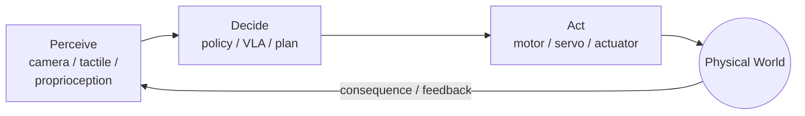
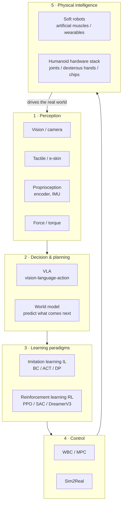

# Lecture 01 — What is Embodied Intelligence? (Definition, Closed Loop, Research Landscape)

> **Meta**
> - Date: 2026-08-15 (Saturday)
> - Lecture / Day: Lecture 01 — the *first* lecture of the study plan (Day 1)
> - Plan anchor: `study-plan-60d.md` → **P1 概念入门 (Concept Primer)**, course episodes **001–007**
> - Goal of today: draw a "map" in your head — what embodied intelligence is, what its core loop is, and what the field's research cuts look like. Be able to mirror-talk it in 3 minutes; no code today.

---

## 0. One-line summary

> **Embodied Intelligence (EI)** = an intelligent agent that lives in the real physical world **with a body**. It learns and acts through a continuously spinning loop: **perceive the world → decide → act with the body → observe the result → decide again…**.
> The exact opposite of "AI without a body" (a chatbot that only types). **The body isn't a peripheral; the body itself is half of intelligence.**

> 📌 **Scope of this lecture**: episodes 001–005 cover concept, architecture, challenges, research directions and industry demos; 006–007 (servo principle, stepper and brushless motors) are the "hardware appetizer" the course places at the end of the concept chapter — their full teardown is Day 2 (P2 Hardware). Today, nail the "concept" half.

---

## 1. Core definition: intelligence is "two halves" stuck together

When most people think of "AI", they picture a brain in a box. Embodied intelligence insists on the other half:

| Half | What it is | What it looks like on a robot |
|---|---|---|
| **Brain (algorithm / intelligence)** | perception, decision, learning | VLA, world models, imitation / reinforcement learning |
| **Body (本体)** | mechanisms, actuators, sensors, materials | robot arm, actuators, encoders, cameras |

The defining idea is the **closed loop**:

This loop never stops while the robot is "alive." That is why it is called **embodied**: intelligence is *situated in* and *shaped by* a body interacting with the world.

**Key historical anchor (cite it):** Rodney Brooks, *"Elephants Don't Play Chess"* (1990) and *"Intelligence Without Representation"* (1991). His core argument: smart behavior can emerge from simple body-grounded reactions, not from a giant symbolic world-model. This is the philosophical root of EI.

### 1.1 Why "body" matters (this is principle, not slogan)

1. **Moravec's Paradox.** High-level reasoning (math, language) is "easy" for computers; low-level "sense + act" skills (grab a cup, walk two steps) are "hugely hard". We've spent decades cracking the upper half and are still wrestling with what kids do casually. → Embodied intelligence is the hard frontier that remains.
2. **The body both constrains and shapes the brain.** A soft, continuously deforming body and a rigid 6-axis arm speak totally different mathematics. Soft actuators have infinite dimensions, nonlinearity, and hysteresis (push it, it slowly responds and doesn't return to the original shape) — there's no clean closed-form equation; you have to **treat it as a black box and learn from data**. That's exactly the modern EI way of thinking.
3. **Data comes from "interaction".** Language models learn from others' already-written text; robots must **move themselves, see the result**, to accumulate their own training data. **A body = the ability to produce your own experience.**

### 1.2 The course's four-layer architecture + four challenges (episodes 002, 003)

**Architecture (002): how the robot's brain and body divide the work** — the course splits the robot into four layers, a pipeline:

| Layer | What it does | Example |
|---|---|---|
| **Perceive** | turn the world into data (camera → pixels, encoder → angle) | camera, LiDAR, tactile |
| **Decide** | decide "what to do next" from perception (policy, planning) | VLA, path planning |
| **Control** | turn "the decision" into precise torque/angle commands | PID, WBC, MPC |
| **Execute** | motors/servos actually move and act on the world | servo, reduction, gripper |

> Don't mix these two up: the **four-layer pipeline** above is the *runtime* division of labor (how it runs); the **5-station map** in §2 is the *research* cut (what the field studies). One is "how it runs," the other is "what to research."

**Four challenges (003): why embodied intelligence is so hard** — the course groups them into four mountains:

| Challenge | Plain words | Why it's hard |
|---|---|---|
| 1 Perception ambiguity | the same scene can mean several things | sensor noise, occlusion, lighting changes |
| 2 Long-horizon decision | one task needs many steps in a row | one wrong step breaks the chain; sparse reward |
| 3 Compliant control | touch requires "gentle," not stiff | force control is harder than position; soft/compliant is even harder to model |
| 4 Data scarcity | real-robot data is scarce and expensive | can't scrape it like text; must generate it by moving |

> These four mountains map to the next 60 days: perception ambiguity → OpenCV/deep learning; long-horizon decision → world models/planning; compliant control → PID/force control; data scarcity → simulation (Sim2Real) + imitation learning. **Remember the four names now; each gets its own chapter later.**

<mark>**📌 Slide supplement 1 | A paradigm shift: from "computational" to "physical" intelligence.** Past AI (LLMs) is **computational intelligence** — it lives in data and virtual environments, outputs a piece of text/image and stops; embodied intelligence is **physical intelligence** — it perceives and *actively changes* the physical world. This is a leap from "digital" to "physical", not just bolting a ChatGPT onto a robot.</mark>

<mark>**📌 Slide supplement 2 | Traditional robotics vs traditional AI.** Traditional robotics emphasizes "precise control, motion planning, dynamics models (model-based)" — precise, reproducible motions in known environments; traditional AI/LLM emphasizes "pattern recognition and generation in data", a fundamentally non-physical "brain". **Embodied intelligence = robotics' "body" + AI's "brain"**, a hybrid Data-driven + Model-based paradigm.</mark>

<mark>**📌 Slide supplement 3 | Real-time closed loop is the key difference.** Traditional LLM training is "offline, open-loop" — data → training → model → output (one-shot), the model gets no environment feedback; embodied intelligence is "real-time, closed-loop" — perceive → decide → act ↻ feedback → new perception… The agent keeps learning in the "act-perceive" cycle — the foundation of physical intelligence. This is the engineering meaning of the "loop" in §0.</mark>

<mark>**📌 Slide supplement 4 | The four-layer technology stack (another cut).** ① **Application layer** (industry/home/special-ops/medical) ② **Algorithm/cognition layer** (perception CV, decision LLM/RL, control PID/inverse-kinematics) ③ **Software/system layer** (ROS, simulation, protocols like WebSocket·DDS·gRPC) ④ **Hardware layer** (motors/reducers/sensors/compute). Our whole 60 days builds bottom-up, layer by layer. Note this is a *different dimension* from "perceive → decide → control → execute" above: one is "how the system is built in layers", the other is "how it divides work at runtime".</mark>

<mark>**📌 Slide supplement 5 | Another "four challenges" (engineering view).** ① **Sim-to-Real Gap** (simulation vs reality) ② **Data sparsity** (robot trial-and-error is expensive, interaction data is scarce) ③ **Generalization** (specialist → generalist) ④ **Safety & interpretability**. Note: these four mountains and the four above (perception ambiguity / long-horizon / compliant control / data scarcity) are **two different lenses** — the former is "engineering deployment", the latter is "capability difficulty". Don't conflate them.</mark>

### 1.3 Hardware appetizer: three motors in one line (006–007; full teardown on Day 2)

The concept chapter ends with three "muscles of the body" to recognize; today you only need to tell "which turns accurately, which turns fast":

| Motor | One line | Trait |
|---|---|---|
| **Servo** | motor + reduction + feedback — a module that "aims its own angle" | angle closed-loop, cheap, good for joints |
| **Stepper** | one pulse = one fixed small step | accurate even open-loop, strong at low speed, but can "lose steps" |
| **Brushless (BLDC)** | high-speed motor with electronic commutation | fast, efficient, long-lived, but needs a driver + encoder |

> Don't memorize specs; remember this: **need "an exact angle" → servo; need "slow, steady motion" → stepper; need "high speed + power" → brushless.** Day 2 (008–012) opens up the servo's reduction and feedback in detail.

---

## 2. The research landscape (memorize this shape)

Think of embodied intelligence as **a ring** with **5 stations**. Today you only need to **name each station and know where it sits**; the later stages will dig in one by one.

**5 stations + landmark works (today, just recognize the names):**

| Station | One line | Landmark (just name-drop) |
|---|---|---|
| 1 Perception | "eyes, skin, and the muscle's own sense" | — |
| 2 Decision · VLA | "see + hear command → directly output action" | RT-2 (Google, 2023); OpenVLA (2023, open-source 7B); π₀ (Physical Intelligence, 2024) |
| 2 Decision · World model | "rehearse the next frame in the head, then decide" | Ha & Schmidhuber, *World Models* (2018); Dreamer |
| 3 Learning · Imitation (BC/ACT/DP) | "watch an expert, then copy" | **ACT** — Zhao et al., RSS 2023 (Stanford ALOHA); **Diffusion Policy** — Chi et al., RSS 2023 (arXiv:2303.04137) |
| 3 Learning · RL | "trial and error, chase the reward" | PPO (Schulman 2017); SAC; DreamerV3 |
| 4 Control | "turn the plan into real torque" | WBC / MPC; Sim2Real (sim-to-real) |
| 5 Physical intelligence · Soft robot | "a soft, muscle-like body" | soft robots / artificial muscles / wearables |

> **Tool seed:** `LeRobot` (Hugging Face's open-source library) is the platform for running imitation learning — it can run ACT / Diffusion Policy on cheap hardware like the SO-101. The `so101-act/` repo already has practice. Keep this connection — this lecture (P1) is "why"; `so101-act` is "the evidence."

---

## 3. Principles to internalize (why it works)

1. **The "perceive → think → act" loop is the smallest unit of intelligence.** Not "a smart model", but "a model that constantly self-corrects through a loop".
2. **Data is the fuel; the body is the refinery.** You can't download a robot's experience — it has to **generate it itself** (teleop, simulation). That's why datasets (e.g. LeRobot's), simulators (Isaac Lab, MuJoCo) and algorithms matter equally.
3. **Imitation (IL) first, trial-and-error (RL) after, world models fill the gap.** Modern division of labor: copy the expert to 80% (cheap, IL/BC), then reward-tune the tail (RL), use world models for long-horizon when data is scarce.
4. **The body redefines the "action space".** A rigid arm's action = 6 joint angles; a soft gripper's action = voltage → continuous deformation. **Same algorithm family, the body speaks a different language** — that is the research entry point.

---

## 4. Today's operation steps (study workflow, not coding)

1. **Read this file once** (you are here).
2. **Hand-draw the two diagrams on paper** (the closed loop + the 5-station map). Don't copy-paste — drawing forces the structure into your head.
3. **Skim 2 papers (no deep read):** ACT (RSS 2023) and Diffusion Policy (arXiv:2303.04137). Just read the abstract + Figure 1, to recognize them.
4. **Mirror test (checkpoint):** close everything, speak for 3 minutes: *"Embodied intelligence is ___; the loop is ___; the five stations are ___; the soft robot belongs to station ___."*
5. **Write 3 sentences** explaining the relation between "body" and "brain".
6. **(Later)** when you reach the BC episodes, reproduce an ACT demo in LeRobot's simulator. Not today.

> ✅ **Definition of "done today":** mirror test passed, and the map drawn.

---

## 5. Common misconceptions & easy mistakes

| # | Misconception | Reality |
|---|---|---|
| 1 | "Embodied AI = bolting a ChatGPT onto a robot." | Wrong. A chatbot only *talks*; embodied intelligence *acts* and *feels consequences*. Language is just one input, not the whole brain. |
| 2 | "Bigger model + more data = always smarter robot." | Embodied AI needs the **right** data (interaction data), not more text. Real-robot data is scarce and expensive — hence Sim2Real and "learn from a few demos" imitation learning. |
| 3 | "Imitation learning and reinforcement learning are basically the same." | Imitation = copy the expert (supervised, cheap, but blind to novelty); RL = learn by reward-driven trial-and-error (explores, needs simulation/safety, sample-hungry). They are **complementary, used in relay**. |
| 4 | "VLA and world model are the same thing." | VLA directly maps "see + hear → action"; a world model predicts the future so the agent can plan in its head. Often used together, but two distinct concepts. |
| 5 | "Soft robots have nothing to do with AI." | The opposite — **the body** is half of embodied intelligence. Soft actuators simply give the algorithm a richer (harder) action space to learn to "speak". |
| 6 | "As a mechanical student, the AI / algorithm side is someone else's job." | The essence of EI is the **body–brain interface**. Mechanical intuition is itself part of the research; learn the brain's vocabulary, but don't outsource the body. |
| 7 | "You have to understand every formula before starting." | No. First grab the **map and the loop** (this lecture); formulas come when you hit their station. Top-down first, then bottom-up. |

---

## 6. Next steps / checkpoint

- **Checkpoint passed if:** you can draw the closed loop + 5-station map by hand and pass the 3-min mirror test.
- **Next lecture (Day 2):** **Hardware** — actuators, reduction gears, angle sensors, 3D printing (episodes 008–012). The parts that make a robot actually *move*.
- **This week's seed:** keep `LeRobot` and `so101-act/` in mind as the physical evidence that "this map is real, not a castle in the air".

---

### References (for later, not required today)
- Brooks, R. (1990). *Elephants Don't Play Chess*.
- Brooks, R. (1991). *Intelligence Without Representation*.
- Zhao et al. (2023). ACT, *Learning Fine-Grained Bimanual Manipulation with Low-Cost Hardware*. RSS 2023.
- Chi et al. (2023). *Diffusion Policy*. RSS 2023. arXiv:2303.04137.
- Brohan et al. (2023). RT-2: vision-language-action model. Google.
- Ha & Schmidhuber (2018). *World Models*. arXiv:1803.10122.
- Hugging Face. LeRobot (open-source imitation-learning library, supports SO-101).