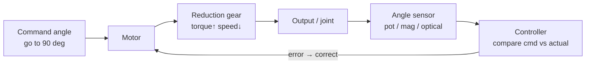

# Lecture 02 — How a Robot's "Muscles & Joints" Are Built (Actuators, Gear Reduction, Sensors, 3D Printing)

> **Meta**
> - Date: 2026-08-15 (Saturday)
> - Lecture / Day: Lecture 02 — the *second* lecture of the study plan (Day 2)
> - Plan anchor: `study-plan-60d.md` → **P2 硬件实体 (Hardware)**, course episodes **008–012**
> - Goal of today: understand what physical parts make a robot arm *move* — how a motor gets torque, how angle is *read back*, and how structural parts get printed from a computer. As a mechanical-engineering student, **this lecture is your comfort zone** — use it to build confidence.

---

## 0. One-line summary

> A robot moves through an **actuator chain**: **motor (force) → reduction gear (amplify torque, slow speed) → angle sensor (report "how far I turned") → structural part (deliver force where it's needed)**. An *encoder servo* = motor + reduction + angle feedback, already a **self-correcting mini closed loop**.
> The key line: a **rigid servo** is "motor + gear + encoder"; a **soft actuator** is a different path — electric field deforms the material directly, no gears, no off-the-shelf encoder. These two are the two answers to the "body" half of embodied intelligence.

---

## 1. Core knowledge (what these 5 episodes are about)

| # | Title | Key point |
|---|---|---|
| 008 | 减速齿轮提升扭矩 (Reduction gear boosts torque) | small gear drives big gear = **more force, slower speed** (like a low gear climbing a hill) |
| 009 | 阻尼齿轮介绍 (Damping / anti-backlash gear) | a gear that **eliminates the gap (backlash)** between meshing teeth, so forward/reverse motion has no "play" or slack |
| 010 | 角度传感器的介绍 (Angle sensor) | turns "how many degrees" into an electrical signal: potentiometer / magnetic encoder / optical |
| 011 | 3d结构的设计和打印 (3D structure design & print) | parts aren't bought, they're drawn then **printed**: model (STL) → slice → print layer by layer |
| 012 | 编码器舵机的设计 (Encoder servo) | a basic servo is already a "motor+reduction+driver+feedback" mini-loop; an encoder servo swaps in a high-res encoder and exposes the angle |

### 1.1 Reduction gear: why "slower" means "stronger"

A gear's essence is **redistributing** the motor's power. Power ≈ torque × angular speed, roughly conserved (ignoring losses):
- the small (motor-side) gear spins fast with low torque;
- the large (output) gear is driven slowly but, per revolution, applies **much more force**.

Analogy: a jar lid you can't open by hand opens with a wrench — you didn't get stronger, the **lever traded speed for torque**. A robot arm needs reduction to amplify the motor's small torque for lifting.

**One number to know: the reduction ratio.** Reduction ratio = input speed ÷ output speed (e.g., 50:1 = speed drops to 1/50, ideal torque ×50). When picking a servo, watch two units: **kg·cm** (servo convention) and **N·m** (SI), roughly **1 kg·cm ≈ 0.098 N·m**. To size a gripper's payload, work backwards: end torque = motor torque × reduction ratio × efficiency.

<mark>**📌 Slide supplement | Deriving the reduction ratio from first principles.** Power `P = τ × ω` (torque × angular speed). An ideal frictionless gear conserves energy: `P_in ≈ P_out`, i.e. `τ_in × ω_in ≈ τ_out × ω_out`, which rearranges to **`τ_out / τ_in ≈ ω_in / ω_out`** — torque ratio is the inverse of speed ratio. Define **reduction ratio `i = ω_in / ω_out`** (input speed ÷ output speed), then **`τ_out ≈ τ_in × i`**: output torque ≈ input torque × ratio. Bigger ratio = more force, slower speed — the math behind "trading speed for strength". It's exactly a car's gearbox: first gear (small drives large) has i > 1, slow but climbs well; fifth gear (large drives small) has i < 1, fast but weak.</mark>

### 1.2 Damping / anti-backlash gear: killing the "play"

Meshing gears have a natural gap (backlash). When you reverse direction, you must "eat" that gap before motion starts — showing up as **dead zone, position slack, jitter**. A damping / double-spring anti-backlash gear preloads the gap shut so both directions are solid.

> Note: backlash is a silent killer in **position control** — you command 10°, it may "free-spin" 1° in the gap first, and across a multi-joint arm the error accumulates into drift.

### 1.3 Angle sensor: letting the machine "know where it is"

The motor turns, but the **controller must know the angle** to correct it. Three common types:
- **Potentiometer**: wiper changes resistance; cheap but wears out, has dead zone;
- **Magnetic encoder**: magnetic field measures angle; contactless, high precision, long life (now mainstream);
- **Optical encoder**: light grating counts; very high precision but dirt-sensitive.

This ties straight back to Lecture 01's loop: **the angle sensor *is* the hardware of proprioception** — the robot's organ for "feeling its own muscle position."

<mark>**📌 Slide supplement 1 | How a potentiometer works (voltage divider).** A potentiometer is a **variable resistor** — a wiper slides over resistive material, changing the resistance in circuit. In a **voltage-divider circuit**, the output voltage is `V_out = V_in × (R_part / R_total)`; because rotation angle is proportional to `R_part`, **angle is proportional to V_out**. Signal chain: mechanical angle → resistance → analog voltage (0–5V) → controller ADC (analog-to-digital) → digital value (e.g. 0–1023) → upper layer infers the angle. Crack open an SG90 servo and you'll find exactly this potentiometer — its "contact-based, wearing, limited-precision" nature caps the performance of cheap servos.</mark>

<mark>**📌 Slide supplement 2 | Magnetic encoders: absolute vs incremental.** A magnetic encoder = a radially-magnetized magnet (spins with the shaft) + a sensor chip (uses Hall effect / magnetoresistance to sense field direction), contactless, noise-immune, high precision. Two outputs: **absolute** — reports "current angle is 135.7°" over SPI/I²C, **knows position on power-up, no homing needed**; **incremental** — outputs A/B quadrature pulses, the controller counts pulses for angle and reads phase for direction, simpler circuit but **loses position on power-off, needs homing**. High-end servos, industrial joints, and drone gimbals use magnetic encoders — the standard for high-precision robot control.</mark>

### 1.4 3D printing: turning a mental structure into a real one

Flow: **CAD model → export STL → slicer cuts it into layers → printer stacks layers**.
- Pros: structural parts are customizable, fit servos/boards exactly;
- Pitfall: printing has tolerance; 10.00 mm on CAD may come out 9.8 mm, so **leave margin** on holes.

### 1.5 Encoder servo: a self-correcting mini loop

Pack "motor + reduction + driver + feedback" into one module = **servo**; it is already a mini closed loop (potentiometer feedback, just low-resolution and not exposed). Swap in a high-res **encoder** and expose the angle, and it becomes an **encoder servo**: you say "go to 90°," it internally measures the actual angle and keeps adjusting until aligned, and also reports the current angle to the upper-layer algorithm. **This is already a miniature "perceive → decide → act" loop** — same principle as Lecture 01's big loop, just shrunk into a palm-sized motor.

<mark>**📌 Slide supplement | The three motors, fully compared (servo / stepper / brushless)**</mark>

<mark>**① Servo = a tightly-integrated module of motor + transmission + sensing + control**, inherently closed-loop. Four parts: DC motor (raw power) → reduction gear train (slow down, boost torque) → position sensor (usually a potentiometer, reads output-shaft angle) → control circuit (a micro PID that takes the command and closes the loop). **The control signal is PWM (pulse-width modulation)**: you vary the high-level duration of a square wave to issue the command. Internal loop: control circuit receives PWM → parses target angle (Target) → potentiometer reads current angle (Current) → computes `Error = Target − Current` → built-in PID drives the motor forward/reverse → loops until error ≈ 0. **One line: give it a target, it goes there by itself** — so servos are "easy, self-feeding-back, disturbance-rejecting", but limited in precision, with a fixed (non-tunable) PID and wearing gears.</mark>

<mark>**② Stepper = the physical executor of the digital world, open-loop.** Principle: energize phase coils in sequence to build a rotating magnetic field that "pulls" a toothed rotor one precise step at a time; `angle turned = steps × step angle`. **Three drive modes**: wave (one coil energized at a time, low torque), full-step (two adjacent coils, high torque), half-step (alternating one/two coils, step angle halved, smoother and finer). The controller sends a **pulse signal (PUL/STEP — one pulse = one step; frequency sets speed) + a direction signal (DIR — high/low sets forward/reverse)**. Advanced: **microstepping** precisely controls the current ratio across coils to split one physical step into smaller "micro-steps" — smoother and finer, at the cost of slightly lower torque. Downside: **open-loop can lose steps** (under heavy load or high speed, the system doesn't know) and vibrates at low speed.</mark>

<mark>**③ Brushless DC (BLDC) = a high-speed motor with electronic commutation.** The difference from brushed motors is **how it commutates**: brushed uses physical brushes + commutator; brushless uses an external controller (ESC) to **energize the three phase coils in sequence, forming a rotating field that pulls the permanent-magnet rotor**, with no brush wear — higher efficiency, speed, and life. **Six-step commutation**: at any instant one coil is driven positive (+), one negative (−), one off (O), six combinations total (`+ − O → + O − → O + − → − + O → − O + → O − +`). The controller must know rotor position to commutate, two ways: **sensored** (Hall sensors directly read the rotor magnet position — smooth start, good low-speed) and **sensorless** (read back-EMF to estimate position, e.g. FOC — simpler and cheaper).</mark>

<mark>**Three-way comparison table**:

| Trait | Servo | Stepper | Brushless (servo) |
|---|---|---|---|
| Control | position closed-loop (PWM) | position open-loop (pulse/dir) | speed/torque/position full closed-loop |
| Strength | high integration, easy | precise position (when not losing steps) | high speed / efficiency / response |
| Weakness | limited precision/response | loses steps, no feedback | complex system, high cost |
| Peripherals | almost none | needs a driver | needs driver + encoder |
| Typical use | teaching robot joints | 3D printers, CNC | industrial robots, drones |

**There is no best motor, only the most suitable motor** — designing an embodied-AI system is fundamentally a trade-off among cost, performance, and control complexity. Our teaching arm picks the servo precisely because it lowers the hardware/control barrier, letting us focus on the upper-layer AI algorithms.</mark>

---

## 2. Principles to internalize (why it works)

1. **Power conservation is the gear's underlying logic**: gears don't create energy, they exchange speed for torque. Want force → accept slow speed. That's physics, not lazy design.
2. **Backlash = a breeding ground for position error**: anywhere with mesh gap, there's "lost motion" between command and actual — closed-loop feedback (encoder) is what fills that hole.
3. **Feedback turns open-loop into closed-loop**: a motor without an angle sensor is "blind acting" (open-loop); add an encoder and the system sees its own state and self-corrects — only then is "precise control" possible.
4. **Structural parts decide the force path**: even the best motor, with a loose/wrong-aligned part, can't deliver force to the end. Hardware is the "body," software is the "brain" — **a bad body wastes a good brain**. That's exactly your mechanical value.

---

## 3. One diagram: the actuator chain + feedback embryo

> This diagram is the **micro version** of Lecture 01's big loop: inside a single servo, "perceive (sensor) → decide (controller) → act (motor)" is already running. When you reach Day 17–20 (PID), the "controller" box here gets filled with a real PID algorithm.

**The "three essentials of an actuator" table (the one to draw today):**

| Essential | What | Rigid servo gives it via | Soft actuator gives it via |
|---|---|---|---|
| Torque / Force | how hard | motor + reduction gear | E-field → material deformation (voltage → deformation) |
| Precision / Resolution | how accurately | encoder (digital angle) | hard to measure directly; external vision/capacitance |
| Speed / Bandwidth | how fast | motor RPM (fast) | material response (slower, hysteretic) |

---

## 4. Today's operation steps (study workflow, not coding)

1. **Read this file once** (you are here).
2. **Redraw the actuator-chain diagram from §3 by hand** (command → motor → reduction → output → sensor → controller → back to motor). Don't copy-paste.
3. **Fill the "three essentials" comparison table** (above); fill the soft-actuator column from your understanding, "TBD" is fine.
4. **Watch 008–012** (1.0–1.5× speed), focus on 012: notice the encoder servo is already a mini loop.
5. **Mirror test:** close everything, talk 3 min — *"a robot moves via ___; a reduction gear is ___; an angle sensor is like ___; an encoder servo is already a ___; vs a soft actuator the difference is ___."*
6. **(Later)** actually drive a servo and read its angle — not urgent today, build concepts first.

> ✅ **Definition of "done today":** chain diagram drawn by hand, mirror test passed, three-essentials table filled.

---

## 5. Common misconceptions & easy mistakes

| # | Misconception | Reality |
|---|---|---|
| 1 | "Reduction just slows the motor, worse performance." | Reduction **exchanges speed for torque** so the end can lift; not worse, "allocated as needed." |
| 2 | "Angle sensor = encoder, same thing." | Encoder **is a type** of angle sensor (magnetic/optical); potentiometer is too. Sensor is the class, encoder is a high-precision member. |
| 3 | "Backlash is nothing, a tiny gap." | Backlash accumulates into **arm drift and jitter** in position control, especially with serial joints. Anti-backlash gears exist precisely for this. |
| 4 | "3D-print the CAD size and it'll fit." | Printing has tolerance; leave margin on holes, don't expect first-try press-fits or the servo won't seat / the shaft wobbles. |
| 5 | "Give a servo an angle and it's exact." | A basic servo "tries its best"; under load it droops. Only an encoder servo *knows* its error and corrects. Load and supply voltage both matter. |
| 6 | "Hardware (actuators) is separate from the algorithm." | The "body" of EI **is** the actuator. **Bad body wastes a good brain** — and that's your strength. |
| 7 | "Soft actuators and these servos are unrelated, not worth comparing." | Exactly the opposite — they're two answers to the "body." Few can explain both rigid servos and soft actuators; that's the research entry point. |

---

## 6. Next steps / checkpoint

- **Checkpoint passed if:** you can redraw the actuator-chain diagram + pass the 3-minute mirror test + the three-essentials table is filled.
- **Next lecture (Day 3):** **Simulation & URDF** — build a virtual robot in software first (013–017), validate structure without touching real hardware.
- **This week's seed:** keep the encoder-servo class the course describes (e.g., STS3215) in mind — there is related practice already in `so101-act/`.

---

### References (for later, not required today)
- Course episodes 008–012 (黑马程序员《具身智能》223-ep version).
- Your undergrad ME/mechatronics texts on "gear transmission, backlash, encoders" (review).
- (Later) Day 17–20 covers PID; then the "controller" box in §3 gets filled for real.