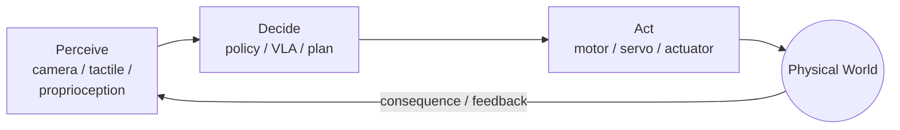
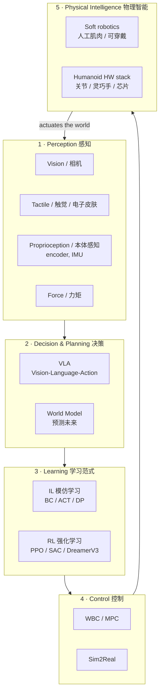

# Lecture 01 — What *is* Embodied Intelligence? (Definition, the Closed Loop & the Research Landscape)

> **Meta**
> - Date: 2026-08-15 (Saturday)
> - Lecture / Day: Lecture 01 — the *first* lecture of the study plan (Day 1)
> - Plan anchor: `study-plan-60d.md` → **P1 概念入门 (Concept)**, course episodes **001–007**
> - Goal of today: build the *map* in your head — what EI is, what its core loop is, and how the field is partitioned. Be able to explain it to a mirror in 3 minutes. No code today.

---

## 0. One-line summary

> **Embodied Intelligence (EI)** = an agent that has a **body** in the physical world and learns/acts by looping **perceive → decide → act → see consequence → decide again**.
> It is the opposite of "disembodied AI" (a chatbot that only reads and writes text). The body is not an accessory; **the body is half of the intelligence.**

> 📌 **Scope of this lecture**: episodes 001–005 cover the concept, architecture, challenges, research directions and industry showcase. Episodes 006–007 (servo working principle; stepper & brushless motors) are a "hardware appetizer" the course places at the end of the concept chapter; the full teardown comes on Day 2 (P2 Hardware). This lecture nails the "concept" half first.

---

## 1. Core definition (the two-half picture)

Most people imagine "AI" as a brain in a box. Embodied intelligence insists on a **second half**:

| Half | What it is | On a robot |
|---|---|---|
| **Brain (算法/智能)** | Perception, decision, learning | VLA, world models, IL/RL policies |
| **Body (本体/身体)** | Mechanics, actuators, sensors, materials | Robot arm, actuators, encoders, cameras |

The defining idea is the **closed loop**:

This loop never stops while the robot is "alive." That is why it is called **embodied**: intelligence is *situated in* and *shaped by* a body interacting with the world.

**Key historical anchor (cite it):** Rodney Brooks, *"Elephants Don't Play Chess"* (1990) and *"Intelligence Without Representation"* (1991). His core argument: smart behavior can emerge from simple body-grounded reactions, not from a giant symbolic world-model. This is the philosophical root of EI.

### 1.1 Why the "body" matters (principle, not slogan)

1. **Moravec's Paradox.** High-level reasoning (math, language) is *easy* for computers; low-level sensorimotor skills (grasping a cup, walking) are *hard*. We spent decades on the easy part and still struggle with the "obvious" physical skills a toddler has. → EI is the hard, unsolved frontier.
2. **The body constrains and shapes the mind.** A soft, continuum body *cannot* be controlled by the same math as a rigid 6-DOF arm. Soft actuators have infinite-dimensional, nonlinear, hysteresis-laden dynamics that you cannot write as a clean closed-form equation — so you *model them as a black box and learn from data*. Same spirit as modern EI.
3. **Data comes from interaction.** A language model learns from text someone already wrote. A robot must *generate* its own training data by moving and seeing what happens. **Embodiment = the ability to collect your own experience.**

---

## 2. The research landscape (memorize this shape)

Think of EI as **one loop** with **five stations**. Today you only need to *name and place* each station; later phases go deep.

**Five stations + landmark work (recognize, don't memorize):**

| Station | One phrase | Landmark to name-drop |
|---|---|---|
| 1 Perception | "eyes, skin, muscles' own sense" | — |
| 2 Decision · VLA | "see + language → action" | RT-2 (Brohan et al., 2023); OpenVLA (2023, open 7B); π₀ (Physical Intelligence, 2024) |
| 2 Decision · World Model | "imagine the next frame, then act" | Ha & Schmidhuber, *World Models* (2018, arXiv:1803.10122); Dreamer (Hafner) |
| 3 Learning · IL (BC/ACT/DP) | "learn by watching demonstrations" | **ACT** — Zhao et al., RSS 2023 (Stanford ALOHA); **Diffusion Policy** — Chi et al., RSS 2023 (arXiv:2303.04137) |
| 3 Learning · RL | "learn by trial and reward" | PPO (Schulman 2017); SAC; DreamerV3 |
| 4 Control | "turn a plan into torque" | WBC / MPC; Sim2Real (transfer sim → real) |
| 5 Physical Intelligence · Soft robotics | "the soft, muscle-like body" | Soft robotics / artificial muscles / wearables |

> **Tooling note:** `LeRobot` (Hugging Face) is the open-source IL platform that runs ACT / Diffusion Policy on low-cost hardware like **SO-101**. There is related practice already in the `so101-act/` repo. Keep that connection — this lecture (P1) is the *why*, `so101-act` is the *proof*.

---

## 3. Principles to internalize (the "why it works" layer)

1. **The sense–think–act loop is the unit of intelligence.** Not "a smart model," but "a model that keeps correcting itself through the loop."
2. **Data is the fuel; embodiment is the refinery.** You cannot download robot experience — you must *generate* it (teleoperation, simulation). Datasets (e.g., LeRobot's) and simulators (Isaac Lab, MuJoCo) matter as much as algorithms.
3. **IL first, RL later, World Model to fill the gaps.** Imitate an expert to get 80% there cheaply (IL/BC), fine-tune the tail with reward (RL), use a world model for long-horizon prediction when data is scarce.
4. **The body redefines the action space.** A rigid arm's action = 6 joint angles. A soft gripper's action = voltage → continuous deformation. **Same algorithm family, different "language" the body speaks** — your research entry point.

---

## 4. Today's operation steps (study workflow, not coding)

1. **Read this file top-to-bottom once** (you are here).
2. **Redraw the two diagrams by hand** (closed loop, 5-station map) on paper. Don't copy-paste.
3. **Skim 2 landmark papers (not full read):** ACT (RSS 2023) and Diffusion Policy (arXiv:2303.04137). Abstract + Figure 1 only.
4. **Mirror test (the checkpoint):** close everything and explain, out loud, for 3 minutes: *"Embodied intelligence is ___; the loop is ___; the five stations are ___; soft robotics sits at station ___"*
5. **Write 3 sentences** connecting "body" and "brain."
6. **(Later)** when you reach the Behavior Cloning (BC) lectures, reproduce one ACT demo in LeRobot sim. Not today.

> ✅ **Definition of "done today":** you can pass the mirror test and you have the map drawn.

---

## 5. Common misconceptions & easy mistakes

| # | Misconception | Reality |
|---|---|---|
| 1 | "Embodied AI = put a ChatGPT on a robot." | No. A chatbot *talks*; EI *acts and feels consequences*. Language is one input, not the whole brain. |
| 2 | "Bigger model + more data = smarter robot, always." | EI needs the **right** data (interaction), not just more text. Real robot data is scarce/expensive; that's why Sim2Real and IL-from-few-demos exist. |
| 3 | "IL and RL are basically the same." | IL = copy an expert (supervised, cheap, stalls on unseen cases). RL = learn from reward (explores, needs sim/safe env, sample-hungry). Used in sequence. |
| 4 | "VLA and World Model are the same thing." | VLA maps *sense+language → action* directly. World Model *predicts the future* so the agent can plan inside its head. Distinct concepts, often combined. |
| 5 | "Soft robotics is separate from AI." | Exactly the opposite — the *body* is half of EI. Soft actuators are a harder, richer action space the algorithms must learn to speak. |
| 6 | "A mechanical background means the AI/algorithm part is someone else's job." | The whole point of EI is the **body–brain interface**. Mechanical intuition *is* part of the research; learn the brain vocabulary, but don't outsource the body. |
| 7 | "I must understand every formula before starting." | No. Learn the *map and the loop* first (this lecture); formulas come per-station later. Top-down before bottom-up. |

---

## 6. Next steps / checkpoint

- **Checkpoint passed if:** you can redraw the loop + 5-station map and pass the 3-minute mirror test.
- **Next lecture (Day 2):** **Hardware** — actuators, gear reduction, angle sensors, 3D printing (course 008–012). The parts that make a robot actually move.
- **This week's seed:** keep `LeRobot` + `so101-act/` open as tangible proof that this map is real.

---

### References (for later, not required today)
- Brooks, R. (1990). *Elephants Don't Play Chess.*
- Brooks, R. (1991). *Intelligence Without Representation.*
- Zhao et al. (2023). *Learning Fine-Grained Bimanual Manipulation with Low-Cost Hardware* (ACT). RSS 2023.
- Chi et al. (2023). *Diffusion Policy.* RSS 2023. arXiv:2303.04137.
- Brohan et al. (2023). *RT-2: Vision-Language-Action Models.* Google.
- Ha & Schmidhuber (2018). *World Models.* arXiv:1803.10122.
- Hugging Face. *LeRobot* (open-source IL library, SO-101 support).