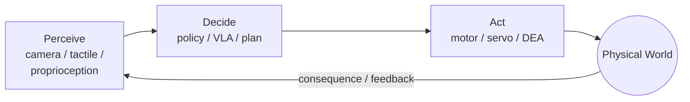
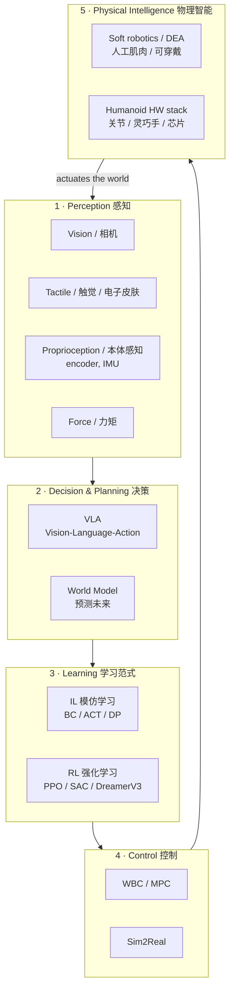

# Lecture 01 — What *is* Embodied Intelligence? (Definition, the Closed Loop & the Research Landscape)

> **Meta**
> - **Date:** 2026-08-15 (Saturday)
> - **Lecture / Day:** Lecture 01 — the *first* lecture of the study plan
> - **Plan anchor:** `study_plan.md` → **A-line (知识主干) Module 1** = 具身智能定义 + 研究版图
> - **Track:** A-line (concepts) leads; B-line (code/portfolio) validates later
> - **Goal of today:** build the *map* in your head, not yet the code. Be able to explain "what embodied intelligence is" to a mirror in 3 minutes.

---

## 0. One-line summary

> **Embodied Intelligence (EI)** = an agent that has a **body** in the physical world, **perceives** it through senses, **thinks/decides**, and **acts** — and *learns* by looping perception → decision → action → consequence, again and again.
> It is the opposite of "disembodied AI" (a chatbot that only reads and writes text). The body is not a accessory; **the body is half of the intelligence.**

---

## 1. Core definition (the two-half picture)

Most people imagine "AI" as a brain in a box. Embodied intelligence insists on a **second half**:

| Half | What it is | Example for you (mech/DEA background) |
|---|---|---|
| **Brain (算法/智能)** | Perception, decision, learning | VLA, world models, IL/RL policies |
| **Body (本体/身体)** | Mechanics, actuators, sensors, materials | Robot arm, **soft actuators / DEA**, encoders, cameras |

The defining idea is the **closed loop**:

This loop never stops while the robot is "alive." That is why it is called **embodied**: intelligence is *situated in* and *shaped by* a body interacting with the world.

**Key historical anchor (cite it):** Rodney Brooks, *"Intelligence Without Representation"* (1991) and *"Elephants Don't Play Chess"* — argued that smart behavior can emerge from simple body-grounded reactions, not from a giant symbolic world-model. This is the philosophical root of EI.

---

## 2. Why the "body" matters (principle, not slogan)

Three reasons, from easy to deep:

1. **Moravec's Paradox.** High-level reasoning (math, language) is *easy* for computers; low-level sensorimotor skills (grasping a cup, walking) are *hard*. We spent 70 years on the easy part and still struggle with the "obvious" physical skills a toddler has. → EI is the hard, unsolved frontier.
2. **The body constrains and shapes the mind.** A soft, continuum body *cannot* be controlled by the same math as a rigid 6-DOF arm. Your DEA background lives exactly here: soft actuators have infinite-dimensional, nonlinear, hysteresis-laden dynamics that you cannot write as a clean closed-form equation — so you *model them as a black box and learn from data*. That is the same spirit as modern EI.
3. **Data comes from interaction.** A language model learns from text someone already wrote. A robot must *generate* its own training data by moving and seeing what happens. **Embodiment = the ability to collect your own experience.**

---

## 3. The research landscape (your map — memorize this shape)

Think of EI as **one loop** with **five stations**. Today you only need to *name and place* each station; later modules go deep.

### Station quick-reference (with landmark papers — for credibility, not memorization yet)

| Station | One phrase | Landmark to name-drop |
|---|---|---|
| Perception | "eyes, skin, muscles' own sense" | — |
| VLA | "see + language → action" | RT-2 (Brohan et al., 2023); OpenVLA (2023, open 7B); π₀ (Physical Intelligence, 2024) |
| World Model | "imagine the next frame, then act" | Ha & Schmidhuber, *World Models* (2018, arXiv:1803.10122); Dreamer (Hafner) |
| IL (BC/ACT/DP) | "learn by watching demonstrations" | **ACT** — Zhao et al., RSS 2023 (Stanford Aloha); **Diffusion Policy** — Chi et al., RSS 2023 (arXiv:2303.04137) |
| RL | "learn by trial and reward" | PPO (Schulman 2017); SAC; DreamerV3 |
| Control | "turn a plan into torque" | WBC / MPC; Sim2Real (transfer sim → real) |
| Soft/DEA | "the soft, muscle-like body" | your lab's turf — see §5 |

> **Tooling note (B-line seed):** `LeRobot` (Hugging Face) is the open-source IL playground that runs ACT / Diffusion Policy on low-cost hardware like **SO-101**. You already touched it in the `so101-act/` repo. Keep that connection — Module 1 is the *why*, `so101-act` is the *proof*.

---

## 4. Principles to internalize (the "why it works" layer)

1. **The sense–think–act loop is the unit of intelligence.** Not "a smart model," but "a model that keeps correcting itself through the loop."
2. **Data is the fuel; embodiment is the refinery.** You cannot download robot experience — you must *generate* it (teleoperation, simulation). This is why datasets (e.g., LeRobot's) and simulators (Isaac Lab, MuJoCo) matter as much as algorithms.
3. **IL first, RL later, World Model to fill the gaps.** Modern division of labor: imitate an expert to get 80% there cheaply (IL/BC), fine-tune the tail with reward (RL), and use a world model for long-horizon prediction when real data is scarce.
4. **The body redefines the action space.** A rigid arm's action = 6 joint angles. A DEA soft gripper's action = voltage → continuous deformation. **Same algorithm family, different "language" the body speaks** — this is precisely your research entry point.

---

## 5. Tie-back to *your* background (why you are not "behind")

You are a mechanical-engineering graduate entering a **soft robotics / DEA** lab. That sounds "far" from AI, but on the EI map you are standing **directly on Station 5 (Physical Intelligence)** — the body side that most CS students lack.

- They have the brain code but no intuition for *why a soft actuator is hard to control*.
- You have the mechanics/materials intuition; you only need to *learn the brain vocabulary* (VLA/IL/RL) and the *data loop*.
- **Your differentiator:** coupling data-driven control (IL/RL) with **DEA soft actuators and proprioception** is a genuine literature gap (we verified this on 2026-08-07) — few people speak both "body" and "brain" fluently. That is your thesis-shaped niche.

---

## 6. Today's operation steps (how to *study* this lecture)

This is a **study workflow**, not a coding tutorial. Do these in order:

1. **Read this file top-to-bottom once** (you are here).
2. **Redraw the two diagrams by hand** (the closed loop, and the 5-station map) on paper. Don't copy-paste — drawing forces the structure into memory.
3. **Pick 2 landmark papers to *skim* (not read fully):** ACT (RSS 2023) and Diffusion Policy (arXiv:2303.04137). Just read the abstract + Figure 1 of each. Goal: recognize the names.
4. **Mirror test (the checkpoint):** close everything and explain, out loud, for 3 minutes: *"Embodied intelligence is ___; the loop is ___; the five stations are ___; and my DEA background sits at station ___."*
5. **Write 3 sentences** connecting DEA to EI (seed for your reflection section below).
6. **(Optional B-line later)** When Module 5–6 land, reproduce one ACT demo in LeRobot sim. Not today.

> ✅ **Definition of "done today":** you can pass the mirror test and you have the map drawn.

---

## 7. Common misconceptions & easy-to-make mistakes (plain language, still precise)

| # | Misconception (the trap) | Reality (the fix) |
|---|---|---|
| 1 | "Embodied AI = put a ChatGPT on a robot." | No. A chatbot *talks*; EI *acts and feels consequences*. Language is one input, not the whole brain. |
| 2 | "Bigger model + more data = smarter robot, always." | Embodiment needs the **right** data (interaction), not just more text. And real robot data is scarce/expensive; that's why Sim2Real and IL-from-few-demos exist. |
| 3 | "IL and RL are basically the same." | IL = copy an expert (supervised, cheap, stalls on unseen cases). RL = learn from reward (explores, needs a sim/safe env, sample-hungry). Different tools, used in sequence. |
| 4 | "VLA and World Model are the same thing." | VLA maps *sense+language → action* directly. World Model *predicts the future* so the agent can plan inside its head. Often combined, but distinct concepts. |
| 5 | "Soft robotics / DEA is separate from AI." | Exactly the opposite — the *body* is half of EI. Soft actuators are just a harder, richer action space the algorithms must learn to speak. |
| 6 | "I'm mechanical, so the AI part is someone else's job." | The whole point of EI is the **body–brain interface**. Your mechanical instincts *are* the research. You learn the brain vocabulary; you don't outsource the body. |
| 7 | "I must understand every formula before starting." | No. Learn the *map and the loop* first (this lecture); formulas come per-station later. Top-down before bottom-up. |

---

## 8. My reflections (first-person — learner/operator voice)

> *Written in the voice of the student (Zizheng Wang), before any hands-on rig time — anticipatory, not yet empirical.*

I'll be honest: before today, when people said "embodied intelligence" I pictured a humanoid walking around. Now I see it's a **loop**, not a robot. The picture that clicked for me is the two-half drawing — brain on the left, body on the right, and an arrow that never stops. My mechanical training suddenly has a home: I'm not "the guy who doesn't know AI," I'm the guy who *owns the body half* that most AI people can't speak.

The part I want to be careful about: it's tempting to dive straight into running ACT demos because that feels like "real progress." But Lecture 01 is telling me to slow down and **hold the map in my head first**. If I can't explain the five stations and where DEA sits, the code later will just be incantations. So my rule for today: draw the diagrams, pass the mirror test, name two papers. That's the bar.

One worry I'll note honestly: "IL first, RL later" sounds clean, but I know DEA has hysteresis and noise that pure IL might struggle with. I'll keep that question flagged for when we reach the learning-paradigm module — I suspect the answer is "IL to bootstrap, then something adaptive for the soft-body tail." That's a thread to pull later, not a problem to solve today.

---

## 9. Next steps / checkpoint

- **Checkpoint passed if:** you can redraw the loop + 5-station map and pass the 3-minute mirror test.
- **Next lecture (Module 2):** **Perception** — vision / tactile / proprioception; what "observing the world" actually feeds into the loop.
- **This week's B-line seed:** keep `LeRobot` + `so101-act/` open as the tangible proof that this map is real, not abstract.

---

### References (for later, not required today)
- Brooks, R. (1991). *Intelligence Without Representation.* Artificial Intelligence.
- Zhao et al. (2023). *Learning Fine-Grained Bimanual Manipulation with Low-Cost Hardware* (ACT). RSS 2023.
- Chi et al. (2023). *Diffusion Policy.* RSS 2023. arXiv:2303.04137.
- Brohan et al. (2023). *RT-2: Vision-Language-Action Models.* Google.
- Ha & Schmidhuber (2018). *World Models.* arXiv:1803.10122.
- Hugging Face. *LeRobot* (open-source IL library, SO-101 support).
