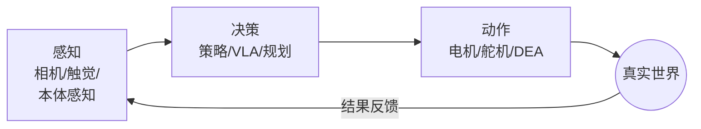
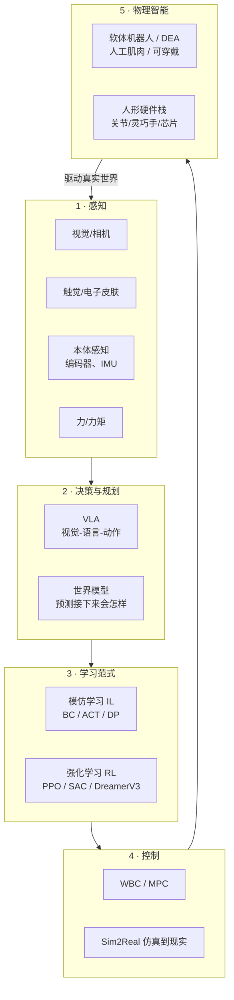

# 第一讲 · 具身智能到底是啥？（定义、那个闭环、还有整张研究地图）

> **本讲信息**
> - **日期：** 2026-08-15（周六）
> - **第几讲：** 第一讲（也是整个学习计划 Day 1）
> - **对应计划：** `study_plan.md` 里 **A线（知识主干）模块1** = 具身智能定义 + 研究版图
> - **今天目标：** 先在你脑子里**画一张地图**，不是写代码。能对镜子用 3 分钟讲清楚"具身智能是啥"。

---

## 0. 一句话总结

> **具身智能（Embodied Intelligence, EI）** = 一个在真实物理世界里**有身体**的智能体，它**用感官看世界 → 动脑子决策 → 用身体去动 → 看动完的结果 → 再决策……** 这个圈圈转个不停，它就是靠这个圈学会本领的。
> 它跟"没有身体的 AI"（比如只会打字的聊天机器人）正好相反。**身体不是配件，身体占了智能的一半。**

---

## 1. 核心定义：智能是"两半"拼起来的

很多人一想"AI"，脑子里就是个盒子里的脑子。具身智能偏要说还有**另一半**：

| 那一半 | 是啥 | 放到你身上（机械/DEA 背景） |
|---|---|---|
| **脑子（算法/智能）** | 感知、决策、学习 | VLA、世界模型、模仿学习/强化学习 |
| **身体（本体）** | 机械结构、执行器、传感器、材料 | 机械臂、**软体驱动器/DEA**、编码器、相机 |

最关键的那个词叫**闭环**（圈圈转不停）：

只要机器人还"活着"，这个圈就不停。所以叫**具身**——智能是"长"在身体里、被身体和世界的互动**塑造**出来的。

**一句话能拽出来的大佬（面试能提一句）：** Rodney Brooks，1991 年写了《Intelligence Without Representation》（没有表征的智能），还有《大象不下棋》——他的核心观点是：聪明的动作可以从"身体直接反应"里冒出来，不一定非得先建一个巨大的符号世界模型。这就是具身智能的哲学老根。

---

## 2. 为啥"身体"这么重要（是原理，不是口号）

三个理由，从好懂到深：

1. **莫拉维克悖论（Moravec's Paradox）。** 高阶推理（数学、语言）电脑觉得很"简单"；低级的"感官+动作"技能（抓个杯子、走两步）反而"巨难"。人类花 70 年把简单那半做出来了，却还在跟小孩随手就会的动作较劲。→ 具身智能是难的、还没被攻克的那块前沿。
2. **身体会限制、也会塑造脑子。** 一个软的、连续变形的身体，跟一个刚性的六轴机械臂，用的数学完全不是一套。你学 DEA 正好踩在这：软体驱动器有无穷维、非线性、还有迟滞（你推一下它慢慢才反应、还回不到原样），根本写不出一个干净的闭式方程——所以你只能**把它当黑箱，用数据去学**。这跟现代具身智能的思路一模一样。
3. **数据来自"互动"。** 语言模型是从别人已经写好的文字里学；机器人得**自己动起来、看结果**，才能攒出自己的训练数据。**有身体 = 能自己生产经验。**

---

## 3. 研究版图（你的地图，先把形状背下来）

把具身智能想成**一个圈**，圈上有 **5 个站**。今天你只要**叫得出每个站的名字、知道它站哪**就行；后面的模块会逐个深挖。

### 5 个站速查（带几篇"能显专业"的论文，今天不用背，认个脸就行）

| 站 | 一句话 | 能提名字的代表作 |
|---|---|---|
| 感知 | "眼睛、皮肤、肌肉自己的感觉" | — |
| VLA | "看见+听懂话 → 直接出动作" | RT-2（Google, 2023）；OpenVLA（2023，开源7B）；π₀（Physical Intelligence, 2024） |
| 世界模型 | "在脑子里先演一下下一帧，再决定" | Ha & Schmidhuber《World Models》(2018)；Dreamer |
| 模仿学习 IL（BC/ACT/DP） | "看专家怎么做，跟着学" | **ACT** — Zhao等, RSS 2023（斯坦福 Aloha）；**Diffusion Policy（扩散策略）** — Chi等, RSS 2023（arXiv:2303.04137） |
| 强化学习 RL | "试错，谁给的奖励多就学谁" | PPO；SAC；DreamerV3 |
| 控制 | "把计划变成真正的力矩" | WBC / MPC；Sim2Real（仿真搬到真机） |
| 边界/DEA | "软的、像肌肉的身体" | 就是你导师那块地盘，见第 5 节 |

> **工具小注（给 B 线埋个种子）：** `LeRobot`（Hugging Face 开源库）就是跑模仿学习的游乐场，能在 SO-101 这种便宜硬件上跑 ACT / 扩散策略。你在 `so101-act/` 那个仓库里其实已经碰过它了。记住这个联系——模块1讲"为啥"，`so101-act` 就是"证据"。

---

## 4. 要刻进脑子里的原理（"它凭啥work"那层）

1. **"感知→想→动"这个圈，才是智能的最小单位。** 不是"一个聪明的模型"，而是"一个不断靠圈圈自我纠错的模型"。
2. **数据是燃料，身体是炼油厂。** 你下载不到机器人的经验，只能**自己生成**（遥操作、仿真）。所以数据集（比如 LeRobot 的）和仿真器（Isaac Lab、MuJoCo）跟算法一样重要。
3. **先模仿（IL），后试错（RL），世界模型补空缺。** 现代分工：先抄专家到 80% 水平（便宜，IL/BC），再用奖励微调尾巴（RL），数据少的时候用世界模型做长程预测。
4. **身体重新定义了"动作空间"。** 刚性臂的动作=6个关节角度；DEA 软夹爪的动作=电压→连续变形。**同一族算法，身体说的"语言"不一样**——这正好是你做研究的切口。

---

## 5. 跟"你自己"挂钩（你一点都不落后）

你是机械工程出身、要进**软体机器人/DEA**课题组。听着好像"离 AI 很远"，但在具身智能地图上，你正好站在 **第 5 站（物理智能）** 上——也就是大多数纯 CS 同学缺的那半"身体"。

- 他们有脑子代码，却不懂**为啥软执行器难控制**；
- 你有机械/材料的直觉，只需要**补脑子的词汇**（VLA/IL/RL）+ 学会**数据那个圈**；
- **你的差异化优势：** 把数据驱动控制（IL/RL）跟 **DEA 软体+本体感知** 绑一块，是实打实的文献缺口（我们 8-07 那轮核过）——能同时说"身体"和"脑子"两种话的人不多。这就是你论文形状的 niche（细分切入点）。

---

## 6. 今天的操作步骤（"怎么学这一讲"，不是写代码）

这是**学习流程**，不是敲代码教程。按顺序来：

1. **把本文件从头到尾读一遍**（你正在这步）。
2. **在纸上亲手画那两张图**（闭环图 + 5站地图）。别复制粘贴——画图才逼着结构进脑子。
3. **挑 2 篇论文"扫"一眼（不用精读）：** ACT（RSS 2023）和 扩散策略（arXiv:2303.04137）。只读摘要 + 图1。目标：混个脸熟。
4. **镜子测试（也就是检查点）：** 关掉所有东西，大声讲 3 分钟：*"具身智能是___；那个圈是___；五个站是___；我的 DEA 背景在第___站。"*
5. **写 3 句话**把 DEA 和具身智能连起来（给你下面"感悟"那节埋种子）。
6. **（B 线以后再做）** 等模块 5–6 到了，在 LeRobot 仿真里复现一个 ACT demo。今天不做。

> ✅ **今天"做完"的标准：** 你能过镜子测试，并且地图画下来了。

---

## 7. 常见误区 & 容易踩的坑（大白话讲，但不丢专业性）

| # | 误区（坑长啥样） | 真相（咋爬出来） |
|---|---|---|
| 1 | "具身AI = 给机器人装个ChatGPT。" | 错。聊天机器人只"说"；具身智能"做"而且"感受后果"。语言只是其中一个输入，不是整个脑子。 |
| 2 | "模型越大、数据越多，机器人就越聪明，永远成立。" | 具身需要的是**对的数据**（互动数据），不是更多文字。而且真机数据又少又贵——所以才有 Sim2Real（仿真搬真机）和"看少量demo就学"的模仿学习。 |
| 3 | "模仿学习 和 强化学习 基本是一回事。" | 模仿=抄专家（监督式，便宜，遇到没见过的就懵）；强化=靠奖励试错（会探索，要仿真/安全环境，吃样本）。两套工具，是**接力**用的。 |
| 4 | "VLA 和世界模型 是一个东西。" | VLA 直接把"看到+听懂→动作"映射出来；世界模型是"先预测未来"好让智能体在脑子里规划。经常一起用，但是两个不同概念。 |
| 5 | "软体机器人/DEA 跟 AI 没关系。" | 正好反过来——**身体**才是具身智能的一半。软执行器只是算法得更努力去"学会说它语言"的、更难更丰富的动作空间。 |
| 6 | "我是搞机械的，AI那部分是别人的活。" | 具身智能的精髓就是**身体-脑子的接口**。你的机械直觉"就是"研究本身。你学脑子的词汇，但不把身体外包出去。 |
| 7 | "我得先把每个公式搞懂才能开始。" | 不用。先抓**地图和那个圈**（这一讲）；公式等到了对应站再细啃。先自上而下，再自下而上。 |

---

## 8. 我的感悟（第一人称——以一个"操作者/学习者"的口气写）

> *以下用学生（王子征）的口吻写，写在还没真正上手设备的阶段——是"预判式"的感悟，不是实操出来的经验。*

说实话，今天之前别人一说"具身智能"，我脑子里就是个人形机器人走来走去。现在我看清了：它是个**圈**，不是个机器人。最戳我的是那张"两半"的图——左边脑子、右边身体，中间一个不停转的箭头。我那点机械训练突然有了家：我不是"不懂AI的那个人"，我是**占了身体那半边、大多数AI人不会说**的那个人。

我想小心的一点：很容易一头扎进跑 ACT demo，因为那感觉像"真进度"。但第一讲在告诉我先慢下来，**先把地图在脑子里攥稳**。我要是连五个站、DEA 站哪都说不清，后面代码就只剩念咒。所以我今天给自己定的规矩：画图、过镜子测试、认两篇论文脸熟。这就是今天的及格线。

有个担心我得老实记下来："先模仿后试错"听着很顺，但我知道 DEA 有迟滞、有噪声，纯模仿学习可能会在尾巴上卡住。这个问题我先挂着，等学到"学习范式"那模块再拉——我猜答案大概是"先用模仿打底，再上点自适应东西对付软体尾巴"。这是后面要拽的线，不是今天要解的题。

---

## 9. 下一步 / 检查点

- **过了检查点 =** 你能徒手画出闭环 + 5站地图，并且过 3 分钟镜子测试。
- **下一讲（模块2）：** **感知**——视觉/触觉/本体感知；"观察世界"到底往那个圈里喂了啥。
- **本周 B 线种子：** 把 `LeRobot` 和 `so101-act/` 留着，当成"这张地图是真的、不是空中楼阁"的实物证据。

---

### 参考资料（先放着，今天不要求）
- Brooks, R. (1991). 《Intelligence Without Representation》.
- Zhao 等 (2023). ACT，《Learning Fine-Grained Bimanual Manipulation with Low-Cost Hardware》. RSS 2023.
- Chi 等 (2023). 《Diffusion Policy》. RSS 2023. arXiv:2303.04137.
- Brohan 等 (2023). RT-2：视觉-语言-动作模型. Google.
- Ha & Schmidhuber (2018). 《World Models》. arXiv:1803.10122.
- Hugging Face. LeRobot（开源模仿学习库，支持 SO-101）.
