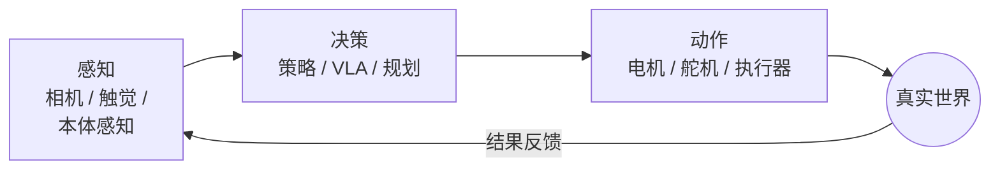
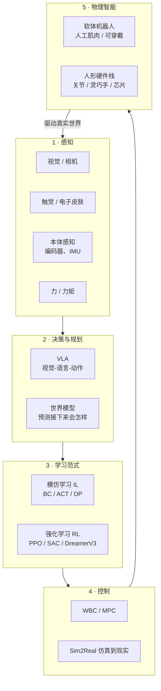

# 第一讲 · 具身智能到底是什么？（定义、闭环、研究版图）

> **本讲信息**
> - 日期：2026-08-15（周六）
> - 第几讲：第一讲（学习计划 Day 1）
> - 对应计划：`study-plan-60d.md` 里 **P1 概念入门** 阶段，课程集号 **001–007**
> - 今日目标：在脑子里画一张"地图"——具身智能是什么、它的核心闭环是什么、研究分哪几块。能对着镜子用 3 分钟讲清楚即可，今天不写代码。

---

## 0. 一句话总结

> **具身智能（Embodied Intelligence, EI）** = 一个身处真实物理世界、**有身体**的智能体。它靠一条不停转动的圈来学习和行动：**用感官感知世界 → 动脑子决策 → 用身体去动作 → 看动作的结果 → 再决策……**。
> 它和"没有身体的 AI"（比如只会打字的聊天机器人）正好相反。**身体不是外设，身体本身就占了智能的一半。**

> 📌 **本讲范围**：课程 001–005 讲概念、体系架构、挑战、科研方向与产业展示；006–007（舵机工作原理、步进电机与无刷电机）是课程放在概念章末尾的"硬件开胃菜"，正式拆解见 Day 2（P2 硬件实体）。本讲先吃透"概念"这一半。

---

## 1. 核心定义：智能是"两半"拼起来的

很多人一想到"AI"，脑子里就是一个盒子里的脑子。具身智能强调还有**另一半**：

| 那一半 | 是什么 | 放到机器人身上 |
|---|---|---|
| **脑子（算法 / 智能）** | 感知、决策、学习 | VLA、世界模型、模仿学习 / 强化学习 |
| **身体（本体）** | 机械结构、执行器、传感器、材料 | 机械臂、执行器、编码器、相机 |

最关键的是**闭环**（圈圈不停转）：

只要机器人还"活着"，这个圈就不停。所以叫**具身**——智能是"长"在身体里、被身体和世界的互动**塑造**出来的。

**一个值得记住的名字（面试能提）：** Rodney Brooks，1990 年发表《大象不下棋》（*Elephants Don't Play Chess*），1991 年发表《Intelligence Without Representation》（没有表征的智能）。他的核心观点：聪明的动作可以从"身体直接反应"里冒出来，不一定非得先建一个巨大的符号世界模型。这是具身智能的哲学源头。

### 1.1 为什么"身体"这么重要（这是原理，不是口号）

1. **莫拉维克悖论（Moravec's Paradox）。** 高阶推理（数学、语言）对电脑来说"简单"；低级的"感官 + 动作"技能（抓杯子、走两步）反而"巨难"。人类花了几十年才把高级那半做出来，却还在和小孩随手就会的动作较劲。→ 具身智能是难、且还没被攻克的那块前沿。
2. **身体既限制、也塑造脑子。** 一个软的、连续变形的身体，和刚性六轴机械臂，用的数学完全不是一套。软体驱动器有无限维、非线性、还有迟滞（推一下它慢慢才反应、还回不到原样），根本写不出干净的闭式方程——所以只能**把它当黑箱，用数据去学**。这和现代具身智能的思路一模一样。
3. **数据来自"互动"。** 语言模型从别人已写好的文字里学；机器人得**自己动起来、看结果**，才能攒出自己的训练数据。**有身体 = 能自己生产经验。**

---

## 2. 研究版图（先记住形状）

把具身智能想成**一个圈**，圈上有 **5 个站**。今天你只要**叫得出每个站的名字、知道它站哪**；后面的阶段会逐个深挖。

**5 个站 + 代表工作（今天认个脸，不用背）：**

| 站 | 一句话 | 代表工作（提名字即可） |
|---|---|---|
| 1 感知 | "眼睛、皮肤、肌肉自己的感觉" | — |
| 2 决策 · VLA | "看见 + 听懂话 → 直接出动作" | RT-2（Google, 2023）；OpenVLA（2023，开源 7B）；π₀（Physical Intelligence, 2024） |
| 2 决策 · 世界模型 | "在脑子里先演一下下一帧，再决定" | Ha & Schmidhuber《World Models》(2018)；Dreamer |
| 3 学习 · 模仿 IL（BC/ACT/DP） | "看专家怎么做，跟着学" | **ACT** — Zhao 等, RSS 2023（斯坦福 ALOHA）；**Diffusion Policy** — Chi 等, RSS 2023（arXiv:2303.04137） |
| 3 学习 · 强化 RL | "试错，谁给的奖励多就学谁" | PPO（Schulman 2017）；SAC；DreamerV3 |
| 4 控制 | "把计划变成真正的力矩" | WBC / MPC；Sim2Real（仿真搬到真机） |
| 5 物理智能 · 软体机器人 | "软的、像肌肉的身体" | 软体机器人 / 人工肌肉 / 可穿戴 |

> **工具伏笔：** `LeRobot`（Hugging Face 开源库）是跑模仿学习的平台，能在 SO-101 这类便宜硬件上跑 ACT / 扩散策略。`so101-act/` 仓库里已有相关实践。记住这个联系——本讲（P1）讲"为什么"，`so101-act` 就是"证据"。

---

## 3. 要刻进脑子里的原理（"它凭什么 work"那层）

1. **"感知 → 想 → 动"这个圈，才是智能的最小单位。** 不是"一个聪明的模型"，而是"一个不断靠圈圈自我纠错的模型"。
2. **数据是燃料，身体是炼油厂。** 你下载不到机器人的经验，只能**自己生成**（遥操作、仿真）。所以数据集（如 LeRobot 的）和仿真器（Isaac Lab、MuJoCo）和算法一样重要。
3. **先模仿（IL），后试错（RL），世界模型补空缺。** 现代分工：先抄专家到 80% 水平（便宜，IL/BC），再用奖励微调尾巴（RL），数据少时用世界模型做长程预测。
4. **身体重新定义了"动作空间"。** 刚性臂的动作 = 6 个关节角度；软体夹爪的动作 = 电压 → 连续变形。**同一族算法，身体说的"语言"不一样**——这正是研究上的切入点。

---

## 4. 今天的操作步骤（学习流程，不是写代码）

1. **把本文件从头到尾读一遍**（你正在这步）。
2. **在纸上亲手画那两张图**（闭环图 + 5 站地图）。别复制粘贴——画图才逼着结构进脑子。
3. **挑 2 篇论文"扫"一眼（不用精读）：** ACT（RSS 2023）和 Diffusion Policy（arXiv:2303.04137）。只读摘要 + 图 1，混个脸熟。
4. **镜子测试（即检查点）：** 关掉所有东西，大声讲 3 分钟：*"具身智能是___；那个圈是___；五个站是___；软体机器人属于第___站。"*
5. **写 3 句话**把"身体"和"脑子"的关系说清楚。
6. **（以后再做）** 等学到行为克隆 BC 那几讲，在 LeRobot 仿真里复现一个 ACT demo。今天不做。

> ✅ **今天"做完"的标准：** 能过镜子测试，并且地图画下来了。

---

## 5. 常见误区 & 容易踩的坑

| # | 误区 | 真相 |
|---|---|---|
| 1 | "具身 AI = 给机器人装个 ChatGPT。" | 错。聊天机器人只"说"；具身智能"做"而且"感受后果"。语言只是其中一个输入，不是整个脑子。 |
| 2 | "模型越大、数据越多，机器人就越聪明，永远成立。" | 具身需要的是**对的数据**（互动数据），不是更多文字。真机数据又少又贵——所以才有 Sim2Real 和"看少量 demo 就学"的模仿学习。 |
| 3 | "模仿学习和强化学习基本是一回事。" | 模仿 = 抄专家（监督式，便宜，遇到没见过的就懵）；强化 = 靠奖励试错（会探索，要仿真 / 安全环境，吃样本）。两套工具，是**接力**用的。 |
| 4 | "VLA 和世界模型是一个东西。" | VLA 直接把"看到 + 听懂 → 动作"映射出来；世界模型是"先预测未来"好让智能体在脑子里规划。经常一起用，但是两个不同概念。 |
| 5 | "软体机器人跟 AI 没关系。" | 正好反过来——**身体**才是具身智能的一半。软体执行器只是算法得更努力去"学会说它语言"的、更难更丰富的动作空间。 |
| 6 | "搞机械的会觉得 AI / 算法那部分是别人的活。" | 具身智能的精髓就是**身体–脑子的接口**。机械直觉本身就是研究的一部分；学脑子的词汇，但不把身体外包出去。 |
| 7 | "得先把每个公式搞懂才能开始。" | 不用。先抓**地图和那个圈**（这一讲）；公式等到了对应站再细啃。先自上而下，再自下而上。 |

---

## 6. 下一步 / 检查点

- **过了检查点 =** 能徒手画出闭环 + 5 站地图，并且过 3 分钟镜子测试。
- **下一讲（Day 2）：** **硬件实体**——执行器、减速齿轮、角度传感器、3D 打印（课程 008–012）。也就是机器人"动起来"靠哪些零件。
- **本周种子：** 把 `LeRobot` 和 `so101-act/` 留着，当成"这张地图是真的、不是空中楼阁"的实物证据。

---

### 参考资料（先放着，今天不要求）
- Brooks, R. (1990). *Elephants Don't Play Chess*.
- Brooks, R. (1991). *Intelligence Without Representation*.
- Zhao 等 (2023). ACT，《Learning Fine-Grained Bimanual Manipulation with Low-Cost Hardware》. RSS 2023.
- Chi 等 (2023). 《Diffusion Policy》. RSS 2023. arXiv:2303.04137.
- Brohan 等 (2023). RT-2：视觉-语言-动作模型. Google.
- Ha & Schmidhuber (2018). 《World Models》. arXiv:1803.10122.
- Hugging Face. LeRobot（开源模仿学习库，支持 SO-101）.
