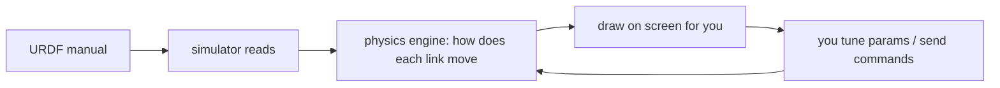

# Lecture 03 — Build a "Fake Robot" in the Computer First (Virtual Simulation & URDF)

> **Meta**
> - Date: 2026-08-16 (Sunday)
> - Lecture / Day: Lecture 03 — the *third* lecture of the study plan (Day 3)
> - Plan anchor: `study-plan-60d.md` → **P3 仿真URDF (Simulation & URDF)**, course episodes **013–017**
> - Goal of today: understand two things — (1) what "simulation" is (running a robot inside the computer), and (2) what URDF is (the "assembly instruction manual" for that fake robot). As a mechanical-engineering student, this lecture uses your "drawing part diagrams" muscle — don't fear it.

---

## 0. One-line summary

> **Simulation** = build a "fake robot + fake world" in the computer, run it first to practice — no real money, can't break, infinite retries.
> **URDF** = the "LEGO assembly manual" for that fake robot (written in computer-readable text). Inside it, a **link** = one rigid part, a **joint** = how two parts connect and can move.
> Remember in one sentence: **simulation lets you "try before you build"; URDF is "translating the robot into words the computer understands."**

---

## 1. Core knowledge (what these 5 episodes are about)

| # | Title | Key point |
|---|---|---|
| 013 | 虚拟仿真概念介绍 (What simulation is) | simulation = build a virtual world + virtual robot in the computer, run it first. Like a pilot training in a flight simulator before the real plane |
| 014 | 虚拟仿真的优缺点 (Pros & cons) | good: cheap, safe, repeatable; bad: the computer world is "simplified" — some real phenomena aren't captured → sim-good ≠ real-good |
| 015 | URDF 概念介绍 (What URDF is) | URDF = the robot's "assembly manual" (XML); lists parts + connections so the simulator knows what the robot looks like |
| 016 | link 和 joint 的概念 (link & joint) | link = one rigid part (like upper arm, forearm); joint = how two parts connect and can move (like a door hinge that only rotates) |
| 017 | link 的模型描述 (Describing a link) | a link needs 4 things: what it looks like (visual), how big it is to bump (collision), how heavy (inertial), where it sits (origin) |

### 1.1 What is simulation, really?

You've played a racing game, right? When the car in the game hits a wall, nothing really breaks — because it's "fake." **Simulation is doing the same thing to a robot: put a fake one inside the computer:**
- there is a "virtual robot arm" in the computer — with a base, an upper arm, a forearm, a gripper;
- there is also a "virtual table" and a "virtual cup";
- you send the command "pick up the cup," the computer calculates using physics laws, and the fake arm on screen actually grabs it.

**Why bother?** Three solid benefits:
1. **No real money** — a real robot arm costs tens of thousands; simulation is free.
2. **Can't break** — a wrong parameter on real hardware can crash it; in simulation you can mess around freely.
3. **Infinite retries** — one real experiment takes half an hour; simulation can "fast-forward," "pause," and "rewind," letting you try a hundred times in a minute.

> Analogy: learner drivers start on a simulator not because the simulator replaces real driving, but because it lets you **practice the basic moves without crashing a real car**. Simulation means the same for you learning robotics — get the moves right before touching the real thing.

### 1.2 The pros & cons of simulation — don't worship it

**Pros:** cheap, safe, repeatable; you can slow time down (e.g., watch every step in slow motion); you can test "dangerous scenarios" that real hardware wouldn't dare run.

**Cons (important!):** the computer world is **simplified**. Real friction (how slippery a pad is), compliance (a cable bends and springs), wire latency (a signal arriving a few milliseconds late), temperature effects… these details are **not fully captured** by simulation. Hence a famous phenomenon: **"tuned perfectly in simulation, then crashes on the real machine."** It's called the **Sim-to-Real gap** — from the fake world in the computer to the real world, there's a gap you can't fully cross.

> Simulation is like a "driving school simulator" — it teaches you the throttle and brake, but **the real-world wind, rain, and the car ahead slamming its brakes are things the simulator can't give you**. So after practicing in simulation, you still need to grind on the real machine. Don't assume "passed simulation = all good."

### 1.3 What is URDF? — the robot's "IKEA manual"

URDF = **U**nified **R**obot **D**escription **F**ormat. Scary name, but it's just **an "assembly manual for the robot" written in XML (a markup language the computer can read)**.

Think of an IKEA chair manual: it doesn't give you real wood, it gives you a sheet of paper saying "board A connects to board B with 4 screws, board B then connects to board C." The simulator reads URDF the same way: **"base connects to upper arm, upper arm connects to forearm, forearm connects to gripper"** — once read, the simulator knows what your robot looks like and how the parts are arranged. If you **don't write this manual, the simulator is blind** — it won't know how many parts you have or how they connect, so it can't run.

### 1.4 link and joint — the robot's "parts" and "ways of connecting"

URDF has only two basic building blocks:

**link = one rigid part.**
- a hard segment of the robot body — e.g., base, upper arm, forearm, gripper finger.
- it has "mass" (how heavy) and "shape" (what it looks like).
- in one phrase: a link is a "thing (noun)" — the part itself.

**joint = how two parts connect and can move.**
- like your "shoulder" connecting "torso" and "upper arm," or "elbow" connecting "upper arm" and "forearm."
- the joint decides: are these two parts "welded still," "able to rotate," or "able to slide."
- four common joint types (these four are enough):
  - **revolute**: rotates around one axis, like a door hinge. → your elbow.
  - **prismatic**: slides straight out, like a drawer. → a slider on a machine tool.
  - **continuous**: rotates forever, no limit, like a wheel.
  - **fixed**: welded, completely still. → used when gluing two parts together.

> A link is a "bone," a joint is the "connection type and range of motion between bones." A robot = a bunch of bones (links) assembled with different connection types (joints).

### 1.5 What does one link actually need? — four things (key point of episode 017)

Saying "this is the upper arm" isn't enough; the computer needs the part's details. A link in URDF usually writes four things:
1. **visual**: what it looks like, how big, what color — **for humans to see**; decides how it's drawn on screen.
2. **collision**: how big a volume it occupies when bumped — **for the physics engine to calculate**; can be a bit smaller than visual (saves computation), close enough is fine.
3. **inertial**: how heavy, where the center of mass is, how big the moment of inertia is — **decides how "hard it is to push."** A heavy or off-center part moves "sluggishly"; these must be written.
4. **origin**: where this part sits relative to its "parent part," and how much it's rotated — **the easiest place to get wrong!** Without an origin, two parts stack on the exact same point and look "clipped through" each other in simulation.

> Pre-flagged mistake: picking the wrong joint type (e.g., writing "slide" where it should "rotate") → the model errors out; not leaving an origin offset on a link → parts all stacked together. Note these two pitfalls on Day 3.

### 1.6 Peek at a "minimal URDF" (recognize it early)

Concepts float; here's a **base + one arm segment** minimal example. You don't need to write it today — just recognize it:

```xml
<robot name="mini_arm">
  <!-- base: one rigid part with a "visual" box -->
  <link name="base">
    <visual>
      <geometry><box size="0.1 0.1 0.05"/></geometry>
    </visual>
  </link>

  <!-- one arm segment: an empty link shell, shape filled in later -->
  <link name="arm1"/>

  <!-- joint: attach arm1 to base, rotate around Z -->
  <joint name="joint1" type="revolute">
    <parent link="base"/>
    <child  link="arm1"/>
    <origin xyz="0 0 0.05" rpy="0 0 0"/>
    <axis   xyz="0 0 1"/>
  </joint>
</robot>
```

Line by line:
- `<robot name="...">` is the **cover** of the whole manual (the root tag); name it whatever.
- Inside `<link name="base">`, `<visual><geometry><box .../></geometry></visual>` draws a 0.1×0.1×0.05 m box for the base (**visual = for humans**).
- `<joint name="joint1" type="revolute">` is a revolute joint; `<parent link="base"/>` and `<child link="arm1"/>` declare "who hangs under whom" — **that's the parent–child relation URDF uses to chain parts into a tree**.
- `<axis xyz="0 0 1"/>` = rotate around the Z axis (the "hinge axis"); you'll see this line constantly when you hit kinematics (Day 12–16).

> Remember this minimal skeleton: **robot cover → link (part) → joint (parent/child + type + axis + origin)**. Day 4 (018–022) fills in every sub-tag (visual / collision / inertial).

---

## 2. Principles to internalize (why it works)

1. **Simulator = physics engine + renderer.** The physics engine calculates how each link moves using Newton's laws (force, mass, acceleration); the renderer draws the result into a picture you can watch. Together, you "see" the robot move.
2. **URDF is the "input file" fed to the physics engine.** If you don't write the link's mass/inertia and the joint's type correctly, the engine won't know how to calculate → either it errors out, or it calculates nonsense (e.g., parts flying away).
3. **Robot parts form a "tree," not a "pile."** Parts hang level by level like a family tree: base (root) → upper arm → forearm → gripper. Every part (except the root) hangs under a "parent part" through **one joint**. This chain is called the "kinematic chain."
4. **Root of the Sim-to-Real gap: the real world is too "messy."** In reality a cable's softness, a bit of oil's slipperiness, a motor's few-millisecond late response — simulation only catches the main effects, not all of them → looks right, isn't right. So discount simulation results a bit.

---

## 3. Two diagrams

**Diagram 1: the robot's "bone tree" (link + joint)**

```mermaid
flowchart TD
    BASE[base<br>link: root] -->|revolute (shoulder)| L1[upper_arm<br>link]
    L1 -->|revolute (elbow)| L2[fore_arm<br>link]
    L2 -->|revolute (wrist)| L3[gripper<br>link]
    L3 -->|prismatic (finger)| F[finger<br>link]
```

> Read the picture: boxes are links (parts), the text on arrows are joints (how they connect and move). The whole "tree" grows from the base, layer by layer. That's exactly what URDF describes.

**Diagram 2: how one simulation loop turns**



> You write the URDF → simulator reads → physics engine calculates → screen shows → you see something wrong and edit the URDF or command → recalculate. That's the simulation loop.

---

## 4. Today's operation steps (study workflow, not coding)

1. **Read this file once** (you are here).
2. **Redraw the "bone tree" diagram from §3 by hand** (base → upper arm → forearm → gripper → finger, label each joint type). Don't copy-paste; drawing forces the structure into your head.
3. **Fill a small "link vs joint" comparison table**: link is the part (noun), joint is the connection (verb). Give 2 examples from your own body each (e.g., thigh = link, knee = joint).
4. **Watch 013–017** (1.0–1.5× speed). Focus on 017: notice the four things (visual / collision / inertial / origin) of one link.
5. **Mirror test (3 min, close everything and talk):** *"Simulation is ___; URDF is ___; link is like ___; joint is like ___; revolute is like ___, prismatic is like ___; the biggest pitfall of simulation is ___."*
6. **(Advanced, not urgent)** Find a ready-made URDF example online (e.g., a small car), open it in an online URDF viewer, and point out which is the link and which is the joint.

> ✅ **Definition of "done today":** bone tree drawn by hand + mirror test passed + can identify link and joint in a URDF example.

---

## 5. Common misconceptions & easy mistakes

| # | Misconception | Reality |
|---|---|---|
| 1 | "Simulation is just a game, a toy, not important." | Simulation calculates seriously with physics laws; it's the **cheapest trial field before real hardware**. Underestimate it and you'll pay more tuition on the real machine. |
| 2 | "Tuned in simulation, so the real machine must work." | Wrong! The **Sim-to-Real gap** is waiting. Discount simulation results; the real machine still needs grinding. |
| 3 | "link and joint are the same thing." | link is the "part (thing)"; joint is "how parts connect and move (relation)." One is a noun, the other a verb — don't mix them. |
| 4 | "Any joint type is fine." | Wrong type (rotate where it should slide) → model errors or moves wrong. revolute = rotate, prismatic = slide, continuous = spin forever, fixed = still — pick by reality. |
| 5 | "A link doesn't need an origin." | Without origin, parts stack on the same point and "clip through" each other in simulation. Every link must say "where it sits relative to its parent." |
| 6 | "Once URDF is written it must run." | You also need correct mass / inertia / joint type, or the physics engine can't calculate. Missing them → errors or flying parts. |
| 7 | "A soft robot can also be written directly in URDF." | Standard URDF only describes **rigid bodies**. A soft actuator deforms, needing other methods (finite element / soft-body simulation). That's exactly the research entry point. |

---

## 6. Next steps / checkpoint

- **Checkpoint passed if:** you can draw the bone tree by hand + pass the 3-min mirror test + identify link and joint in a URDF example.
- **Next lecture (Day 4):** **URDF tag deep-dive + Node.js simulation environment** (018–022) — actually write each URDF tag by hand, and get the simulation environment running on your computer to see the robot.
- **This week's seed:** treat "practice in simulation first, then real hardware" as your standard workflow, and benchmark it against the real-hardware practice in `so101-act`.

---

### References (for later, not required today)
- Course episodes 013–017 (黑马程序员《具身智能》223-ep version).
- (Later) Day 4–5 will hand-write URDF tags and run the Node.js simulator; Day 17–20's PID will fill the "controller" box in this simulation loop.
- Extended thought: the difference between soft-robot simulation (finite element / soft-body physics) and standard URDF — a research entry point.