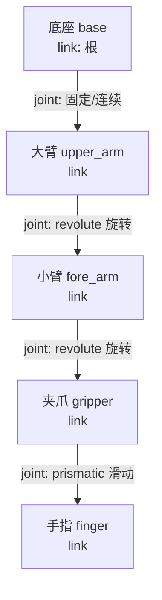

# 第三讲 · 在电脑里先造个"假机器人"练手（虚拟仿真 & URDF）

> **本讲信息**
> - **日期：** 2026-08-16（周日）
> - **第几讲：** 第三讲（整个学习计划 Day 3）
> - **对应计划：** `study-plan-60d.md` 里 **P3 仿真URDF** 阶段，课程集号 **013–017**
> - **今天目标：** 搞懂两件事——①啥是"仿真"（在电脑里跑机器人）；②URDF 是啥（给这个假机器人写的一份"组装说明书"）。你机械出身，这讲会用到你"画零件图"的老本行，别怕。

---

## 0. 一句话总结（先看结论，心里有底）

> **仿真** = 在电脑里造一个"假的机器人 + 假的世界"，先让它跑起来练手，不花真钱、摔不坏、能无限重来。
> **URDF** = 给这个假机器人写的一份"乐高组装说明书"（用电脑能读的文字写成）。里面 **link（连杆）= 一块块硬零件**，**joint（关节）= 零件之间怎么连、能怎么动**。
> 一句话记牢：**仿真让你"先试错再动手"，URDF 是"把机器人翻译成电脑懂的话"。**

---

## 1. 核心知识点（这 5 节在讲啥，全是大白话）

| 集号 | 标题 | 大白话 |
|---|---|---|
| 013 | 虚拟仿真概念介绍 | 仿真 = 在电脑里造个虚拟世界 + 虚拟机器人，让它先动起来。像飞行员先用模拟器练，再上真飞机 |
| 014 | 虚拟仿真的优缺点 | 好处：省钱、安全、能重来；坏处：电脑世界是"简化版"，有些真实现象模拟不出 → 仿真好 ≠ 真机好 |
| 015 | URDF 概念介绍 | URDF = 机器人的"组装说明书"（电脑语言 XML 写的），列出零件清单 + 连接关系，仿真器靠它认机器人 |
| 016 | link 和 joint 的概念 | link = 一块刚体零件（像大臂、小臂）；joint = 两零件之间怎么连、能怎么动（像门合页只能转） |
| 017 | link 的模型描述 | 一个 link 要写清四样：长啥样(视觉)、碰它多大(碰撞)、多重(惯性)、摆在哪(位置) |

### 1.1 仿真到底是啥？—— 就是"电脑里的机器人游戏"

你玩过赛车游戏吧？游戏里那辆车撞了墙不会真坏，因为那是"假的"。**仿真（simulation）就是把机器人也做成"假的"放在电脑里**：

- 电脑里有一个"虚拟的机械臂"，有底座、有大臂小臂、有夹爪；
- 电脑里还有一个"虚拟的桌子、虚拟的杯子"；
- 你发指令"夹起杯子"，电脑按物理规律算一算，屏幕上那个假手臂就真夹起来了。

**为啥要这么干？** 三个实在好处：
1. **不花真钱**：真机械臂几万块，仿真不要钱；
2. **摔不坏**：真机调错参数可能撞坏，仿真里随便造；
3. **能重来**：真机一次实验半小时，仿真可以"加速""暂停""倒带"，一分钟试一百次。

> 打个比方：学开车先上模拟器，不是因为模拟器能替你上路，而是让你**在不用赔车的前提下把基本动作练熟**。仿真对你学机器人也是这个意思——先把动作练对，再碰真家伙。

### 1.2 仿真的优缺点——别迷信它

仿真不是万能的，得心里有数：

**优点：**
- 便宜、安全、可重复；
- 能调时间快慢（比如慢放，看清每一步）；
- 能测"危险场景"（真机不敢做的，仿真里随便试）。

**缺点（重点！）：**
- 电脑里的世界是**简化版**。真实的摩擦（皮垫多滑）、柔性（一根线会软会弹）、电线时延（信号晚到几毫秒）、温度影响……这些细节仿真**抓不全**。
- 所以会出现一个著名现象：**"仿真里调得倍儿好，真机上就翻车"**。这叫 **Sim-to-Real gap（仿真到现实的鸿沟）**——从电脑里的假世界，到现实的真世界，中间有条跨不过去的缝。

> 大白话记法：仿真像"驾校模拟器"，它教你认油门刹车，但**真上路的风、雨、前车急刹，模拟器给不了**。所以仿真练完，真机上还要再磨一遍。别以为仿真过了就万事大吉。

### 1.3 URDF 是啥？——机器人的"宜家说明书"

URDF = **U**nified **R**obot **D**escription **F**ormat，翻译过来叫"统一机器人描述格式"。名字吓人，其实就是**一份用电脑语言（叫 XML）写的"机器人组装说明书"**。

想想宜家的椅子说明书：它不给你真木头，它给你一张纸，上面写"板A用 4 颗螺丝连到板B，板B再连到板C"。仿真器读 URDF，也是这个逻辑：**"底座连大臂，大臂连小臂，小臂连夹爪"**——读完了，仿真器才知道你这个机器人长啥样、零件咋排。

你**不写这份说明书，仿真器就两眼一抹黑**，不知道你有几个零件、怎么连，自然跑不起来。

### 1.4 link 和 joint —— 机器人的"零件"和"连接方式"

URDF 里只有两种基本积木：

**link（连杆）= 一块"刚体零件"。**
- 就是机器人身上一段硬邦邦的身板，比如底座、大臂、小臂、夹爪指。
- 它有"质量"（多重）、"形状"（长啥样）。
- 一句话：link 是"东西（名词）"——是零件本身。

**joint（关节）= 两个零件之间"怎么连、能怎么动"。**
- 就像你身体里"肩"连接"大臂"和"躯干"，"肘"连接"大臂"和"小臂"。
- joint 决定：这两个零件是"焊死不动"，还是"能转"，还是"能滑"。
- 常见四种 joint 类型（记这四种够用）：
  - **revolute（旋转关节）**：像门合页，绕一根轴转。→ 你胳膊的肘。
  - **prismatic（移动关节）**：像抽屉，直直地滑出去。→ 机床上的滑块。
  - **continuous（连续旋转）**：一直转、不限位，像轮子。
  - **fixed（固定关节）**：焊死，完全不动。→ 把两个零件粘一起时用。

> 大白话：link 是"骨头"，joint 是"骨头之间的连接方式和活动范围"。机器人 = 一堆骨头（link）用不同的连接方式（joint）拼起来。

### 1.5 一个 link 到底要写啥？—— 四件事（第 017 节重点）

光说"这是大臂"不够，电脑要知道这块零件的细节。URDF 里一个 link 通常写四样：

1. **visual（视觉）**：长啥样、多大、啥颜色——**给人看的**，决定屏幕上画出来长怎样。
2. **collision（碰撞）**：碰它时用多大体积——**给物理引擎算的**。可以比视觉小一圈（省计算），反正碰的差不多就行。
3. **inertial（惯性）**：多重、重心在哪、转动惯量多大——**决定它"难不难被推动"**。质量大的、重心偏的，动起来"肉"，这些都要写。
4. **origin（位置）**：这块零件相对"父零件"摆在哪、转了多大角度——**最容易写错的地方**！不写 origin，两块零件就叠在同一个点上了，仿真里看着像"穿模"。

> 易错提醒前置：joint 类型选错（比如该转的写成该滑的）→ 建模直接报错；link 没留 origin 偏移 → 零件全叠一起。这两坑 Day 3 就得记牢。

---

## 2. 原理（它凭啥能 work，先抓这几条）

1. **仿真器 = 物理引擎 + 画面渲染。** 物理引擎按牛顿力学（力、质量、加速度）算每个 link 怎么动；渲染器把结果画成你能看的画面。两者配合，你才"看见"机器人动。
2. **URDF 是喂给物理引擎的"输入文件"。** 你不写清 link 的质量/惯性、joint 的类型，引擎就不知道怎么算 → 要么报错，要么算得乱七八糟（比如零件飞出去）。
3. **机器人零件是"树"不是"堆"。** 零件像家谱一样一层层挂：底座（根）→ 大臂 → 小臂 → 夹爪。每个零件（除了根）都通过**一个 joint** 挂在"父零件"下面。这条链叫"运动链"。
4. **Sim-to-Real gap 的根子：真世界太"碎"。** 现实里一根线的软、一点油的滑、电机晚反应几毫秒，仿真只能抓主要的，抓不全 → 看起来对、实际不对。所以仿真结果要"打个折"看。

---

## 3. 两张图

**图一：机器人的"骨头树"（link + joint）**

> 看图说话：方框是 link（零件），箭头上的字是 joint（怎么连、怎么动）。整棵"树"从底座长出来，一层套一层。这就是 URDF 要描述的样子。

**图二：仿真一圈怎么转**

> 你写的 URDF → 仿真器读 → 物理引擎算 → 屏幕显示 → 你看着不对就改 URDF 或改指令 → 再算。这就是仿真循环。

---

## 4. 跟"你自己"挂钩（这一讲对你有啥用）

你是机械 / DEA 软体背景，这讲有两层意义：

1. **仿真是你"零成本的试错场"。** 你以后要控 DEA 软体执行器，软体建模极难（连续变形、迟滞、状态难测）。你可以**先在仿真里用刚性近似练控制算法**，等算法顺了再上真机，省大把时间。
2. **URDF 描述不了"软身体"——这正好是你的机会。** 标准 URDF 描述的是"刚体零件"（硬邦邦、不变形）。但你导师的 DEA 是**软的、会鼓会缩的**。也就是说：课本里的 URDF 方法，碰到你的软体就"卡壳"了——软体得用别的办法（比如有限元、软体仿真）来描述。**这个"卡壳"，就是你能做研究的地方**：怎么让虚拟机器人也长出"软身体"？
3. **对标你仓库里的真机。** `so101-act/` 里你跑的是真硬件（STS3215 舵机那类刚性执行器）。现在学仿真，以后可以"先在仿真里练，再上真机"，和你 Day 2 学的刚性舵机正好对上。

---

## 5. 今天的操作步骤（学习流程，不是敲代码）

1. **读一遍本文件**（你在这步）。
2. **徒手画出第 3 节的"骨头树"图**（底座 → 大臂 → 小臂 → 夹爪 → 手指，标上每个 joint 类型）。别复制，画一遍才进脑子。
3. **列一张"link vs joint"对比小表**：link 是零件（名词）、joint 是连接方式（动词）。各举 2 个你身上的例子（如：大腿 = link，膝盖 = joint）。
4. **对照课程看 013–017**（1.0–1.5 倍速）。重点看 017：留意一个 link 的 visual / collision / inertial / origin 四样都长啥样。
5. **镜子测试（3 分钟，关掉一切讲）：** *"仿真就是___；URDF 是___；link 相当于___；joint 相当于___；revolute 像___、prismatic 像___；仿真最大的坑是___。"*
6. **（进阶，不急）** 网上找一个现成 URDF 例子（比如一个小车），用在线 URDF 查看器打开，指给大家看哪个是 link、哪个是 joint。

> ✅ 今天"做完"的标准：骨头树能徒手画 + 镜子测试能过 + 能在一个 URDF 例子里认出 link 和 joint。

---

## 6. 常见误区 & 容易踩的坑（大白话）

| # | 误区（坑长啥样） | 真相（咋爬出来） |
|---|---|---|
| 1 | "仿真就是打游戏，玩具不重要。" | 仿真是用物理定律认真算的，是**真机之前最便宜的试错试场**。轻视它，真机上你会多交学费。 |
| 2 | "仿真里调好了，真机肯定行。" | 错！**Sim-to-Real gap** 在等你。仿真结果要"打折"看，真机还要再磨。 |
| 3 | "link 和 joint 是一回事。" | link 是"零件（东西）"，joint 是"零件怎么连、怎么动（关系）"。一个是名词一个是动词，别混。 |
| 4 | "joint 随便选个类型都行。" | 类型选错（该转写成该滑）→ 建模报错或动得不对。revolute = 转、prismatic = 滑、continuous = 一直转、fixed = 不动，按实际选。 |
| 5 | "link 不写 origin 也行。" | 不写 origin，零件全叠在同一个点，仿真里"穿模"叠一起。每个 link 都要告诉它"相对爸爸摆在哪"。 |
| 6 | "URDF 写完就一定能跑。" | 还要写对质量 / 惯性 / joint 类型，物理引擎才算得动。漏了就报错或乱飞。 |
| 7 | "软体机器人也能直接写 URDF。" | 标准 URDF 只描述**刚体**。你的 DEA 软体会变形，得用别的办法（有限元 / 软体仿真）。这正好是你研究的切入点。 |

---

## 7. 我的感悟（第一人称——王子征口吻，预判式）

> *以下用学生（王子征）口吻写，写在还没真上手写 URDF 的阶段——预判式感悟。*

今天这讲，我第一反应是"这不就是我本科画零件图那套搬到了电脑里吗"。link 像我 CAD 里的一个个零件，joint 像装配关系。但转念一想，不对——我以前画的是"给人看的图"，URDF 是"给物理引擎算的输入"。同样一块大臂，画出来好看没用，得把质量、重心、转动惯量都写对，引擎才推得动它。这让我对"机械设计"多了一层敬畏：你写的每个数，电脑都当真。

最触动我的是 Sim-to-Real gap。我以前潜意识觉得"仿真能跑通就稳了"，现在知道那是天真。尤其是想到我未来的 DEA 软体——它连标准 URDF 都描述不了（会变形嘛），仿真这关对我更难。但也正因为难，才有得做。别人用刚性 URDF 三下五除二搭完，我得想办法让虚拟机器人也"软"起来，这本身就是课题。

还有个小心得：仿真和真机的关系，像"先在驾校练，再上路"。我仓库里 so101-act 已经摸过真机了，现在补上仿真这课，以后就能"仿真练熟 → 真机微调"，效率高一倍。这讲我不飘，它让我把"机械底子"和"机器人智能"又焊紧了一扣。

---

## 8. 下一步 / 检查点

- **过了检查点 =** 能徒手画骨头树 + 过 3 分钟镜子测试 + 能在一个 URDF 例子里认出 link 和 joint。
- **下一讲（Day 4）：** **URDF 标签详解 + Node.js 仿真环境**（018–022）——真正动手写 URDF 的每个标签，并把仿真环境在电脑上跑起来看机器人。
- **本周种子：** 把"先在仿真里练、再上真机"当成你的标准工作流，和 so101-act 的真机经验对照着记。

---

### 参考资料（先放着，今天不要求）
- 课程视频 013–017（黑马程序员《具身智能》223 节版）。
- （后续）Day 4–5 会动手写 URDF 标签、跑 Node.js 仿真；Day 24–28 的 PID 会把这个"仿真循环"里的控制器填满。
- 延伸思考：软体机器人的仿真（有限元 / 软体物理）与标准 URDF 的区别——你的研究切入点。
