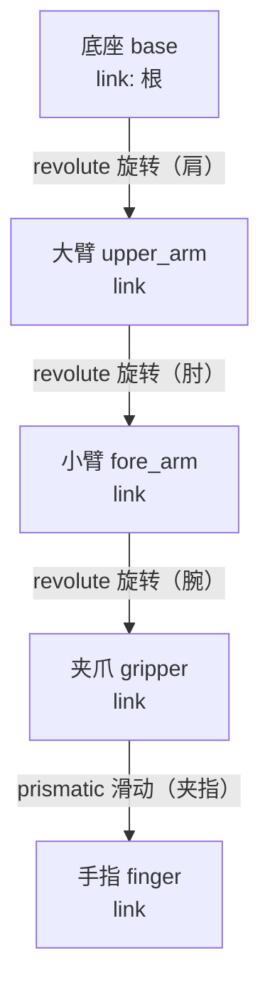

# 第三讲 · 在电脑里先造个"假机器人"练手（虚拟仿真 & URDF）

> **本讲信息**
> - 日期：2026-08-16（周日）
> - 第几讲：第三讲（学习计划 Day 3）
> - 对应计划：`study-plan-60d.md` 里 **P3 仿真URDF** 阶段，课程集号 **013–017**
> - 今日目标：搞懂两件事——① 啥是"仿真"（在电脑里跑机器人）；② URDF 是啥（给这个假机器人写的一份"组装说明书"）。机械出身，这讲会用到"画零件图"的老本行，别怕。

---

## 0. 一句话总结

> **仿真** = 在电脑里造一个"假的机器人 + 假的世界"，先让它跑起来练手，不花真钱、摔不坏、能无限重来。
> **URDF** = 给这个假机器人写的一份"乐高组装说明书"（用电脑能读的文字写成）。里面 **link（连杆）= 一块块硬零件**，**joint（关节）= 零件之间怎么连、能怎么动**。
> 一句话记牢：**仿真让你"先试错再动手"，URDF 是"把机器人翻译成电脑懂的话"。**

---

## 1. 核心知识点（这 5 节在讲啥）

| 集号 | 标题 | 要点 |
|---|---|---|
| 013 | 虚拟仿真概念介绍 | 仿真 = 在电脑里造虚拟世界 + 虚拟机器人，让它先动起来。像飞行员先用模拟器练，再上真飞机 |
| 014 | 虚拟仿真的优缺点 | 好处：省钱、安全、能重来；坏处：电脑世界是"简化版"，有些真实现象模拟不出 → 仿真好 ≠ 真机好 |
| 015 | URDF 概念介绍 | URDF = 机器人"组装说明书"（XML 写的），列出零件清单 + 连接关系，仿真器靠它认机器人 |
| 016 | link 和 joint 的概念 | link = 一块刚体零件（像大臂、小臂）；joint = 两零件之间怎么连、能怎么动（像门合页只能转） |
| 017 | link 的模型描述 | 一个 link 要写清四样：长啥样(视觉)、碰它多大(碰撞)、多重(重力)惯性、摆在哪(位置) |

### 1.1 仿真到底是啥

你玩过赛车游戏吧？游戏里那辆车撞了墙不会真坏，因为那是"假的"。**仿真（simulation）就是把机器人也做成"假的"放在电脑里**：
- 电脑里有一个"虚拟的机械臂"，有底座、有大臂小臂、有夹爪；
- 电脑里还有一个"虚拟的桌子、虚拟的杯子"；
- 你发指令"夹起杯子"，电脑按物理规律算一算，屏幕上那个假手臂就真夹起来了。

**为什么要这么干？** 三个实在好处：
1. **不花真钱**：真机械臂几万块，仿真不要钱；
2. **摔不坏**：真机调错参数可能撞坏，仿真里随便造；
3. **能重来**：真机一次实验半小时，仿真可以"加速""暂停""倒带"，一分钟试一百次。

> 类比：学开车先上模拟器，不是因为模拟器能替你上路，而是让你**在不用赔车的前提下把基本动作练熟**。仿真对你学机器人也是这个意思——先把动作练对，再碰真家伙。

### 1.2 仿真的优缺点——别迷信它

**优点：** 便宜、安全、可重复；能调时间快慢（如慢放，看清每一步）；能测"危险场景"（真机不敢做的，仿真里随便试）。

**缺点（重点）：** 电脑里的世界是**简化版**。真实的摩擦（皮垫多滑）、柔性（一根线会软会弹）、电线时延（信号晚到几毫秒）、温度影响……这些细节仿真**抓不全**。所以会出现一个著名现象：**"仿真里调得倍儿好，真机上就翻车"**。这叫 **Sim-to-Real gap（仿真到现实的鸿沟）**——从电脑里的假世界，到现实的真世界，中间有条跨不过去的缝。

> 仿真像"驾校模拟器"，它教你认油门刹车，但**真上路的风、雨、前车急刹，模拟器给不了**。所以仿真练完，真机上还要再磨一遍。别以为仿真过了就万事大吉。

<mark>**📌 课件补充 1｜从"仿真"到"数字孪生"**：传统仿真聚焦"特定过程"、局部离线、用于分析验证（比如一个齿轮的受力分析）；**数字孪生（Digital Twin）**聚焦"完整实体"、全局实时同步，是在数字空间里创建物理实体的**动态虚拟副本**——它不只有相同的外观(Geometry)，还有相同的物理属性(Physics)，能接收传感器数据(Sensing)并响应控制指令(Actuation)。工业里 GE 给每台航空发动机建数字孪生做故障预测，NASA 给火星车建数字孪生在地球上模拟火星环境。我们这门课要做的，就是给实体机械臂建一个数字孪生，作为主要的开发测试平台。</mark>

<mark>**📌 课件补充 2｜仿真的三大价值 + 数据瓶颈**：① **降成本**——真机器人贵，仿真里"炸毁"无数虚拟机器人成本为零；② **保安全**——防算法 bug 撞坏设备、伤人，还能测极端工况；③ **提效率**——同时跑成百上千个实验、24 小时不间断，改一个臂长/扭矩参数只需几秒。更深一层：现代 AI 是"数据饕餮"，训练一个抓取模型需要**数百万次交互数据**，真机抓一百万次要几年、硬件早报废——**仿真就是"无限数据生成器"**，也是强化学习（RL）的理想训练场（虚拟世界里数亿次试错几小时完成）。所以公认最高效的范式是 **"99% 在仿真大规模训练 + 1% 在现实微调部署"**。</mark>

### 1.3 URDF 是啥——机器人的"宜家说明书"

URDF = **U**nified **R**obot **D**escription **F**ormat，翻译过来叫"统一机器人描述格式"。名字吓人，其实就是**一份用 XML（一种电脑能读的标记语言）写的"机器人组装说明书"**。

想想宜家的椅子说明书：它不给你真木头，它给你一张纸，上面写"板 A 用 4 颗螺丝连到板 B，板 B 再连到板 C"。仿真器读 URDF 也是这个逻辑：**"底座连大臂，大臂连小臂，小臂连夹爪"**——读完了，仿真器才知道你这个机器人长啥样、零件咋排。你不写这份说明书，仿真器就两眼一抹黑，不知道你有几个零件、怎么连，自然跑不起来。

### 1.4 link 和 joint——机器人的"零件"和"连接方式"

URDF 里只有两种基本积木：

**link（连杆）= 一块"刚体零件"。**
- 机器人身上一段硬邦邦的身板，比如底座、大臂、小臂、夹爪指。
- 它有"质量"（多重）、"形状"（长啥样）。
- 一句话：link 是"东西（名词）"——零件本身。

**joint（关节）= 两个零件之间"怎么连、能怎么动"。**
- 像你身体里"肩"连接"大臂"和"躯干"，"肘"连接"大臂"和"小臂"。
- joint 决定：这两个零件是"焊死不动"，还是"能转"，还是"能滑"。
- 常见四种 joint 类型（记这四种够用）：
  - **revolute（旋转关节）**：像门合页，绕一根轴转。→ 你胳膊的肘。
  - **prismatic（移动关节）**：像抽屉，直直地滑出去。→ 机床上的滑块。
  - **continuous（连续旋转）**：一直转、不限位，像轮子。
  - **fixed（固定关节）**：焊死，完全不动。→ 把两个零件粘一起时用。

> link 是"骨头"，joint 是"骨头之间的连接方式和活动范围"。机器人 = 一堆骨头（link）用不同的连接方式（joint）拼起来。

<mark>**📌 课件补充｜树状结构 + 父子关系 + 运动学链（URDF 的核心世界观）**：一个机器人模型就是一系列 Link 通过 Joint 连接成的**树状结构（Tree Structure）**，两条硬约束：**必须有一个根 Link（Root Link），且不允许出现闭环**。每个 Joint 都连着一父一子：**父 Link（Parent）+ 子 Link（Child）**——这定义了坐标系的变换方向。比如肘关节连接"上臂"和"小臂"，上臂是父、小臂是子，我们描述的是"小臂相对于上臂的位置和运动"。这条父子关系链从根 Link 一级级往下传，最终构成整个机器人的**运动学链（Kinematic Chain）**。类比人体：躯干→上臂→小臂→手掌，就是一条从根往下长的"骨骼树"。</mark>

### 1.5 一个 link 到底要写啥——四件事（第 017 节重点）

光说"这是大臂"不够，电脑要知道这块零件的细节。URDF 里一个 link 通常写四样：
1. **visual（视觉）**：长啥样、多大、啥颜色——**给人看的**，决定屏幕上画出来长怎样。
2. **collision（碰撞）**：碰它时用多大体积——**给物理引擎算的**。可以比视觉小一圈（省计算），差不多就行。
3. **inertial（惯性）**：多重、重心在哪、转动惯量多大——**决定它"难不难被推动"**。质量大的、重心偏的，动起来"肉"，这些都要写。
4. **origin（位置）**：这块零件相对"父零件"摆在哪、转了多大角度——**最容易写错的地方**！不写 origin，两块零件就叠在同一个点上，仿真里看着像"穿模"。

> 易错提醒：joint 类型选错（该转写成该滑）→ 建模直接报错；link 没留 origin 偏移 → 零件全叠一起。这两坑 Day 3 就得记牢。

### 1.6 看一眼"最小 URDF"到底长啥样（提前混个脸熟）

光说概念容易飘，这里放一个**只有底座 + 一节臂**的最小例子，你今天不用写，但认得它就好：

```xml
<robot name="mini_arm">
  <!-- 底座：一个刚体零件，带一个"视觉"方块 -->
  <link name="base">
    <visual>
      <geometry><box size="0.1 0.1 0.05"/></geometry>
    </visual>
  </link>

  <!-- 一节臂：一个空壳 link，具体形状后面再补 -->
  <link name="arm1"/>

  <!-- 关节：把 arm1 接到 base 上，能绕 z 轴转 -->
  <joint name="joint1" type="revolute">
    <parent link="base"/>
    <child  link="arm1"/>
    <origin xyz="0 0 0.05" rpy="0 0 0"/>
    <axis   xyz="0 0 1"/>
  </joint>
</robot>
```

逐行看：
- `<robot name="...">` 是整份说明书的**封皮**（根标签），名字随便起。
- `<link name="base">` 里套 `<visual><geometry><box .../></geometry></visual>` = 给底座画一个 0.1×0.1×0.05 米的方块（**visual = 给人看**）。
- `<joint name="joint1" type="revolute">` = 一个旋转关节；`<parent link="base"/>` 和 `<child link="arm1"/>` 说清"谁挂在谁下面"——**这就是"父子关系"，URDF 靠它把零件串成树**。
- `<axis xyz="0 0 1"/>` = 绕 Z 轴转（转动的"轴心"），这行后面学运动学（Day 12–16）会天天见。

> 记住这段的最小骨架：**robot 封皮 → link（零件）→ joint（parent/child + type + axis + origin）**。Day 4（018–022）会动手把 visual/collision/inertial 每个子标签写全。
>
> ⚠️ 提示：按 URDF 规范，`revolute` 关节**必须**带 `<limit>`（角度上下限 + 力矩/速度）才能被解析器接受，否则会报错。上面这个示例为了"只认骨架"省略了它，真正动手写时别漏（Day 4 的完整示例会补上）。

---

## 2. 原理（先抓这几条）

1. **仿真器 = 物理引擎 + 画面渲染。** 物理引擎按牛顿力学（力、质量、加速度）算每个 link 怎么动；渲染器把结果画成你能看的画面。两者配合，你才"看见"机器人动。
2. **URDF 是喂给物理引擎的"输入文件"。** 你不写清 link 的质量 / 惯性、joint 的类型，引擎就不知道怎么算 → 要么报错，要么算得乱七八糟（如零件飞出去）。
3. **机器人零件是"树"不是"堆"。** 零件像家谱一层层挂：底座（根）→ 大臂 → 小臂 → 夹爪。每个零件（除根）都通过**一个 joint** 挂在"父零件"下面。这条链叫"运动链"。
4. **Sim-to-Real gap 的根子：真世界太"碎"。** 现实里一根线的软、一点油的滑、电机晚反应几毫秒，仿真只能抓主要的，抓不全 → 看起来对、实际不对。所以仿真结果要"打个折"看。

---

## 3. 两张图

**图一：机器人的"骨头树"（link + joint）**



> 方框是 link（零件），箭头上的字是 joint（怎么连、怎么动）。整棵"树"从底座长出来，一层套一层。这就是 URDF 要描述的样子。

**图二：仿真一圈怎么转**


> 你写的 URDF → 仿真器读 → 物理引擎算 → 屏幕显示 → 你看着不对就改 URDF 或改指令 → 再算。这就是仿真循环。

---

## 4. 今天的操作步骤（学习流程，不是敲代码）

1. **读一遍本文件**（你在这步）。
2. **徒手画出第 3 节的"骨头树"图**（底座 → 大臂 → 小臂 → 夹爪 → 手指，标上每个 joint 类型）。别复制，画一遍才进脑子。
3. **列一张"link vs joint"对比小表**：link 是零件（名词）、joint 是连接方式（动词）。各举 2 个你身上的例子（如：大腿 = link，膝盖 = joint）。
4. **对照课程看 013–017**（1.0–1.5 倍速）。重点看 017：留意一个 link 的 visual / collision / inertial / origin 四样都长啥样。
5. **镜子测试（3 分钟，关掉一切讲）：** *"仿真就是___；URDF 是___；link 相当于___；joint 相当于___；revolute 像___、prismatic 像___；仿真最大的坑是___。"*
6. **（进阶，不急）** 网上找一个现成 URDF 例子（如一个小车），用在线 URDF 查看器打开，指给大家看哪个是 link、哪个是 joint。

> ✅ 今天"做完"的标准：骨头树能徒手画 + 镜子测试能过 + 能在一个 URDF 例子里认出 link 和 joint。

---

## 5. 常见误区 & 容易踩的坑

| # | 误区 | 真相 |
|---|---|---|
| 1 | "仿真就是打游戏，玩具不重要。" | 仿真是用物理定律认真算的，是**真机之前最便宜的试错场**。轻视它，真机上你会多交学费。 |
| 2 | "仿真里调好了，真机肯定行。" | 错！**Sim-to-Real gap** 在等你。仿真结果要"打折"看，真机还要再磨。 |
| 3 | "link 和 joint 是一回事。" | link 是"零件（东西）"，joint 是"零件怎么连、怎么动（关系）"。一个是名词一个是动词，别混。 |
| 4 | "joint 随便选个类型都行。" | 类型选错（该转写成该滑）→ 建模报错或动得不对。revolute = 转、prismatic = 滑、continuous = 一直转、fixed = 不动，按实际选。 |
| 5 | "link 不写 origin 也行。" | 不写 origin，零件全叠在同一个点，仿真里"穿模"叠一起。每个 link 都要告诉它"相对父零件摆在哪"。 |
| 6 | "URDF 写完就一定能跑。" | 还要写对质量 / 惯性 / joint 类型，物理引擎才算得动。漏了就报错或乱飞。 |
| 7 | "软体机器人也能直接写 URDF。" | 标准 URDF 只描述**刚体**。软体执行器会变形，得用别的办法（有限元 / 软体仿真）。这正好是研究上的切入点。 |

---

## 6. 下一步 / 检查点

- **过了检查点 =** 能徒手画骨头树 + 过 3 分钟镜子测试 + 能在一个 URDF 例子里认出 link 和 joint。
- **下一讲（Day 4）：** **URDF 标签详解 + Node.js 仿真环境**（018–022）——真正动手写 URDF 的每个标签，并把仿真环境在电脑上跑起来看机器人。
- **本周种子：** 把"先在仿真里练、再上真机"当成标准工作流，和 `so101-act/` 的真机实践对照着记。

---

### 参考资料（先放着，今天不要求）
- 课程视频 013–017（黑马程序员《具身智能》223 节版）。
- （后续）Day 4–5 会动手写 URDF 标签、跑 Node.js 仿真；Day 17–20 的 PID 会把这个"仿真循环"里的控制器填满。
- 延伸思考：软体机器人的仿真（有限元 / 软体物理）与标准 URDF 的区别——研究上的切入点。</content>