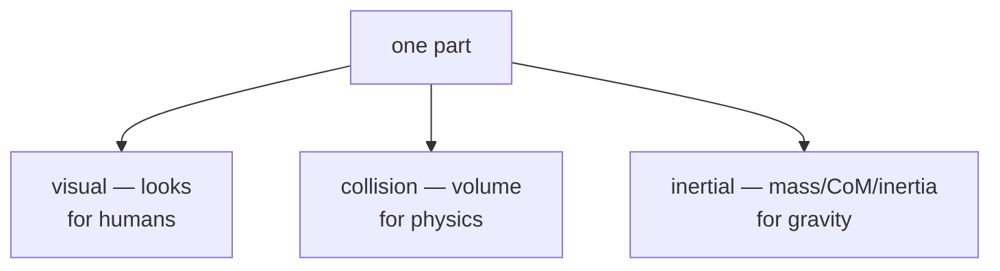

# Lecture 04 — Writing URDF Tags by Hand + Drawing the Robot with Node.js

> **Meta**
> - Date: 2026-08-17 (Monday)
> - Lecture / Day: Lecture 04 — the *fourth* lecture of the study plan (Day 4)
> - Plan anchor: `study-plan-60d.md` → **P3 仿真URDF (Simulation & URDF)**, course episodes **018–022**
> - Goal of today: turn Day 3's *concepts* into *action* — actually read each URDF tag (the three sub-tags of link, and joint's parent/child/axis), and get the course's Node.js simulation environment running on your computer.

---

## 0. One-line summary

> Day 3 taught you "URDF is a manual"; today you learn "**how to write every line of that manual**." URDF is XML — a pile of angle-bracket tags: **a link wraps three sub-tags (visual = for humans, collision = for physics, inertial = for gravity); a joint writes parent (who hangs under whom), child, type (how it moves), axis (around which axis), origin (where it sits)**. Once the manual is written, you need a tool that reads and draws it — the course uses a **Node.js web-based simulation environment**: Node.js is the runtime that lets JavaScript run on your computer instead of only in the browser.

---

## 1. Core knowledge (what these 5 episodes are about)

| # | Title | Key point |
|---|---|---|
| 018 | urdf链接方式介绍 (How links connect) | a link hangs onto its parent via a joint; the robot is a "tree" (each link has one parent, the root is base) |
| 019 | LINK标签子元素详解 (link sub-elements) | a link wraps three sub-tags: `<visual>` (for humans), `<collision>` (for physics), `<inertial>` (for gravity/inertia) |
| 020 | urdf的link语法介绍 (link syntax) | concrete syntax: `<geometry>` shape (box/cylinder/sphere/mesh), `<material>` color, `<origin>` position |
| 021 | nodejs介绍和安装 (Node.js intro & install) | Node.js = a runtime that runs JavaScript on your computer; verify with `node -v` / `npm -v` |
| 022 | nodejs仿真环境测试 (Sim env test) | boot the sim environment and see the robot model in the browser |

### 1.1 A link's "three identities" (episode 019 — expanding Day 3's "four things")

Day 3 said a link writes four things (visual/collision/inertial/origin). Today that becomes tags — really, one link plays **three roles**, each with its own block:

- **visual**: what the part **looks like**. Inside: `<geometry>` (shape: box / cylinder / sphere / mesh) + `<material>` (color). **Only affects the screen, not the physics.**
- **collision**: how much **volume it occupies when bumped**. Used by the physics engine for contact detection. **You may deliberately make it simpler than visual** (e.g., approximate a complex shape with a cylinder), because collision detection is the most expensive part.
- **inertial**: how **heavy**, where the center of mass is, how big the moment of inertia. Used for dynamics (gravity, acceleration). Writes `<mass>` (kg) + `<inertia>` (3×3 matrix) + `<origin>` (center of mass).

> One line: **visual is the "skin," collision is the "bump," inertial is the "weight."** They are independent.

### 1.2 How a joint is written (episode 018 — the most important part)

A joint is "how parts connect." It must write:

- `<parent link="..."/>` + `<child link="..."/>`: **who hangs under whom**. child is the "kid," parent is the "dad." Swap them and the chain breaks.
- `type`: revolute (rotate) / prismatic (slide) / continuous (spin forever) / fixed (welded). Written as a joint attribute: `<joint type="revolute">`.
- `<axis xyz="0 0 1"/>`: **which axis it rotates/slides around**. "0 0 1" = around Z. This is the core of arm kinematics.
- `<origin xyz="..." rpy="..."/>`: where this joint **sits on the previous part, and its orientation**. xyz is position (meters), rpy is orientation (radians, roll-pitch-yaw, fixed-axis X→Y→Z).
- (**required** for revolute / prismatic; not needed for continuous / fixed) `<limit lower="..." upper="..." effort="..." velocity="..."/>`: clamp the angle range / torque / speed.

### 1.3 What Node.js is, and why the simulation needs it (episode 021)

- JavaScript was originally "browser-only." **Node.js = a runtime that lets JavaScript run on your computer (server)**, plus the `npm` package manager (install other people's libraries).
- This course's simulation is a **web stack** (HTML + JavaScript drawing the robot's 3D scene), so you install Node.js on your computer, boot the project, then open it in a browser.
- Verify it's installed: type `node -v` (prints Node's version) and `npm -v` (prints npm's version). Both printing numbers = done.

### 1.4 Sim environment test (episode 022)

After Node is installed: enter the project folder, `npm install` (installs dependencies per `package.json`) → run the start command → open `localhost` on some port in the browser → see the robot. This is the "display window" for the arm you build on Day 5.

---

## 2. Principles to internalize (why it works)

1. **URDF is declarative, not imperative**: you only write "what parts exist, how they connect, what they look like" — **not "how it moves."** The physics engine computes the motion. That's the difference between a "manual" and a "program."
2. **One link, three blocks, three consumers**: visual → renderer (humans), collision → contact detection (physics), inertial → dynamics (gravity/inertia). Decoupled, so collision may cheap out with a simple shape.
3. **Coordinate frames are the soul of URDF**: every link has its own "local frame"; origin sets where it sits relative to its parent. The rpy order (fixed-axis X→Y→Z) is order-sensitive — get it wrong and the part tilts/flips.
4. **The robot's skeleton is a tree, not a web**: a link has exactly one parent (the root base has none). Two parents (or a cycle) makes the URDF invalid.

---

## 3. Two diagrams

**Diagram 1: a link's "three identities"**



**Diagram 2: a real URDF snippet (full base + full joint)**

```xml
<robot name="mini_arm">
  <!-- link with all three identities: skin / bump / weight -->
  <link name="base">
    <visual>
      <geometry><box size="0.1 0.1 0.05"/></geometry>
      <material name="gray"/>
    </visual>
    <collision>
      <geometry><box size="0.1 0.1 0.05"/></geometry>
    </collision>
    <inertial>
      <mass value="0.5"/>
      <inertia ixx="0.001" ixy="0" ixz="0" iyy="0.001" iyz="0" izz="0.001"/>
    </inertial>
  </link>

  <link name="arm1"/>

  <joint name="joint1" type="revolute">
    <parent link="base"/>
    <child  link="arm1"/>
    <origin xyz="0 0 0.05" rpy="0 0 0"/>
    <axis   xyz="0 0 1"/>
    <limit  lower="-1.57" upper="1.57" effort="10" velocity="1"/>
  </joint>
</robot>
```

> Read it: `visual` wraps `geometry+material`; `collision` also wraps `geometry` (may be simpler than visual); `inertial` wraps `mass+inertia`; `joint` wraps `parent/child/origin/axis/limit`. That's Day 4's core syntax.

---

## 4. Today's operation steps (study workflow, not coding)

1. **Read this file once** (you are here).
2. **Redraw the "three identities" diagram by hand** (§3 diagram 1), chanting: visual = skin, collision = bump, inertial = weight.
3. **Read the URDF in §3 diagram 2 line by line**, stating what each line does (especially `parent`/`child`/`axis`).
4. **Watch 018–022** (1.0–1.5× speed). Focus on 019: what the visual/collision/inertial sub-tags look like in real code.
5. **Install Node.js and verify**: type `node -v` and `npm -v`; both printing numbers = success.
6. **Mirror test (3 min, close everything and talk):** *"URDF is written in ___; a link's three sub-tags are ___, ___, ___ (for ___); in a joint, parent is ___, child is ___, axis is ___; Node.js is ___."*

> ✅ **Definition of "done today":** three-identities diagram drawn by hand + can read §3's URDF line by line + Node.js installed and verified.

---

## 5. Common misconceptions & easy mistakes

| # | Misconception | Reality |
|---|---|---|
| 1 | "visual and collision must be identical." | No. collision may use a **simpler** shape (cheaper contact detection), as long as it roughly covers the part. |
| 2 | "Swapping parent and child is fine, the simulator auto-corrects." | Swapping = broken chain (kid hung on the wrong dad): errors out or the arm grows from the wrong place. **It does not auto-correct.** |
| 3 | "The order in rpy doesn't matter." | rpy is an **order-sensitive** fixed-axis X→Y→Z rotation; wrong order → tilted, flipped, twisted parts. |
| 4 | "Skipping inertial (or all zeros) is fine." | mass 0 / inertia 0 → the part is "weightless" in dynamics, flies off under any force. You may fudge visual, never inertia. |
| 5 | "Node.js is just for websites, unrelated to robots." | This course's simulation is a web stack; Node.js is the base that runs it. No Node → no sim environment. |
| 6 | "`node -v` prints a number, so just run the project." | You still need `npm install` for dependencies; a mismatched Node version can also stop the project from booting. |
| 7 | "A link can have two parents (e.g. a parallel mechanism: the end effector connects back to the base through two chains)." | Standard URDF is a **tree**; a link has one parent. Note that "two legs sharing a torso" is actually **legal** (one parent can have many children); what URDF cannot express is a **closed loop** — parallel mechanisms need SDF / MJCF or a fixed joint breaking the loop. |

---

## 6. Next steps / checkpoint

- **Checkpoint passed if:** three-identities diagram drawn by hand + can read §3's URDF line by line + Node.js installed.
- **Next lecture (Day 5):** **Building the robot arm** (023–026) — from the base upward, assemble upper arm, forearm, gripper, and see a full arm in simulation.
- **This week's seed:** burn `link(three identities) + joint(parent/child/axis/origin)` into your head — it's the foundation for any robot model and for kinematics (Day 12–16).

---

### References (for later, not required today)
- Course episodes 018–022 (黑马程序员《具身智能》223-ep version).
- ROS wiki's official URDF tutorials (XML tag reference — look up any tag you don't know).
- Node.js official site (installer + `node -v` / `npm -v` verification).
