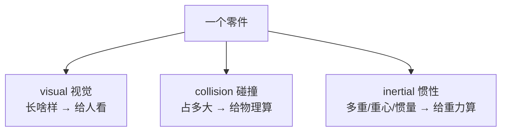

# 第四讲 · 动手写 URDF 标签 + 用 Node.js 把机器人"画"出来

> **本讲信息**
> - 日期：2026-08-17（周一）
> - 第几讲：第四讲（学习计划 Day 4）
> - 对应计划：`study-plan-60d.md` 里 **P3 仿真URDF** 阶段，课程集号 **018–022**
> - 今日目标：把 Day 3 的"概念"落到"动手"——真正看懂 URDF 每个标签怎么写（link 的三个子标签、joint 的 parent/child/axis），并且把课程用的 Node.js 仿真环境在电脑上跑起来。

---

## 0. 一句话总结

> 第三讲懂了"URDF 是说明书"，这一讲学"**说明书每一行怎么写**"。URDF 是 XML——一堆尖括号标签：**link 标签里套三个子标签（visual 给人看 / collision 给物理算 / inertial 给重力算）；joint 标签里写 parent（谁挂在谁下面）、child、type（怎么动）、axis（绕哪根轴）、origin（装在哪）**。写完这份说明书，得有个"能读它、把它画出来"的工具——课程用的是 **Node.js 搭的网页仿真环境**：Node.js 就是让 JavaScript 能在你电脑本地跑起来的运行时。

---

## 1. 核心知识点（这 5 节在讲啥）

| 集号 | 标题 | 要点 |
|---|---|---|
| 018 | urdf链接方式介绍 | link 靠 joint 挂到 parent，机器人是一棵"树"（每个 link 只有一个 parent，根是 base） |
| 019 | LINK标签子元素详解 | link 里套三个子标签：`<visual>` 给人看、`<collision>` 给物理算、`<inertial>` 给重力/惯性算 |
| 020 | urdf的link语法介绍 | 具体语法：`<geometry>` 形状（box/cylinder/sphere/mesh）、`<material>` 颜色、`<origin>` 位置 |
| 021 | nodejs介绍和安装 | Node.js = 在电脑本地跑 JavaScript 的运行时；装完用 `node -v` / `npm -v` 验证 |
| 022 | nodejs仿真环境测试 | 把仿真环境跑起来，浏览器里看到机器人模型 |

### 1.1 一个 link 的"三种身份"（对应 019，Day 3 那"四件事"的展开）

Day 3 说过一个 link 要写四样（visual/collision/inertial/origin）。这一讲把它落到标签上——其实是一个 link 要"扮演三个角色"，各写一套：

- **visual（视觉）**：这个零件**长啥样**。里面写 `<geometry>`（形状：box 方块 / cylinder 圆柱 / sphere 球 / mesh 导入 3D 模型）+ `<material>`（颜色）。**只影响屏幕显示，不影响物理。**
- **collision（碰撞）**：这个零件**碰它时占多大体积**。给物理引擎做"有没有撞到"的检测用。**可以故意比 visual 小/简化**（比如用个圆柱近似复杂形状），因为碰撞检测最吃算力。
- **inertial（惯性）**：这个零件**多重、重心在哪、转动惯量多大**。给动力学算（重力、加速、惯量）。写 `<mass>`（质量，kg）+ `<inertia>`（3×3 转动惯量矩阵）+ `<origin>`（重心位置）。

> 一句话：**visual 是"皮"，collision 是"碰"，inertial 是"重"。** 三个各写各的、互不干扰。

### 1.2 joint 怎么写（对应 018，最关键）

joint 是"连接方式"，里面必写几个标签：

- `<parent link="..."/>` + `<child link="..."/>`：**谁挂在谁下面**。child 是"孩子"，parent 是"爹"。这俩写反，运动链就断了。
- `type`：revolute（转）/ prismatic（滑）/ continuous（一直转）/ fixed（焊死）。写在 joint 标签的属性里：`<joint type="revolute">`。
- `<axis xyz="0 0 1"/>`：**绕哪根轴转/滑**。"0 0 1" = 绕 Z 轴。这是机械臂运动学的核心设定。
- `<origin xyz="..." rpy="..."/>`：这个 joint **装在上一个零件的哪个位置、什么朝向**。xyz 是位置（米），rpy 是朝向（弧度，roll-pitch-yaw，绕 X→Y→Z 固定轴转）。
- （revolute 可选）`<limit lower="..." upper="..." effort="..." velocity="..."/>`：限制转角范围 / 力矩 / 速度。

### 1.3 Node.js 是啥、为什么仿真要用它（对应 021）

- JavaScript 本来是"只能跑在浏览器里"的语言。**Node.js = 一个让 JavaScript 能在你电脑（服务器）本地跑的运行时**，还自带 `npm` 包管理器（装别人写好的库）。
- 这个课程的仿真环境是**网页技术栈**（HTML + JavaScript 画的机器人 3D 画面），所以要先在电脑上装 Node.js，把项目跑起来，再用浏览器打开看。
- 验证装好：命令行敲 `node -v`（出 Node 版本号）、`npm -v`（出 npm 版本号）。两个都出数字 = 装好了。

### 1.4 仿真环境测试（对应 022）

装好 Node 后，进项目目录 `npm install`（按 `package.json` 装依赖）→ 跑启动命令 → 浏览器打开 `localhost` 的某个端口 → 看到机器人。这就是 Day 5 要拼的那条机械臂的"显示窗口"。

---

## 2. 原理（先抓这几条）

1. **URDF 是"声明式"，不是"命令式"**：你只写"有哪些零件、怎么连、长啥样"，**不写"它怎么动"**。怎么动由仿真器的物理引擎算。这就是"说明书"和"程序"的区别。
2. **一个 link 三套信息，喂给三个"消费者"**：visual → 渲染器（人看）、collision → 碰撞检测（物理）、inertial → 动力学（重力惯性）。三者解耦，所以 collision 可以偷懒用简单形状。
3. **坐标系是 URDF 的灵魂**：每个 link 有自己的"局部坐标系"，origin 决定它相对 parent 摆在哪。rpy 顺序（固定轴 X→Y→Z）写错，零件会歪 / 翻。
4. **机器人的骨架是"树"，不是"网"**：一个 link 只能有一个 parent（根 base 没有 parent）。要是一个 link 有两个 parent（或形成环），URDF 直接不合规。

---

## 3. 两张图

**图一：一个 link 的"三种身份"各管啥**



**图二：一段真实 URDF（base 完整 + joint 完整）**

```xml
<robot name="mini_arm">
  <!-- link 三种身份都写全：皮 / 碰 / 重 -->
  <link name="base">
    <visual>
      <geometry><box size="0.1 0.1 0.05"/></geometry>
      <material name="gray"/>
    </visual>
    <collision>
      <geometry><box size="0.1 0.1 0.05"/></geometry>
    </collision>
    <inertial>
      <mass value="0.5"/>
      <inertia ixx="0.001" ixy="0" ixz="0" iyy="0.001" iyz="0" izz="0.001"/>
    </inertial>
  </link>

  <link name="arm1"/>

  <joint name="joint1" type="revolute">
    <parent link="base"/>
    <child  link="arm1"/>
    <origin xyz="0 0 0.05" rpy="0 0 0"/>
    <axis   xyz="0 0 1"/>
    <limit  lower="-1.57" upper="1.57" effort="10" velocity="1"/>
  </joint>
</robot>
```

> 对照着读：`visual` 里套 `geometry+material`；`collision` 里也套 `geometry`（可以比 visual 简单）；`inertial` 里套 `mass+inertia`；`joint` 里套 `parent/child/origin/axis/limit`。这就是 Day 4 的核心语法。

---

## 4. 今天的操作步骤（学习流程，不是敲代码）

1. **读一遍本文件**（你在这步）。
2. **徒手画"link 三种身份"图**（§3 图一），边画边背：visual=皮、collision=碰、inertial=重。
3. **对着 §3 图二的 URDF 代码，一行行说出每行在干嘛**（尤其 `parent`/`child`/`axis` 三行）。
4. **对照课程看 018–022**（1.0–1.5 倍速）。重点看 019：visual / collision / inertial 三个子标签在真实代码里长啥样。
5. **装 Node.js 并验证**：命令行敲 `node -v`、`npm -v`，两个都出数字即成功。
6. **镜子测试（3 分钟，关掉一切讲）：** *"URDF 是___写的；link 三个子标签是___、___、___，分别给___看；joint 里 parent 是___、child 是___、axis 是___；Node.js 是___。"*

> ✅ **今天"做完"的标准：** link 三身份图能徒手画 + 能逐行读 §3 的 URDF + Node.js 装好验证通过。

---

## 5. 常见误区 & 容易踩的坑

| # | 误区 | 真相 |
|---|---|---|
| 1 | "visual 和 collision 必须一模一样。" | 不用。collision 可以用**更简单**的形状（省碰撞检测算力），只要大致盖住就行。 |
| 2 | "`parent` 和 `child` 写反了没关系，仿真器会自动纠正。" | 写反 = 运动链断了（孩子挂错爹），要么报错要么臂从错误的地方长出来。**不会自动纠正。** |
| 3 | "origin 的 rpy 顺序无所谓。" | rpy 是固定轴 X→Y→Z 的**顺序敏感**旋转，顺序错 → 零件歪、翻、拧。 |
| 4 | "inertial 不写或全填 0 没关系。" | 质量 0 / 惯量 0 → 动力学里零件"没重量"，一受力就飞、转不起来。视觉可以糊弄，惯性不能。 |
| 5 | "Node.js 就是给网页用的，跟机器人没关系。" | 这个课程的仿真就是网页技术栈，Node.js 是跑它的底座。没它，仿真环境起不来。 |
| 6 | "`node -v` 出数字就万事大吉，直接跑项目。" | 还要 `npm install` 装依赖；版本不匹配（Node 太新/太旧）也会导致项目跑不起来。 |
| 7 | "一个 link 可以同时有两个 parent（像两条腿共用躯干）。" | 标准 URDF 是**树**，一个 link 只有一个 parent。真需要多 parent 得换 SDF 格式。 |

---

## 6. 下一步 / 检查点

- **过了检查点 =** link 三身份图徒手画 + 逐行读懂 §3 URDF + Node.js 装好。
- **下一讲（Day 5）：** **搭建机械臂模型**（023–026）——从 base 开始，一节节把大臂、小臂、夹爪拼出来，在仿真里看到一条完整的臂。
- **本周种子：** 把 `link(三种身份) + joint(parent/child/axis/origin)` 这套语法刻进脑子——这是后面写任何机器人模型、以及理解运动学（Day 12–16）的地基。

---

### 参考资料（先放着，今天不要求）
- 课程视频 018–022（黑马程序员《具身智能》223 节版）。
- ROS wiki 的 URDF 官方教程（XML 标签速查，遇到不会的标签去查）。
- Node.js 官网（安装包 + `node -v`/`npm -v` 验证）。
