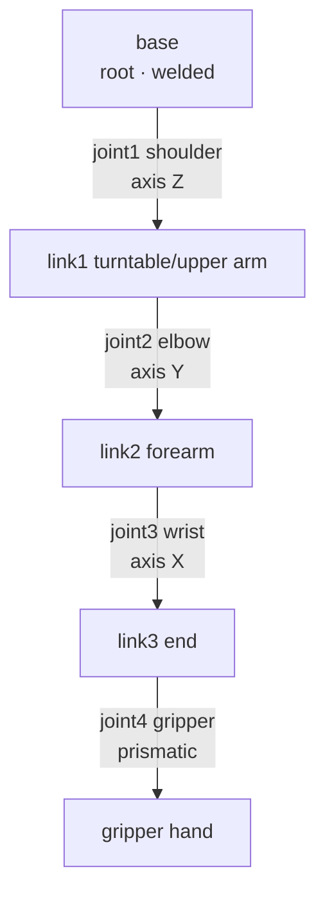

# Lecture 05 — Assembling a Robot Arm (base → joints → links → gripper)

> **Meta**
> - Date: 2026-08-18 (Tuesday)
> - Lecture / Day: Lecture 05 — the *fifth* lecture of the study plan (Day 5)
> - Plan anchor: `study-plan-60d.md` → **P3 仿真URDF (Simulation & URDF)**, course episodes **023–026**
> - Goal of today: get hands-on — in URDF, assemble a robot arm piece by piece starting from the base, and see it display correctly in simulation. This is URDF's "real-deal" round.

---

## 0. One-line summary

> A robot arm = **1 base + a chain of "link–joint" links**. Assemble from the root upward: **fix the base → add the first joint (shoulder, rotating around Z) → hang the upper-arm link → add the elbow joint → hang the forearm → … all the way to the end gripper**. Each added joint adds one "degree of freedom" (an independent direction of motion). When done, the simulation should show an arm that can strike poses.

---

## 1. Core knowledge (what these 4 episodes are about)

| # | Title | Key point |
|---|---|---|
| 023 | 构建机械臂的base组件 (Build the base) | base is the "root" of the tree; usually welded (fixed) to the world, else gravity pulls the whole arm down |
| 024 | 构建机械臂的第一个joint (Build the first joint) | the "shoulder" between base and upper arm: revolute around Z, needs axis + limit |
| 025 | 构建机械臂的其他的joint和link (Build the rest) | upper arm → forearm → wrist → gripper; each joint has its own axis and origin, chained one by one |
| 026 | urdf仿真创建的细节问题 (Sim creation details) | frame alignment, inertia, joint limits, naming — check these after assembling |

### 1.1 The base component (023)

- base = the base, the **root** of the kinematic chain — it has **no parent**.
- Two ways: ① let it be the root link, no joint attached; ② use a `fixed` joint to "weld" it to the world frame.
- Key point: **the base must be fixed.** Simulation has gravity; if the base isn't fixed, the whole arm falls / floats away.

### 1.2 The first joint (024)

- Between the base and the first link (turntable / upper arm), usually a **revolute** rotating around the vertical Z axis (like twisting your waist).
- Write: `parent=base`, `child=link1`, `type=revolute`, `<axis xyz="0 0 1"/>`, `<origin>` (where on the base's top it sits), `<limit lower upper>` (how far it turns).
- This first joint is "joint 1" in kinematics, its angle written as **θ₁**.

### 1.3 The other joints and links (025)

- Keep assembling upward: link1 → joint2 (elbow, rotating around a horizontal axis) → link2 (forearm) → joint3 (wrist) → link3 (end) → gripper.
- Each joint has a **different axis** (shoulder around Z, elbow around Y, wrist around X…) and a **different origin** (at the end of the previous part).
- What you get is a "kinematic chain"; the end link is the "**end effector (hand)**" — the thing IK (Day 12–16) will later drive to a target position.

### 1.4 Detail issues (026)

- **Frame alignment**: each joint's origin must line up with the previous part's "interface," or parts misalign / float.
- **Inertia**: don't zero out mass/inertia, or the arm goes crazy in dynamics (spins wildly at the slightest touch).
- **Joint limits**: set limits, or joints rotate to impossible angles (self-intersection).
- **Naming**: consistent names (base_link / link1 / joint1) so control code can match them later.

---

## 2. Principles to internalize (why it works)

1. **Degrees of freedom = independent directions of motion**: a chain with N revolute/prismatic joints has N DOF. 6 DOF ≈ 3 for position + 3 for orientation, enough to cover any pose in space (why industrial arms are often 6-axis).
2. **axis decides "which axis this joint rotates around" — the lifeblood of kinematics**: FK/IK (Day 12–16) compute the end pose purely from each joint's axis + origin.
3. **The kinematic chain is a directed tree growing from base**: changing one joint's angle only affects its "downstream" parts (its children, grandchildren), never upstream.
4. **Inertia/mass must be real values**: dynamics (gravity, acceleration, contact) only computes correctly if inertial is accurate. You may fudge visual, never inertia.

---

## 3. Diagram: how an arm is assembled piece by piece

**Diagram 1: the arm's kinematic chain (4 joints: shoulder / elbow / wrist / gripper)**



> Boxes = links (parts), text on arrows = joints (how they connect + which axis). Each added joint adds one DOF. The end "hand" is the future IK target.

**Diagram 2: writing it as URDF (base + shoulder + elbow, 3 links, 2 joints)**

```xml
<robot name="my_arm">
  <link name="base">
    <visual>
      <geometry><cylinder radius="0.06" length="0.08"/></geometry>
    </visual>
    <inertial>
      <mass value="0.5"/>
      <inertia ixx="0.001" ixy="0" ixz="0" iyy="0.001" iyz="0" izz="0.001"/>
    </inertial>
  </link>

  <link name="shoulder_link"/>
  <link name="elbow_link"/>

  <!-- joint 1: shoulder, rotate around Z -->
  <joint name="shoulder" type="revolute">
    <parent link="base"/>
    <child  link="shoulder_link"/>
    <origin xyz="0 0 0.08" rpy="0 0 0"/>
    <axis   xyz="0 0 1"/>
    <limit  lower="-3.14" upper="3.14" effort="10" velocity="1"/>
  </joint>

  <!-- joint 2: elbow, rotate around Y -->
  <joint name="elbow" type="revolute">
    <parent link="shoulder_link"/>
    <child  link="elbow_link"/>
    <origin xyz="0 0.15 0" rpy="0 0 0"/>
    <axis   xyz="0 1 0"/>
    <limit  lower="-2.5" upper="2.5" effort="10" velocity="1"/>
  </joint>
</robot>
```

> Note the two joints have different axes: shoulder `xyz="0 0 1"` (around Z), elbow `xyz="0 1 0"` (around Y) — because they physically rotate in different directions. That's what "write the correct axis for each joint" means.

---

## 4. Today's operation steps (study workflow, not coding)

1. **Read this file once** (you are here).
2. **Redraw §3 diagram 1's chain by hand** (base → shoulder → upper arm → elbow → forearm → wrist → hand), labeling each joint's axis.
3. **Hand-copy the URDF in §3 diagram 2** (write it out, don't copy-paste), silently saying what each line does. When done, count: how many links? how many joints? what type each?
4. **Watch 023–026** (1.0–1.5× speed). Focus on 026: the "detail issues" the instructor stresses (inertia, limits, frame alignment).
5. **(Hands-on, optional)** Save diagram 2's URDF as a `.urdf` file, load it into the course's sim environment, and check it correctly shows a "base + two arm segments."
6. **Mirror test (3 min, close everything and talk):** *"A robot arm = ___ + ___; the first joint is ___, rotating around ___; each added joint adds one ___; why must the base be fixed ___; the end effector is ___."*

> ✅ **Definition of "done today":** chain diagram drawn by hand + hand-copied URDF with correct link/joint counts + can explain "DOF" and "fix the base."

---

## 5. Common misconceptions & easy mistakes

| # | Misconception | Reality |
|---|---|---|
| 1 | "Not fixing the base is fine, it's just simulation." | Simulation has gravity; an unfixed base → the whole arm falls / floats. **Base must be welded (fixed) or be the root.** |
| 2 | "Getting parent/child slightly wrong is no big deal." | Wrong → the chain breaks, the arm grows from the wrong place, and all downstream kinematics is wrong. |
| 3 | "Every joint's axis is `0 0 1` (around Z)." | Shoulder around Z, elbow around Y, wrist around X — **write each joint's axis to match its real rotation axis**, or it spins around the wrong one. |
| 4 | "Just fill inertia with 0.001 everywhere." | Wrong inertia → the arm goes crazy in dynamics (spins on touch, sags). You can fudge visual, never inertia. |
| 5 | "No joint limits — let it turn as far as it wants." | No limits → joints reach impossible angles (upper arm punches through the forearm). Set upper/lower to the real range. |
| 6 | "Name things arbitrarily; I'll recognize them later." | Messy names (a, b, c, x1) → control code and angle reads won't match. Prefer base_link / link1 / joint1. |
| 7 | "It displays in the sim = done." | Display is step one; still check **clipping, floating parts, and whether joints rotate correctly** — that's exactly what 026 covers. |

---

## 6. Next steps / checkpoint

- **Checkpoint passed if:** chain diagram drawn by hand + hand-copied URDF counted correctly + can explain DOF / base-fixing.
- **Next lecture (Day 6):** **Upper/lower computer comms + scanning & configuring servos by ID** (027–030) — back from the "virtual arm" to the "real arm," getting the computer to talk to real servos.
- **This week's seed:** remember the assembly logic — "**fix base → chain joints/links one by one → the end is the hand**" — it's the shared foundation for kinematics (Day 12–16) and real-hardware control (Day 6–11).

---

### References (for later, not required today)
- Course episodes 023–026 (黑马程序员《具身智能》223-ep version).
- ROS wiki URDF tutorial's "building a movable model" section (the official multi-joint example).
- (Later) Day 6 returns to real hardware; Day 12–16's kinematics turns each joint angle of this chain into an end position.
