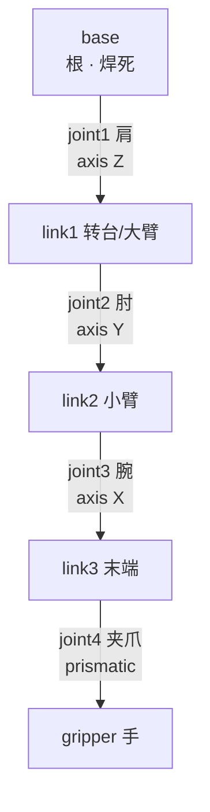

# 第五讲 · 把一条机械臂"拼"出来（base → 关节 → 连杆 → 夹爪）

> **本讲信息**
> - 日期：2026-08-18（周二）
> - 第几讲：第五讲（学习计划 Day 5）
> - 对应计划：`study-plan-60d.md` 里 **P3 仿真URDF** 阶段，课程集号 **023–026**
> - 今日目标：真正动手——在 URDF 里从 base 开始，一节一节把机械臂拼出来，让它在仿真里正确显示。这是 URDF 的"实战关"。

---

## 0. 一句话总结

> 机械臂 = **1 个底座（base）+ 一串"连杆—关节"串成的运动链**。拼的时候从根往上：**先把 base 固定好 → 加第一个 joint（肩，绕 Z 轴转）→ 挂上大臂 link → 加肘 joint → 挂小臂 → …… 一直拼到末端夹爪**。每加一个 joint 就多一个"自由度"（能独立动的方向）。拼完在仿真里应该看到一条能摆姿势的臂。

---

## 1. 核心知识点（这 4 节在讲啥）

| 集号 | 标题 | 要点 |
|---|---|---|
| 023 | 构建机械臂的base组件 | base 是整棵树的"根"，通常焊死（fixed）到世界，否则重力一作用整条臂往下掉 |
| 024 | 构建机械臂的第一个joint | base 和大臂之间的"肩"关节，revolute 绕 Z 轴转，要设 axis + limit |
| 025 | 构建机械臂的其他的joint和link | 大臂→小臂→腕→夹爪，每个 joint 都有自己的 axis 和 origin，一段段串 |
| 026 | urdf仿真创建的细节问题 | 坐标对齐、惯性参数、关节限位、命名规范——拼完要检查这几样 |

### 1.1 base 组件（023）

- base = 底座，整条运动链的**根（root）**，**没有 parent**。
- 两种处理：① 就让它当根 link，不接任何 joint；② 用一个 `fixed` joint 把它"焊"到世界坐标系（world）上。
- 关键点：**base 必须固定住**。仿真里有重力，如果 base 没固定，整条臂会直接掉下去 / 飘走。

### 1.2 第一个 joint（024）

- base 和第一个 link（大臂/转台）之间，通常是 **revolute**，绕竖直的 Z 轴转（像人转腰）。
- 要写：`parent=base`、`child=link1`、`type=revolute`、`<axis xyz="0 0 1"/>`、`<origin>`（装在 base 顶面哪个位置）、`<limit lower upper>`（转多少度）。
- 这第一个 joint 就是后面运动学的"关节 1"，角度记为 **θ₁**。

### 1.3 其他的 joint 和 link（025）

- 继续往上拼：link1 → joint2（肘，绕水平轴转）→ link2（小臂）→ joint3（腕）→ link3（末端）→ 夹爪。
- 每个 joint 的 **axis 不同**（肩绕 Z、肘绕 Y、腕绕 X……），**origin 也不同**（装在上一个零件的末端）。
- 拼出来的就是一条"运动链"，末端那个 link 就是"**末端执行器（手）**"——将来 IK（Day 12–16）要控制它到指定位置。

### 1.4 细节问题（026）

- **坐标对齐**：每个 joint 的 origin 要对准上一个零件的"接口"，否则零件错位 / 悬空。
- **惯性参数**：mass、inertia 别乱填 0，否则动力学仿真里臂会"发疯"（轻轻一碰就乱转）。
- **关节限位**：设 limit，否则关节会转到人体不可能的角度（自穿插）。
- **命名规范**：base_link / link1 / joint1 这类统一命名，后面写控制代码时对得上号。

---

## 2. 原理（先抓这几条）

1. **自由度 = 能独立动的方向数**：一条链有几个 revolute/prismatic joint，就有几个自由度。6 自由度 ≈ 3 个定位 + 3 个定向，正好覆盖空间任意位姿（所以工业臂常是 6 轴）。
2. **axis 决定了"这个关节绕哪根轴转"，这是运动学的命根子**：后面 FK/IK（Day 12–16）全靠每个 joint 的 axis + origin 算末端位置。
3. **运动链是一棵有向树，从 base 长出来**：改一个关节的角度，只影响它"下游"的零件（它的孩子、孙子），不影响"上游"。
4. **惯性/质量要填真值**：动力学（重力、加速、碰撞）能不能算对，全靠 inertial 准不准。视觉可以糊弄，惯性不能。

---

## 3. 图：一条臂怎么一节节拼起来

**图一：5 轴机械臂的运动链（谁挂谁）**



> 方框 = link（零件），箭头上的字 = joint（怎么连 + 绕哪根轴）。每多一个 joint，就多一个自由度。末端那个"手"就是将来 IK 的目标。

**图二：把它写成 URDF（base + 肩 + 肘，3 个 link 2 个 joint）**

```xml
<robot name="my_arm">
  <link name="base">
    <visual>
      <geometry><cylinder radius="0.06" length="0.08"/></geometry>
    </visual>
    <inertial>
      <mass value="0.5"/>
      <inertia ixx="0.001" ixy="0" ixz="0" iyy="0.001" iyz="0" izz="0.001"/>
    </inertial>
  </link>

  <link name="shoulder_link"/>
  <link name="elbow_link"/>

  <!-- 关节1：肩，绕 Z 轴转 -->
  <joint name="shoulder" type="revolute">
    <parent link="base"/>
    <child  link="shoulder_link"/>
    <origin xyz="0 0 0.08" rpy="0 0 0"/>
    <axis   xyz="0 0 1"/>
    <limit  lower="-3.14" upper="3.14" effort="10" velocity="1"/>
  </joint>

  <!-- 关节2：肘，绕 Y 轴转 -->
  <joint name="elbow" type="revolute">
    <parent link="shoulder_link"/>
    <child  link="elbow_link"/>
    <origin xyz="0 0.15 0" rpy="0 0 0"/>
    <axis   xyz="0 1 0"/>
    <limit  lower="-2.5" upper="2.5" effort="10" velocity="1"/>
  </joint>
</robot>
```

> 注意两个 joint 的 axis 不一样：肩 `xyz="0 0 1"`（绕 Z），肘 `xyz="0 1 0"`（绕 Y）——因为它们在空间里转的方向本来就不同。这就是"每个关节都要写对 axis"的意思。

---

## 4. 今天的操作步骤（学习流程，不是敲代码）

1. **读一遍本文件**（你在这步）。
2. **徒手画 §3 图一的运动链**（base → 肩 → 大臂 → 肘 → 小臂 → 腕 → 手），给每个 joint 标上它绕的轴。
3. **把 §3 图二的 URDF 抄一遍**（手抄，不是复制），抄的时候心里默念每行干嘛。抄完数一数：几个 link？几个 joint？各是什么 type？
4. **对照课程看 023–026**（1.0–1.5 倍速）。重点看 026：讲师强调的"细节问题"（惯性、限位、坐标对齐）。
5. **（动手，可选）** 把图二的 URDF 存成 `.urdf` 文件，扔进课程仿真环境里，看它能不能正确显示一条"底座+两节臂"。
6. **镜子测试（3 分钟，关掉一切讲）：** *"机械臂 = ___ + ___；第一个关节是___、绕___轴转；每加一个 joint 多一个___；base 为什么必须固定___；末端执行器是___。"*

> ✅ **今天"做完"的标准：** 运动链图徒手画 + 手抄 URDF 数对 link/joint 数 + 能讲清"自由度"和"base 固定"。

---

## 5. 常见误区 & 容易踩的坑

| # | 误区 | 真相 |
|---|---|---|
| 1 | "base 不固定也没事，反正是仿真。" | 仿真有重力，base 不固定 → 整条臂往下掉 / 飘。**base 必须焊死（fixed）或当根。** |
| 2 | "joint 的 parent/child 关系连错一点没关系。" | 连错 → 运动链断裂，臂从错误的地方长出来，后面运动学全错。 |
| 3 | "所有关节的 axis 都写 `0 0 1`（绕 Z）。" | 肩绕 Z、肘绕 Y、腕绕 X——**每个关节的 axis 要按它真实的旋转轴写**，写错关节就绕错轴转。 |
| 4 | "惯性参数随便填个 0.001 就行。" | 惯性乱填 → 动力学仿真里臂"发疯"（一碰就乱转、自己往下垮）。视觉能糊弄，惯性不能。 |
| 5 | "不设 joint limit，能转多少转多少。" | 不设 limit → 关节转到人体不可能的角度（大臂穿进小臂）。要按真实活动范围设上下限。 |
| 6 | "命名随便起，later 能认出来就行。" | 命名乱（a、b、c、x1）→ 后面写控制代码、读角度时对不上号。建议 base_link / link1 / joint1 统一。 |
| 7 | "拼完仿真里显示出来 = 大功告成。" | 显示只是第一步，还要检查**有没有穿模、零件悬空、关节转得对不对**——这些就是 026 讲的细节问题。 |

---

## 6. 下一步 / 检查点

- **过了检查点 =** 运动链图徒手画 + 手抄 URDF 数对 + 讲清自由度/base 固定。
- **下一讲（Day 6）：** **上下位机通讯 + 按 ID 扫描配置舵机**（027–030）——从"虚拟的臂"回到"真的臂"，让电脑和真实舵机对上话。
- **本周种子：** 记住"**base 固定 → 一节节串 joint/link → 末端是手**"这条装配逻辑，它是后面运动学（Day 12–16）和真机控制（Day 6–11）的共同地基。

---

### 参考资料（先放着，今天不要求）
- 课程视频 023–026（黑马程序员《具身智能》223 节版）。
- ROS wiki 的 URDF 教程里"构建可动模型"一节（多 joint 串联的官方范例）。
- （后续）Day 6 起回到真实硬件；Day 12–16 的运动学会把这条链上的每个 joint 角度"翻译"成末端位置。
