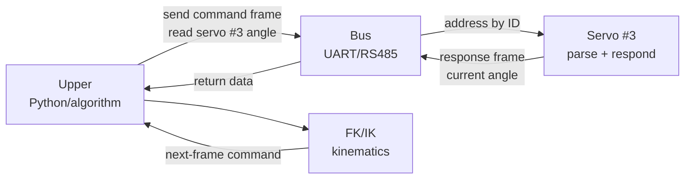

# Lecture 06 — From "Virtual Arm" Back to "Real Arm" (Upper/Lower Computer Comm + Servo ID Scanning)

> **Meta**
> - Date: 2026-08-19 (Wednesday)
> - Lecture / Day: Lecture 06 — the *sixth* lecture of the study plan (Day 6)
> - Plan anchor: `study-plan-60d.md` → **P4 通讯标定 (Communication & Calibration)**, course episodes **027–030**
> - Goal of today: switch from "running a fake robot in the computer" back to "running real servos on the desk" — understand how the PC talks to servos, how each servo is found by ID, and how to read every servo's angle back. As a mechanical-engineering student, this lecture is the wire that connects *hardware actuators* to *software algorithms*.

---

## 0. One-line summary

> **Upper/lower computer = the upper (PC / algorithm) sends commands, the lower (servo controller + servos) executes and returns data**. Multiple servos share one bus, each **identified by a unique ID** (the bus addresses by ID), so the PC "calls" one servo by ID and that servo responds alone. **Common ground (GND tied together) is the prerequisite for any comm to work; every servo on the bus must have a unique ID, otherwise the bus collides and angles get crossed up.**

---

## 1. Core knowledge (what these 4 episodes are about)

| # | Title | Key point |
|---|---|---|
| 027 | 上下位机通讯流程 (Upper/lower comm flow) | upper sends a command frame → lower parses → servo acts → returns the current angle. Half-duplex bus, addressed by ID |
| 028 | 扫描配置编码器舵机 (Scan & configure encoder servos) | after power-on, "scan" the bus to find every online servo's ID; assign each a unique ID (to avoid collisions) |
| 029 | 获取某个编号id的角度 (Read angle by ID) | send a "read angle" command to a target ID → servo returns its current encoder value → upper parses |
| 030 | 多个舵机角度的获取 (Read multiple servo angles) | poll each ID in turn (or use sync read) → get every joint angle in one shot → feed into FK/IK |

### 1.1 What is upper/lower comm? — basically a "point-to-point chat"

You chat on WeChat: you send a message, the other side reads, replies; you see the reply. **Upper/lower comm works exactly like that — except "you" is the PC (upper), and "the other side" is the servo controller + servos (lower).**

- **Upper (上位机)**: your PC, running the algorithm (Python / C++ / Node, etc.), responsible for "deciding what to do."
- **Lower (下位机)**: the servo controller (parses commands, drives signals to servos) + the servos (the ones that physically turn), responsible for "hearing the command, moving, and reporting back."
- **Physical medium**: a bus (commonly UART-to-RS485, or USB-to-serial). A few wires on the bench: power (VCC), ground (GND), data lines (D+/D−).
- **Protocol**: an agreed "language" between the two sides — header, function code, ID, data, checksum.

> Analogy: the upper is the *head teacher*, the lower is the *class president + a class of students*. The teacher calls "Student #3, stand up!" → the class president hears → student #3 stands → the president reports back "Student #3 has stood up." **The ID is the student number**, every student needs a unique one.

### 1.2 Scan & configure encoder servos — "roll call" before "renumber"

When a fresh batch of servos is plugged in (or after a swap), the upper doesn't know how many there are or what their IDs are. **Scanning = send a broadcast asking "everyone online, report your ID"; every servo answers.** Now you know how many there are and what they're numbered.

**Configuring IDs = giving every servo a unique "student number".** This is to avoid ID collisions (a collision = two servos answering at once → garbled data). The usual steps:
1. Scan to learn all current IDs;
2. Call each one in turn and rewrite its ID (take the old one offline temporarily, then assign the new one);
3. Scan again to verify.

> **Key principle: on one bus, every servo must have a unique ID.** Even a difference of 1 (1 vs 2 vs 3 …) is fine — no repeats. This is the most common beginner trap: once the bus gets confused, you no longer know whose numbers are whose.

### 1.3 Reading one servo's angle — calling out "where have you turned?"

**Command frame (pseudocode example):**
```
[header] [function=read angle] [ID=3] [data length] [params] [checksum]
```

The upper sends "read the angle of servo #3" → servo #3 receives it, reads its encoder value, returns a response frame (containing #3's current angle). **The upper parses that into degrees (or radians) for the algorithm.**

**Encoder angle vs command angle:**
- **Command angle**: where you *told* it to go (the target within `<limit>` in URDF).
- **Encoder angle**: where it *actually* ended up (measured by the encoder). The difference is the error → that's the closed-loop feedback (the embryo of PID, to be covered in Day 17–20).

### 1.4 Reading multiple servos — polling / sync read

To get the full pose of an arm (multiple joints), you need every servo's angle. Two ways:

- **Polling**: call each servo in turn. Simple but slow — 6 servos × a few ms each = tens of ms before you have a complete pose.
- **Sync read**: send one broadcast "everyone answer" packet, all servos respond nearly at once. Current mainstream servo buses (e.g., Feetech / Dynamixel protocol) support sync read.

> **Why does "how fast you read" matter?** Control loop frequency (the "sampling rate" of control theory) needs to be high enough for stable closed-loop. Slow feedback → PID can't correct in time → oscillation / can't track. **At least ~50 Hz** (one full pose every 20 ms) is the floor; **100 Hz+** is solid.

---

## 2. Principles to internalize (why it works)

1. **The bus = one shared data line + many devices**: every servo hangs on the same wire, distinguished by ID. Physically they **must share GND** (all grounds tied together) — otherwise the data line's high/low has no reference and **comm fails**.
2. **The ID is a unique "door number"**: every command carries an ID; **only the matching servo responds**, others stay silent. So if two IDs collide → both respond → frames get garbled.
3. **Reading the angle = reading the encoder = the source of closed-loop feedback**: without this you have no "where am I now" perception. Control theory calls this the *observation*. The "actual value" in PID is exactly this.
4. **Sampling rate sets the ceiling of control**: faster feedback → more stable control. Too slow → PID can't correct in time → jitter / instability.

---

## 3. One diagram: one round-trip between upper and lower



> The complete control loop: read angle → use FK to compute end pose → compare with target → PID outputs torque → send to servo → servo moves → read again… this is the whole **control loop**, to be covered systematically in Day 17–20.

---

## 4. Today's operation steps (study workflow, not coding)

1. **Read this file once** (you are here).
2. **Redraw the "upper/lower round-trip" diagram by hand** (§3), marking where the ID lives and what the sampling rate is.
3. **List the "must-haves of upper/lower comm":** ① common GND ② unique IDs ③ matching baud rate ④ matching protocol version ⑤ correct TX/RX wiring (no cross).
4. **Watch 027–030** (1.0–1.5× speed). Focus on 028: scanning / assigning IDs is the prerequisite for every later real-machine experiment.
5. **Mirror test (3 min, close everything and talk):** *"Upper/lower comm is ___; the bus addresses by ___; scanning is for ___; reading the angle equals reading ___; polling vs sync-read differ in ___; why common GND is needed ___; what happens when IDs collide ___."*
6. **(Later)** actually plug in a servo bus, scan once, write down every servo's ID, and verify that "read angle by ID" returns a value matching the real position.

> ✅ **Definition of "done today":** can hand-draw the upper/lower round-trip + name the three iron rules (common GND / unique ID / sampling rate) + pass the mirror test.

---

## 5. Common misconceptions & easy mistakes

| # | Misconception | Reality |
|---|---|---|
| 1 | "Upper/lower comm = send a command and the servo moves on its own." | Comm is **two-way**: send command + read return. **Without the return**, you have no idea whether it succeeded or where it ended up — that's open-loop (inaccurate, drifts). |
| 2 | "IDs can be anything; assigning all to 1 is fine." | **IDs on one bus must be unique.** Two servos both at 1 → bus collision, garbled data, and the angle you read back isn't from the one you wanted. Every servo needs a different number (1/2/3/4/5/6…). |
| 3 | "Just wire VCC and the data line; GND is optional." | **GND must be shared.** All devices' grounds tied together as the voltage reference; otherwise the data line has no high/low reference and **comm fails**. |
| 4 | "Scan once and you're done; no need to scan again." | Re-scan whenever you swap / add a servo or change wiring. In a fixed setting (production line) you can save an "ID configuration table" so you don't redo it manually each time. |
| 5 | "Read the angle as fast as possible — infinite Hz." | Upper CPU + bus bandwidth are finite. **50–200 Hz** is the common sensible range (one full read every 5–20 ms); blindly pushing for higher rates will lose frames. |
| 6 | "Polling servos one by one is the most stable." | Fine for simple setups, but at **high control rate / many servos** polling drags down the overall feedback. **Sync read is the more professional way.** |
| 7 | "TX goes to TX, RX goes to RX." | Serial is **cross-wired**: upper's TX → lower's RX, upper's RX → lower's TX. **Wire it wrong and you receive nothing.** |

---

## 6. Next steps / checkpoint

- **Checkpoint passed if:** you can hand-draw the upper/lower round-trip + name the three iron rules (common GND / unique ID / sampling rate) + can articulate the difference between read angle and command angle.
- **Next lecture (Day 7):** **Dependency install + miniconda + environment setup** (031–035) — set up the Python environment and use conda to isolate the "embodied robot project" from everything else, so package installs don't fight.
- **This week's seed:** burn the "upper/lower = bus addressing + unique ID + common GND + two-way feedback" four-pack into your head — every later real-machine experiment (PID, teleoperation, BC data collection) rests on it.

---

### References (for later, not required today)
- Course episodes 027–030 (黑马程序员《具身智能》223-ep version).
- Protocol docs for your servo model (Feetech / Waveshare / Dynamixel, etc.) — the exact frame format depends on the model.
- (Later) Day 8–11 covers "calibration + teleoperation + WebSocket + real angle reading" — extending today's "upper/lower round-trip" into a full "teacher arm → student arm" demonstration chain.