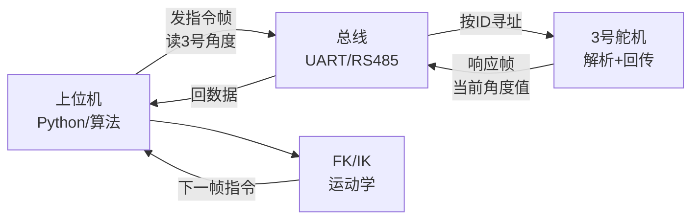

# 第六讲 · 从"虚拟的臂"回到"真的臂"（上下位机通讯 + 扫描配置舵机）

> **本讲信息**
> - 日期：2026-08-19（周三）
> - 第几讲：第六讲（学习计划 Day 6）
> - 对应计划：`study-plan-60d.md` 里 **P4 通讯标定** 阶段，课程集号 **027–030**
> - 今日目标：从"在电脑里跑假机器人"切回"在桌上跑真舵机"——搞懂电脑怎么跟舵机"对上话"、怎么按 ID 找到每一只舵机、怎么把每只的角度读回来。机械出身，本讲就是把"硬件执行器"接上"软件算法"的那根线。

---

## 0. 一句话总结

> **上下位机 = 上位机（电脑/算法）发指令，下位机（舵机控制器/舵机）执行并回传数据**。一条总线上挂多只舵机，**每只用唯一 ID 标识**（总线按 ID 寻址），电脑"点名"某只舵机，它就只回这只的角度。**共地（GND 连一起）是通讯能成功的前提；舵机 ID 必须唯一，否则总线冲突、角度串台**。

---

## 1. 核心知识点（这 4 节在讲啥）

| 集号 | 标题 | 要点 |
|---|---|---|
| 027 | 上下位机通讯流程 | 上位机（电脑）发指令帧 → 下位机（舵机控制器）解析 → 舵机执行 → 回传当前角度。半双工总线，靠 ID 寻址 |
| 028 | 扫描配置编码器舵机 | 上电后先"扫一遍"总线，找到所有在线舵机的 ID；给每只设唯一 ID（避免冲突） |
| 029 | 获取某个编号 ID 的角度 | 总线发"读角度"指令给指定 ID → 舵机返回当前编码器读数 → 上位机解析 |
| 030 | 多个舵机角度的获取 | 多 ID 依次轮询（或广播读）→ 把所有关节角度一次性拿到 → 上位机做 FK/IK 用 |

### 1.1 上下位机是啥——其实就是个"点对点聊天系统"

你跟同事微信聊天：你发一条，对方收到、读一下、回一条，对方回的时候你看得到。**上下位机通讯就是这个模式，只不过"你"是电脑（上位机）、"对方"是舵机控制器 + 舵机（下位机）**。

- **上位机**：你的电脑、跑算法的程序（Python / C++ / Node 都行），负责"想好要做什么"。
- **下位机**：舵机控制器（接收指令、转成电信号给舵机）+ 舵机（真转的那只），负责"听指令、动起来、回头报"。
- **通讯媒介**：一根总线（常用串口 UART 转 RS-485 总线、或 USB 转串口），物理上是几根线（电源 VCC、GND、数据线 D+/D-）。
- **协议**：双方约定好的"语言"——帧头、功能码、ID、数据、校验。

> 类比：上位机像"班主任"，下位机像"班长 + 一群学生"。班主任喊"3 号同学站起来！" → 班长听到 → 3 号学生站起 → 班长回头告诉班主任"3 号已站起"。**ID 就是"学号"**，每个学生必须唯一。

### 1.2 扫描配置编码器舵机——先"点人头"再"改学号"

新接上一批舵机（或换了一批），上位机不知道总线上有几只、ID 分别是什么。**扫描 = 发广播包问"在线的报 ID"，所有舵机回自己的 ID**。这样你就能知道有几只、各是几号。

**配置 ID = 给每只舵机改一个唯一的"学号"**。这一步是为了避免两只舵机 ID 撞车（撞车 = 总线冲突，两只同时回 → 数据乱了）。常见做法：
1. 先扫描拿到所有现有 ID；
2. 一只只"点名"改 ID（先让原 ID 临时下线，再赋予新 ID）；
3. 改完再扫一遍验证。

> **关键原则：同一总线上，所有舵机的 ID 必须两两不同**。哪怕差 1（1 vs 2 vs 3……），也别重复。这是初学者最常踩的坑——总线一乱就不知道是谁回的数。

### 1.3 读单个舵机的角度——点名问"你转哪儿了"

**指令帧示例（伪代码）**：
```
[帧头] [功能码=读角度] [ID=3] [数据长度] [参数] [校验]
```

上位机发"读 3 号舵机的角度" → 3 号舵机收到、读自己编码器当前值、回一个响应帧（包含 3 号当前角度）。**上位机拿到角度后，转成 ° 或 rad 给算法用**。

**编码器角度 vs 命令角度**：
- **命令角度**：你"让它转到的位置"（即 URDF 里 `<limit>` 范围内的目标值）。
- **编码器角度**：它**实际上转到的位置**（编码器测得）。两者之差 = 误差 → 闭环反馈（就是 Day 17–20 的 PID 雏形）。

### 1.4 读多个舵机的角度——轮询 / 同步读

要拿到整条臂（多关节）的当前位姿，需要把所有舵机的角度都读一遍。两种做法：

- **轮询（polling）**：一只只点名读。简单但慢，6 只舵机 × 几 ms 一只 = 几十 ms 才拿到完整姿态。
- **同步读（sync read）**：发一条"读所有"广播包，所有舵机几乎同时回。当前主流舵机总线（如 Feetech / Dynamixel 协议）都支持 sync read。

> **为什么在乎"读得快"？** 控制频率（控制论里叫"采样频率"）要够高才能稳定闭环。读得慢 → 反馈迟 → 抖 / 振荡 / 跟踪不上。**一般 50 Hz 以上**（每 20 ms 拿到一次完整姿态）是底线，100 Hz+ 才够稳。

---

## 2. 原理（先抓这几条）

1. **总线 = 共享的"一根数据线 + 多只设备"**：所有舵机挂在同一根线上，靠 ID 区分谁该响应。物理上必须**共地**（GND 全连一起），否则电平参考不一致 → 通讯失败。
2. **ID 是唯一的"门牌号"**：上位机发的每条指令都带 ID，**只有 ID 匹配的那只舵机响应**，其他静默。所以"两个 ID 撞了"会导致两只同时回 → 帧错乱。
3. **读角度 = 读编码器 = 闭环反馈的硬件来源**：没有这一步就没有"现在到底在哪"的感知 → 控制论里叫"观测"。PID 里那个"实际值"就是它。
4. **采样频率决定控制上限**：反馈越快，控制越稳。太慢则 PID 没法及时纠偏 → 抖动 / 失稳。

---

## 3. 一张图：上下位机一条指令的来回



> 完整控制闭环：读角度 → 用 FK 算末端位置 → 跟目标比 → PID 出扭矩 → 发给舵机 → 舵机再动 → 再读……这就是**控制环（control loop）**的全貌，Day 17–20 会系统讲。

---

## 4. 今天的操作步骤（学习流程，不是敲代码）

1. **读一遍本文件**（你在这步）。
2. **徒手画"上下位机一条来回"图**（§3 那张），标出 ID 在哪、采样频率是多少。
3. **列一张"上下位机通讯必备"清单**：① 共地 ② 唯一 ID ③ 波特率一致 ④ 协议版本一致 ⑤ 数据线接对（TX/RX 不要交叉错）。
4. **对照课程看 027–030**（1.0–1.5 倍速）。重点看 028：扫描 / 配 ID 是后续所有真机实验的前提。
5. **镜子测试（3 分钟，关掉一切讲）：** *"上下位机是___；总线寻址靠___；扫描是干嘛___；读角度等于读___；轮询和同步读差别是___；为什么要共地___；ID 撞了会怎样___。"*
6. **（以后再做）** 真接上舵机总线，扫描一遍，记下每只的 ID，验证"按 ID 读角度"返回的数和实际位置一致。

> ✅ **今天"做完"的标准：** 能徒手画上下位机来回图 + 说出"共地 / 唯一 ID / 采样频率"三条铁律 + 镜子测试通过。

---

## 5. 常见误区 & 容易踩的坑

| # | 误区 | 真相 |
|---|---|---|
| 1 | "上下位机通讯就是把指令发出去，舵机会自己动。" | 通讯是**双向**：发指令 + 读回传。**没读回传**就没有"是否成功 / 转到哪儿"的反馈，是开环（不准、易飘）。 |
| 2 | "ID 随便编就行，每只给个 1 就行。" | **同一总线 ID 必须唯一**。两只都给 1 → 总线冲突、数据错乱、读到的角度不是你想要的那只。必须每只不同（1/2/3/4/5/6……）。 |
| 3 | "接线只要 VCC 和数据线就行，GND 可省。" | **GND 必须共**。所有设备的 GND 接到一起作为电平参考点，否则数据线上的高/低电平没有基准，**通讯必失败**。 |
| 4 | "扫描一次就完了，以后不用再扫。" | 换舵机、加舵机、改线后**都要重新扫**。固定场景（产线）可保存一份"ID 配置表"避免每次手动配。 |
| 5 | "读角度越快越好，无限高频。" | 上位机算力 + 总线带宽是有限的。**50–200 Hz** 是常见的合理控制频率（每 5–20 ms 读一次），盲目冲高频会丢帧。 |
| 6 | "轮询一只只读最稳。" | 简单场景轮询没问题，但**控制频率高 / 舵机多**时轮询会拖慢整体反馈。**Sync read 是更专业的做法**。 |
| 7 | "TX 接 TX、RX 接 RX 就行。" | 串口是**交叉接**：上位机 TX → 下位机 RX，上位机 RX → 下位机 TX。**接反就收不到东西**。 |

---

## 6. 下一步 / 检查点

- **过了检查点 =** 能徒手画上下位机来回图 + 说出"共地 / 唯一 ID / 采样频率"三条铁律 + 能复述读角度与命令角度的区别。
- **下一讲（Day 7）：** **依赖安装 + miniconda + 环境搭建**（031–035）——把 Python 环境搭起来，用 conda 隔离"具身机器人项目"和别的项目，避免装包打架。
- **本周种子：** 把"上下位机 = 总线寻址 + 唯一 ID + 共地 + 双向反馈"这个四件套刻进脑子——后面所有真机实验（PID、遥操作、BC 数据采集）都靠它。

---

### 参考资料（先放着，今天不要求）
- 课程视频 027–030（黑马程序员《具身智能》223 节版）。
- Feetech / Waveshare / Dynamixel 等总线舵机的协议文档（具体帧格式以你用的型号为准）。
- （后续）Day 8–11 接着讲"标定 + 遥操作 + WebSocket + 真实角度读取"——把今天这条"上下位机来回"拓展成完整的"教师臂 → 学生臂"示教链。