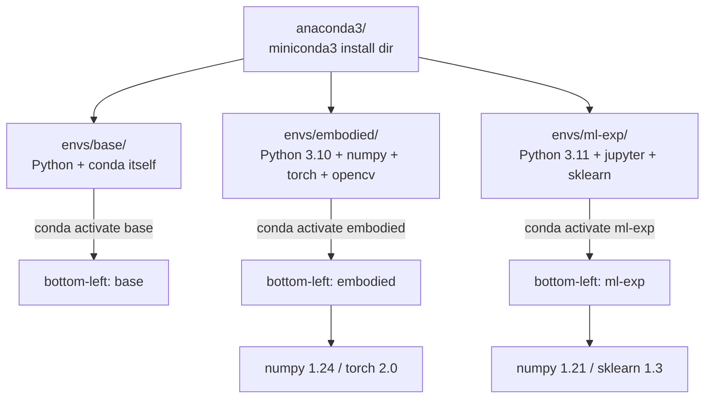

# Lecture 07 — Set Up the Python Environment (Dependency Install + miniconda + Environment Isolation)

> **Meta**
> - Date: 2026-08-20 (Thursday)
> - Lecture / Day: Lecture 07 — the *seventh* lecture of the study plan (Day 7)
> - Plan anchor: `study-plan-60d.md` → **P4 通讯标定 (Communication & Calibration)**, course episodes **031–035**
> - Goal of today: understand **why** Python environments need to be isolated (otherwise package installs will fight each other), and **actually install** miniconda, create an `embodied` environment, and pre-install the common packages you'll need later. As a mechanical-engineering student who may not have touched Python environments before, this lecture is catching up on that gap.

---

## 0. One-line summary

> **Different projects need different Python environments** — one project wants NumPy 1.x, another wants 2.x, install both globally and they will fight. **miniconda = a lightweight Anaconda** that lets you run **multiple isolated Python environments on one machine** without contaminating each other. **Four commands you'll use constantly: `create` to build, `activate` to enter, `install` to install a package, `deactivate` to exit**. **Don't install things in `base` recklessly; don't mix pip and conda carelessly** — the dependency graph will eventually break.

---

## 1. Core knowledge (what these 5 episodes are about)

| # | Title | Key point |
|---|---|---|
| 031 | pip的依赖安装 (pip dependency install) | pip = Python's built-in package installer; `pip install <pkg>`; version conflicts often need pinning |
| 032 | 今日课程目标介绍 (Today's course goals) | see what this phase will cover and which packages you'll need; plan ahead |
| 033 | miniconda的安装 (Install miniconda) | miniconda is Anaconda's "lite" version — only the bare minimum (Python + conda) without pre-bundled packages |
| 034 | conda的常用指令 (Common conda commands) | `create / activate / deactivate / install / list / remove / env list` — memorize these 7 |
| 035 | conda的环境搭建 (Build a conda environment) | create a project-specific environment (e.g., `embodied`), install the packages the project needs |

### 1.1 What is pip, and why talk about it first

`pip` is Python's built-in package manager. Before you write `import numpy`, you have to `pip install numpy` to put that library into the current Python environment's site-packages. **Core usage:**
- `pip install <pkg>`: install the latest version
- `pip install <pkg>==1.21.0`: install a specific version
- `pip list`: see what's installed in the current environment
- `pip uninstall <pkg>`: remove a package
- `pip install -r requirements.txt`: batch-install from a file (very common in projects)

**Limitation of pip**: it only "sees" Python itself (installs into the active Python's site-packages), **it does NOT manage non-Python dependencies** (some libraries need a specific C compiler, system .so files, etc.). conda goes one step further.

### 1.2 What is miniconda — why not just use Python's built-in

**Python's built-in**: install the python.org .exe → installs into `/usr/bin/python` (or `C:\Python39\` on Windows). Problems:
- Only one Python;
- Global site-packages shared across projects;
- Project A wants numpy 2.x, project B wants 1.x → **they will fight**.

**Anaconda**: comes with a bunch of pre-installed packages (numpy, pandas, jupyter…), 1+ GB heavy, beginner-friendly but bloated.

**Miniconda**: only installs Python + the `conda` environment manager itself, **under 100 MB**. Install what you need with `conda install` or `pip install`. **Best for programmers and "I want to control my own environment" types.**

> Analogy: Python built-in is "one shared kitchen for the whole company"; Miniconda is "each project team has its own small kitchen" — team A's Chinese stove doesn't affect team B's Western oven.

### 1.3 Seven common conda commands (covers 80% of daily use)

| Command | What it does |
|---|---|
| `conda create -n <name> python=3.10` | Create a new environment named `<name>` with Python 3.10 |
| `conda activate <name>` | Enter this environment (Windows: `activate`; macOS/Linux: same) |
| `conda deactivate` | Exit the current environment, return to base |
| `conda install <pkg>` | Install a package in the current environment |
| `conda list` | See what packages are installed in the current environment |
| `conda env list` | See all environments on this machine |
| `conda remove -n <name> --all` | Delete an environment (with all its packages) |

**Full beginner flow example**:
```bash
# 1) Install miniconda (download .exe / .sh from the official site, double-click / bash)
# 2) Open a new terminal; check whether the bottom-left says (base)
conda create -n embodied python=3.10
conda activate embodied           # bottom-left changes to (embodied)
conda install numpy matplotlib    # install packages the project needs
pip install lerobot               # pip-install what conda doesn't have
python -c "import numpy; print(numpy.__version__)"  # verify
```

### 1.4 Why environment isolation matters — "package installs don't fight" is the core motivation

**A real scenario**: your ML project uses PyTorch 1.13 (depends on numpy 1.21); half a year later you take another course that needs PyTorch 2.0 (depends on numpy 1.24). **If both are in base**, the old project breaks. **If each has its own environment**, they don't bother each other.

**The embodied-intelligence course needs at least two environments:**
- `embodied`: the main project — robot control, OpenCV, PyTorch, etc.
- (Optional) `ml-experiment`: for tinkering with new models, isolated from the main project.

> **Rule of thumb: when do I need a new environment?** Whenever two projects' dependencies clash, versions conflict, or you want a "clean from-scratch" — open a new env.

---

## 2. Principles to internalize (why it works)

1. **An "environment" = an independent Python interpreter + its own site-packages.** Packages in different envs are invisible to each other — numpy in `embodied` and numpy in `base` are not the same file.
2. **base is the "ballast stone", don't pollute it.** All your projects should live in their own named environments; base should hold conda itself. **Polluting base can break conda itself** — and then you have to reinstall.
3. **conda and pip can be mixed, but order matters.** First `conda install` for what's in the conda repo, then `pip install` for what conda doesn't have. **Reverse order** makes conda's dependency resolver confused.
4. **Domestic mirrors matter**: conda's default repo is overseas; downloads can crawl. The first thing after installing miniconda is **swap to a Tsinghua / Aliyun mirror** — otherwise a 200 MB PyTorch installs until the end of time.

---

## 3. One diagram: how conda environments are "isolated"



> `embodied` and `ml-exp` each install **their own numpy**, files don't overlap — that's "isolation". Switching environments is like switching to an independent kitchen.

---

## 4. Today's operation steps (study workflow, not coding)

1. **Read this file once** (you are here).
2. **Hand-draw the "conda environment isolation" diagram** (§3), marking each environment's Python version and core packages.
3. **Memorize the 7 conda commands** (the table in §1.3), write them down from memory once.
4. **Watch 031–035** (1.0–1.5× speed). Focus on 033/034: install miniconda + run through the 7 commands.
5. **Actually do it**: install miniconda → swap to a domestic mirror → create `embodied` environment → install numpy + matplotlib → verify with `import`.
6. **Mirror test (3 min, close everything and talk):** *"Why use conda instead of Python's built-in ___; miniconda vs anaconda differ in ___; the 7 common commands are ___; why the base env can't be polluted ___; conda/pip mixing order is ___; what if you don't swap the domestic mirror ___."*

> ✅ **Definition of "done today":** can write the 7 conda commands from memory + `embodied` environment built and `import numpy` works + know why you need a domestic mirror.

---

## 5. Common misconceptions & easy mistakes

| # | Misconception | Reality |
|---|---|---|
| 1 | "Python's built-in is enough; why bother with miniconda?" | A single environment serving multiple projects → package version fights → old projects break. conda gives you **one env per project**, no contamination. |
| 2 | "Anaconda is better than miniconda, more features." | Anaconda has a bunch of pre-installed packages (numpy/pandas/jupyter), 1+ GB heavy, mostly unused. **For lightweight setups miniconda is the better fit.** |
| 3 | "Installing in base is fine, it's my computer anyway." | **Base is conda's own home.** Polluting it can break conda's own dependency graph — painful to repair. All projects should live in their own environments. |
| 4 | "conda and pip both install packages; just use either." | They can mix, but **conda first, pip second**. conda prefers packages from the conda repo (compatibility-tested); pip fills the gap. **Reverse order misleads the resolver.** |
| 5 | "The default conda repo is fine." | Default repo is overseas; in China installing PyTorch / TensorFlow (huge packages) can take **hours**. First thing after installing miniconda: **swap to Tsinghua / Aliyun mirror.** |
| 6 | "Newest Python is the most stable." | **Not necessarily.** Many deep-learning libraries lag on brand-new Python versions. **Follow the version mainstream ML libraries support** (e.g., 3.10 / 3.11) — that's the safest bet. |
| 7 | "Once I have an environment, `conda` works without installing miniconda, right?" | **No.** `conda` ships with miniconda / anaconda. System Python doesn't have conda by default — install miniconda first. |

---

## 6. Next steps / checkpoint

- **Checkpoint passed if:** you can write the 7 conda commands from memory + the `embodied` environment is built and `import numpy` works + you know why the domestic mirror matters.
- **Next lecture (Day 8):** **Calibration principle + servo calibration algorithm** (036–039) — back to the real machine, how to align the software's "zero degrees" with the real servo's "zero degrees".
- **This week's seed:** burn the four rules — **project gets its own environment, base stays clean, conda first, domestic mirror** — into your head. These conventions run through the whole 60 days; the ML/DL lectures (Day 29–41) will lean on them again when installing PyTorch.

---

### References (for later, not required today)
- Course episodes 031–035 (黑马程序员《具身智能》223-ep version).
- miniconda official site installers (Windows / macOS / Linux).
- Domestic conda mirror configuration (Tsinghua TUNA / Aliyun) — search "conda Tsinghua mirror" for one-line configuration.
- (Later) Day 8–11 real-machine experiments + WebSocket + real angle reading will run on top of the `embodied` environment you built today.