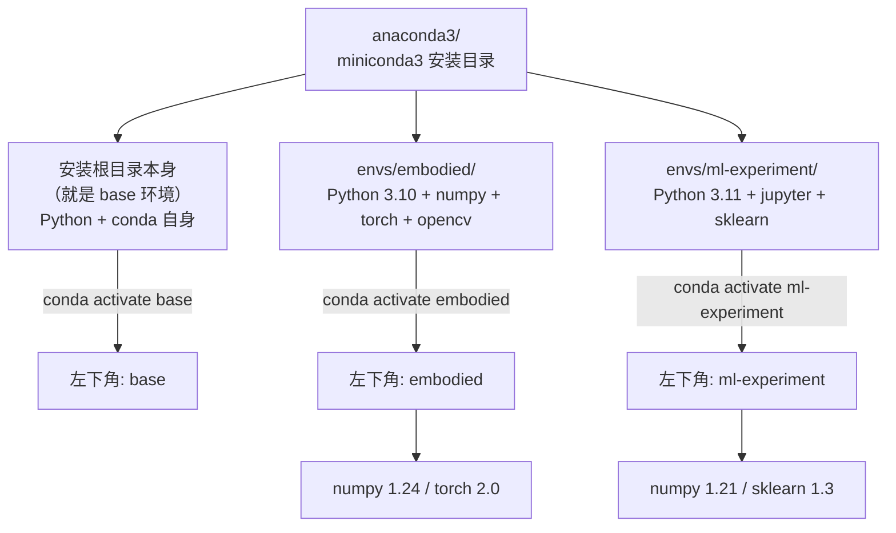

# 第七讲 · 把 Python 环境搭起来（依赖安装 + miniconda + 环境隔离）

> **本讲信息**
> - 日期：2026-08-20（周四）
> - 第几讲：第七讲（学习计划 Day 7）
> - 对应计划：`study-plan-60d.md` 里 **P4 通讯标定** 阶段，课程集号 **031–035**
> - 今日目标：搞懂**为什么**要把 Python 环境隔离（不然装包打架），并**亲手装好** miniconda，建一个叫 `embodied` 的环境，把后面要用的常用包先装上。机械出身可能没怎么碰过 Python 环境，这一讲算补课。

---

## 0. 一句话总结

> **不同项目要不同的 Python 环境**——一个项目用的 NumPy 是 1.x，另一个项目要 2.x，全装一起必打架。**miniconda = 轻量版的 Anaconda**，帮你一台电脑装**多套隔离的 Python 环境**，互不污染。**核心四条指令：`create` 建环境、`activate` 进环境、`install` 装包、`deactivate` 退出（完整七条见 §1.3）**。**别在 `base` 里乱装包、pip 和 conda 别混用**，否则依赖关系迟早崩。

---

## 1. 核心知识点（这 5 节在讲啥）

| 集号 | 标题 | 要点 |
|---|---|---|
| 031 | pip 的依赖安装 | pip = Python 自带的"装包工具"；`pip install <包名>`；版本冲突时常要指定版本 |
| 032 | 今日课程目标介绍 | 看清一阶段要学什么、用到哪些包，提前规划 |
| 033 | miniconda 的安装 | miniconda 是 Anaconda 的"精简版"——只带最基础的 Python + conda，没多余预装包 |
| 034 | conda 的常用指令 | `create / activate / deactivate / install / list / remove / env list`——记住 7 条 |
| 035 | conda 的环境搭建 | 建一个项目专属环境（如 `embodied`），在里面装项目要的包 |

### 1.1 pip 是啥、为啥要先讲它

`pip` 是 Python 自带的包管理器。你写 `import numpy` 之前，得先 `pip install numpy` 把这个库装到当前 Python 环境里。**核心用法**：
- `pip install <包名>`：装最新版
- `pip install <包名>==1.21.0`：装指定版本
- `pip list`：看当前环境装了啥
- `pip uninstall <包名>`：卸
- `pip install -r requirements.txt`：按文件批量装（项目里很常见）

**pip 的局限**：它**只看 Python 自己**（装到当前激活的 Python/site-packages 里），**不会帮你管"非 Python 的依赖"**（如某些库需要特定的 C 编译器、系统 .so 文件等）。conda 比它更进一步。

### 1.2 miniconda 是啥——为什么不用 Python 自带的

**Python 自带版本**：直接装 python.org 的 .exe → 装到一个固定的系统/用户目录（Linux 如 `/usr/bin/python`，Windows 默认在用户目录 `%LocalAppData%\Programs\Python\`）。问题：
- 只有一个 Python；
- 全局 site-packages，多个项目共享；
- 装 A 项目要 numpy 2.x，装 B 项目要 1.x → **必打架**。

**Anaconda**：带一堆预装包（numpy、pandas、jupyter……），重 1 GB+，初学者友好但冗余。

**Miniconda**：只装 Python + conda 这个"环境管理工具"本身，**不到 100 MB**。想要啥包自己 `conda install` 或 `pip install`。**适合程序员和"想自己掌控环境"的人**。

> 类比：Python 自带版像"全公司共用一个厨房"，Miniconda 像"每个项目组有自己独立的小厨房"——组 A 装的中式灶台不影响组 B 的西式烤箱。

### 1.3 conda 七条常用指令（记住这七条够用 80% 场景）

| 指令 | 干嘛 |
|---|---|
| `conda create -n <名字> python=3.10` | 建一个名叫 `<名字>`、用 Python 3.10 的新环境 |
| `conda activate <名字>` | 进入这个环境（conda 4.6+ 各平台统一 `conda activate`） |
| `conda deactivate` | 退出当前环境，回到 base |
| `conda install <包名>` | 在当前环境里装包 |
| `conda list` | 看当前环境装了哪些包 |
| `conda env list` | 看这台电脑上一共建了哪些环境 |
| `conda remove -n <名字> --all` | 删掉一个环境（连同里面所有包） |

**完整新手流程示例**：
```bash
# 1) 装 miniconda（官网下 .exe / .sh 双击 / bash 装）
# 2) 打开新终端，看左下角是不是 (base)
conda create -n embodied python=3.10
conda activate embodied          # 左下角变 (embodied)
conda install numpy matplotlib  # 装项目要的包
pip install lerobot             # conda 仓库没有的用 pip 补
python -c "import numpy; print(numpy.__version__)"  # 验证
```

### 1.4 环境隔离的好处——"装包不打架"是核心动机

**一个真实场景**：你机器学习项目用了 PyTorch 1.13（依赖 numpy 1.21），半年后学另一个课要用 PyTorch 2.0（依赖 numpy 1.24）。**如果都装在 base**，旧项目跑不起来；**如果两个环境各装各的**，互不干扰。

**具身智能这个课至少要两套环境**：
- `embodied`：主项目用，机器人控制、OpenCV、PyTorch 等。
- （可选）`ml-experiment`：专门折腾新模型，跟主项目隔离。

> **判断要不要新建环境**：项目 A 和 B 的依赖有冲突、版本要求不同、或者想"干净从零再来"——就开新环境。

<mark>**📌 课件补充 1｜"依赖地狱"的具体样子**：项目 A（数据分析）要 pandas 1.5 + numpy 1.21，项目 B（机器学习）要 pandas 2.1 + numpy 1.24——如果全局只装一套库，两个项目**无法同时工作**。Conda 的核心思想就是**隔离（Isolation）**：给每个项目建一个独立的"盒子"，每个盒子有独立的 Python 版本和包版本，A 环境装的包对 B 环境完全无影响。而且 Conda **跨语言**——不仅能管 Python，还能管 R、C++ 等，从此一台电脑可以同时拥有无数个互不干扰的开发环境。</mark>

<mark>**📌 课件补充 2｜Git + Conda = 标准化开发的"黄金搭档"**：**Git 管代码的"历史"与"协作"（时间维度）**——跟踪每一次代码变更，关键词 clone/commit/push/pull；**Conda 管项目的"依赖"与"环境"（空间维度）**——隔离不同项目的运行环境，关键词 create/activate/install/deactivate。两者合起来，就是**专业、可靠、可复现**的开发工作流：Git 保证"代码随时可回退、可协作"，Conda 保证"环境随时可重建、不冲突"。</mark>

---

## 2. 原理（先抓这几条）

1. **"环境" = 一个独立的 Python 解释器 + 一套独立的 site-packages**。不同环境的包互不可见——`embodied` 装的 numpy 跟 `base` 装的 numpy 不是同一个文件。
2. **base 环境是"压舱石"，不要乱装东西**。你装的所有项目都该放在自己命名的环境里，base 只留 conda 本身。**base 装爆了，conda 自己都坏了**——得重装。
3. **conda 和 pip 能混用，但顺序讲究**。先用 `conda install` 装"conda 仓库里有"的，再用 `pip install` 装"conda 没有的"。**反过来**容易让 conda 的依赖解析器算错账。
4. **国内镜像**：conda 默认源在境外，下载常龟速。装完后第一件事是换源（清华源 / 阿里源），不然一个 200 MB 的 PyTorch 装到天荒地老。

---

## 3. 一张图：conda 环境是怎么"隔离"的



> `embodied` 和 `ml-experiment` 里**各自装各自的 numpy**，文件互不重叠——这就是"隔离"。换环境就像换独立厨房。

---

## 4. 今天的操作步骤（学习流程，不是敲代码）

1. **读一遍本文件**（你在这步）。
2. **徒手画"conda 环境隔离"图**（§3 那张），标出每个环境的 Python 版本和核心包。
3. **记牢 7 条 conda 指令**（1.3 节的表），默写一遍。
4. **对照课程看 031–035**（1.0–1.5 倍速）。重点看 033/034：装 miniconda + 跑通 7 条指令。
5. **亲手装一遍**：装 miniconda → 换国内源 → 建 `embodied` 环境 → 装 numpy + matplotlib → 验证可 import。
6. **镜子测试（3 分钟，关掉一切讲）：** *"为什么要用 conda 而不是 Python 自带的___；miniconda 跟 anaconda 的差别是___；7 条常用指令是___；base 环境为什么不能乱装包___；conda 和 pip 混用顺序是___；国内源不换会怎样___。"*

> ✅ **今天"做完"的标准：** 默写 7 条 conda 指令 + `embodied` 环境建好并能 import numpy + 知道为啥要换国内源。

---

## 5. 常见误区 & 容易踩的坑

| # | 误区 | 真相 |
|---|---|---|
| 1 | "Python 自带的就够了，为啥还要 miniconda？" | 单一环境装多个项目 → 包版本打架 → 老项目跑不起来。conda 帮你**一套环境一个项目**，互不污染。 |
| 2 | "Anaconda 比 miniconda 好，功能多。" | Anaconda 多一堆预装包（numpy/pandas/jupyter），重 1 GB+，多数用不上。**轻量场景 miniconda 更合适**。 |
| 3 | "在 base 里装包也一样，反正是我的电脑。" | **base 是 conda 自己的家**。装爆了 conda 自己的依赖关系会乱，重装很麻烦。所有项目请进自己的环境。 |
| 4 | "conda 和 pip 都能装包，随便用。" | 能混用，但**先 conda 再 pip**。conda 优先用 conda 仓库的（兼容性验证过）；pip 装 conda 仓库没有的。**反了会算错依赖**。 |
| 5 | "conda 装包用默认源就行。" | 默认源在境外，国内下载 PyTorch / TensorFlow 这种大包**能慢到几小时**。装完 miniconda 第一件事：**换清华源 / 阿里源**。 |
| 6 | "Python 装最新版最稳。" | **不一定**。很多深度学习库对新版本 Python 适配滞后。**跟随主流 ML 库支持的版本**（如 3.10 / 3.11）最稳。 |
| 7 | "建了环境就能用 conda，没装 miniconda 也能跑 conda 命令吧？" | **不行**。conda 是 miniconda / anaconda 自带的工具。系统 Python 默认没 conda，要先装 miniconda。 |

---

## 6. 下一步 / 检查点

- **过了检查点 =** 能默写 7 条 conda 指令 + `embodied` 环境建好并能 import numpy + 知道为啥要换国内源。
- **下一讲（Day 8）：** **标定原理 + 舵机标定算法**（036–039）——回到真机，讲"软件零位"和"真实舵机零位"怎么对齐。
- **本周种子：** 把"**项目用专属环境、base 干净、conda 优先、国内源**"四条铁律刻进脑子——这套规矩贯穿整个 60 天，ML/DL 那几讲（Day 29–41）装 PyTorch 时还会反复用到。

---

### 参考资料（先放着，今天不要求）
- 课程视频 031–035（黑马程序员《具身智能》223 节版）。
- miniconda 官网安装包（Windows / macOS / Linux 三版）。
- 国内 conda 镜像配置（清华 TUNA / 阿里云）——搜"conda 清华源"一行命令搞定。
- （后续）Day 8–11 真机实验 + WebSocket + 真实角度读取，会基于今天搭好的 `embodied` 环境跑代码。</content>