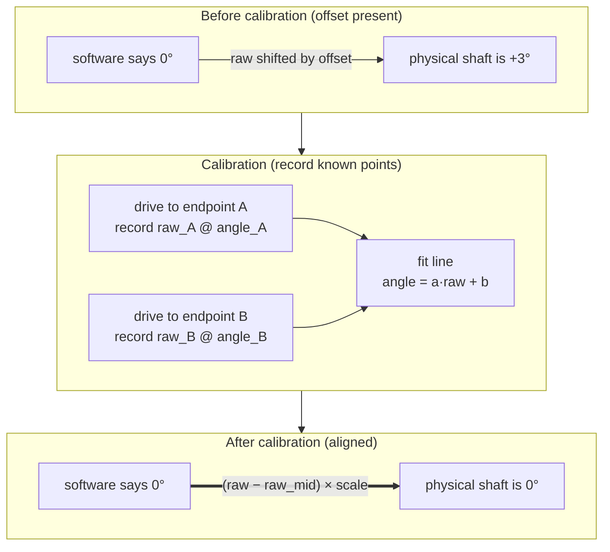

# Lecture 08 — Calibration Principle & Servo Calibration Algorithm

> **Meta**
> - Date: 2026-08-21 (Friday)
> - Lecture / Day: Lecture 08 — the *eighth* lecture of the study plan (Day 8)
> - Plan anchor: `study-plan-60d.md` → **P4 通讯标定 (Communication & Calibration)**, course episodes **036–039**
> - Goal of today: understand **why the teacher arm must be calibrated** (a servo's physical "zero" and the software's "zero" do not agree out of the box), see **what calibration data actually looks like**, and grasp the **linear-mapping algorithm** that turns a servo's raw reading into a trustworthy angle. This is the moment the robot's joints start telling the truth.

---

## 0. One-line summary

> **A servo does not report degrees — it reports a raw reading; "degrees" are computed from that reading.** Out of the box, every servo's raw "zero" is shifted by a manufacturing offset, so software "0°" ≠ physical "0°". **Calibration = record the raw reading at known positions (endpoints / midpoint) and fit a linear map** `angle = a × raw + b` so the two zeros finally line up. **The teacher arm is calibrated first because it is the source of all demonstration data** — if its angles are wrong, every action you collect is wrong.

---

## 1. Core knowledge (what these 4 episodes are about)

| # | Title | Key point |
|---|---|---|
| 036 | 安装细节介绍 (installation details) | pre-calibration hardware check: servos mounted, wiring correct, IDs assigned (from Day 6), power OK — a sloppy install poisons calibration |
| 037 | 教师端机械臂为什么要标定 (why the teacher arm must be calibrated) | the servo's zero position has a per-unit manufacturing offset; the teacher arm is the data source, so its angles must be true first |
| 038 | 舵机标定的数据展示 (what calibration data looks like) | calibration produces (raw reading ↔ angle) pairs per servo — see the numbers before trusting them |
| 039 | 舵机标定的算法原理 (the calibration algorithm) | a **linear map** fitted from two (or more) known points turns raw → angle |

### 1.1 What is the "teacher arm", and why does it go first

In a teleoperation (遥操作) data-collection setup, a dual-arm robot is split into two roles:

- **Teacher arm (教师端 / leader)**: the arm the human grabs and moves by hand to *demonstrate* an action. Its joint angles are the **labels** of the training data.
- **Follower arm (学生端 / follower)**: the arm that (later) reproduces the demonstrated motion, or is itself the training target.

> Analogy: the teacher arm is the "answer sheet" being written while the human moves it. If the answer sheet's ruler is bent, every number you copy down is wrong. **So you calibrate the teacher first** — you cannot measure the follower against a broken ruler.

### 1.2 Why calibration is needed — where the zero-offset comes from

A servo (舵机) contains a position-feedback element (a potentiometer or magnetic encoder) plus a gear train. What the software actually reads back is a **raw value** — e.g. an ADC integer in some range — *not* an angle in degrees.

Three sources of error stack up before any calibration is done:

1. **Potentiometer mid-point tolerance** — the wiper's electrical "center" is never exactly at the mechanical center of the output shaft.
2. **Gear-assembly tolerance** — the horn (舵盘) mounts onto the output shaft with a random angular offset (a spline has ~dozens of teeth; you're off by some whole teeth).
3. **Per-unit variation** — every servo ships with a *different* offset. You cannot copy one servo's numbers to another.

Net effect: **the same "raw = X" means a slightly different physical angle on every servo**, and software "0°" lands a few degrees off. A few degrees of error at the shoulder becomes centimeters of error at the end-effector.

### 1.3 What calibration data looks like (episode 038)

During calibration you drive each servo to known positions and record the raw reading. The output is, per servo, a small table of **(raw ↔ angle)** reference pairs, for example:

| servo_id | joint | raw at −90° | raw at 0° (mid) | raw at +90° | scale (deg / raw) |
|---|---|---|---|---|---|
| 1 | shoulder | 132 | 2048 | 3964 | 90 / 1916 |
| 2 | elbow | 210 | 2050 | 3890 | 90 / 1840 |
| … | … | … | … | … | … |

Notice the **midpoints are not all 2048 and the ranges are not identical** — that is exactly the per-unit offset and span difference. In LeRobot this same data is persisted to a **calibration file** (e.g. a JSON `calib` file) that the robot loads on startup, so it does not have to be re-done every power-up.

> The point of "displaying the data" (038) is to *look at it* before trusting it: if a midpoint is wildly off or a range is implausible, you catch the bad servo before it poisons the whole dataset.

### 1.4 The calibration algorithm — a linear map (episode 039)

Assuming the raw reading is (approximately) linear in the physical angle, the mapping is a straight line:

```
angle = a × raw + b
```

You need **two known points** to fix the two unknowns `a` (slope / scale) and `b` (offset):

1. Drive the servo to a known angle θ₁, record raw₁.
2. Drive it to a second known angle θ₂, record raw₂.
3. Solve:

```
a = (θ₂ − θ₁) / (raw₂ − raw₁)
b = θ₁ − a × raw₁
```

After that, *any* raw reading converts to an angle. In practice this is often stated as two intuitive numbers instead of `a` and `b`:

- **midpoint (中位 / zero offset)** — the raw value when the servo is at its mechanical/visual zero. It is what shifts software "0°" onto physical "0°" (in `angle = a·raw + b` form, `b = −a × raw_mid`).
- **scale / span (量程)** — how many degrees per raw count, derived from the endpoint readings (e.g. "90° per 1916 raw").

So the everyday form is:

```
angle = (raw − raw_mid) × scale
```

where `scale = 90° / (raw_{+90°} − raw_mid)`.

---

## 2. Principles to internalize (why it works)

1. **"Angle" is a computed quantity, not a measured one.** The servo only ever reports raw. Everything you later log as a "joint angle" is `raw` pushed through a calibration map. Garbage map → garbage angles.
2. **The offset is per-servo and physical, not a software bug.** Two servos of the same model will have different zero offsets. There is no "one calibration constant" to copy around.
3. **Two points determine a line.** Because the raw↔angle relation is linear, recording two known positions is enough. Midpoint + span is just a friendlier way to state the same line.
4. **Calibration must be persisted and reloaded.** The map is stored in a calib file and loaded on startup. If you forget to save it, every reboot starts from a wrong zero again.
5. **Verify after calibrating.** Move the joint through its range and check the angle is continuous and hits the extremes sensibly — a bad midpoint makes the *whole* joint "zero-drift" (零位飘).

---

## 3. One diagram: how calibration "lines up" the two zeros



> Calibration does not change the servo — it changes the *map* the software uses to interpret the servo. You are fixing the ruler, not the joint.

---

## 4. Today's operation steps (study workflow, not coding)

1. **Read this file once** (you are here).
2. **Hand-draw the "linear map" of §3**, labeling `a` (scale) and `b` (offset) on the line.
3. **Recite the mapping out loud**: `angle = (raw − raw_mid) × scale`, and how to solve `a` and `b` from two points.
4. **Watch 036–039** (1.0–1.5× speed). Focus on 037 (why the teacher arm is first) and 039 (the two-point linear map).
5. **Read a real calibration file** if you have the SO-101 / LeRobot environment — open the `calib` JSON and find each servo's midpoint and scale; sanity-check the ranges.
6. **Mirror test (3 min, close everything and talk):** *"why a servo's 'zero' is wrong out of the box ___; what two numbers fully define the calibration line ___; why the teacher arm is calibrated first ___; what happens if you forget to save the calib file ___; how to verify a calibration is correct ___."*

> ✅ **Definition of "done today":** can derive `angle = a·raw + b` from two known points + can explain why the teacher arm is calibrated before the follower + can point at the midpoint and scale in a calibration file.

---

## 5. Common misconceptions & easy mistakes

| # | Misconception | Reality |
|---|---|---|
| 1 | "The servo reports degrees directly." | It reports a **raw reading**; degrees are *computed*. The map is what makes the number meaningful. |
| 2 | "Factory zero is already accurate, no need to calibrate." | Every servo has a **per-unit offset** from potentiometer + gear-assembly tolerance. "0°" is a few degrees off out of the box. |
| 3 | "Calibrate once, good forever." | **Re-calibrate after** swapping a servo, re-mounting the horn, or a mechanical repair — anything that changes the physical zero. |
| 4 | "I can copy one servo's calibration to another." | The offset is **per-unit**; two identical servos differ. Copying is how you get a systematically wrong arm. |
| 5 | "Calibration is just setting the PWM duty / angle limits." | Setting limits is *configuration*. Calibration is establishing the **raw↔angle map** so every reading means the right angle. |
| 6 | "The midpoint doesn't matter much, only the range does." | A wrong midpoint shifts **every** angle by the same error → the whole joint "zero-drifts" and downstream data is garbage. |
| 7 | "I don't need to save the calibration data." | **Unsaved = lost.** Without persisting to a calib file you re-calibrate every power-up. |

---

## 6. Next steps / checkpoint

- **Checkpoint passed if:** you can fit `angle = a·raw + b` from two points + explain why the teacher arm comes first + locate midpoint/scale in a real calib file.
- **Next lecture (Day 9):** **Teleoperation concepts + programming-language trends + teacher-arm calibration finished** (040–042) — what "master/slave" and "demonstration" mean, and actually *completing* and *verifying* the teacher arm's calibration so its angles are finally trustworthy.
- **This week's seed:** the two words that matter this phase are **"raw" and "map"** — raw is what the machine gives you, the map is what makes it true. This same "record known points → fit a map" idea returns later in camera calibration (intrinsics) and in sim-to-real alignment.

---

## 7. First-person reflection (from the SO-101 bootcamp, not the textbook)

The course explains calibration in the abstract; the bootcamp made it physical. On the SO-101 dual arm I ran LeRobot's calibration flow by hand. Three things stuck:

1. **You can feel the offset.** Before calibrating, the "0°" pose looked visibly lopsided — one arm's shoulder sat a few degrees off. It wasn't a subtle number on a screen; it was a robot that *looked* wrong. That's the whole point of 037 in one glance.

2. **The data is just a list of raw↔angle pairs.** Watching the calibration dump its numbers, it was exactly the table in §1.3 — per-servo midpoint and span. Seeing real `raw` values (a shoulder around 2048, another a bit off) made "per-unit offset" concrete: there is no universal constant.

3. **Save-and-verify is where it bites.** Forgetting to persist the calib file meant re-doing it after a power cycle; and the plan's two pitfalls were exactly what I hit — a sloppy midpoint made the arm "zero-drift", and skipping the "sweep to the extreme and watch the angle" check let a bad joint through until the demo almost failed. Calibration is boring until it's the reason your whole pipeline is wrong — then it's the most important five minutes of the day.

> If I were to redo it: calibrate the **teacher arm first, always**, verify by sweeping every joint to its limits, and commit the calib file to the project like source code — not a scratch file that lives only in memory.

---

### References (for later, not required today)
- Course episodes 036–039 (黑马程序员《具身智能》223-ep version).
- LeRobot `lerobot-calibrate` workflow — the calibration-file format it saves per motor.
- (Later) Day 9 completes the teacher-arm calibration and verifies it; camera calibration (intrinsics) reuses the same "record known points → fit a map" idea.
