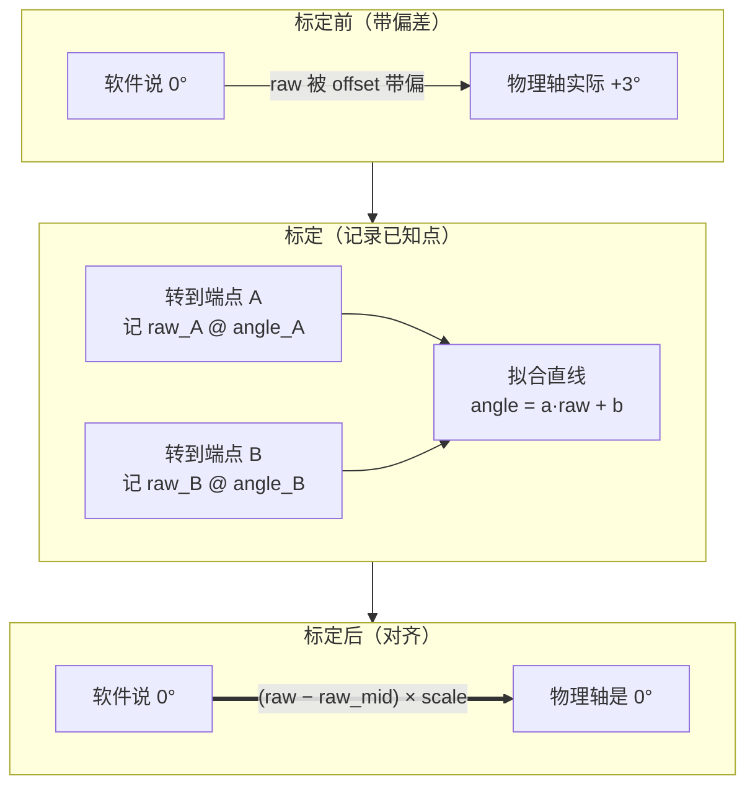

# 第八讲 · 标定原理与舵机标定算法

> **本讲信息**
> - 日期：2026-08-21（周五）
> - 第几讲：第八讲（学习计划 Day 8）
> - 对应计划：`study-plan-60d.md` 里 **P4 通讯标定** 阶段，课程集号 **036–039**
> - 今日目标：搞懂**为什么教师端机械臂要标定**（舵机的物理"零位"和软件的"零位"出厂就对不齐），看清**标定数据长什么样**，掌握把舵机原始读数换算成可信角度的**线性映射算法**。从这一讲开始，机器人的关节才"说真话"。

---

## 0. 一句话总结

> **舵机回报的不是角度，而是原始读数；"角度"是从读数算出来的。** 出厂时每颗舵机的原始"零位"都带一个制造偏差，所以软件"0°"≠ 物理"0°"。**标定 = 在已知位置（端点/中点）记下原始读数，拟合一条线性映射** `angle = a × raw + b`，让两个零位最终对齐。**教师端最先标定，因为它是所有示范数据的源头**——它的角度错了，你采的每一条动作全错。

---

## 1. 核心知识点（这 4 节在讲啥）

| 集号 | 标题 | 要点 |
|---|---|---|
| 036 | 安装细节介绍 | 标定前的硬件检查：舵机装好、接线正确、ID 已配好（承接 Day 6）、供电正常——装得马虎，标定必歪 |
| 037 | 教师端机械臂为什么要标定 | 舵机零位有"逐颗"的制造偏差；教师端是数据源头，所以它的角度必须先准 |
| 038 | 舵机标定的数据展示 | 标定产出的是每颗舵机的"原始读数 ↔ 角度"对应关系——先看清数字再信它 |
| 039 | 舵机标定的算法原理 | 用两个（或更多）已知点拟合一条**线性映射**，把 raw 换算成角度 |

### 1.1 "教师端"是啥、为啥它先标定

在遥操作数据采集的架构里，双臂机器人被分成两个角色：

- **教师端（teacher / leader / 主臂）**：人用手直接抓着掰、用来"示范"动作的那条臂。它的关节角度，就是训练数据的**标签**。
- **学生端（follower / 从臂）**：后面要复现示范动作的那条臂（或者本身就是训练对象）。

> 类比：教师端就是"标准答案卷"，人掰它的时候就是在写答案。如果答案卷的尺子是歪的，你抄下来的每个数字都是错的。**所以教师端先标定**——你不能拿一把坏尺子去量从臂。

### 1.2 为什么要标定——零位偏差从哪来

舵机内部有一个角度反馈元件（电位器或磁编码器）+ 一套齿轮组。软件真正读回来的其实是**原始读数（raw）**——比如某个范围内的 ADC 整数——**而不是角度**。

标定之前，有三层误差叠加：

1. **电位器中位公差**——电刷的"电气中心"和输出轴的"机械中心"永远对不齐。
2. **齿轮装配公差**——舵盘（horn）装到输出轴上会带一个随机的角度偏移（花键有几十个齿，你总会差几个齿）。
3. **逐颗差异**——每颗舵机出厂偏差都不同，不能把一颗的参数抄给另一颗。

最终效果：**同样的 "raw = X"，在不同舵机上对应的物理角度都不一样**，软件"0°"会偏个几度。肩关节差几度，到末端就放大成几厘米的误差。

### 1.3 标定数据长什么样（038 节）

标定时把每颗舵机转到已知位置、记下原始读数，得到每颗舵机一张小的"原始读数 ↔ 角度"对照表，比如：

| servo_id | 关节 | −90° 时 raw | 0°（中位）raw | +90° 时 raw | 量程（度/raw） |
|---|---|---|---|---|---|
| 1 | 肩 | 132 | 2048 | 3964 | 90 / 1916 |
| 2 | 肘 | 210 | 2050 | 3890 | 90 / 1840 |
| … | … | … | … | … | … |

注意看：**中位不都是 2048、量程也不一样**——这正是"逐颗偏移 + 逐颗量程差异"。在 LeRobot 里，这份数据会被存成**标定文件**（比如一个 JSON 的 `calib` 文件），机器人上电时加载，不用每次开机重标。

> "数据展示"（038）的意义在于**先看一眼再信它**：如果某颗中位离谱、量程不合理，能在它污染整批数据之前把坏舵机揪出来。

### 1.4 标定算法——线性映射（039 节）

假设原始读数和物理角度近似线性，那么映射就是一条直线：

```
angle = a × raw + b
```

要确定 `a`（斜率/量程）和 `b`（偏移）两个未知数，需要**两个已知点**：

1. 把舵机转到已知角度 θ₁，记下 raw₁；
2. 转到第二个已知角度 θ₂，记下 raw₂；
3. 解出：

```
a = (θ₂ − θ₁) / (raw₂ − raw₁)
b = θ₁ − a × raw₁
```

之后任意一个 raw 都能换算成角度。实际使用里，通常不说 `a` 和 `b`，而说两个更直观的数：

- **中位（零位偏移）**——舵机转到机械/视觉零点时的 raw 值，它负责把软件"0°"挪到物理"0°"（在 `angle = a·raw + b` 里对应 `b = −a × raw_mid`）。
- **量程（scale）**——每变化一个 raw 对应多少度，由端点读数推出来（比如"90° 对应 1916 个 raw"）。

所以日常写法是：

```
angle = (raw − raw_mid) × scale
```

其中 `scale = 90° / (raw_{+90°} − raw_mid)`。

---

## 2. 原理（先抓这几条）

1. **"角度"是算出来的，不是测出来的。** 舵机只回报 raw，你后面记录的每个"关节角度"都是 raw 套上一层标定映射。映射错，角度全错。
2. **偏移是逐颗的、物理的，不是软件 bug。** 同型号两颗舵机零位偏移都不同，不存在"一套标定常数到处抄"。
3. **两点定一条直线。** 因为 raw↔角度 是线性的，记两个已知位置就够了。"中位 + 量程"只是同一条直线更顺口的说法。
4. **标定必须存盘、开机重载。** 映射存进 calib 文件、上电加载；忘了存，每次重启都得从错误零位开始。
5. **标完要验证。** 把关节走一遍全行程、看角度是否连续、能不能合理到极限——中位不准会让整个关节"零位飘"。

---

## 3. 一张图：标定是怎么把两个零位"对齐"的



> 标定不改变舵机本身，改的是**软件解读舵机的那张映射**。你修的是尺子，不是关节。

---

## 4. 今天的操作步骤（学习流程，不是敲代码）

1. **读一遍本文件**（你在这步）。
2. **徒手画 §3 的"线性映射"图**，在直线上标出 `a`（量程）和 `b`（偏移）。
3. **口头背出映射**：`angle = (raw − raw_mid) × scale`，以及怎么由两点解出 `a`、`b`。
4. **对照课程看 036–039**（1.0–1.5 倍速）。重点看 037（为什么教师端先标）和 039（两点线性映射）。
5. **打开一份真实标定文件**（如果你有 SO-101 / LeRobot 环境）——看 `calib` JSON 里每颗舵机的中位和量程，检查量程是否合理。
6. **镜子测试（3 分钟，关掉一切讲）：** *"舵机零位为什么出厂就不准___；决定标定直线的是哪两个数___；教师端为什么先标___；标定文件忘存会怎样___；怎么验证一次标定是对的___。"*

> ✅ **今天"做完"的标准：** 能由两个已知点推出 `angle = a·raw + b` + 能说清教师端为什么先于从臂标定 + 能在标定文件里指出中位和量程。

---

## 5. 常见误区 & 容易踩的坑

| # | 误区 | 真相 |
|---|---|---|
| 1 | "舵机直接回报角度。" | 它回报的是**原始读数**，角度是**算出来**的。是映射让那个数字有意义。 |
| 2 | "出厂零位就准，不用标。" | 每颗舵机都带**逐颗偏移**（电位器中位 + 齿轮装配公差），"0°"出厂就偏几度。 |
| 3 | "标一次，永久有效。" | **换舵机、重装舵盘、机械维修后都要重标**——任何改变物理零位的操作都作废旧标定。 |
| 4 | "一颗的标定能抄给另一颗。" | 偏移是**逐颗**的，同型号两颗也不一样。抄来抄去只会得到一条系统性全错的臂。 |
| 5 | "标定就是设置 PWM 占空比 / 角度限位。" | 设限位是**配置**。标定是建立**raw↔角度 的映射**，让每个读数对应正确角度。 |
| 6 | "中位差一点没事，量程对就行。" | 中位错会**平移所有角度**，整个关节"零位飘"，后面数据全废。 |
| 7 | "标定数据不用存。" | **不存 = 丢了。** 没写进 calib 文件，每次上电都得重标。 |

---

## 6. 下一步 / 检查点

- **过了检查点 =** 能由两点拟合 `angle = a·raw + b` + 说清教师端为什么先标 + 能在真实 calib 文件里找到中位和量程。
- **下一讲（Day 9）：** **遥操作概念 + 编程语言趋势 + 教师端标定完成**（040–042）——"主从""示教"是什么意思，以及真正**完成并验证**教师端标定，让它的角度终于可信。
- **本周种子：** 这一阶段就两个词——**"raw"和"映射"**。raw 是机器给你的，映射是让它变真的。这套"记已知点 → 拟合映射"的思路，后面相机标定（内参）、sim-to-real 对齐还会反复出现。

---

## 7. 训练营实操回顾（来自 SO-101，不是课本）

课程是抽象地讲标定；训练营把它变得触手可及。在 SO-101 双臂上，我亲手跑过 LeRobot 的标定流程，有三点印象最深：

1. **偏差是"看得见"的。** 标定前，"0°"姿态明显歪——一条臂的肩膀偏了几度。它不是屏幕上一个不起眼的数字，而是一台**看起来就错了**的机器人。037 那一节讲的东西，一眼就看明白了。

2. **数据就是一张 raw↔角度 对照表。** 看标定往外吐数字时，就是 §1.3 那张表——每颗舵机的中位和量程。看到真实的 raw 值（肩膀大概 2048、另一颗差一点），"逐颗偏移"才落到实处：不存在什么通用常数。

3. **"存盘 + 验证"是最容易栽的地方。** 忘了存 calib 文件，断电一次就得重来；计划里写的两个坑我全踩过——中位没标准让臂"零位飘"，跳过"转到极限看角度"的检查，让一颗坏关节一路漏到演示差点翻车。标定这东西，平时很无聊，直到它成了你整条管线全错的根因——那一刻它就成了全天最重要的五分钟。

> 让我重来一次：**永远先标教师端**，标完把每个关节扫到极限验证一遍，再把 calib 文件当源码一样提交进项目——而不是留在内存里、一关机就没的临时文件。

---

### 参考资料（先放着，今天不要求）
- 课程视频 036–039（黑马程序员《具身智能》223 节版）。
- LeRobot 的 `lerobot-calibrate` 标定流程——它给每颗电机保存的标定文件格式。
- （后续）Day 9 完成教师端标定并验证；相机标定（内参）会复用同一套"记已知点 → 拟合映射"的思路。
