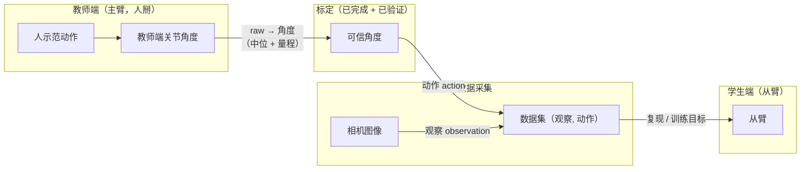

# 第九讲 · 遥操作概念、编程趋势与教师端标定完成

> **本讲信息**
> - 日期：2026-08-22（周六）
> - 第几讲：第九讲（学习计划 Day 9）
> - 对应计划：`study-plan-60d.md` 里 **P4 通讯标定** 阶段，课程集号 **040–042**
> - 今日目标：吃透数据采集所依赖的**遥操作词汇**（主从、示教），理解改变我们写代码方式的**编程语言趋势**（AI 辅助，你当"AI 项目经理"），最后**完成并验证教师端标定**，让主臂角度可信。这是正式采数据前的一道闸门。

---

## 0. 一句话总结

> **遥操作 = 人掰教师端（主臂）示范，学生端（从臂）复现；数据采集 = 记录（观察，动作）对，其中"动作"来自教师端。** AI 时代的编程趋势，从"逐行手写"翻转为**"你描述、AI 写、你验证整合"**——你成了**AI 项目经理**。**教师端标定完成 + 验证 = 主臂角度终于可信，采数据这一步可以开始了。**

---

## 1. 核心知识点（这 3 节在讲啥）

| 集号 | 标题 | 要点 |
|---|---|---|
| 040 | 遥操作相关概念 | 主从、示教、领导臂/跟随臂——数据采集背后的架构 |
| 041 | 编程语言发展趋势 | AI 辅助编程成为主流，人从"码农"变成"AI 项目经理" |
| 042 | teacher端机械臂的标定完成 | 完成**并验证**教师端标定——主臂角度终于可信 |

### 1.1 遥操作相关概念（040 节）

**遥操作**是人直接（或远程）掰动一条臂来示范动作，系统记录、并让另一条臂复现。核心词汇：

- **主从（master / slave）**——也叫**领导臂 / 跟随臂（leader / follower）**。主臂（教师端）被人掰，从臂（学生端）跟随主臂的角度。
- **示教（demonstration / teaching）**——人通过掰主臂"教"机器人一个动作，这就是模仿学习的原料。
- **数据采集 =（观察，动作）对**——观察是机器人"看到和感觉到"的（相机图像 + 关节状态），动作是教师端"做了什么"（它的关节角度）。

> 为什么先讲这个：模仿学习 / 行为克隆需要海量"人示范"的数据，而遥操作就是采集这些数据的标准方式。**没有示范 → 没有训练数据 → 没有模型。**

### 1.2 编程语言发展趋势（041 节）

我们写代码的方式正在变：

- **以前**：逐行手写，和语法、API 较劲。
- **现在**：AI 辅助编程（Copilot、Cursor、Claude Code……）——你用自然语言描述需求，AI 生成代码。
- **角色翻转**：从**"码农"**（手写实现）变成**"AI 项目经理"**（提需求、拆任务、*验证*生成的代码、整合、debug）。

对学具身智能的人意味着：**你不需要背下每种语言的语法，但必须能（1）把需求描述准、（2）读懂并验证 AI 写的代码、（3）把它接进项目。** AI 写代码快——但"对不对"还得你兜底。

> 关键习惯（Day 10 会落地成实操）：**先小段验证，再扩展。** 绝不让 AI 一次性吐一大坨没验证的代码——真出问题时你都不知道从哪改。

### 1.3 教师端标定完成（042 节）

这是 Day 8 "为什么要标定"的收尾。完成它意味着：

1. **存盘**——教师端每颗舵机的中位、量程都写进标定文件（`calib` JSON）。
2. **验证**——把每个关节扫一遍全行程，看角度是否连续、中位有没有"零位飘"。
3. **签收**——主臂角度可信，这是采干净数据的前提。

> "完成"不是"跑过一次标定脚本"，而是"跑完**并且**验证数字合理"。

---

## 2. 原理（先抓这几条）

1. **遥操作是一套映射，不是遥控玩具。** 从臂不是简单回放摇杆信号，而是主臂角度被**实时映射**成从臂目标角度。
2. **训练数据的质量，起点在教师端。** 主臂角度错了（没标定），每一条（观察，动作）都继承这个错。标定是第一道质量闸门。
3. **AI 辅助编程不等于不用懂。** 需求、验证、整合还是你的。"AI 写得快"是速度，"你知道它对"才是价值。
4. **"做完"= "验证过"。** 标定和代码一样，只有检查了输出才算完——扫到极限、看连续、看漂移。

---

## 3. 一张图：从标定好的教师端到采到数据

> 整条管线都压在一个薄薄的地基上：**教师端的角度必须是真的。** 这正是 Day 8 讲、Day 9 收尾的那件事。

---

## 4. 今天的操作步骤（学习流程，不是敲代码）

1. **读一遍本文件**（你在这步）。
2. **徒手画 §3 的数据流图**，标出主/从、动作/观察。
3. **口头背出四个词**：主从、示教、观察、动作——并说出哪个是教师端产出的。
4. **对照课程看 040–042**（1.0–1.5 倍速）。重点看 040（遥操作词汇）和 042（完成 + 验证标定）。
5. **有环境的话**：完成教师端标定并**验证**——扫每个关节、确认连续、存好 `calib` 文件。
6. **镜子测试（3 分钟，关掉一切讲）：** *"遥操作是什么、模仿学习为什么需要它___；四个词是哪四个、哪个是教师端的输出___；AI 时代编程怎么变了、你的新角色是什么___；什么才算'标定完成'___。"*

> ✅ **今天"做完"的标准：** 能用自己的话讲清主从 + 示教 +（观察，动作）+ 能说出 AI 时代的角色转变 + 教师端标定已完成**并验证**。

---

## 5. 常见误区 & 容易踩的坑

| # | 误区 | 真相 |
|---|---|---|
| 1 | "遥操作就是摇杆/遥控发舵机指令。" | 它是一套**主→从的角度映射** + 一条**数据采集**回路；重点在采示范，不是单纯让电机动。 |
| 2 | "AI 能写代码了，就不用懂编程了。" | 需求、验证、整合还是你的。**"AI 写得快"≠"代码是对的"**。 |
| 3 | "AI 项目经理 = 躺平让 AI 全干。" | 你要**提需求、拆任务、审代码、整合、debug**——判断力是你的，打字是 AI 的。 |
| 4 | "标定脚本跑完就算完成。" | 完成 = 跑完**并验证**（扫极限、看连续和漂移）。没验证的标定是定时炸弹。 |
| 5 | "从臂的标定比教师端更重要。" | 教师端是**数据源**，它角度错了每条示范都错。**先标教师端。** |
| 6 | "观察就是相机图像。" | 观察 = 图像 **+ 关节状态**（往往还有更多）。模型既学"看到的"也学"感觉到的"。 |

---

## 6. 下一步 / 检查点

- **过了检查点 =** 能讲清主从 + 示教 +（观察，动作）+ AI 时代角色转变 + 教师端标定已做完**并验证**。
- **下一讲（Day 10）：** **AI 生成舵机角度监控程序 + WebSocket 实时通讯**（043–046）——Vibe Coding（自然语言描述、小段验证）+ WebSocket（全双工）把角度从硬件→后端→网页实时推出来。
- **本周种子：** **"主、从、示教、采集"**——数据采集的四个词。Day 11 以后（真正采数据、行为克隆）都建立在这套词汇上。

---

## 7. 训练营实操回顾（来自 SO-101，不是课本）

课程把概念起了名；训练营让我亲手做了一遍。有两点最戳我：

1. **遥操作是全身的回路，不是按个按钮。** 训练营里我亲手掰 SO-101 的主臂，看着从臂实时跟随、相机全程在录。§3 那张心智图——教师端产出"动作"、相机产出"观察"——不再抽象，变成了"我的手就是标签"。你会真切感受到：一条没标定的臂，会怎么污染你采下的每一帧。

2. **"完成"真的等于"验证过"。** 教师端标定做完后，真正的考验是把每个关节扫到极限、盯着角度保持连续。计划里那句原话——"标定了但没验证 → 后面全错"——是那种你差点栽一次才真信的东西。从那以后，"存 calib + 扫一遍验证"就成了肌肉记忆，不再是清单上的一项。

> 让我重来一次：把"标定签收"和"第一次示范"当成一口气——**标定、验证，然后立刻采几条示范、用眼睛核一遍数字**，再信任整条管线。

---

### 参考资料（先放着，今天不要求）
- 课程视频 040–042（黑马程序员《具身智能》223 节版）。
- LeRobot 遥操作配置——把主臂角度镜像到从臂的 leader/follower 设置。
- （后续）Day 10 写角度监控程序 + WebSocket 链路；Day 11 起在标定好的教师端上采示范数据。
