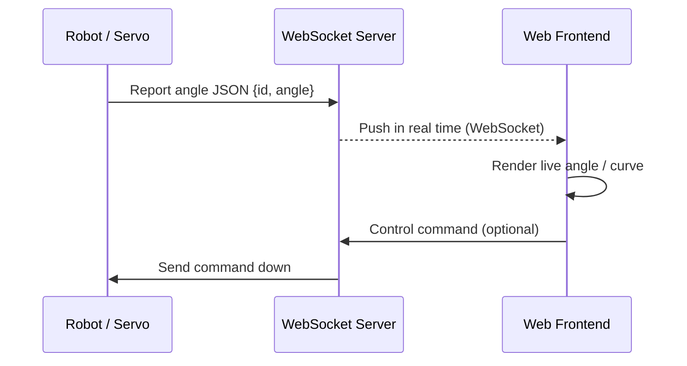
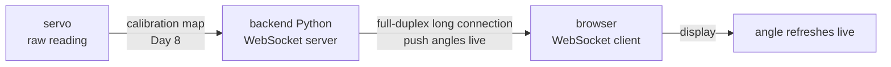
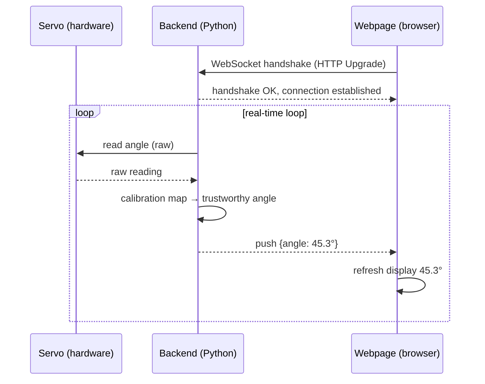

# Lecture 10 — AI-Generated Servo-Angle Monitoring + WebSocket Real-Time Communication

> **Meta**
> - Date: 2026-08-23 (Sunday)
> - Lecture / Day: Lecture 10 — the *tenth* lecture of the study plan (Day 10)
> - Plan anchor: `study-plan-60d.md` → **P4 通讯标定 (Communication & Calibration)**, course episodes **043–046**
> - Goal of today: switch to a brand-new way of writing code — **describe what you want in natural language and let the AI write** a "real-time servo-angle monitor", then learn **WebSocket** (full-duplex real-time communication) to push servo angles from hardware → backend → browser **in real time**. This is your first real "AI project manager" exercise, moving from hand-writing to vibe coding.

---

## 0. One-line summary

> **Vibe Coding = you describe the requirement in plain language, the AI generates the code, and you verify in small pieces before scaling up** — you move from "coder" to "AI project manager". **WebSocket = a two-way, real-time, long-lived connection**: instead of the browser and server playing "question-answer", **whoever has a message pushes it immediately**, which is exactly what you need to stream servo angles frame by frame to a webpage. Put them together and you can build a **live joint-angle monitoring page** today.

---

## 1. Core knowledge (what these 4 episodes are about)

| # | Title | Key point |
|---|---|---|
| 043 | AI-generated servo-angle monitor | Vibe Coding: describe "I want a program that reads a servo angle and shows it" in natural language; the AI produces the skeleton |
| 044 | AI-coding hands-on | generate in small pieces → verify each piece → integrate; "ask concretely, verify promptly" |
| 045 | WebSocket real-time communication | WebSocket is a **full-duplex** long-lived connection that fixes HTTP's high-latency "question-answer" polling |
| 046 | WebSocket real-time angle push | backend reads the servo angle → pushes it to the browser over WebSocket → the page refreshes live |

### 1.1 What is Vibe Coding (043)

<mark>Continuing Day 9's "AI project manager" role, this lecture turns it into a concrete style: **Vibe Coding**. You stop hand-typing every line and instead describe the requirement in natural language; the AI (Copilot / Cursor / Claude Code, …) generates the code, and you **read, verify, and integrate**.</mark>

Three rules of thumb:
1. **Describe concretely**: not "write a monitor program", but "read servo #3's angle in Python, 10 times per second, and print it".
2. **Verify in small pieces**: let the AI generate one small block (one function / one module) at a time, run it, then continue.
3. **Ask the AI to explain**: after it generates, have it explain line by line — you learn as you go.

> Analogy: Vibe Coding is you, the "project manager", giving requirements to an "outsourced programmer" (the AI) — you own "what and whether it's right", the AI does "the typing". **The judgment is yours; the typing is the AI's.**

### 1.2 Why WebSocket instead of plain HTTP? (045 — the key part)

The oldest way for a browser and server to talk is HTTP "question-answer": the browser asks "what's the angle now?", the server answers. To see a live angle, you can only **poll frantically** — ask every few dozen milliseconds. The problem is obvious:

| Approach | How it works | Downside |
|---|---|---|
| HTTP polling | the browser asks "angle?" every 100 ms | most requests are empty/wasted; latency |
| **WebSocket** | one handshake, then a **long-lived connection**; both sides push messages anytime | real-time, cheap |

<mark>WebSocket is a **full-duplex** long-lived connection: after the handshake, the server **actively pushes** new angles to the browser, and the browser can **send commands anytime** without waiting to be asked.</mark> This is exactly why the "software/system layer" diagram lists WebSocket among robot communication protocols (alongside DDS and gRPC) — it is naturally suited to high-frequency, low-latency, bidirectional real-time data streams.

> Analogy: HTTP polling is you calling again and again to ask "where's my package?"; WebSocket is you and the courier adding each other on WeChat — the moment the package moves, he messages you.

### 1.3 What an angle-monitoring program looks like (044 + 046)

A complete "real-time angle monitor" chain has three segments:

1. **Hardware segment (lower computer)**: the servo itself, reporting raw readings (Day 6).
2. **Backend segment (upper computer / Python)**: read the servo angle → apply the calibration map (Day 8) → get a trustworthy angle → **push** it to the browser over WebSocket.
3. **Webpage segment (browser)**: a WebSocket client that refreshes the UI the moment an angle arrives.

> Key: the WebSocket here is "server pushes proactively", not the browser asking over and over. Every time the backend reads a new angle it broadcasts it to all connected pages, so the display is "alive".

---

## 2. Principles to internalize (why it works)

1. **WebSocket is a "handshake once, stay connected" channel.** It borrows HTTP for the first handshake, then upgrades into an independent long-lived connection where data flows in both directions as frames — no more HTTP request/response overhead.
2. **Full-duplex = both sides can send unprompted.** HTTP can only "client asks, server answers"; WebSocket lets the server push anytime — which is exactly what real-time monitoring needs.
3. **The core of AI-coding is not "AI writes for you" but "you gate-keep the AI".** The risk of Vibe Coding: the AI's code may run but be semantically wrong (wrong servo ID, wrong units). That's why small-piece verification matters — Day 9's "verify in small pieces before scaling up" lands here.
4. **Real-time = sampling rate (Day 6) + transport latency (WebSocket).** Reading fast (50–200 Hz) but transporting slowly still makes the display stutter; WebSocket squeezes transport latency to a minimum.

---

## 3. One diagram: one angle's real-time journey from servo to webpage

> This diagram wires Day 6 (read angle), Day 8 (calibration), and Day 10 (WebSocket push) into one real-time pipeline — every link you learned before "powers on" here.

---

## 4. Today's operation steps (study workflow, not coding)

1. **Read this file once** (you are here).
2. **Hand-draw the §3 sequence diagram**, marking the four steps: handshake → loop-read angle → server pushes → page refreshes.
3. **Explain two terms out loud**: Vibe Coding (you describe, AI writes, you verify); WebSocket (full-duplex, long-lived, real-time push).
4. **Watch 043–046** (1.0–1.5× speed). Focus on 045: why WebSocket beats HTTP polling.
5. **(Hands-on) Use the AI to write a minimal angle monitor**: first ask it in one sentence to generate the "backend reads servo angle + WebSocket broadcast" skeleton and run it; then add "webpage receives and displays". **Verify each added piece before moving on.**
6. **Mirror test (3 min, close everything and talk):** *"What is Vibe Coding and what is my new role ___; WebSocket vs HTTP polling differ in ___; what does full-duplex mean ___; a real-time angle chain has which three segments ___; the biggest pitfall of AI-generated code is ___"*

> ✅ **Definition of "done today":** can explain Vibe Coding + WebSocket full-duplex + the three segments of a real-time chain, and can use the AI to build a minimal page that shows angles live.

---

## 5. Common misconceptions & easy mistakes

| # | Misconception | Reality |
|---|---|---|
| 1 | "Vibe Coding = let the AI write everything, then I copy-paste." | AI-generated code may **run but be semantically wrong** (wrong ID, wrong unit, missing bounds). **Verify in small pieces**, or you won't know where to debug. |
| 2 | "WebSocket is just a faster HTTP." | No. It's an **independent long-lived, full-duplex** protocol; after the handshake it no longer does "request-response", and the server can push. Different model entirely. |
| 3 | "For live angles, just HTTP-poll every 10 ms." | Polling wastes requests, has latency, and can overload the server. Real-time should use WebSocket. |
| 4 | "Once WebSocket connects it never drops." | Network hiccups and server restarts drop it. **Add reconnection logic**, or the page freezes on a stale angle. |
| 5 | "I don't need to understand AI-generated code as long as it runs." | You must at least **read what each piece does**, or you can't judge correctness or locate problems. The AI is an accelerator, not a substitute. |
| 6 | "Backend read + WebSocket push has nothing to do with the calibration I learned." | **It does.** The angle you push must be the *calibrated* trustworthy angle, or it's wrong no matter how fast you push (Day 8's map is actually used here). |

---

## 6. Next steps / checkpoint

- **Checkpoint passed if:** you can explain Vibe Coding + WebSocket full-duplex + the three segments of a real-time chain, and you built a minimal real-time monitoring page with the AI.
- **Next lecture (Day 11):** formally enter **data collection** — collect demonstrations on the calibrated teacher arm to prepare "(observation, action)" data for behavior cloning (BC).
- **This week's seed:** burn two flows into your head — the Vibe Coding flow "**describe → AI generates → verify in small pieces → integrate**", and the data flow "**read angle → calibrate → WebSocket push live**". Almost every real-machine day from now on uses both.

---

## 7. First-person reflection (from the SO-101 bootcamp, not the textbook)

The deepest impression from "watching angles live" in the bootcamp: **seeing it live and seeing it only from logs afterwards are two totally different debugging experiences.**

1. **Live visualization = having eyes.** Pushing the SO-101's joint angles to a webpage over WebSocket, the curve on screen moved the moment I moved the master arm. Whether calibration was right or there was "zero-drift" (Day 8's pitfall) was visible at a glance — far better than staring at a string of numbers.
2. **"AI writes, I verify" actually works.** When I asked the AI to generate the "read angle + WebSocket broadcast" skeleton, the first version had the wrong servo ID. **If I hadn't verified in small pieces and had just run it, I'd have been staring at an angle that never read correctly.** That moment turned "verify in small pieces" from a slogan into muscle memory.

> If I were to redo it: build the minimal "read angle → print" loop **first**, confirm the angle is trustworthy (calibration is fine), *then* add WebSocket and the webpage on top. A shaky foundation only gets more dangerous the higher you build.

---

### References (for later, not required today)
- Course episodes 043–046 (黑马程序员《具身智能》223-ep version).
- MDN's WebSocket documentation (the `WebSocket` API, handshake, reconnection).
- (Later) Day 11+ collects demonstrations on the calibrated teacher arm; this WebSocket real-time link will be reused in teleoperation monitoring and behavior-cloning data visualization.