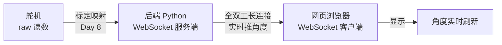
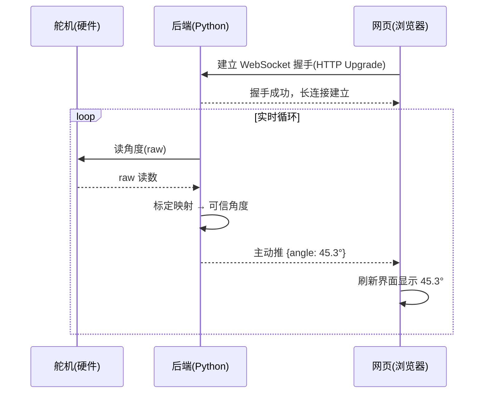

# 第十讲 · AI 生成角度监控程序 + WebSocket 实时通讯

> **本讲信息**
> - 日期：2026-08-23（周日）
> - 第几讲：第十讲（学习计划 Day 10）
> - 对应计划：`study-plan-60d.md` 里 **P4 通讯标定** 阶段，课程集号 **043–046**
> - 今日目标：换一种全新的写代码方式——**用自然语言让 AI 帮你写**一个"舵机角度实时监控"程序，再学**WebSocket**（全双工实时通讯），把舵机角度从硬件 → 后端 → 网页**实时**推出来。这是从"手动敲代码"到"AI 项目经理"的第一次实战。

---

## 0. 一句话总结

> **Vibe Coding（氛围编程）＝ 你用大白话描述需求，AI 生成代码，你小段验证、再扩展**——你从"码农"变成"AI 项目经理"。**WebSocket ＝ 一条"双向、实时、长连接"的通讯管道**：浏览器和服务器之间不再"一问一答"，而是**谁有消息谁随时推**，正好用来把舵机角度一帧帧实时刷到网页上。合起来，你今天能搭出一个**能实时看关节角度的监控网页**。

---

## 1. 核心知识点（这 4 节在讲啥）

| 集号 | 标题 | 要点 |
|---|---|---|
| 043 | AI 生成舵机角度监控程序 | Vibe Coding：用自然语言描述"我要一个能读舵机角度并显示的程序"，AI 生成代码骨架 |
| 044 | AI 编程实操 | 小段生成 → 逐段验证 → 整合；学会"提问要具体、验证要及时" |
| 045 | WebSocket 实时通讯 | WebSocket 是**全双工**长连接，解决 HTTP"一问一答"轮询的高延迟 |
| 046 | WebSocket 实时角度推送 | 后端读舵机角度 → 通过 WebSocket 推给浏览器 → 网页实时刷新显示 |

### 1.1 Vibe Coding 是啥（043）

<mark>延续 Day 9 讲的"AI 项目经理"角色，这一讲正式落地成一种写法：**Vibe Coding**。你不再逐行敲代码，而是用自然语言描述需求，让 AI（Copilot / Cursor / Claude Code 等）生成代码，你负责**读、验证、整合**。</mark>

核心心法就三条：
1. **描述要具体**：不说"写个监控程序"，而说"用 Python 读 3 号舵机的角度，每秒读 10 次，打印出来"。
2. **小段验证**：一次只让 AI 生成一小段（一个函数 / 一个模块），跑通再往下。
3. **不懂就问 AI 解释**：AI 生成后，让它逐行解释，你顺便学。

> 类比：Vibe Coding 就像你当"甲方经理"跟"外包程序员"（AI）提需求——你负责说清楚"要什么、对不对"，AI 负责"动手写"。**判断力是你的，打字是 AI 的。**

### 1.2 为什么是 WebSocket，而不是普通的 HTTP？（045，最关键）

浏览器跟服务器通讯，最老的办法是 HTTP"一问一答"：浏览器问一句"现在角度多少？"，服务器答一句。想看实时角度，只能**疯狂轮询（polling）**——每隔几十毫秒问一次。问题很明显：

| 方式 | 怎么工作 | 缺点 |
|---|---|---|
| HTTP 轮询 | 浏览器每隔 100ms 问一次"角度多少" | 大部分请求是空的、浪费；有延迟 |
| **WebSocket** | 一次握手后建立**长连接**，双方随时互相推消息 | 实时、省资源 |

<mark>WebSocket 是**全双工（full-duplex）**长连接：握手之后，服务器有新角度就**主动推**给浏览器，浏览器要发指令也能**随时发**，不用等对方问。</mark> 这正是课件里"软件/系统层"那张图把 WebSocket 列为机器人通信协议之一（和 DDS、gRPC 并列）的原因——它天生适合"高频、低延迟、双向"的实时数据流。

> 类比：HTTP 轮询像你不停打电话问"快递到哪了？"；WebSocket 像你和快递员加了微信，包裹一动他就主动发消息给你。

### 1.3 角度监控程序长什么样（044 + 046）

一条完整的"角度实时监控"链路，分三段：

1. **硬件段（下位机）**：舵机本身，回报 raw 读数（Day 6 学过）。
2. **后端段（上位机 / Python）**：读舵机角度 → 套标定映射（Day 8）→ 得到可信角度 → 通过 WebSocket **推**给浏览器。
3. **网页段（浏览器）**：WebSocket 客户端，收到角度就实时刷新界面。

> 关键：这里的 WebSocket 是"服务端主动推"，不是浏览器一遍遍来问。后端每读到一个新角度就 broadcast（广播）给所有连着的网页，网页的显示就是"活的"。

---

## 2. 原理（先抓这几条）

1. **WebSocket 是一条"握手一次、常驻不走"的通道。** 它借 HTTP 完成第一次握手，之后升级成独立的长连接，数据以"帧（frame）"为单位双向流动，不再有 HTTP 那套"请求-响应"的开销。
2. **全双工 = 双方都能主动发。** HTTP 只能"客户端问、服务端答"；WebSocket 允许服务端随时主动推——这正是实时监控需要的。
3. **AI 编程的核心不是"AI 替你写"，而是"你替 AI 把关"。** Vibe Coding 的风险是：AI 生成的代码可能能跑但**语义不对**（比如读错了舵机 ID、单位搞错）。所以必须小段验证——Day 9 那句"先小段验证，再扩展"在这里落地。
4. **实时性 = 采样频率（Day 6）+ 传输延迟（WebSocket）**。读得快（50–200 Hz）但传得慢，画面照样卡；WebSocket 把传输延迟压到最低。

---

## 3. 一张图：一次角度从舵机到网页的实时旅程

> 这张图把 Day 6（读角度）、Day 8（标定）、Day 10（WebSocket 推送）串成了一条完整的实时管线——你之前学的每一环，都在这里"通电"了。

---

## 4. 今天的操作步骤（学习流程，不是敲代码）

1. **读一遍本文件**（你在这步）。
2. **徒手画 §3 的时序图**，标出"握手 → 循环读角度 → 服务端主动推 → 网页刷新"四步。
3. **口头讲清两个词**：Vibe Coding（你描述、AI 写、你验证）；WebSocket（全双工、长连接、实时推）。
4. **对照课程看 043–046**（1.0–1.5 倍速）。重点看 045：WebSocket 为什么比 HTTP 轮询强。
5. **（动手）用 AI 写一个最小角度监控程序**：先用一句话让 AI 生成"后端读舵机角度 + WebSocket 广播"的骨架，跑通；再加"网页端接收并显示"。**每加一段就验证一段。**
6. **镜子测试（3 分钟，关掉一切讲）：** *"Vibe Coding 是什么、我的新角色是___；WebSocket 和 HTTP 轮询的区别是___；全双工是什么意思___；一条实时角度监控链路分哪三段___；AI 生成代码最大的坑是___。"*

> ✅ **今天"做完"的标准：** 能讲清 Vibe Coding + WebSocket 全双工 + 一条实时链路的三个环节，并用 AI 搭出一个能实时显示角度的最小网页。

---

## 5. 常见误区 & 容易踩的坑

| # | 误区 | 真相 |
|---|---|---|
| 1 | "Vibe Coding = 让 AI 全自动写完，我复制粘贴就完事。" | AI 生成的代码可能**能跑但语义错**（读错 ID、单位错、少边界判断）。**必须小段验证**，否则出 bug 都不知道从哪查。 |
| 2 | "WebSocket 就是更快的 HTTP。" | 不是。它是**独立的长连接 + 全双工**协议，握手后不再走"请求-响应"，服务端能主动推。两者模型根本不同。 |
| 3 | "想看实时角度，用 HTTP 每 10ms 轮询一次就行了。" | 轮询大量空请求、有延迟、还容易把服务器问爆。实时场景该用 WebSocket。 |
| 4 | "WebSocket 连上了就永远不断。" | 网络抖动、服务端重启都会断。**要做断线重连**，不然网页"卡死"在某一个旧角度上。 |
| 5 | "AI 生成的代码不用懂，能跑就行。" | 你至少要能**读懂每段在干嘛**，否则没法判断它对不对、没法在出问题时定位。AI 是加速器，不是替身。 |
| 6 | "后端读角度 + WebSocket 推送，跟前面学的标定没关系。" | **关系大得很**。后端推出去的"角度"必须是标定后的可信角度，否则推得再快也是错的（Day 8 的映射在这里被真正用上）。 |

---

## 6. 下一步 / 检查点

- **过了检查点 =** 讲清 Vibe Coding + WebSocket 全双工 + 实时链路三段 + 用 AI 搭出最小实时监控网页。
- **下一讲（Day 11）：** 正式进入**数据采集**——在标定好的教师端上采示范数据，为后面的行为克隆（BC）准备"（观察，动作）"数据集。
- **本周种子：** 把"**描述需求 → AI 生成 → 小段验证 → 整合**"这条 Vibe Coding 流程，和"**读角度 → 标定 → WebSocket 实时推**"这条数据流，都刻进脑子——后面几乎每一天的真机实验都要同时用到这两条。

---

## 7. 训练营实操回顾（来自 SO-101，不是课本）

训练营里"实时看角度"这件事，最深的印象是：**能实时看到，和只能事后看 log，是两种完全不同的调试体验。**

1. **实时可视化 = 长了眼睛。** 把 SO-101 的关节角度用 WebSocket 推到网页上，掰动主臂时屏幕上那条曲线就跟着动。标定对不对、有没有"零位飘"（Day 8 的坑），一眼就能看出来——比盯着一串数字强太多。

2. **"AI 写、我验证"真的能落地。** 让 AI 生成"读角度 + WebSocket 广播"的骨架时，第一版它把舵机 ID 写错了。**如果我没小段验证、直接跑，就会盯着一个永远读不对的角度发懵**。这件事让我把"小段验证"从口号变成了肌肉记忆。

> 让我重来一次：**先搭"读角度 → 打印"的最小闭环**，验证角度可信（标定没问题），再往上加 WebSocket 和网页。地基不牢，越往上越危险。

---

### 参考资料（先放着，今天不要求）
- 课程视频 043–046（黑马程序员《具身智能》223 节版）。
- MDN 的 WebSocket 文档（`WebSocket` API、握手、断线重连）。
- （后续）Day 11 起在标定好的教师端上采示范数据；WebSocket 这条实时链路会被复用到遥操作监控、行为克隆数据可视化里。