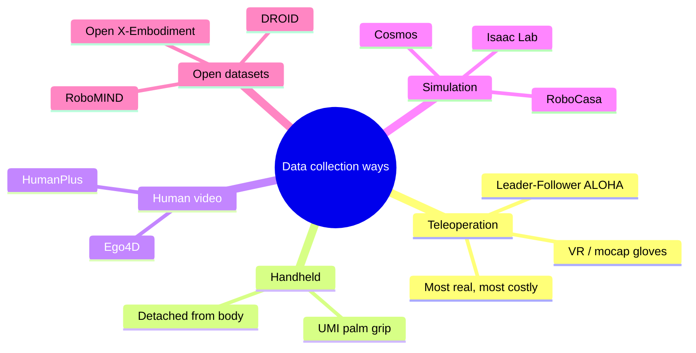
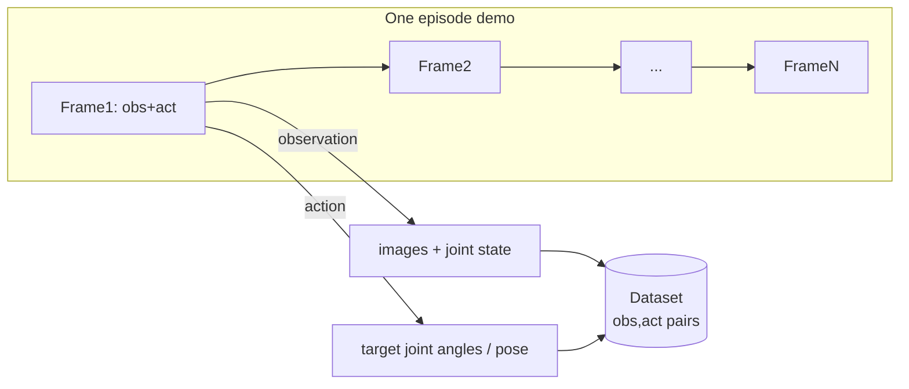
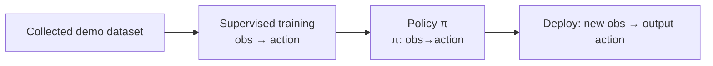
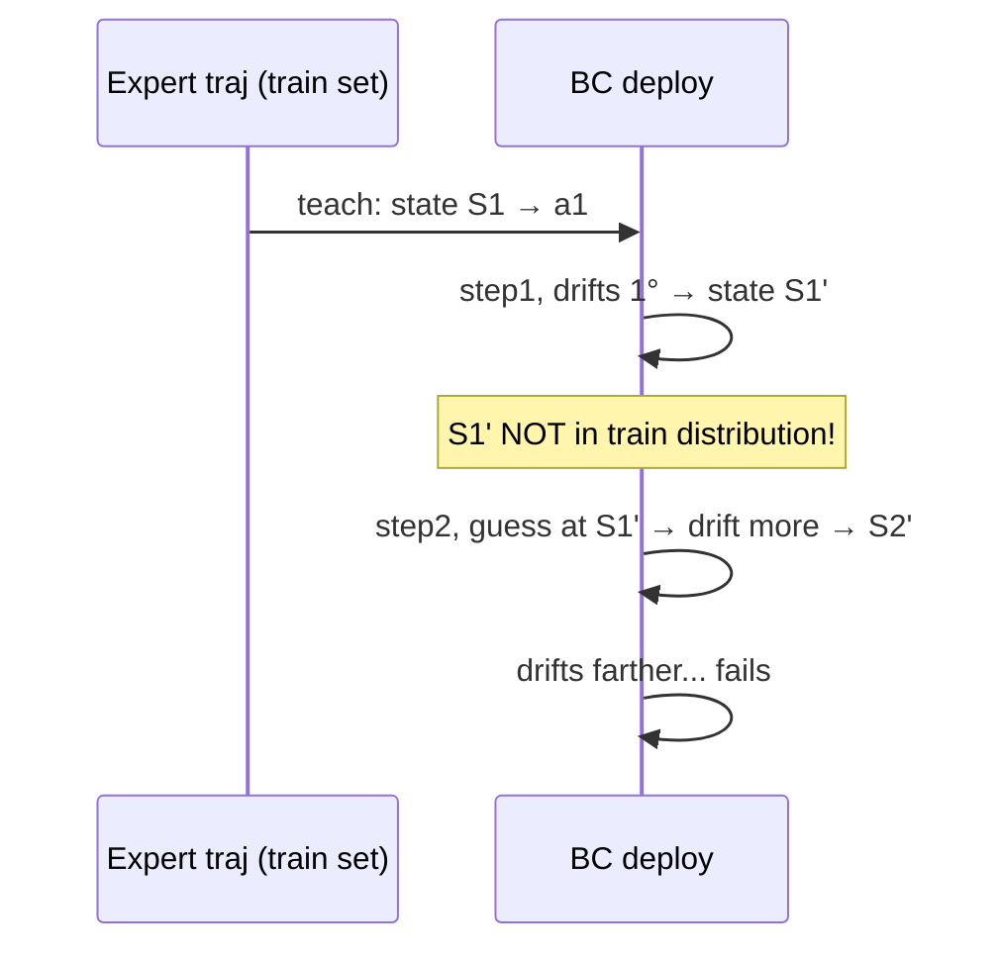
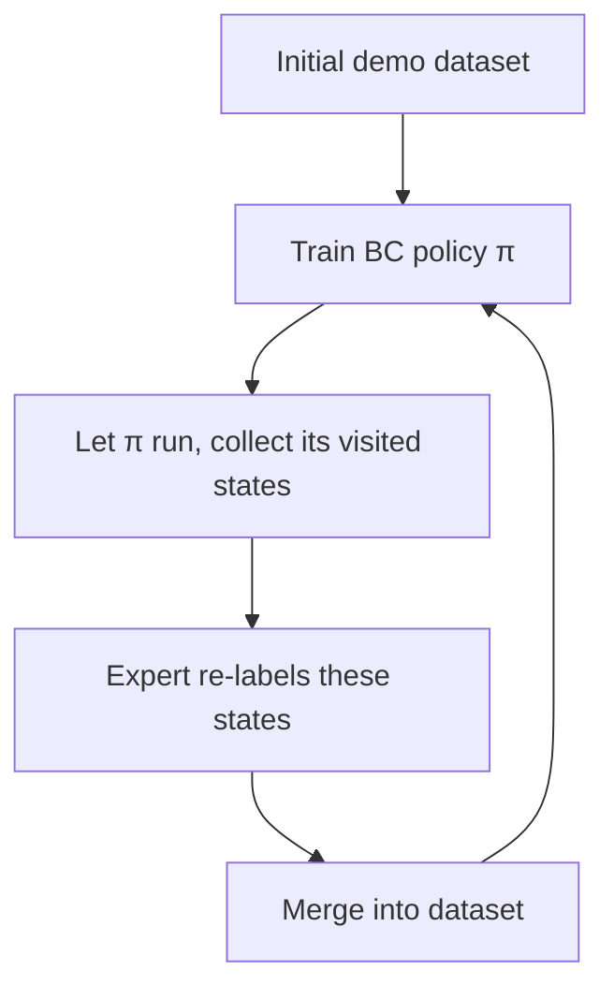
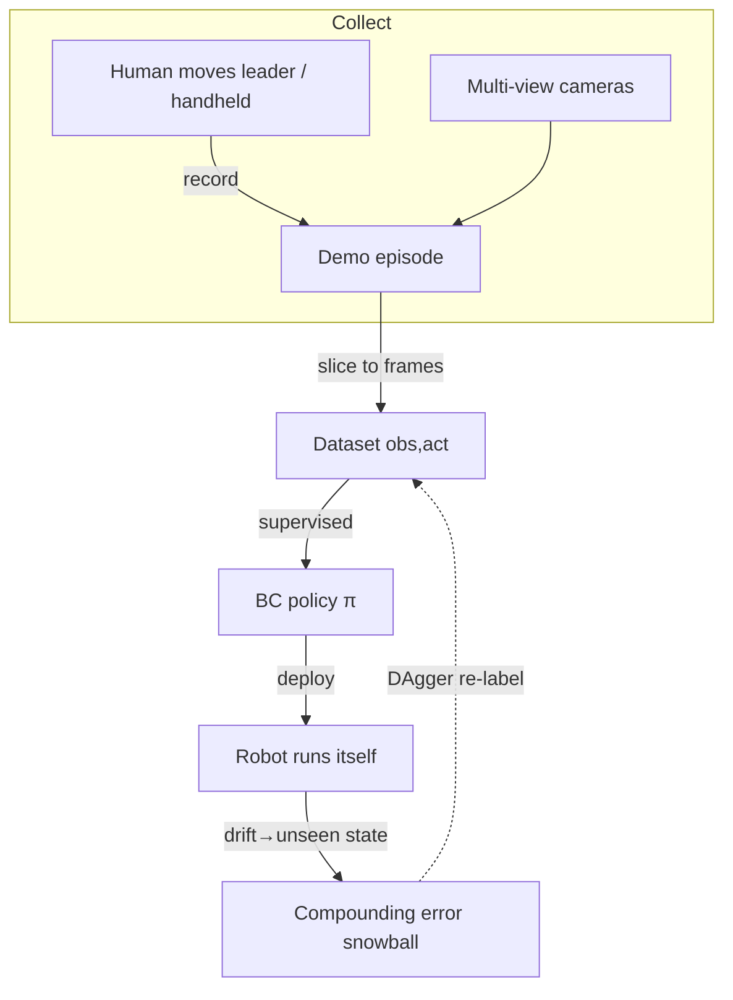

# Lecture 11 · Data Collection & Behavior Cloning (BC)

> **Lecture info**
> - Date: 2026-08-24 (Wed)
> - Lecture #: 11th (study-plan Day 11)
> - Plan: **P5 Data Collection / Imitation Learning** stage in `study-plan-60d.md`; course episodes **047–050** (verify against the actual course)
> - Goal today: enter the step "let the robot learn the动作 humans demonstrate". First, where does data come from (teleoperation / handheld / video / simulation / open datasets); second, what exactly lives inside a dataset — the (observation, action) pair; finally, the most basic imitation-learning algorithm — **Behavior Cloning (BC)** — and why it "looks learned but drifts once deployed" (compounding error), plus how **DAgger** patches that hole.

---

## 0. One-line summary

> **Data collection = recording human demonstrations as a pile of (observation, action) pairs; Behavior Cloning (BC) = treating those pairs as a supervised "input → output" problem so the robot learns to reproduce.** BC is simple and works, but its fatal flaw is "one small deviation lands you in unseen states and the error snowballs" (compounding error). **DAgger's fix is "have the expert re-label the states the robot actually visits", which pins down distribution shift.** This lecture harvests Day 9 (teleoperation) and Day 10 (real-time pipeline): the demonstrations collected earlier become training data today.

---

## 1. Core knowledge (what these 4 episodes cover)

| Ep | Title | Key points |
|---|---|---|
| 047 | Why data / the crux of IL | No demo → no data → no policy; **data is the most expensive factor** |
| 048 | Ways to collect data | Teleoperation (master-follower/VR/mocap), handheld (UMI), human video (HumanPlus), simulation (Isaac Lab/Cosmos), open datasets |
| 049 | Dataset format: (observation, action) | observation = images + proprioception; action = joint angles / end-effector pose; episode; LeRobot's parquet layout |
| 050 | BC & DAgger | BC supervised training; compounding error; DAgger interactive re-labeling |

### 1.1 Why start with "data" (047)

<mark>Course supplement: in embodied AI there is a saying — "data > parameters". OpenVLA beats the 55B RT-2-X with only 7B params, showing this generation's bottleneck is "diversity of the data distribution", not "model size". So **the craft of collecting clean data is worth more than tuning models**.</mark>

Imitation Learning (IL) is essentially: **a human demonstrates, the machine copies**. No demonstration → no training samples → no "learning". This directly connects to Day 9's teleoperation — **the demonstrations collected via teleoperation are today's raw material**.

Industry reality in 2026: dedicated data-collection sites (e.g., the Zhongyuan heterogeneous humanoid training ground in Henan, the Nanyang data-collection center) have become an independent track. In other words, **"knowing how to collect clean data" is itself a job/internship entry point**, especially attractive to someone with your mechanical background who understands hardware calibration.

> Analogy: teaching a kid to tie shoelaces — you slowly tie it dozens of times in front of them (collect demos), they watch and learn (IL). If you only explain the principle without showing the motion, they'll never learn — **a demonstration is that "visible process"**.

### 1.2 Five ways to collect data (048)

| Way | How | Pros | Cons | Reps |
|---|---|---|---|---|
| **Teleoperation** | human moves leader arm (or VR / mocap gloves), follower records | most real, matches real hardware | slow, costly, needs hardware | ALOHA, Open-TeleVision |
| **Handheld collector** | human holds a small camera-equipped device, detached from the robot | cheap, many scenes | must map to robot action space | **UMI** (palm grip) |
| **Human video** | learn "how humans do it" from Ego4D/EgoExo4D, then transfer | massive, free | big domain gap, needs remap | HumanPlus |
| **Simulation** | virtual human/arm acts in Isaac Lab / Cosmos | unlimited, cheap, add noise | sim ≠ real (Sim2Real gap) | Isaac Lab, RoboCasa |
| **Open datasets** | use others' collected data directly | saves effort, train immediately | may not fit your embodiment | Open X-Embodiment, DROID, RoboMIND, AgiBot World |

<mark>Course supplement: for the **soft robotics / DEA** direction remember — real-robot samples are "extremely costly and the body ages/breaks down", so simulation + domain randomization is your main battlefield; cherish every real demo you can collect (echoes Day 8 calibration, Day 9 leader-arm sign-off).</mark>

### 1.3 What exactly is inside a dataset: the (observation, action) pair (049)

One demonstration (called an **episode**, one complete task) is sliced into many frames; each frame is one sample:

- **observation (what the robot "sees and feels")**
  - camera images (often multi-view: left wrist, right wrist, third-person)
  - **proprioception**: own joint angles, gripper opening, force/tactile (Day 2's encoder readings are finally consumed here)
- **action (what the robot "did")**
  - usually **target joint angles** (same source as Day 9 leader-arm angles)
  - or end-effector pose (x, y, z, orientation)

<mark>Course supplement: LeRobot (Hugging Face's embodied-learning library) organizes datasets as **parquet** files — an `episode_data` table stores per-frame timestamps, image paths, state, action; a `meta` stores calibration and camera intrinsics/extrinsics. Training ACT / SmolVLA is a `load_dataset` away, no reinventing wheels.</mark>

> Key intuition: **each row = "what was seen then + how much to move then"**. BC learns this "lookup table" — given a new observation, guess how much to move.

### 1.4 What is Behavior Cloning BC (050)

**Behavior Cloning = doing imitation learning as the most ordinary supervised learning.**

- input: observation `o` (image + state)
- output: action `a` (what the expert did)
- training: minimize the gap between "predicted action" and "expert action" (regression loss such as MSE, or learn the action distribution)

> Analogy: BC is like **copying homework** — you memorize every step's "problem → answer", and on the exam you copy when you see a similar problem. Simple, fast, usable immediately. Day 10's "build the minimal loop first, then expand" — BC is the minimal "learn-to-act" loop.

### 1.5 BC's Achilles' heel: compounding error

BC's biggest trap: **it assumes each training frame is i.i.d., but deployment is frame-after-frame sequential.**

- Training: every step's observation comes from **trajectories the expert walked** (clean).
- Deploy: BC walks itself; step 1 drifts 1°, the next observation becomes "a state the expert never walked, but BC itself created".
- Since BC never learned at that state, it drifts more → **error snowballs, eventually crashes**.

This is **compounding error / distribution shift**: errors accumulate and roll like a snowball.

<mark>Course supplement: the one sentence every beginner must remember — **BC fails not because "it doesn't look like the expert", but because "one deviation lands it in unseen states"**. This is the shared starting point of three different fixes: DAgger, Diffusion Policy, and world models.</mark>

### 1.6 DAgger: have the expert re-label "the states the robot actually visits"

**DAgger (Dataset Aggregation)** is simple: **don't only learn on states the expert walked; also ask the expert "what to do here" on the states the robot actually reaches.**

Loop (repeat a few rounds):
1. Train a BC policy `π` on the current dataset.
2. Let `π` run in real/sim, collect the states **it actually encounters**.
3. Give those states to the expert to label with "correct action".
4. Merge new labels into the dataset, retrain `π`.
5. Repeat 2–4 until `π` is stable.

> Intuition: BC only practiced "the path the top student walked"; DAgger also takes "the path the weak student (BC) drifted into" to ask the top student, so the weak student slowly stops drifting. **Cost: needs the expert online** (human or a good oracle) — that's its main deployment difficulty.

---

## 2. Principles (grab these)

1. **IL = learn policy π(a|o) from demos.** BC is the most direct implementation: treat it as supervised regression.
2. **Observation ≠ only images.** Proprioception (joint angles, gripper, force) is also part of observation — Day 2 encoders, Day 8 calibration angles are finally "consumed" here.
3. **The action space decides everything.** For a rigid arm the action is "joint angles"; in your advisor's DEA direction the action may be "voltage field / charge" — **change the body, change the action space, change how BC's input/output is defined** (this is the research gap for soft robotics).
4. **Compounding error comes from "sequential decision + distribution shift".** BC training is i.i.d.; deployment is Markov Decision Process (MDP) chained — mismatch → snowball.
5. **DAgger fills the distribution hole with "expert re-labeling"**, but it is costly because the expert must be online; Day 12's Diffusion Policy and Day 13's RL detour around the hole from other angles (multimodal modeling, trial-and-error reward).

---

## 3. One diagram: from demo to a usable BC policy

> This diagram strings Day 9 (teleoperation/teaching), Day 10 (real-time pipeline for QA) and today (dataset/BC) into one line: **demo → data → policy → deploy → (DAgger reflux)**.

---

## 4. Steps today (study flow, not coding)

1. **Read this file** (you are here).
2. **Draw §1.2 mindmap** (five ways) and §3 overview by hand; mark where observation/action come from.
3. **Say four words aloud**: episode, observation, action, compounding error — and state what "action" is on a rigid arm vs. on your advisor's DEA.
4. **Watch 047–050** (1.0–1.5×). Focus on 049 (dataset format) and 050 (BC & compounding error).
5. **(Hands-on, if you have the env) run a minimal BC with LeRobot**: load a ready dataset (e.g., an SO-100 task), train a small "obs → joint angle" net, see how it reproduces in sim — deliberately perturb step 1 and watch the compounding error grow.
6. **Mirror test (3 min, everything off):** *"Five ways to collect data and when each fits___; what's inside an (obs,act) pair___; why BC is called 'cloning'___; how compounding error arises, in one sentence___; what extra step DAgger adds over BC___"*

> ✅ **Done today =** explain five collection ways + (obs,act) composition + BC principle + compounding-error snowball + DAgger loop.

---

## 5. Common misconceptions

| # | Misconception | Truth |
|---|---|---|
| 1 | "Collecting data is just recording more times." | Data must **cover key states, have diversity**; 100 repeats of one motion < 10 variants × 10. Quality > quantity. |
| 2 | "Observation is just camera images." | Observation = images **+ proprioception** (joint angles, gripper, force). The model learns both "seen" and "felt". |
| 3 | "BC trained = deploy to real robot directly." | BC has compounding error; a chain of real decisions snowballs — test "does it drift farther under perturbation?" before shipping. |
| 4 | "Action is motor speed / voltage." | Usually action is **target joint angle or end-effector pose** (position level), tracked by a low-level controller; DEA action may be voltage field. Define the action space first. |
| 5 | "DAgger is always better, use it forever." | DAgger needs **expert online** — costly on real hardware; many cases use BC to 60–80% first, or use Day 12 generative methods. |
| 6 | "Open datasets feed my robot directly." | Others' embodiment/camera/action space differ; must **remap/align**; blindly applying often mismatches distribution. |

---

## 6. Next step / checkpoint

- **Checkpoint passed =** explain five collection ways + (obs,act) pair + BC principle + compounding error + DAgger loop.
- **Next lecture (Day 12):** advanced imitation learning — **Diffusion Policy** and **ACT (action chunking)**. They treat BC's compounding error and "predict only one action per step" short-sightedness from "multimodal action modeling" and "action chunking" angles.
- **This week's seed:** burn "**(observation, action) pair + compounding error**" into memory — every method in Day 12/13 wrestles with these two concepts.

---

## 7. Bootcamp retrospective (from SO-101, not textbook)

In the bootcamp I collected SO-101 demos by hand; two things clicked today:

1. **"Data quality" is tangible, not a slogan.** Demos collected before leader-arm calibration carried zero-drift (Day 8's trap); fed to BC the model learned a bunch of "crooked actions". Calibration sign-off + eyeballing numbers on the spot (Day 9 muscle memory) made the (obs,act) pairs clean.
2. **Compounding error is visible.** After BC training, let SO-101 reproduce "move the block left → right". First steps OK; once the gripper drifted 2°, the whole trajectory drifted farther and the block slipped. That's when I truly got "one deviation → unseen state" — not a metaphor, it happens immediately.

> If I could redo it: confirm leader calibration before collecting; after BC training **deliberately perturb to test compounding error**, don't declare "learned" right away.

---

### References (park them, not required today)
- Course videos 047–050 (Black Horse《Embodied Intelligence》223-ep version).
- LeRobot docs & example datasets (`load_dataset`, parquet layout, ACT/SmolVLA training).
- Papers: Behavior Cloning basics; **DAgger** (Ross et al., 2011, ICML); Diffusion Policy (arXiv:2303.04137, Day 12); ACT/ALOHA (arXiv:2304.13705, Day 12).
- Open datasets: Open X-Embodiment (arXiv:2310.08864), DROID, RoboMIND, AgiBot World (Colosseo, arXiv:2503.06669).
- Soft/DEA note: real samples extremely costly, simulation + domain randomization is the main battlefield; action space is voltage field not joint angles, BC I/O must be redefined.
