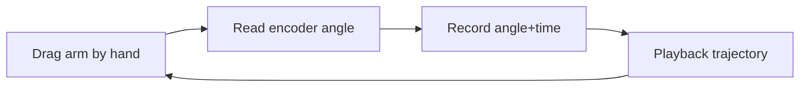

# Lecture 11 — Reading Real Arm Angles & Action Recording / Playback

> **Meta**
> - Date: 2026-08-24 (Wednesday)
> - Lecture / Day: Lecture 11 — Day 11 of the study plan
> - Plan anchor: `study-plan-60d.md` → **P4 Upper-lower computer comm / calibration / WebSocket**, course episodes **047–050**
> - Goal of today: swap Day 10's "sim monitor" for "read real servo angles"; see Apple's arm as an industry benchmark; understand "action-sequence recording & playback" = saving teleoperation as a reproducible trajectory. Ties to KB 02 (humanoid stack) actuator feedback.

---

## 0. One-line summary

> Real angles come from **encoder feedback** (not the target value you set in code); "action-sequence recording & playback" saves the trajectory you drag by hand as structured data — exactly the "demonstration data" seed that Behavior Cloning (BC, Day 51+) will later consume.

---

## 1. Core knowledge (against 047–050)

### 1.1 047 Read real arm angles
- Day 10 faked angles in simulation; today we read **real servo encoder feedback**.
- The real payoff of upper-lower comm (Day 6/10): upper sends commands, lower executes, and returns real angles.

### 1.2 048 Fix the simulator display bug
- When sim meets real hardware, displays often mismatch (screen angle ≠ real arm). Fix the display first, then control — otherwise you don't know what you're actually driving.

### 1.3 049 Apple's robot arm principle
- Apple's desktop assembly arm (e.g. Breakthrough line) is an industry benchmark: **high-precision rigid actuators + closed-loop feedback**, used for product assembly / inspection.
- Learn its "high-precision closed loop" thinking, not the hardware itself.

### 1.4 050 Record & playback action sequences
- Record the trajectory you drag by hand as a stream of `(angle / timestamp)`.
- One-click playback later = reproducible trajectory → the seed of **teleoperation** demonstration data.
- This stream is the "expert action label" source for BC (Day 51+).

---

## 2. Principles to internalize

1. **Real angle ≠ target angle**: target is what you want; real angle (encoder) is what it actually is — feedback is truth.
2. **Recording & playback = structured trajectory**, not a video; algorithms can learn from it.
3. **Apple's essence**: high-precision rigid actuator + closed-loop feedback = industry-grade operation.

---

## 3. One diagram: record-playback loop

---

## 4. Today's operation steps

1. **Read real arm angles and display them**, confirming servo ID matches the code config (else you read the wrong joint).
2. **Record a motion and play it back**, keeping playback speed aligned with recording.
3. **Explain out loud**: real vs target angle, meaning of record/playback, why Apple's arm is a benchmark.
4. **(Later)** watch an Apple desktop-arm assembly video to feel "high-precision closed loop".
5. **Mirror test (3 min):** *"Real angles come from ___; record & playback = ___; Apple benchmark means ___; who uses demonstration data later (Day 51+ BC) ___"*

> ✅ **Definition of "done today":** explain real angle / record-playback / Apple benchmark + pass the mirror test.

---

## 5. Common misconceptions & easy mistakes

| # | Misconception | Reality |
|---|---|---|
| 1 | Code-set angle is the real angle | That's the target; real angle is the encoder feedback |
| 2 | Record & playback is just "video" | It's structured trajectory data learnable by BC |
| 3 | Apple's arm is directly usable | Closed ecosystem; learn its high-precision loop thinking |
| 4 | Demonstration data is useless | It's exactly BC's supervision label on Day 51+ |

---

## 6. DEA cross-link (light, not the main line)

- Plan Day 2 already noted: soft actuators are an alternative execution route.
- For **DEA artificial muscle**, "reading real angles" is itself hard — DEA has no encoder; it relies on **flexible sensing (capacitive / deformation)** for proprioception, which is exactly your direction's trait (ties to Day 17 soft modeling). Rigid arms "have angles by birth"; soft arms must "compute angles from sensing".

---

## 7. Next steps / checkpoint

- **Checkpoint passed if:** you can explain real angle / record-playback / Apple benchmark + pass the mirror test.
- **Next lecture (Day 12):** Robot kinematics — from joint angle to end-effector position (Forward Kinematics), episodes 051–053.

---

### References (for later, not required today)
- Course episodes 047–050 (B 站《黑马程序员 · 具身智能》).
- KB 02 humanoid stack (actuator feedback).
- (Later) Day 51+ Behavior Cloning BC uses today's "demonstration data" concept.
