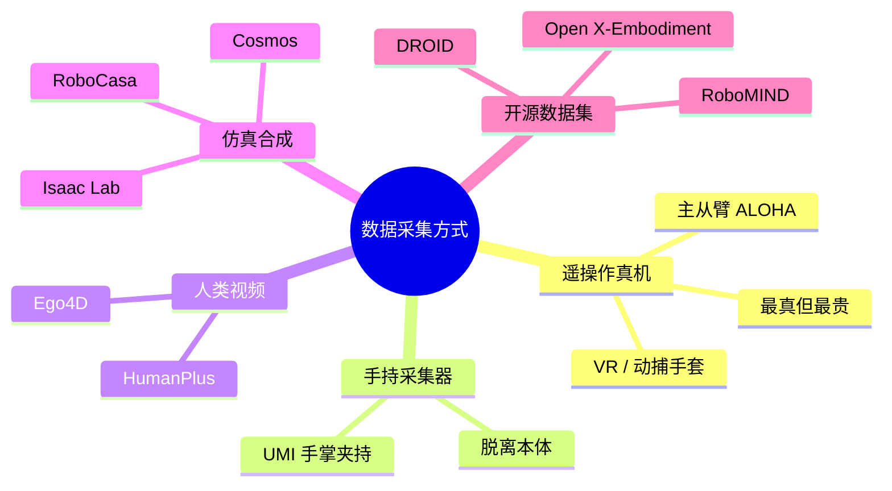
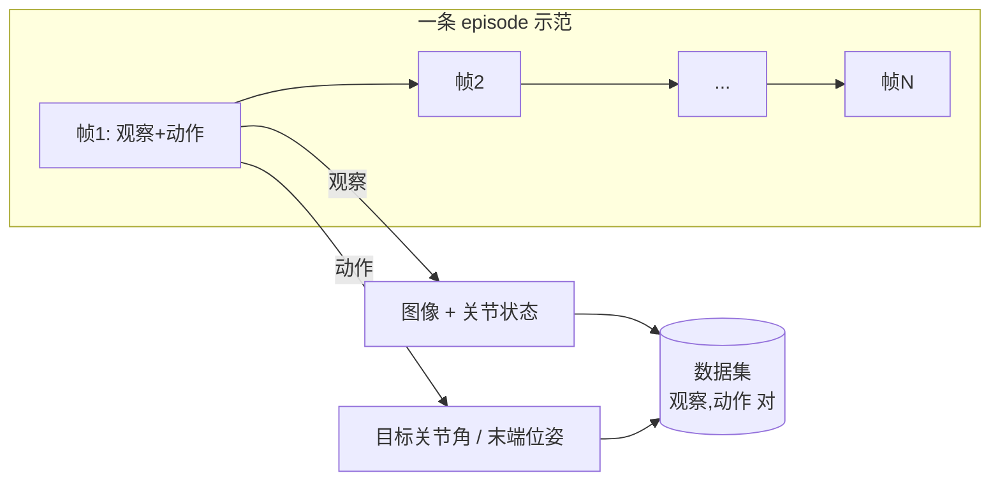
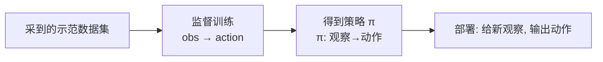
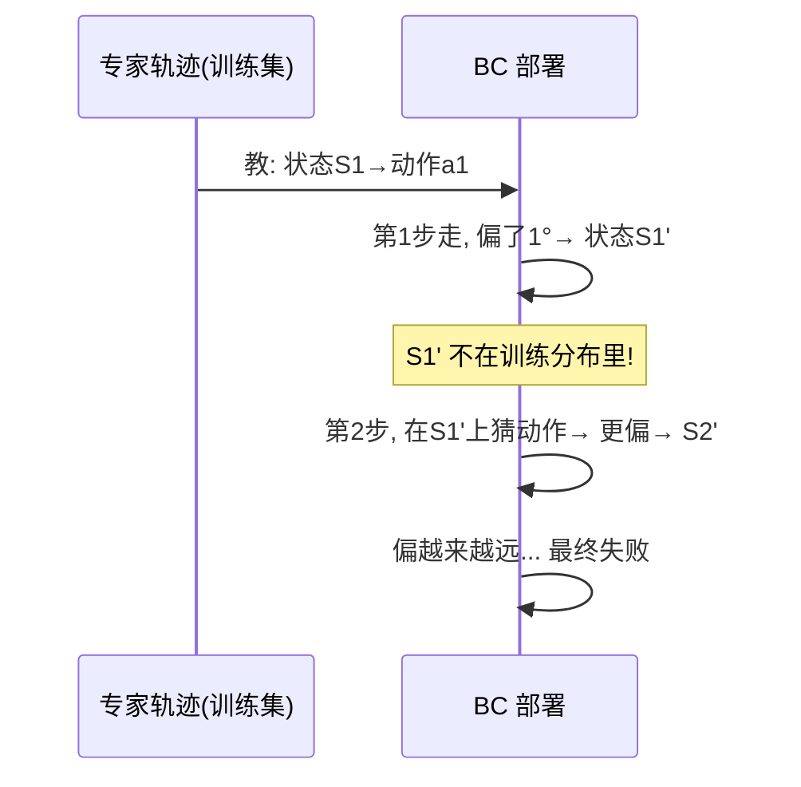
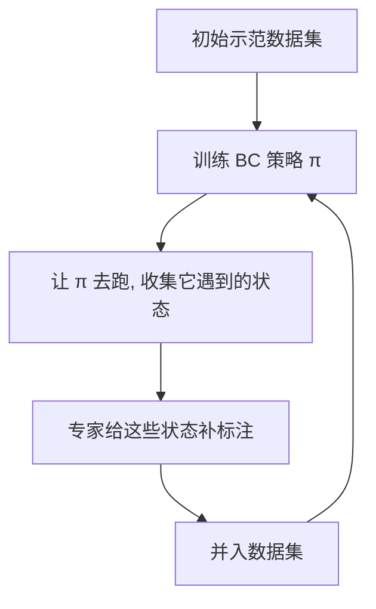
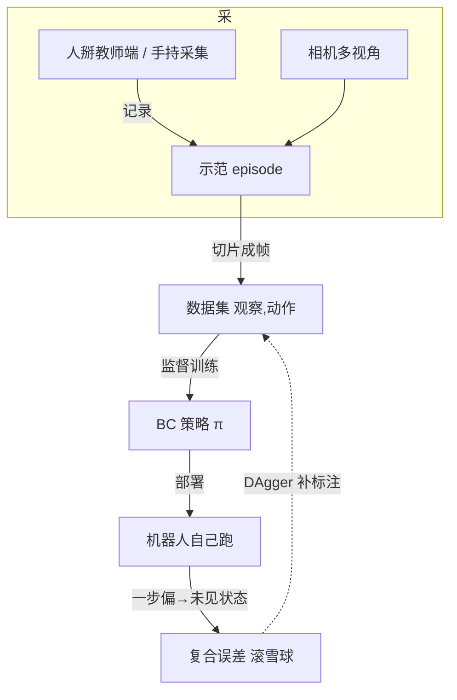

# 第十一讲 · 数据采集与行为克隆（Behavior Cloning, BC）

> **本讲信息**
> - 日期：2026-08-24（周三）
> - 第几讲：第十一讲（学习计划 Day 11）
> - 对应计划：`study-plan-60d.md` 里 **P5 数据采集 / 模仿学习** 阶段，课程集号 **047–050**（以实际课程为准）
> - 今日目标：正式进入“让机器人学做人示范的动作”这一步。先搞清**数据从哪来**（遥操作 / 手持 / 视频 / 仿真 / 开源），再搞清**数据集里装的是什么**（观察，动作）对，最后落地最基础的模仿学习算法——**行为克隆 BC**，并理解它为什么“学得像、一上手就歪”（复合误差），以及 **DAgger** 怎么补这个洞。

---

## 0. 一句话总结

> **数据采集 = 把人示范的“（看到/感觉到的，做了什么）”录成一堆（观察，动作）对；行为克隆 BC = 把这些对当“输入→输出”的监督题来训练，让机器人学会复现。** BC 简单好用，但致命伤是“一步偏了就进入没见过的状态、越偏越远”（复合误差）；**DAgger 的解法是“让专家在机器人自己会遇到的状态下补标注”，把分布漂移摁住。** 这一讲是 Day 9 遥操作、Day 10 实时链路的“收谷”——前面采到的示范，今天变成训练数据。

---

## 1. 核心知识点（这 4 节在讲啥）

| 集号 | 标题 | 要点 |
|---|---|---|
| 047 | 为什么需要数据 / 模仿学习命门 | 没有示范→没有数据→没有策略；**数据是最贵的生产要素** |
| 048 | 数据采集的几种方式 | 遥操作（主从/VR/动捕）、手持采集器（UMI）、人类视频（HumanPlus）、仿真合成（Isaac Lab/Cosmos）、开源数据集 |
| 049 | 数据集格式：（观察，动作）对 | 观察 = 图像 + 本体状态；动作 = 关节角 / 末端位姿；episode；LeRobot 的 parquet 组织 |
| 050 | 行为克隆 BC 与 DAgger | BC 监督训练；复合误差；DAgger 交互式补标注 |

### 1.1 为什么先讲“数据”（047）

<mark>课件补充：具身智能圈有句话——“数据 > 参数”。OpenVLA 用 7B 参数就超过了 55B 的 RT-2-X，说明这一代瓶颈在“数据分布的多样性”，不在“模型多大”。所以**采数据这门手艺，比调模型更值钱**。</mark>

模仿学习（Imitation Learning）的本质是：**人做示范，机器照着学**。没有示范，就没有训练样本；没有样本，就谈不上“学”。这和Day 9 讲的遥操作直接挂钩——**遥操作采到的示范，就是今天的原料**。

产业侧 2026 年的现实：专门做数据采集的场地（比如河南的中原异构人形机器人训练场、南阳数采中心）已经是一个独立赛道。换句话说，**“会采干净数据”本身就是一条就业/实习入口**，对你这种机械背景、懂硬件标定的人尤其友好。

> 类比：教小孩系鞋带，你先在他面前慢慢系几十遍（采集示范），他看着学（模仿学习）。你只给他讲原理、不让他看动作，他永远学不会——**示范就是那样“看得见的过程”**。

### 1.2 数据采集的五种方式（048）

| 方式 | 怎么做 | 优点 | 缺点 | 代表 |
|---|---|---|---|---|
| **遥操作真机** | 人掰主臂（或戴 VR、动捕手套），从臂跟随并记录 | 动作最真、和真机一致 | 慢、贵、要硬件 | ALOHA、Open-TeleVision |
| **手持采集器** | 人手里拿个带相机的小装置直接做动作，脱离机器人本体 | 便宜、能采很多场景 | 要映射到真机动作空间 | **UMI**（手掌夹持器） |
| **人类第一视角视频** | 从 Ego4D / EgoExo4D 学“人怎么干”，再迁到机器人 | 数据海量、免费 | 域差距大、要重映射 | HumanPlus |
| **仿真合成** | 在 Isaac Lab / Cosmos 里让虚拟人/虚拟臂做动作 | 无限、便宜、可加噪声 | 仿真≠真机（Sim2Real 差） | Isaac Lab、RoboCasa |
| **开源数据集** | 直接用别人采好的 | 省事、能直接练 | 不一定贴合你的本体 | Open X-Embodiment、DROID、RoboMIND、AgiBot World |

<mark>课件补充：对**软体机器人 / DEA**方向要特别记住——真机样本“极贵且本体会老化/击穿”，所以仿真合成 + 域随机化是你的主战场；能采的真机示范要倍加珍惜（呼应 Day 8 标定、Day 9 教师端签收）。</mark>

### 1.3 数据集里到底装了什么：（观察，动作）对（049）

一条示范（叫一个 **episode**，一次完整任务）被切成很多帧，每一帧就是一个样本：

- **观察 observation（机器人“看到和感觉到”的）**
  - 相机图像（往往多视角：左腕、右腕、第三人称）
  - **本体状态 proprioception**：自己的关节角度、夹爪开合、力/触觉（Day 2 的编码器读数在这被真正用上）
- **动作 action（机器人“做了什么”）**
  - 通常是**目标关节角度**（和 Day 9 教师端角度同源）
  - 或末端执行器位姿（x, y, z, 姿态）

<mark>课件补充：LeRobot（Hugging Face 的具身学习库）把数据集组织成 **parquet** 文件——一个 `episode_data` 表存每帧的时间戳、图像路径、状态、动作；一个 `meta` 存标定、相机内外参。练 ACT / SmolVLA 时直接 `load_dataset` 就能用，不用自己造轮子。</mark>

> 关键直觉：**每行样本 = “当时看到了啥 + 当时该动多少”**。BC 要学的就是这张“查表”——给新观察，猜该动多少。

### 1.4 行为克隆 BC 是什么（050）

**行为克隆（Behavior Cloning）= 把模仿学习当成最普通的监督学习来做。**

- 输入：观察 `o`（图像+状态）
- 输出：动作 `a`（专家在当时做的动作）
- 训练：最小化“预测动作”和“专家动作”的差距（回归损失，如 MSE；或学动作的分布）

> 类比：BC 就像**抄作业**——你把学霸每一步的“题目→答案”都记下来，考试看到类似题就照抄。简单、快、上手就能用。Day 10 说的“先搭最小闭环、再扩展”，BC 就是最小的“学动作”闭环。

### 1.5 BC 的阿喀琉斯之踵：复合误差（compounding error）

BC 最大的坑：**它假设训练时每一帧是独立同分布的，但真机是“一帧接一帧”串起来的。**

- 训练时：每一步的观察都来自**专家自己走的轨迹**（干干净净）。
- 部署时：BC 自己走，第一步偏了 1°，下一步的观察就变成了“专家从没走过、但 BC 自己造出来的状态”。
- 因为 BC 从没在那种状态上学过，它更容易再偏一点 → **偏越来越远，最后彻底翻车**。

这叫**复合误差 / 分布漂移（distribution shift）**：错误会累积、会滚雪球。

<mark>课件补充：必须让新手记住的一句话——**BC 的失败不是“学得不像”，而是“一步偏了之后进入没见过的状态”**。这是 DAgger、Diffusion Policy、世界模型三条不同解法的共同出发点。</mark>

### 1.6 DAgger：让专家在“机器人自己会遇到的状态”上补标注

**DAgger（Dataset Aggregation）** 的核心思想很朴素：**别只在专家走过的状态下学，要在“机器人实际会走到的状态”上也问专家“这时该咋动”。**

流程（反复做几轮）：
1. 用当前数据集训练一个 BC 策略 `π`。
2. 让 `π` 去真机/仿真里跑，收集它**实际遇到的状态**。
3. 把这些状态拿给专家标上“正确动作”。
4. 把新标注并入数据集，重新训练 `π`。
5. 重复 2–4，直到 `π` 稳。

> 直觉：BC 只练过“学霸走的路”；DAgger 把“学渣（BC）自己走歪的路”也拿去问学霸，于是学渣慢慢不会走歪了。**代价是要专家在线介入（人或好的预言机）**，这是它落地的主要难点。

---

## 2. 原理（先抓这几条）

1. **模仿学习 = 从示范里学策略 π(a|o)。** BC 是最直接的实现：把它当监督回归。
2. **观察≠只有图像。** 本体状态（关节角、夹爪、力）同样是观察的一部分——Day 2 编码器、Day 8 标定的角度在这里被真正“消费”。
3. **动作空间决定一切。** 刚体臂的动作是“关节角”；到了你导师的 DEA 方向，动作可能是“电压场/电荷”——**本体变了，动作空间变了，BC 的输入输出定义也得跟着变**（这是软体方向的研究缝隙）。
4. **复合误差来自“顺序决策 + 分布漂移”。** BC 训练是 i.i.d. 的，部署是马尔可夫决策过程（MDP）式的链式，二者不匹配 → 滚雪球。
5. **DAgger 用“专家补标注”填分布漏洞**，但贵在要专家在线；后续 Day 12 的 Diffusion Policy、Day 13 的 RL，是从别的角度（多模态建模、试错奖励）绕开这个洞。

---

## 3. 一张图：从示范到能用的 BC 策略

> 这张图把 Day 9（遥操作/示教）、Day 10（实时链路用于质检）和今天（数据集/BC）串成了一条线：**示范→数据→策略→部署→（DAgger 回流）**。

---

## 4. 今天的操作步骤（学习流程，不是敲代码）

1. **读一遍本文件**（你在这步）。
2. **徒手画 §1.2 的 mindmap**（五种采集方式）和 §3 的总图，标出“观察/动作”从哪来。
3. **口头讲清四个词**：episode、观察、动作、复合误差——并说清“动作”在刚体臂上是什么、在你导师 DEA 上可能是什么。
4. **对照课程看 047–050**（1.0–1.5 倍速）。重点看 049（数据集格式）和 050（BC 与复合误差）。
5. **（动手，有环境的话）用 LeRobot 跑一个最小 BC**：加载一个现成数据集（如例子里的 SO-100 任务），训练一个“观察→关节角”的小网络，看它在仿真里复现得怎么样——故意让它第一步受点扰，观察复合误差怎么滚大。
6. **镜子测试（3 分钟，关掉一切讲）：** *“数据采集有哪五种方式、各适合啥___；一条（观察，动作）对里观察和动作分别装啥___；BC 为什么叫‘克隆’___；复合误差是怎么来的、一句话___；DAgger 比 BC 多了哪一步___。”*

> ✅ **今天“做完”的标准：** 能讲清五种采集方式 + （观察，动作）对的构成 + BC 原理 + 复合误差的滚雪球机制 + DAgger 的“补标注”闭环。

---

## 5. 常见误区 & 容易踩的坑

| # | 误区 | 真相 |
|---|---|---|
| 1 | “采数据就是多录几遍就行。” | 数据要**覆盖关键状态、有多样性**；同一动作录 100 遍不如 10 种不同情形的各 10 遍。质量>数量。 |
| 2 | “观察就是相机图像。” | 观察 = 图像 **+ 本体状态**（关节角、夹爪、力）。模型既学“看到的”也学“感觉到的”。 |
| 3 | “BC 训练完就能直接上真机。” | BC 有复合误差，真机一连串决策会滚雪球；上线前要在仿真/受控环境测“受扰后会不会越偏越远”。 |
| 4 | “动作就是电机转速/电压。” | 通常动作是**目标关节角或末端位姿**（位置级），底层由控制器去跟踪；DEA 方向动作可能是电压场。定义清楚动作空间是第一步。 |
| 5 | “DAgger 比 BC 强，永远该用 DAgger。” | DAgger 要**专家在线补标注**，真机很贵；很多场景先用 BC 拿到 60–80% 再说，或用 Day 12 的生成式方法绕开。 |
| 6 | “开源数据集能直接喂给我的机器人。” | 别人的本体、相机、动作空间和你不同，要**重映射/对齐**；直接套往往分布不匹配、效果差。 |

---

## 6. 下一步 / 检查点

- **过了检查点 =** 讲清五种采集方式 + （观察，动作）对 + BC 原理 + 复合误差 + DAgger 闭环。
- **下一讲（Day 12）：** 进阶模仿学习——**Diffusion Policy（扩散策略）** 与 **ACT（动作分块）**。它们从“多模态动作建模”和“动作分块”两个角度，专门治 BC 的复合误差和“一步只预测一个动作”的短视。
- **本周种子：** 把“**（观察，动作）对 + 复合误差**”刻进脑子——后面 Day 12/13 的所有方法，都是在和这两个概念较劲。

---

## 7. 训练营实操回顾（来自 SO-101，不是课本）

训练营里我亲手采过 SO-101 的示教，有两件事今天终于对上了：

1. **“数据质量”不是口号，是能摸到的。** 教师端没标定好时采的示范，关节角带着零位飘（Day 8 的坑），喂给 BC 后模型学了一堆“歪的动作”。标定签收 + 当场核一遍数字（Day 9 的肌肉记忆），采出来的（观察，动作）才干净。

2. **复合误差是真能看见的。** 训练完 BC，让 SO-101 自己复现“把方块从左边放到右边”。前几步还行，一旦夹爪偏了 2°，后面整条轨迹就越来越歪，最后方块没拿稳。那一刻我才真正懂课件里“一步偏了进入没见过的状态”——不是比喻，是马上发生的。

> 让我重来一次：采示范前先确认教师端标定可信；训练 BC 后**故意加扰动测复合误差**，而不是直接宣布“学会了”。

---

### 参考资料（先放着，今天不要求）
- 课程视频 047–050（黑马程序员《具身智能》223 节版）。
- LeRobot 文档与示例数据集（`load_dataset`、parquet 组织、ACT/SmolVLA 训练）。
- 论文：Behavior Cloning 基础；**DAgger**（Ross et al., 2011, ICML）；Diffusion Policy（arXiv:2303.04137，Day 12 细讲）；ACT/ALOHA（arXiv:2304.13705，Day 12 细讲）。
- 开源数据集：Open X-Embodiment（arXiv:2310.08864）、DROID、RoboMIND、AgiBot World（Colosseo, arXiv:2503.06669）。
- 软体/DEA 侧提醒：真机样本极贵，仿真合成 + 域随机化是主战场；动作空间是电压场而非关节角，BC 的输入输出要重新定义。
