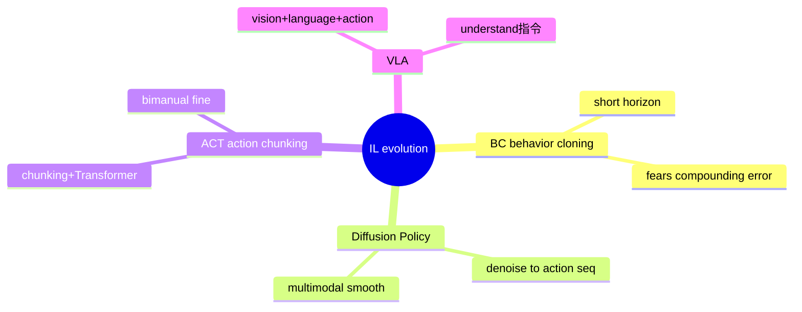
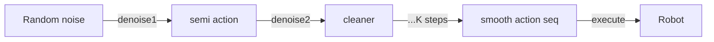
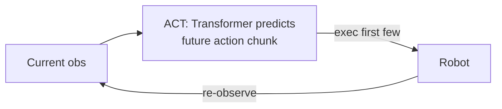
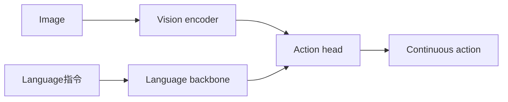
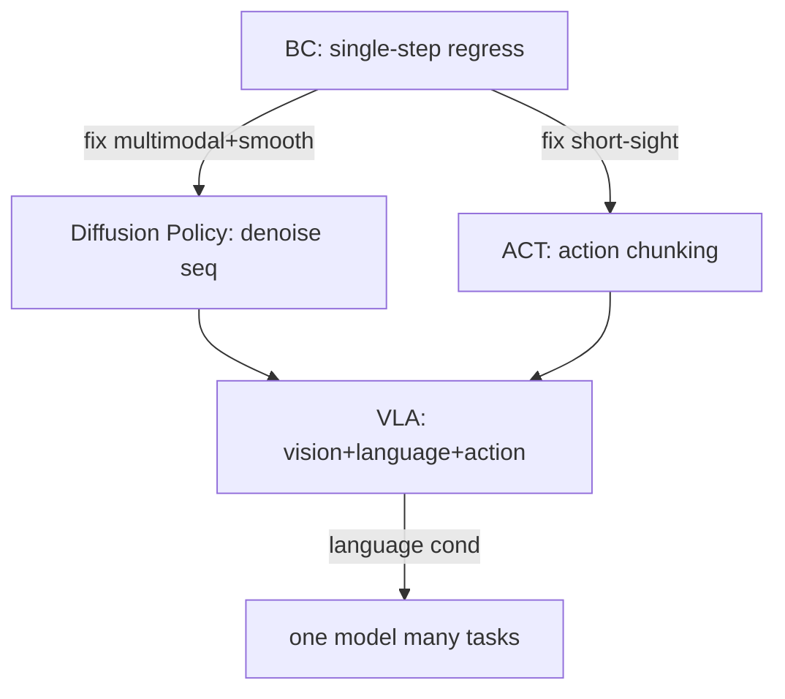

# Lecture 12 · Advanced Imitation Learning: Diffusion Policy & Action Chunking (ACT / VLA)

> **Lecture info**
> - Date: 2026-08-25 (Thu)
> - Lecture #: 12th (study-plan Day 12)
> - Plan: **P5 Data Collection / Imitation Learning** stage in `study-plan-60d.md`; course episodes **051–054** (verify against the actual course)
> - Goal today: BC is short-sighted, fears compounding error, and can't handle "one observation has many valid actions". Today we level up with three stronger imitation methods — **Diffusion Policy**, **ACT (action chunking)**, and an intro to **VLA (Vision-Language-Action)**: fusing "see image + understand speech + output action" into one model.

---

## 0. One-line summary

> **Diffusion Policy = iteratively sculpting random noise into a smooth action sequence via denoising — naturally multimodal and smooth; ACT = predicting a short future action chunk at once (action chunking) + Transformer, fixing BC's "one step at a time" short-sightedness; VLA = vision encoder + language model + action head, letting the robot "see + understand指令 + act" directly.** All three patch BC's holes: multimodal modeling, a longer horizon, language conditioning. The real hard problem for your advisor's DEA direction is — **the action space is a voltage field, not joint angles; VLA/diffusion must generate "voltage" as the action**.

---

## 1. Core knowledge (what these 4 episodes cover)

| Ep | Title | Key points |
|---|---|---|
| 051 | Why go beyond BC | compounding error + multimodal actions + short horizon; generative policies arrive |
| 052 | Diffusion Policy | denoise → action sequence; multimodal; smooth; slow infer → distill/consistency |
| 053 | ACT + ALOHA | action chunking + Transformer; low-cost bimanual; camera-layout sensitive |
| 054 | VLA intro | vision+language+action head; 3 action-head routes (discrete token / diffusion / chain-of-action); representative models |

### 1.1 Why BC is not enough (051)

BC has three hard flaws; we covered two yesterday, here's the third:
1. **Compounding error** (chained decisions, one drift → all drift).
2. **Distribution shift** (deploy states not in training distribution).
3. **Multimodal / short-sighted**: one observation can have several equally valid actions (e.g., "put cup on table" can be left-hand or right-hand); BC's MSE regression **averages** them into a neither-here-nor-there motion (jerky, stuck). And BC predicts only "next action" per step — no coherent global view.

<mark>Course supplement: 2026 consensus — **pure end-to-end VLA is not the终点**; neuro-symbolic (PDDL planning + diffusion execution) and world-model hybrids beat pure VLA on long-horizon tasks. This is a very accessible research gap to enter.</mark>

### 1.2 Diffusion Policy: sculpting "noise" into "action" (052)

**Diffusion Policy (arXiv:2303.04137, RSS 2023)** borrows from image generation (e.g., Stable Diffusion):

- Training: take a real action sequence, gradually add noise until pure noise; the model learns "how to denoise it step by step".
- Inference: start from random noise, **denoise K steps**, finally get a smooth, reasonable action sequence.

Why good?
- **Multimodal**: denoising from different noise yields different valid actions (left-hand / right-hand both OK).
- **Smooth trajectory**: generates "a sequence", not a single step — coherent, no jitter.
- **Robust**: more resilient to noise and perturbation.

Cost: **slow inference** (K denoising steps) → accelerate with **distillation / consistency policy** to real-time.

<mark>Course supplement: π0 (Physical Intelligence) uses **flow matching** (not classic diffusion) for 50 Hz real-time; GR00T N1 uses a diffusion head. Same "generative action representation", just different denoising math.</mark>

### 1.3 ACT + ALOHA: plan a small chunk ahead (053)

**ACT (Action Chunking Transformer, arXiv:2304.13705)** with **ALOHA** bimanual platform, very engineering-minded:

- **Action Chunking**: don't predict only the next action each step; predict **a short future chunk (e.g., 10–30 actions)** at once, execute the first few, then re-predict. This reduces "single-step short-sightedness" and compounding-error accumulation.
- **Transformer backbone**: CVAE + Transformer learns the action distribution, also helps multimodality.
- **Low-cost bimanual**: ALOHA does needle-threading, folding with two cheap cameras + two cheap arms — same lineage as your bootcamp SO-101.

Cost: **camera-layout sensitive** (view change → distribution shift), needs diverse demos.

> Analogy: BC is "step by step, re-think each step"; ACT is "plan a small stretch of road ahead, walk a few steps, re-plan" — less back-and-forth, steadier.

### 1.4 VLA intro: see + understand + act (054)

**VLA (Vision-Language-Action)** fuses three things in one model:
- **Vision encoder** (SigLIP / DINOv2 / Eagle): image → features.
- **Language backbone** (LLaMA / PaliGemma / Qwen / SmolLM2): understands "put red block left".
- **Action Head**: outputs actions.

**Three action-head routes** (know the difference):

| Route | Principle | Pros | Cons | Reps |
|---|---|---|---|---|
| Discrete token | quantize each dim to bins, next-token predict | simple, reuses LLM stack | quantization loss on continuous | RT-2, OpenVLA |
| Diffusion / flow | diffusion/flow match generate continuous action chunks | smooth, multimodal | many infer steps, need distill | π0, GR00T N1, Octo, SmolVLA |
| Chain-of-action | coarse trajectory in action space then refine | long-horizon strong | complex, latency | ACoT-VLA, dVLA |

<mark>Course supplement: model comparison (mid-2026) — OpenVLA (7B, discrete token, Apache-2.0), π0 (~3B, flow matching), GR00T N1 (humanoid, NVIDIA), Octo (93M, diffusion, MIT), RDT-1B (Tsinghua, diffusion transformer), SmolVLA (450M, flow matching, LeRobot-native). **Data > parameters**: OpenVLA's 7B beats RT-2-X's 55B.</mark>

---

## 2. Principles (grab these)

1. **Generative policy = learn "distribution of actions" not "one averaged action".** Diffusion / ACT / VLA all use generative models for multimodality, avoiding BC's "averaged-face" jitter.
2. **Longer horizon = steadier.** ACT's chunking, Diffusion's sequence both lengthen the decision horizon, suppressing compounding error.
3. **VLA = language as a "condition".** Same observation, "left" vs "right" gives different actions — language makes one model do many tasks.
4. **Inference latency is a real constraint.** Diffusion needs many denoise steps; ACT chunk needs Transformer forward; onboard compute (Jetson Thor) needs distill/quantize. Day 10's "sample rate + transport" upgrades to "inference rate".
5. **DEA's real problem**: action is **voltage field / charge**, not joint angles. Diffusion Policy / VLA must generate "voltage" as action — **how to represent it and keep the actuator from breaking down is an open research problem**.

---

## 3. One diagram: the BC → DP / ACT → VLA relay

> This line is the same root as Day 11's "compounding error": BC first gets 60–80%, generative methods push it steadier/more general; tomorrow Day 13's RL fills the last 10–20% long tail.

---

## 4. Steps today (study flow)

1. **Read this file**.
2. **Draw §1.1 mindmap** (BC→DP/ACT→VLA) and §3 relay by hand.
3. **Say three words aloud**: why Diffusion Policy is multimodal, what ACT's chunking is, what the VLA trio is.
4. **Watch 051–054** (1.0–1.5×). Focus on 052 (Diffusion denoise) and 054 (VLA 3 action-head routes).
5. **(Hands-on) run SmolVLA or ACT with LeRobot**: load a pretrained weight on a sim/SO-100 task, give a language指令, see what action comes out; compare BC's "averaged-face" jitter.
6. **Mirror test (3 min):** *"BC's three flaws___; what Diffusion denoise does and why multimodal___; what ACT chunking is and which BC flaw it fixes___; VLA trio___; three action-head routes with one rep each___"*

> ✅ **Done today =** BC three flaws + Diffusion denoise + ACT chunking + VLA trio + three action-head routes.

---

## 5. Common misconceptions

| # | Misconception | Truth |
|---|---|---|
| 1 | "Diffusion Policy generates images." | It generates **action sequences**, only borrowing denoising math; images are just one observation input. |
| 2 | "VLA beats BC/DP, just use VLA." | VLA needs language data and bigger compute; many tasks BC/DP suffice, VLA is "nice-to-have + multi-task". |
| 3 | "Discrete-token action head is simplest, use it." | Quantization loss; continuous precision (needle) fits diffusion/flow head better. |
| 4 | "ACT isn't camera-sensitive, place freely." | ACT **is camera-layout sensitive**; big view change needs re-demo / domain adapt. |
| 5 | "Diffusion infer is slow, can't be real-time." | Raw multi-step slow, but distill/consistency reaches 50 Hz (π0); real-time is engineering not dead-end. |
| 6 | "DEA direction just applies VLA." | Action space is voltage field; VLA's output head must be redefined and keep actuator safe (no breakdown); that's a research gap, not a ready solution. |

---

## 6. Next step / checkpoint

- **Checkpoint passed =** BC three flaws + Diffusion denoise + ACT chunking + VLA trio + three action-head routes.
- **Next lecture (Day 13):** **RL intro + Sim2Real** — after BC/DP lays the base, use RL (PPO/SAC/world models) to fill the last 10–20% long tail, and how to move sim-trained policy to real hardware (domain randomization, teacher-student distillation).
- **This week's seed:** remember "**IL lays base → RL post-trains the tail → real-hardware reflux self-improves**" — the modern mainstream division of labor.

---

## 7. Bootcamp retrospective (from SO-101, not textbook)

The bootcamp SO-101 bimanual used the **ACT** route; today's points clicked on the spot:

1. **"Action chunking" is not metaphysics, it's steady.** Bootcamp had SO-101 move a small object box-to-box; ACT predicted a chunk at once, visibly smoother than pure BC's "jitter every step". First time seeing chunking suppress compounding error live.

2. **Language指令 really works as condition.** Give SO-101 "left / right", same weights switch target — that's the embryo of VLA, just lighter conditioning. Today I finally mapped it to the VLA trio.

> If I could redo it: before doing imitation learning, decide "multimodal? language? real-time enough?" then pick BC / DP / ACT / VLA, not blindly the biggest model.

---

### References (park them, not required today)
- Course videos 051–054 (Black Horse《Embodied Intelligence》223-ep version).
- Papers: **Diffusion Policy** (arXiv:2303.04137); **ACT/ALOHA** (arXiv:2304.13705); **OpenVLA** (arXiv:2406.09246); **π0** (arXiv:2410.24164); **GR00T N1** (arXiv:2503.14734); **Octo** (arXiv:2405.12213); **RDT-1B** (arXiv:2410.07864); **SmolVLA** (arXiv:2506.01844); DP3/iDP3 (arXiv:2403.03954).
- LeRobot: SmolVLA / ACT fine-tune examples; Hugging Face model hub.
- Soft/DEA note: action space is voltage field; generative action representation must redefine output and keep actuator safe (no breakdown).
