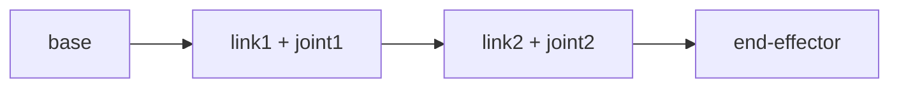

# Lecture 12 — Robot Kinematics: From Joint Angles to End Position (Forward Kinematics)

> **Meta**
> - Date: 2026-08-25 (Thursday)
> - Lecture / Day: Lecture 12 — Day 12 of the study plan
> - Plan anchor: `study-plan-60d.md` → **P5 Kinematics (FK / IK)**, course episodes **051–053**
> - Goal of today: what kinematics is, how to derive a one-link model, and how multi-link chains compose into the end position. This is the ground for "letting the arm know where its hand is". Ties to KB 02 (humanoid stack) kinematics.

---

## 0. One-line summary

> **Kinematics = the geometry of "joint angles ↔ end position", ignoring force** (force is dynamics); from a "one-link model (single link)" to "multi-link analytic (chain transforms)", you get the end coordinates — the base for Inverse Kinematics (IK) and visual grasping later.

---

## 1. Core knowledge (against 051–053)

### 1.1 051 Kinematics concept
- Kinematics only cares "given joint angles, where is the end" — pure geometry, no force / torque.
- Boundary with dynamics: **dynamics handles "how much force to rotate there"**, kinematics doesn't.

### 1.2 052 One-link kinematics model
- Single link: one joint angle θ, end position = rod length L rotated by θ.
- The smallest unit of every complex arm.

### 1.3 053 Multi-link analytic kinematics
- Chain each segment's "rotate + translate" transform (chain rule).
- The nth joint's end = the product of all preceding joint transforms.

---

## 2. Principles to internalize

1. **Kinematics ≠ dynamics**: kinematics only handles position geometry, not force.
2. **Joint angle → end = chained transform**: each segment rotates + translates.
3. **One-link model is the base**; multi-link is its superposition.

---

## 3. One diagram: kinematic chain

---

## 4. Today's operation steps

1. **Hand-derive a two-link forward solution**: given θ1, θ2, L1, L2, compute end (x, y).
2. **Understand the "joint angle → end coord" chain relation.**
3. **Explain out loud**: kinematics definition, one-link model, how multi-link composes.
4. **(Later)** verify a rotation-translation matrix in code (used Day 13).
5. **Mirror test (3 min):** *"Kinematics definition ___; one-link model ___; how multi-link composes ___; kinematics vs dynamics ___"*

> ✅ **Definition of "done today":** hand-derive two-link FK + explain kinematics/dynamics boundary + pass mirror test.

---

## 5. Common misconceptions & easy mistakes

| # | Misconception | Reality |
|---|---|---|
| 1 | Kinematics = dynamics | Kinematics only handles geometry, not force/torque |
| 2 | One-link model is a real arm | It's the simplest unit; real arms stack multi-link |
| 3 | End position is guessed | It's the product of all joint transforms |

---

## 6. DEA cross-link (light, not the main line)

- Rigid-arm kinematics uses "finitely many discrete joint angles"; **soft / DEA arm "kinematics" is infinite-dimensional, continuous deformation**, with no clean discrete joint angles — this is why your direction is harder than rigid arms (ties to Day 17 soft modeling). Rigid arms get exact FK; soft arms often need Cosserat-rod / data-driven approximation.

---

## 7. Next steps / checkpoint

- **Checkpoint passed if:** hand-derive two-link FK + explain kinematics/dynamics boundary + pass mirror test.
- **Next lecture (Day 13):** matrix math & end-effector solving (homogeneous transform), episodes 054–056.

---

### References (for later, not required today)
- Course episodes 051–053 (B 站《黑马程序员 · 具身智能》).
- KB 02 humanoid stack (kinematics).
- (Later) Day 14 IK, Day 16 keyboard control all build on today's FK.
