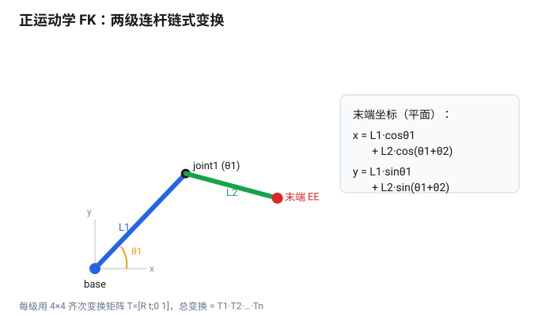

# Lecture 12 — Robot Kinematics: From Joint Angles to End Position (Forward Kinematics)

> **Meta**
> - Date: 2026-08-25 (Tuesday)
> - Lecture / Day: Lecture 12 — Day 12 of the study plan
> - Plan anchor: `study-plan-60d.md` → **P5 Kinematics (FK / IK)**, course episodes **051–053**
> - Goal of today: what kinematics is, how to derive a one-link model, and how multi-link chains compose into the end position. This is the ground for "letting the arm know where its hand is". Ties to KB 02 (humanoid stack) kinematics.

---

## 0. One-line summary

> Kinematics = the geometry of "joint angles ↔ end position", **ignoring force** (force is dynamics); from a "one-link model" to "multi-link analytic (chain transforms)", you get the end coordinates — the base for IK and visual grasping. My own mnemonic: **FK is a function — give it angles, it returns exactly one point**.

---

## 1. Core knowledge (against 051–053)

### 1.1 051 Kinematics concept
- Kinematics only cares "given joint angles, where is the end" — pure geometry, no force / torque.
- Boundary with dynamics: **dynamics answers "how much force to rotate there"**, kinematics doesn't.
- The confusion I had: I mixed up "where is the hand" with "how much force to move it". One sentence fixed it — **kinematics answers "where", dynamics answers "how much force"**.

### 1.2 052 One-link kinematics model
- One joint angle θ, end position = rod length L rotated by θ.
- In plane: `x = L·cosθ`, `y = L·sinθ`.
- The smallest unit of every complex arm; multi-link just stacks it.

### 1.3 053 Multi-link analytic kinematics (chained transforms)
- Chain each segment's "rotate then translate along the rod" transform (chain rule).
- The nth joint's end = the **product** of all preceding joint transforms, not a sum.
- The tool is the **homogeneous transform matrix (see §2)**.

---

## 2. Principles: homogeneous matrix + two-link FK

### 2.1 Why the homogeneous matrix
Each joint's "rotate + translate" is one 4×4 matrix:
```
T = [ R   t ]
    [ 0   1 ]
```
R is the 3×3 rotation, t the 3×1 translation. Write a point as a homogeneous vector `[x y z 1]^T`; one matrix multiply does rotation and translation at once.

The whole arm's total transform = the matrices chained by **left-multiply**:
```
T_total = T1 · T2 · … · Tn
```
End position = T_total · point in base frame. Matrix multiply is **non-commutative**, so order matters.

### 2.2 Closed-form FK for a planar two-link arm (I derived it by hand)
With link lengths L1, L2, joint angles θ1 (world-relative), θ2 (relative to previous link), base at origin:
```
x = L1·cosθ1 + L2·cos(θ1 + θ2)
y = L1·sinθ1 + L2·sin(θ1 + θ2)
```
> Intuition: the first link brings the end to (L1cosθ1, L1sinθ1); the second link rotates θ2 *on top of* the already-rotated θ1, hence cos(θ1+θ2).

This diagram shows "chained transform → end coords", rendered directly on GitHub:



---

## 3. Today's operation steps

1. **Hand-derive a two-link forward solution**: given θ1, θ2, L1, L2, compute end (x, y). (The formula above is the answer, but derive it from the picture once yourself — sticks better.)
2. **Understand the "joint angle → end coord" chain**: not a sum, a matrix product.
3. **Explain out loud**: kinematics definition, one-link model, how multi-link composes, what the homogeneous matrix looks like.
4. **(Later)** verify a rotation-translation matrix in code (used Day 13).
5. **Mirror test (3 min):** *"Kinematics definition ___; one-link model ___; how multi-link composes ___; kinematics vs dynamics ___; block structure of T ___"*

> ✅ **Definition of "done today":** hand-derive two-link FK + explain kinematics/dynamics boundary + recite the two-link closed form + pass mirror test.

---

## 4. Common misconceptions & easy mistakes

| # | Misconception | Reality |
|---|---|---|
| 1 | Kinematics = dynamics | Kinematics only handles geometry, not force/torque |
| 2 | One-link model is a real arm | It's the simplest unit; real arms stack multi-link |
| 3 | End position is guessed | It's the product of all joint transforms (matrix, not addition) |
| 4 | Matrix order doesn't matter | T_total = T1·T2·…·Tn; multiply is non-commutative, wrong order breaks the end |

---

## 5. DEA cross-link (light, not the main line)

- Rigid-arm kinematics uses "finitely many discrete joint angles"; **soft / DEA arm "kinematics" is infinite-dimensional, continuous deformation**, with no clean discrete joint angles — this is why your direction is harder than rigid arms (ties to Day 17 soft modeling). Rigid arms get exact FK; soft arms often need Cosserat-rod / data-driven approximation.

---

## 6. Next steps / checkpoint

- **Checkpoint passed if:** hand-derive two-link FK + explain kinematics/dynamics boundary + recite the two-link closed form + pass mirror test.
- **Next lecture (Day 13):** matrix math & end-effector solving (homogeneous transform), episodes 054–056.

---

### References (for later, not required today)
- Course episodes 051–053 (B 站《黑马程序员 · 具身智能》).
- KB 02 humanoid stack (kinematics).
- (Later) Day 14 IK, Day 16 keyboard control build on today's FK.
