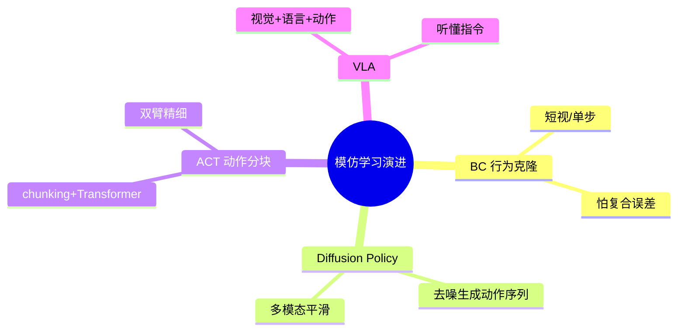
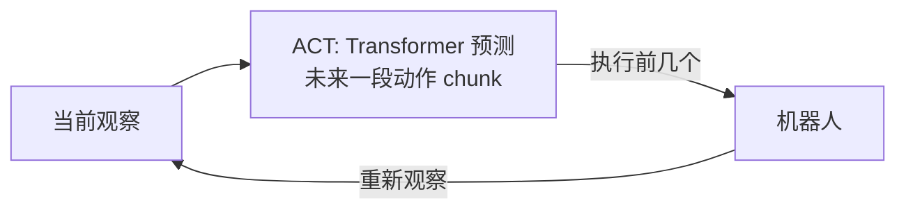
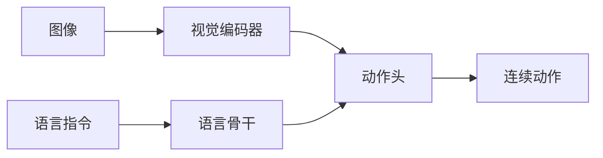
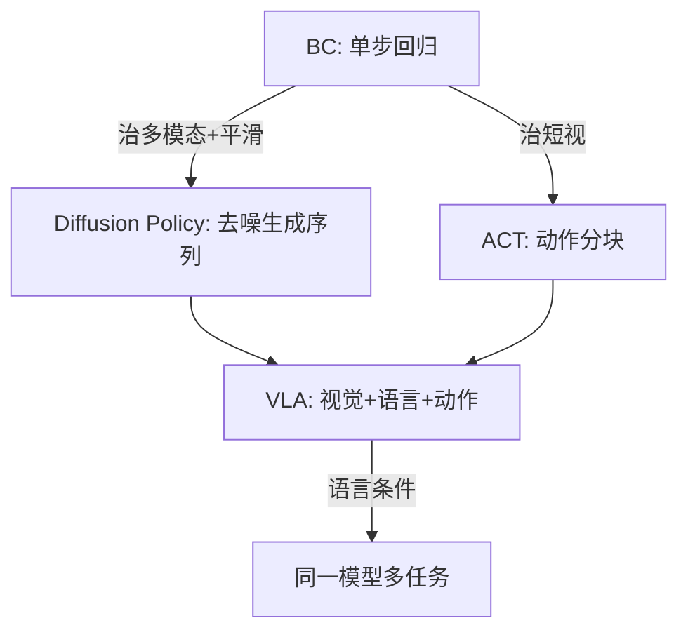

# 第十二讲 · 进阶模仿学习：扩散策略（Diffusion Policy）与动作分块（ACT / VLA）

> **本讲信息**
> - 日期：2026-08-25（周四）
> - 第几讲：第十二讲（学习计划 Day 12）
> - 对应计划：`study-plan-60d.md` 里 **P5 数据采集 / 模仿学习** 阶段，课程集号 **051–054**（以实际课程为准）
> - 今日目标：BC 太短视、怕复合误差、还不会处理“同一观察有多种合理动作”。今天上三个更厉害的模仿学习方法——**Diffusion Policy（扩散策略）**、**ACT（动作分块）**，并顺势入门 **VLA（视觉-语言-动作）**：把“看图像 + 听懂话 + 出动作”真正合到一个模型里。

---

## 0. 一句话总结

> **Diffusion Policy = 用“去噪”一步步把随机噪声雕琢成一段流畅动作序列，天生擅长多模态、轨迹平滑；ACT = 一次预测未来一小段动作（action chunking）+ Transformer，专治 BC“一步只看一步”的短视；VLA = 视觉编码器 + 语言模型 + 动作头，让机器人“看图 + 听懂指令”直接出动作。** 三者都在补 BC 的洞：多模态建模、长一点儿的视野、语言条件。你导师的 DEA 方向真正的难题是——**动作空间是电压场而非关节角，VLA/diffusion 要把“电压”当动作来生成**。

---

## 1. 核心知识点（这 4 节在讲啥）

| 集号 | 标题 | 要点 |
|---|---|---|
| 051 | 为什么要超越 BC | 复合误差 + 多模态动作 + 短视；生成式策略登场 |
| 052 | Diffusion Policy（扩散策略） | 去噪生成动作序列、多模态、轨迹平滑；推理慢→蒸馏/consistency |
| 053 | ACT + ALOHA（动作分块） | action chunking + Transformer；低成本双臂精细操作；对相机布局敏感 |
| 054 | VLA 入门 | 视觉+语言+动作头；动作头三路线（离散 token / 扩散 / 动作链式）；代表模型 |

### 1.1 为什么 BC 不够，要更进阶的方法（051）

BC 有三个硬伤，昨天讲过两个，今天补第三个：
1. **复合误差**（链式决策，一步偏步步偏）。
2. **分布漂移**（部署状态不在训练分布）。
3. **多模态 / 短视**：同一个观察可能有好几种都对的动作（比如“把杯子放桌上”可以左手放也可以右手放）；BC 用 MSE 回归会把这些动作“平均”成一个四不像（轨迹发抖、卡顿）。而且 BC 每步只预测“下一个动作”，没有连贯的全局观。

<mark>课件补充：2026 年的共识——**纯端到端 VLA 不是终局**，神经符号（PDDL 规划 + diffusion 执行）与世界模型混合方案在长程任务上显著更好。这是非常适合切入的研究缝隙。</mark>

### 1.2 Diffusion Policy：把“噪声”雕成“动作”（052）

**Diffusion Policy（arXiv:2303.04137, RSS 2023）** 的思路借自图片生成（如 Stable Diffusion）：

- 训练时：给一条真实动作序列，逐步加噪声把它变成纯噪声；模型学“怎么把噪声一步步去干净”。
- 推理时：从一个随机噪声出发，**反复去噪 K 步**，最终得到一段平滑、合理的动作序列。

为什么好？
- **多模态**：去噪可以从不同噪声出发，生成不同的合理动作（左手放 / 右手放都行）。
- **轨迹平滑**：生成的是“一段序列”，不是单步，所以连贯、不抖。
- **稳**：对噪声和扰动更鲁棒。

代价：**推理慢**（要跑 K 步去噪）→ 用 **蒸馏 / consistency policy** 加速到实时。

<mark>课件补充：π0（Physical Intelligence）用的是 **flow matching**（流匹配）而不是经典扩散，做到 50 Hz 实时；GR00T N1 用扩散头。本质都是“生成式动作表征”，只是去噪的数学实现不同。</mark>

### 1.3 ACT + ALOHA：一次想好一小段（053）

**ACT（Action Chunking Transformer，arXiv:2304.13705）** 配 **ALOHA** 双臂平台，思路很工程：

- **Action Chunking（动作分块）**：不要每步只预测下一个动作，而是一次预测**未来一小段（比如 10–30 个动作）**，只执行前面几个，再重新预测。这样减少了“单步短视”和复合误差的累积。
- **Transformer  backbone**：用 CVAE + Transformer 学动作分布，对多模态也有好处。
- **低成本双臂**：ALOHA 用两颗低价款相机 + 两台低成本臂就能做穿针、折叠等精细操作——和你在训练营用的 SO-101 同源。

代价：**对相机布局敏感**（视角变了分布就变），需要较多样的示范。

> 类比：BC 像“走一步看一步、每步重新想”;ACT 像“先想好接下来一小段路怎么走，走几步再重新规划”——少了来回纠结，更稳。

### 1.4 VLA 入门：让机器人“看图 + 听懂话 + 出手”（054）

**VLA（Vision-Language-Action）** 把三件事合一个模型：
- **视觉编码器**（SigLIP / DINOv2 / Eagle）：把图像变成特征。
- **语言骨干**（LLaMA / PaliGemma / Qwen / SmolLM2）：理解“把红块放左边”这种指令。
- **动作头 Action Head**：输出动作。

**动作头三条路线**（务必分清）：

| 路线 | 原理 | 优点 | 缺点 | 代表 |
|---|---|---|---|---|
| 离散 token 化 | 把每维动作量化成 bin，当 next-token 预测 | 简单、复用 LLM 栈 | 连续运动有量化损失 | RT-2、OpenVLA |
| 扩散 / 流匹配 | 用扩散/流匹生成连续动作块 | 轨迹平滑、多模态 | 推理步多需蒸馏 | π0、GR00T N1、Octo、SmolVLA |
| 动作链式思考 | 先在动作空间出粗轨迹再细化 | 长程强 | 结构复杂、延迟 | ACoT-VLA、dVLA |

<mark>课件补充：模型对照（2026 中）——OpenVLA(7B, 离散token, Apache-2.0)、π0(~3B, flow matching)、GR00T N1(人形专用, NVIDIA)、Octo(93M, diffusion, MIT)、RDT-1B(清华, diffusion transformer)、SmolVLA(450M, flow matching, LeRobot 原生)。**数据 > 参数**：OpenVLA 以 7B 超 55B 的 RT-2-X。</mark>

---

## 2. 原理（先抓这几条）

1. **生成式策略 = 学“动作的分布”而非“一个平均动作”。** Diffusion / ACT / VLA 都用生成模型表达多模态，避免 BC 的“平均脸”卡顿。
2. **视野（horizon）更长 = 更稳。** ACT 的 chunking、Diffusion 的一段序列，都在拉长决策视野，压制复合误差。
3. **VLA = 把语言变成“条件”。** 同一观察，“放左边”和“放右边”给出不同动作——语言让同一模型干多种任务。
4. **推理延迟是现实约束。** Diffusion 要多步去噪；ACT chunk 要 Transformer 前向；上机载算力（Jetson Thor 之类）要蒸馏/量化。Day 10 讲的“采样频率 + 传输”在这升级为“推理频率”。
5. **DEA 方向的真问题**：动作是**电压场/电荷**，不是关节角。Diffusion Policy / VLA 要生成的“动作”变成连续电压轨迹——**怎么表征、怎么保证驱动器不击穿，是开放研究问题**。

---

## 3. 一张图：BC → DP / ACT → VLA 的接力

> 这条路和 Day 11 的“复合误差”是同一根线：BC 先拿到 60–80% 成功率，生成式方法把它推到更稳、更泛化；明天 Day 13 的 RL 再补最后 10–20% 长尾。

---

## 4. 今天的操作步骤（学习流程）

1. **读一遍本文件**。
2. **徒手画 §1.1 的 mindmap**（BC→DP/ACT→VLA）和 §3 的接力图。
3. **口头讲清三个词**：Diffusion Policy 为什么多模态、ACT 的 chunking 是什么、VLA 三件套是哪三件。
4. **对照课程看 051–054**（1.0–1.5×）。重点看 052（Diffusion 去噪）和 054（VLA 动作头三路线）。
5. **（动手）用 LeRobot 跑 SmolVLA 或 ACT**：在一个 sim/SO-100 任务上加载预训练权重，给一句语言指令看它出什么动作；对比 BC 的“平均脸”抖动。
6. **镜子测试（3 分钟）：** *“BC 的三个硬伤___；Diffusion Policy 去噪在干啥、为啥多模态___；ACT 的 chunking 是啥、治了 BC 哪个伤___；VLA 三件套___；动作头三条路线各举一个代表___。”*

> ✅ **今天“做完”的标准：** 讲清 BC 三硬伤 + Diffusion 去噪 + ACT chunking + VLA 三件套 + 动作头三路线。

---

## 5. 常见误区 & 容易踩的坑

| # | 误区 | 真相 |
|---|---|---|
| 1 | “Diffusion Policy 就是生成图片。” | 它生成的是**动作序列**，只是借了去噪的数学；图像只是观察输入之一。 |
| 2 | “VLA 比 BC/DP 强，直接上 VLA。” | VLA 要语言数据和更大算力；很多任务 BC/DP 已够，VLA 是“锦上添花 + 多任务”。 |
| 3 | “动作头离散 token 最简单，用它就对。” | 量化有损失，连续精密操作（穿针）更适合扩散/流匹配头。 |
| 4 | “ACT 对相机不敏感，随便摆。” | ACT **对相机布局敏感**，视角大变要重新采示范/域适应。 |
| 5 | “Diffusion 推理慢，不能实时。” | 原始多步去噪慢，但蒸馏/consistency 能到 50 Hz（π0）；实时是工程问题不是死穴。 |
| 6 | “DEA 方向直接套 VLA 就行。” | 动作空间是电压场，VLA 的输出头要重新定义并保证不击穿驱动器；这是研究缝隙不是现成方案。 |

---

## 6. 下一步 / 检查点

- **过了检查点 =** BC 三硬伤 + Diffusion 去噪 + ACT chunking + VLA 三件套 + 动作头三路线。
- **下一讲（Day 13）：** **强化学习入门 + Sim2Real**——BC/DP 打底后，用 RL（PPO/SAC/世界模型）补最后 10–20% 长尾，以及怎么把仿真里练好的策略搬到真机（域随机化、教师-学生蒸馏）。
- **本周种子：** 记住“**IL 打底 → RL 后训练补尾部 → 真机回灌自改进**”这条现代主流分工。

---

## 7. 训练营实操回顾（来自 SO-101，不是课本）

训练营的 SO-101 双臂就是用 **ACT** 路线做的，今天的知识点当场对上：

1. **“动作分块”不是玄学，是真稳。** 训练营里让 SO-101 做“把小物件从一个盒移到另一个盒”，ACT 一次预测一小段动作，比纯 BC 那种“每步重新抖一下”明显顺。第一次亲眼看到 chunking 怎么压住复合误差。

2. **语言指令真能当条件。** 给 SO-101 一句“放到左边/右边”，同一套权重就切换目标——这就是 VLA 的雏形，只不过训练营用的是更轻量的条件。今天才把它和 VLA 三件套对上号。

> 让我重来一次：以后做模仿学习，先想清“要不要多模态、要不要语言、实时性够不够”，再选 BC / DP / ACT / VLA，而不是无脑上最大的模型。

---

### 参考资料（先放着，今天不要求）
- 课程视频 051–054（黑马程序员《具身智能》223 节版）。
- 论文：**Diffusion Policy**（arXiv:2303.04137）；**ACT/ALOHA**（arXiv:2304.13705）；**OpenVLA**（arXiv:2406.09246）；**π0**（arXiv:2410.24164）；**GR00T N1**（arXiv:2503.14734）；**Octo**（arXiv:2405.12213）；**RDT-1B**（arXiv:2410.07864）；**SmolVLA**（arXiv:2506.01844）；DP3/iDP3（arXiv:2403.03954）。
- LeRobot：SmolVLA / ACT 微调示例；Hugging Face 模型库。
- 软体/DEA 侧提醒：动作空间是电压场；生成式动作表征要重新定义输出并保证驱动器安全（不击穿）。
