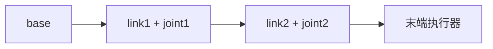

# 第十二讲 · 机器人运动学：从关节角到末端位置（正运动学 FK）

> **本讲信息**
> - 日期：2026-08-25（周四）
> - 第几讲：第十二讲（学习计划 Day 12，P5 运动学）
> - 对应计划：`study-plan-60d.md` → **P5 运动学（正解 FK / 逆解 IK）**，课程集号 **051–053**
> - 今日目标：搞懂运动学是什么、一级模型怎么推、多连杆怎么串成末端位置。这是「让机械臂知道手在哪」的地基。接 KB 02（人形机器人栈）的运动学。

---

## 0. 一句话总结

> **运动学 = 研究「关节角 ↔ 末端位置」的几何关系，不管力**（管力的是动力学）；从「一级模型（单连杆）」到「多连杆解析（把每段变换串起来）」，就得到末端坐标——这是后面逆运动学（IK）和视觉抓取的地基。

---

## 1. 核心知识点（对照 051–053）

### 1.1 051 机器人运动学概念
- 运动学只关心「给一组关节角，末端在哪」——纯几何，不含力 / 力矩。
- 和动力学的边界：**动力学管「要用多大力转到这」**，运动学不管。

### 1.2 052 一级运动学模型
- 单连杆：一个关节角 θ，末端位置 = 杆长 L 转 θ。
- 这是所有复杂臂的最小单元。

### 1.3 053 多连杆运动学的解析
- 把每段「转一下 + 移一下」的变换串起来（链式法则）。
- 第 n 个关节的末端 = 前面所有关节变换的连乘结果。

---

## 2. 原理（先抓这几条）

1. **运动学 ≠ 动力学**：运动学只管位置几何，不管力。
2. **关节角 → 末端 = 链式变换**：每段转 + 移。
3. **一级模型是地基**，多连杆是它的叠加。

---

## 3. 一张图：运动链

---

## 4. 今天的操作步骤

1. **手推一个两级连杆的正解**：给 θ1、θ2、L1、L2，算出末端 (x, y)。
2. **理解「关节角 → 末端坐标」的链式关系**。
3. **口头讲清**：运动学定义、一级模型、多连杆怎么串。
4. **（以后）** 用代码验证一个旋转平移矩阵（Day 13 会用到）。
5. **镜子测试（3 分钟）：** *「运动学定义___；一级模型___；多连杆怎么串___；运动学 vs 动力学___。」*

> ✅ **今天「做完」的标准：** 手推两级正解 + 讲清运动学/动力学边界 + 过镜子测试。

---

## 5. 常见误区 & 容易踩的坑

| # | 误区 | 真相 |
|---|---|---|
| 1 | 运动学 = 动力学 | 运动学只管几何位置，不管力/力矩 |
| 2 | 一级模型就是真臂 | 它是最简单单元，真臂是多连杆叠加 |
| 3 | 末端位置靠猜 | 它是所有关节变换的连乘结果 |

---

## 6. DEA 交叉链接（轻量，非主线）

- 刚性臂的运动学是「有限个离散关节角」；**软体 / DEA 臂的「运动学」是无穷维、连续变形**，没有干净的离散关节角——这是你方向比刚性臂难的核心（接 Day 17 软体建模）。所以刚性臂能精确正解，软体臂往往要用 Cosserat 杆 / 数据驱动模型近似。

---

## 7. 下一步 / 检查点

- **过了检查点 =** 手推两级正解 + 讲清运动学/动力学边界 + 过镜子测试。
- **下一讲（Day 13）：** 矩阵运算与末端求解（齐次变换矩阵），课程集号 054–056。

---

### 参考资料（先放着，今天不要求）
- 课程集号 051–053（B 站《黑马程序员 · 具身智能》）。
- KB 02 人形机器人栈（运动学）。
- （后续）Day 14 逆运动学 IK、Day 16 键盘控制都建立在本讲正解之上。