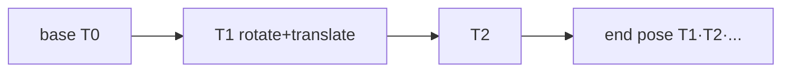

# Lecture 13 — Matrix Math & End-Effector Solving (Homogeneous Transform)

> **Meta**
> - Date: 2026-08-26 (Friday)
> - Lecture / Day: Lecture 13 — Day 13 of the study plan
> - Plan anchor: `study-plan-60d.md` → **P5 Kinematics (FK)**, course episodes **054–056**
> - Goal of today: write "joint angle → end pose" as a computable matrix form (homogeneous transform); understand how 4×4 matrices chain all joints in 3D. Builds on Day 12 FK.

---

## 0. One-line summary

> **Homogeneous transform = rotation (3×3) + translation (3×1) + bottom row (0 0 0 1)**; end pose = the **product** of all joint transform matrices from base to end. Matrix multiplication is non-commutative — wrong order, wrong result.

---

## 1. Core knowledge (against 054–056)

### 1.1 054 Matrix operation principle
- Use matrices to uniformly represent "rotation" and "translation" for easy chaining.
- Rotation = 3×3 matrix; translation = column vector.

### 1.2 055 Matrix end-effector solving
- Write each joint's "rotate + translate" as a transform matrix T.
- End pose = T₁ · T₂ · … · Tₙ (left-multiply from base to end).

### 1.3 056 3D space kinematics solving
- Use a **4×4 homogeneous transform** to pack "rotate about axis + translate along axis" in one matrix.
- Chain all joints' 4×4 matrices to get the end pose (position + orientation) in 3D.

---

## 2. Principles to internalize

1. **Homogeneous matrix structure**: top-left 3×3 is rotation, top-right 3×1 is translation, bottom row fixed `0 0 0 1`.
2. **End = product**: T_total = T₁·T₂·…·Tₙ.
3. **Order is fatal**: AB ≠ BA; transforms apply "right-to-left" to coordinates — wrong order, wrong result.

---

## 3. One diagram: homogeneous transform chain

---

## 4. Today's operation steps

1. **Verify a rotation-translation matrix in code**: given θ, compute T, multiply a point, check correctness.
2. **Hand-compute a 3D end pose** (two-link).
3. **Explain out loud**: homogeneous matrix structure, how end is computed, why order matters.
4. **(Later)** verify a 4×4 transform with NumPy.
5. **Mirror test (3 min):** *"Homogeneous matrix structure ___; how is end pose computed ___; why does matrix order matter ___".*

> ✅ **Definition of "done today":** hand-compute + explain homogeneous chain + pass mirror test.

---

## 5. Common misconceptions & easy mistakes

| # | Misconception | Reality |
|---|---|---|
| 1 | Matrix order doesn't matter | AB ≠ BA; wrong order, wrong result |
| 2 | Point is a row vector | Usually column vector left-multiplied; flip it, wrong result |
| 3 | Separate rotation & translation is clearer | Homogeneous unifies them; only chaining is convenient |

---

## 6. DEA cross-link (light, not the main line)

- Rigid arms use **discrete homogeneous matrices**; **soft / DEA arm transforms are continuous, varying with the deformation field** — no clean discrete T₁…Tₙ, needing Cosserat-rod / FEM approximation (ties to Day 17 soft modeling). Rigid arms get exact FK; soft arms' "FK" is itself an approximation.

---

## 7. Next steps / checkpoint

- **Checkpoint passed if:** hand-compute + explain homogeneous chain + pass mirror test.
- **Next lecture (Day 14):** Inverse Kinematics (IK) — multiplicity & other difficulties, episodes 057–059.

---

### References (for later, not required today)
- Course episodes 054–056 (B 站《黑马程序员 · 具身智能》).
- (Later) Day 14 IK, Day 16 keyboard control build on today's matrices.