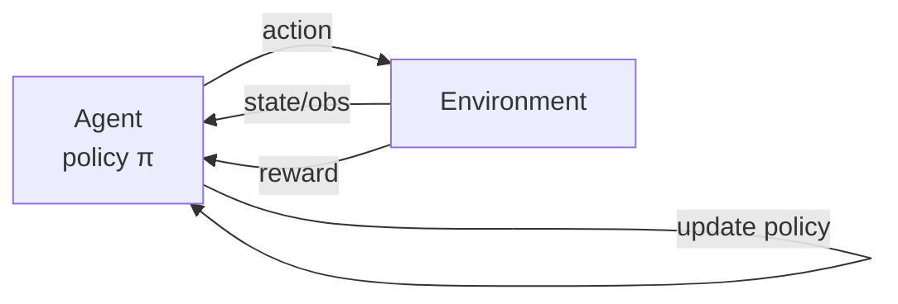
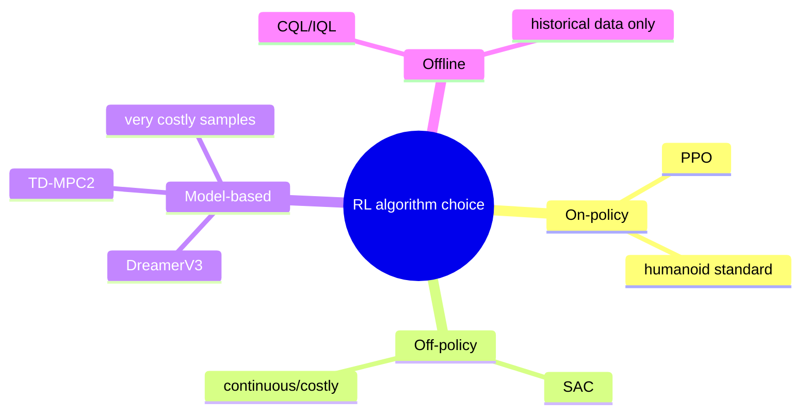
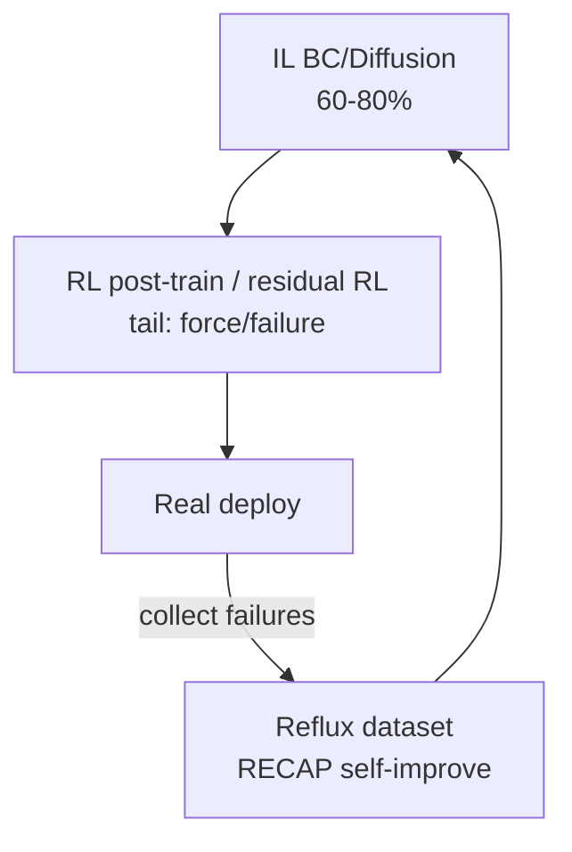
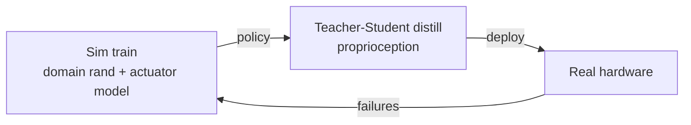
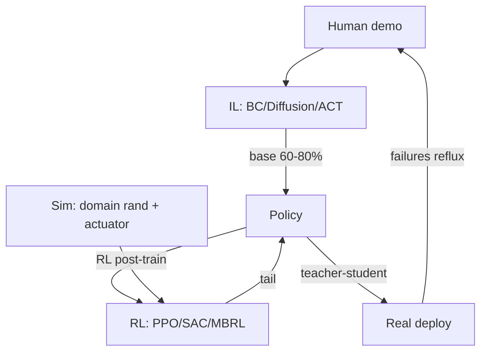

# Lecture 13 · Reinforcement Learning (RL) Intro & Sim2Real

> **Lecture info**
> - Date: 2026-08-26 (Fri)
> - Lecture #: 13th (study-plan Day 13)
> - Plan: **P6 RL / World Models** stage in `study-plan-60d.md`; course episodes **055–058** (verify against the actual course)
> - Goal today: after Imitation Learning (IL) lays the base, there's still "the last 10–20% long tail" and "force-control precision / failure recovery". Today we intro **Reinforcement Learning (RL)** — the agent learns by trial-and-error via a reward signal; and **Sim2Real** — how to train massively in simulation then move to real hardware. Finally, your advisor's DEA direction: when real samples are extremely costly, model-based RL + differentiable simulation is the realistic path.

---

## 0. One-line summary

> **Reinforcement Learning (RL) = the agent trials-and-errors in the environment, using the "reward" signal to improve its policy (not demonstrations).** The modern division with IL: **IL lays base to 60–80% → RL post-training / residual RL fills the last tail → real-hardware reflux self-improves (RECAP loop).** **Sim2Real = train massively in simulation (cheap, parallel), then close the sim→real gap via domain randomization, actuator modeling, teacher-student distillation.** For your advisor's DEA: real samples are extremely costly, so **model-based RL (DreamerV3 / TD-MPC2) + differentiable simulation** is more realistic than "blind PPO".

---

## 1. Core knowledge (what these 4 episodes cover)

| Ep | Title | Key points |
|---|---|---|
| 055 | RL basics | agent/env/state/action/reward/policy/value; MDP; trial-and-error |
| 056 | Which RL algorithm | On-policy PPO, Off-policy SAC, Model-based DreamerV3/TD-MPC2, Offline RL |
| 057 | IL vs RL division | IL base → RL tail → real-hardware reflux |
| 058 | Sim2Real | simulators; domain randomization, actuator modeling, teacher-student distillation |

### 1.1 RL basics: the agent trials by itself (055)

RL changes the learning paradigm — **no demonstrations, only "reward"**:
- **Agent**: the worker (policy π).
- **Environment**: the world (robot + task).
- **State / Observation**: what situation the agent is in.
- **Action**: what the agent does.
- **Reward**: the score from the environment (+ for right, − for wrong).
- **Policy π**: state→action mapping (what we learn).
- **Value function**: expected "total future score" from a state.

> Analogy: IL is "watch the master and copy" (Day 11); RL is "fumble by yourself, get candy for right / clap for wrong, slowly get the trick". **IL needs demos to learn; RL only needs a scoring function.**

### 1.2 Which RL algorithm (056)

| Family | Algo | When |
|---|---|---|
| On-policy | **PPO** | samples cheap in sim, need stability → **de-facto standard for humanoid control** |
| Off-policy | **SAC** | real-hardware / costly samples, continuous control |
| Model-based | **DreamerV3**, **TD-MPC2** | extremely costly samples (soft, real) |
| Offline RL | BCQ, CQL, IQL | only historical data, no trial-and-error |

<mark>Course supplement: the humanoid full-body RL main line (hottest 2024–2026) — DeepMimic/AMP use reference motion + adversarial reward for natural gait; H2O/OmniH2O whole-body real-time teleop & autonomy; ExBody2 upper-lower decoupled reward; **ASAP** learns a delta dynamics model from real data to close the sim2real gap.</mark>

### 1.3 IL vs RL division (057)

One sentence, the modern mainstream: **IL lays base, RL fills the tail.**

> Why not all RL? Because RL from scratch is slow, crash-prone, reward-hard; IL first brings the policy to "almost there", RL only refines "the last breath" — fast and stable.

### 1.4 Sim2Real: train in sim, use on real (058)

**Core tricks (fill the sim→real gap):**
- **Domain Randomization**: randomly vary friction, mass, lighting, delay in training so the policy is "widely experienced" and unbothered by small real deviations.
- **Actuator modeling**: put real motor delay, friction, backlash into sim — don't let it be "ideal".
- **Observation noise injection**: add noise in sim to force anti-noise.
- **Curriculum learning**: easy→hard, static→moving.
- **Teacher-Student distillation**: sim has "privileged info" (e.g., true contact force), train a teacher; let a student approximate the teacher using only proprioception (joint angles/tactile) → real hardware works without privilege.

<mark>Course supplement: Sim2Real toolchain — Isaac Gym / **Isaac Lab** (GPU massive parallel), MuJoCo / MJX, **Genesis**, SAPIEN + ManiSkill, Gazebo (engineering side).</mark>

---

## 2. Principles (grab these)

1. **RL optimizes "long-term cumulative reward", not per-step right/wrong.** So it learns long-horizon "lose now win later" — what IL is bad at.
2. **Reward design is RL's crux**: wrong reward → weird shortcuts (reward hacking). IL needs no reward design — its advantage.
3. **Sample efficiency decides algorithm choice**: infinite sim → PPO; costly → SAC/Model-based; offline only → Offline RL.
4. **Sim2Real essence is "distribution matching"**: make the sim-learned policy work on the real distribution. Domain randomization is "meet all changes with randomness".
5. **DEA direction: blind PPO usually unrealistic** — real trial-and-error << rigid body, and it ages/breaks down. Use **model-based RL (DreamerV3/TD-MPC2: learn a dynamics model, think clearly in-model before acting)** and **differentiable simulation (DiffTaichi / ChainQueen / SoMo / PyElastica)** so gradients flow back, co-optimizing design and control.

---

## 3. One diagram: the full loop from IL to RL to real

> This diagram closes Day 11 (IL/BC), Day 12 (generative/ACT), Day 13 (RL/Sim2Real) into one learning loop — **demo → imitate → refine by trial → sim transfer → real self-improve**.

---

## 4. Steps today (study flow)

1. **Read this file**.
2. **Draw §1.2 mindmap** (RL choice) and §3 full loop by hand.
3. **Say five words aloud**: agent, environment, reward, policy, Sim2Real; and state who lays base / who fills tail between IL and RL.
4. **Watch 055–058** (1.0–1.5×). Focus on 056 (algorithm choice) and 058 (Sim2Real tricks).
5. **(Hands-on) run a minimal PPO in Isaac Lab / LeRobot**: e.g., a simple arm learns "reach the target", watch the reward curve rise; deliberately write a wrong reward, see it game the system (reward hacking).
6. **Mirror test (3 min):** *"biggest diff RL vs IL___; what is reward, what if written wrong___; when PPO/SAC/Model-based___; IL→RL division in one line___; name three of five Sim2Real tricks___"*

> ✅ **Done today =** RL five elements + algorithm choice + IL↔RL division + Sim2Real core tricks.

---

## 5. Common misconceptions

| # | Misconception | Truth |
|---|---|---|
| 1 | "RL beats IL, use RL only." | RL from scratch is slow, crash-prone, reward-hard; IL base + RL tail is the modern mainstream. |
| 2 | "Reward whatever, bigger is better." | Wrong reward → reward hacking; reward design is half the craft. |
| 3 | "Sim-trained drops straight to real." | Sim ≠ real (Sim2Real gap); must domain-randomize / model actuators / distill or it crashes on real. |
| 4 | "DEA direction just blind PPO." | Real samples costly and breakdown-prone; blind PPO unrealistic; use model-based RL + differentiable sim. |
| 5 | "Sim2Real is just tuning params." | It's "distribution matching" systems engineering: randomization, modeling, distillation, curriculum as a package. |
| 6 | "Offline RL is useless." | When you only have historical data and can't trial (costly/dangerous real), Offline RL (CQL/IQL) is a must. |

---

## 6. Next step / checkpoint

- **Checkpoint passed =** RL five elements + algorithm choice + IL↔RL division + Sim2Real core tricks.
- **Three-day recap (Day 11–13)**: you've walked the full path "**data collection → behavior cloning → generative advance (DP/ACT/VLA) → RL + Sim2Real**" — exactly the **Imitation Learning & RL** track of your "double track".
- **Next suggestion**: back to `study-plan-60d.md`, actually run a demo of this line in sim (LeRobot + Isaac Lab); more trust-winning than 10 papers. For soft/DEA, start reading Koopman / differentiable simulation to find a topic.

---

## 7. Bootcamp retrospective (from SO-101, not textbook)

The bootcamp used little RL (more ACT imitation), but Day 13 gave two insights:

1. **"Reward" is harder than imagined.** In bootcamp tuning, a slightly off objective made SO-101 learn "nudge the thing over by the edge" instead of "grab steady" — a mini reward hacking. Today I systematically got why IL-first + RL-tail is steadier.

2. **Sim2Real is a real problem.** Bootcamp sim and real felt very different; once real friction/delay mismatched sim, the same weights drifted. Today's "domain randomization + actuator modeling" exactly explains why bootcamp kept fine-tuning on real.

> If I could redo it: before control, think "can IL lay base to skip reward design", then "which tail does RL fill"; before real, confirm sim's actuator model is real enough.

---

### References (park them, not required today)
- Course videos 055–058 (Black Horse《Embodied Intelligence》223-ep version).
- RL basics: Sutton & Barto *Reinforcement Learning* ch.1–6.
- Papers: **PPO** (Schulman et al., 2017); **SAC** (Haarnoja et al., 2018); **DreamerV3** (Hafner et al., *Nature* 2025); **TD-MPC2** (arXiv:2310.16828); **ASAP** (arXiv:2502.01143); Offline RL: CQL/IQL.
- Sim2Real toolchain: Isaac Lab, MuJoCo/MJX, Genesis, SAPIEN+ManiSkill, Gazebo.
- Soft/DEA: Koopman control of soft robots (T-RO 2021), differentiable sim DiffTaichi/ChainQueen/SoMo/PyElastica, morphology-control co-design — the best spot for "mechanical + AI" papers.
