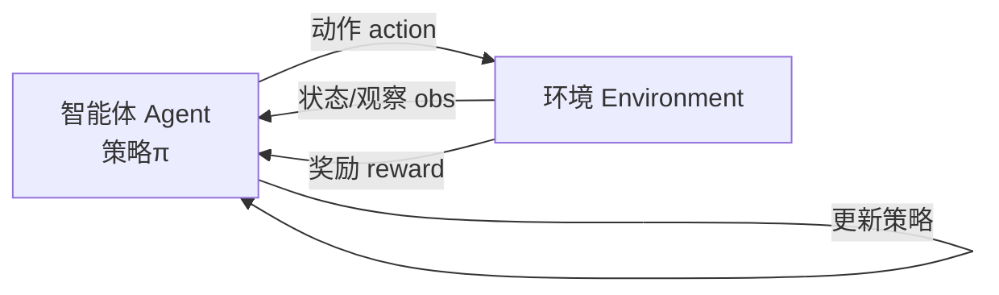
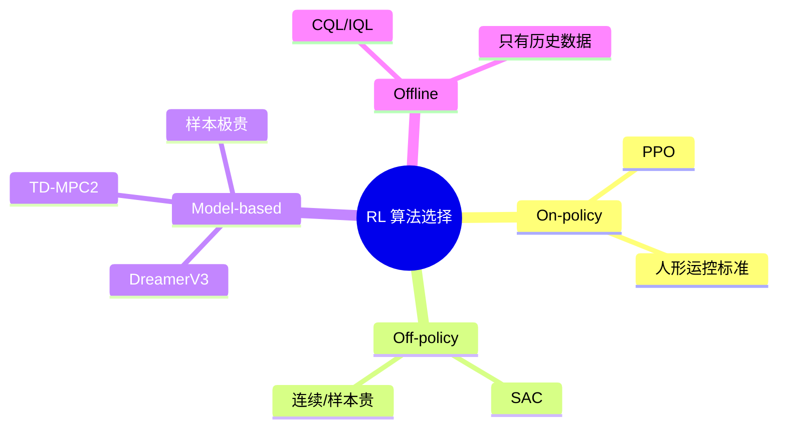
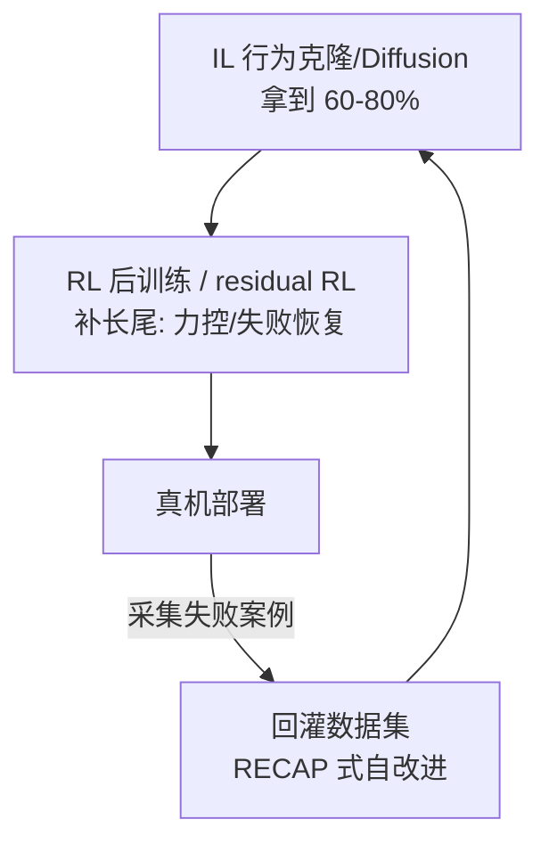
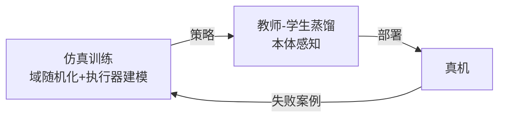
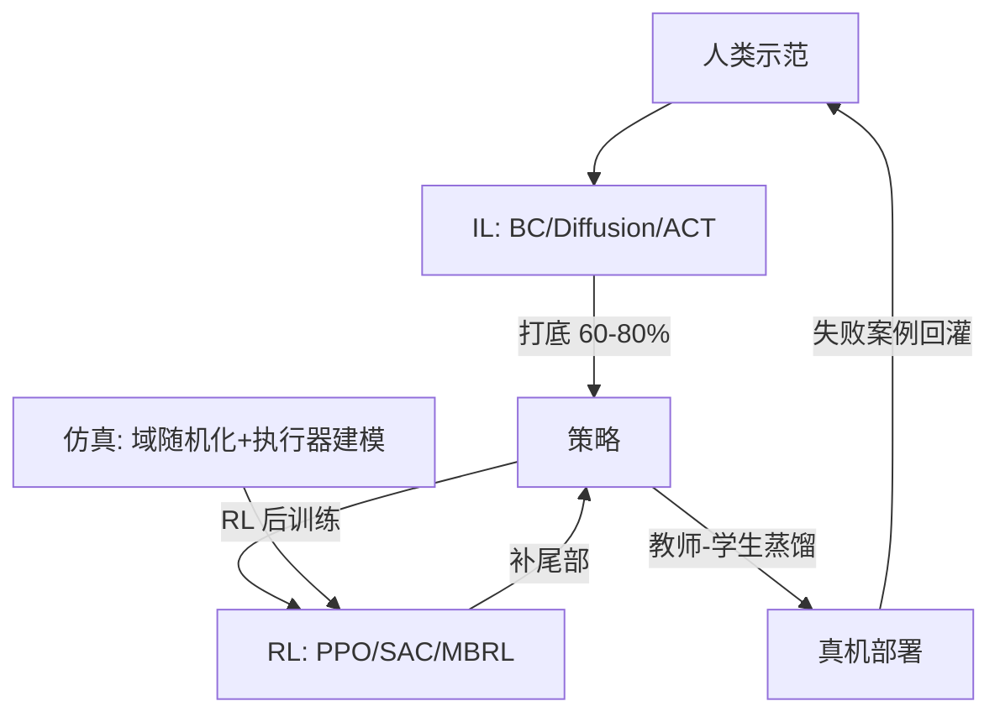

# 第十三讲 · 强化学习入门（RL）与 Sim2Real（仿真到现实）

> **本讲信息**
> - 日期：2026-08-26（周五）
> - 第几讲：第十三讲（学习计划 Day 13）
> - 对应计划：`study-plan-60d.md` 里 **P6 强化学习 / 世界模型** 阶段，课程集号 **055–058**（以实际课程为准）
> - 今日目标：模仿学习（IL）打底后，还差“最后 10–20% 长尾”和“力控精度 / 失败恢复”。今天入门**强化学习 RL**——智能体自己试错拿奖励学策略；并学 **Sim2Real**：怎么在仿真里海量练、再搬到真机。最后落到你导师 DEA 方向：样本极贵时，model-based RL + 可微仿真才是正解。

---

## 0. 一句话总结

> **强化学习（RL）＝智能体在环境里自己试错，靠“奖励”信号把策略越练越好（而不是靠示范）。** 和 IL 的现代分工是：**IL 打底拿 60–80% 成功率 → RL 后训练 / residual RL 补最后长尾 → 真机回灌自改进（RECAP 闭环）。** **Sim2Real＝先在仿真里海量练（便宜、可并行），再用域随机化、执行器建模、教师-学生蒸馏把“仿真→真机”的差距填平。** 对你导师的 DEA：真机样本极贵，**model-based RL（DreamerV3 / TD-MPC2）+ 可微仿真**是比“直接 PPO 硬莽”更现实的路。

---

## 1. 核心知识点（这 4 节在讲啥）

| 集号 | 标题 | 要点 |
|---|---|---|
| 055 | RL 基础概念 | 智能体/环境/状态/动作/奖励/策略/价值；MDP；试错学习 |
| 056 | RL 算法怎么选 | On-policy PPO、Off-policy SAC、Model-based DreamerV3/TD-MPC2、Offline RL |
| 057 | IL 与 RL 的分工 | IL 打底 → RL 补尾部 → 真机回灌自改进 |
| 058 | Sim2Real 仿真到现实 | 仿真器；域随机化、执行器建模、教师-学生蒸馏 |

### 1.1 RL 基础：智能体自己试错（055）

RL 换个学习范式——**没有示范，只有“奖励”**：
- **智能体 Agent**：干活的（策略 π）。
- **环境 Environment**：世界（机器人+任务）。
- **状态 State / 观察 Observation**：Agent 当前身处啥情况。
- **动作 Action**：Agent 出的招。
- **奖励 Reward**：环境给的分（做对了+，做错了−）。
- **策略 Policy π**：状态→动作的映射（要学的东西）。
- **价值函数 Value**：某个状态“将来能拿多少总分”的预期。

> 类比：IL 是“看师傅做、照抄”（Day 11）；RL 是“自己瞎试，做对给糖、做错拍手，慢慢悟出套路”。**IL 要有示范才学；RL 只要能打分就能学。**

### 1.2 RL 算法怎么选（056）

| 类别 | 算法 | 何时用 |
|---|---|---|
| On-policy | **PPO** | 仿真里样本便宜、要稳 → **人形运控事实标准** |
| Off-policy | **SAC** | 真机/样本贵、连续控制 |
| Model-based | **DreamerV3**、**TD-MPC2** | 样本极贵（软体、真机） |
| Offline RL | BCQ、CQL、IQL | 只有历史数据、不能试错 |

<mark>课件补充：人形与全身控制的 RL 主线（2024–2026 最热）——DeepMimic/AMP 用参考动作+对抗奖励做自然步态；H2O/OmniH2O 全身实时遥操作与自主；ExBody2 上下身解耦奖励；**ASAP** 用真机数据学 delta 动力学模型闭合 sim2real 差。</mark>

### 1.3 IL 与 RL 的分工（057）

现代主流答案一句话：**IL 打底，RL 补尾部。**

> 为什么不全用 RL？因为 RL 从零试错极慢、易崩、奖励难设计；IL 先用示范把策略带到“差不多”，RL 只在“差一口气”的地方精修，又快又稳。

### 1.4 Sim2Real：仿真练、真机用（058）

**核心技巧（填仿真→真机的沟）：**
- **域随机化 Domain Randomization**：训练时随机改摩擦、质量、光照、延迟，让策略“见多识广”，真机一点偏差也不怕。
- **执行器建模**：把真实电机的延迟、摩擦、齿隙写进仿真，别让它“理想化”。
- **观测噪声注入**：仿真里加噪声，逼策略抗噪。
- **课程学习 Curriculum**：从易到难，先静止再运动。
- **教师-学生蒸馏 Teacher-Student**：仿真里有“特权信息”（如真实接触力），训个教师；让学生只靠本体感知（关节角/触觉）逼近教师 → 真机无特权也能用。

<mark>课件补充：Sim2Real 工具链——Isaac Gym / **Isaac Lab**（GPU 大规模并行）、MuJoCo / MJX、**Genesis**、SAPIEN + ManiSkill、Gazebo（工程侧）。</mark>

---

## 2. 原理（先抓这几条）

1. **RL 优化的是“长期累计奖励”，不是单步对错。** 所以它能学“先吃亏后受益”的long-horizon 策略——这是 IL 不擅长的。
2. **奖励设计是 RL 的命门**：奖励写错，学出歪门邪道（reward hacking）。IL 不用设计奖励，这是它的优势。
3. **样本效率决定算法选型**：能无限仿真→PPO；样本贵→SAC/Model-based；只有离线数据→Offline RL。
4. **Sim2Real 的本质是“分布匹配”**：让仿真里学到的策略在真机分布上也work。域随机化是“以随机应万变”。
5. **DEA 方向：直接 PPO 硬莽通常不现实**——真机试错次数远小于刚体，且会老化/击穿。要用 **model-based RL（DreamerV3/TD-MPC2 思路：学一个动力学模型，在模型里想清楚再动）** 和 **可微仿真（DiffTaichi / ChainQueen / SoMo / PyElastica）**，让梯度能回传，设计与控制协同优化。

---

## 3. 一张图：从 IL 到 RL 到真机的完整闭环

> 这张图把 Day 11（IL/BC）、Day 12（生成式/ACT）、Day 13（RL/Sim2Real）收成一条完整学习闭环——**示范→模仿→试错精修→仿真迁移→真机自改进**。

---

## 4. 今天的操作步骤（学习流程）

1. **读一遍本文件**。
2. **徒手画 §1.2 的 mindmap**（RL 算法选择）和 §3 的完整闭环。
3. **口头讲清五个词**：智能体、环境、奖励、策略、Sim2Real；并说清 IL 和 RL 谁打底、谁补尾部。
4. **对照课程看 055–058**（1.0–1.5×）。重点看 056（算法选择）和 058（Sim2Real 技巧）。
5. **（动手）Isaac Lab / LeRobot 里跑一个最小 PPO**：比如让一个简单臂学“走到目标点”，看奖励曲线怎么涨；故意把奖励写错，看它怎么钻空子（reward hacking）。
6. **镜子测试（3 分钟）：** *“RL 和 IL 最大区别___；奖励是啥、奖励写错会怎样___；PPO/SAC/Model-based 各啥时候用___；IL→RL 分工一句话___；Sim2Real 五个技巧举三个___。”*

> ✅ **今天“做完”的标准：** 讲清 RL 五要素 + 算法选择 + IL↔RL 分工 + Sim2Real 核心技巧。

---

## 5. 常见误区 & 容易踩的坑

| # | 误区 | 真相 |
|---|---|---|
| 1 | “RL 比 IL 强，全用 RL。” | RL 从零试错慢、易崩、奖励难写；IL 打底 + RL 补尾部才是现代主流。 |
| 2 | “奖励随便写，越大越好。” | 奖励写错会 reward hacking（钻空子）；奖励设计是 RL 一半的功力。 |
| 3 | “仿真练好就能直接上真机。” | 仿真≠真机（Sim2Real 差）；必须域随机化/执行器建模/蒸馏，否则真机翻车。 |
| 4 | “DEA 方向直接 PPO 硬莽。” | 真机样本极贵且会击穿，直接 PPO 不现实；用 model-based RL + 可微仿真。 |
| 5 | “Sim2Real 只是调参数。” | 它是“分布匹配”系统工程：随机化、建模、蒸馏、课程学习成套上。 |
| 6 | “Offline RL 没用。” | 当你只有历史数据不能试错（真机贵/危险），Offline RL（CQL/IQL）是刚需。 |

---

## 6. 下一步 / 检查点

- **过了检查点 =** RL 五要素 + 算法选择 + IL↔RL 分工 + Sim2Real 核心技巧。
- **三天小结（Day 11–13）**：你已经走完“**数据采集 → 行为克隆 → 生成式进阶（DP/ACT/VLA） → 强化学习 + Sim2Real**”这条模仿学习到强化学习的完整路径，正是你“双轨”里的**模仿学习与强化学习**那一轨。
- **下一步建议**：回到 `study-plan-60d.md`，把这条线在仿真里真跑一个 demo（LeRobot + Isaac Lab），比读 10 篇论文更让导师信任；软体/DEA 方向可开始看 Koopman / 可微仿真，找选题。

---

## 7. 训练营实操回顾（来自 SO-101，不是课本）

训练营里 RL 用得少（更多是 ACT 模仿），但 Day 13 给我两个启发：

1. **“奖励”比想象中难。** 训练营调参时，目标函数稍微偏一点，SO-101 就学会“蹭着边把东西推过去”而不是“稳稳抓”——这就是 mini reward hacking。今天才系统理解为啥 IL 先用示范、RL 只补尾部更稳。

2. **Sim2Real 是真问题。** 训练营的 sim 和真机手感差很多；一旦真机摩擦/延迟和 sim 不一致，同一套权重就飘。今天学的“域随机化 + 执行器建模”正好解释了为什么训练营要反复在真机上微调。

> 让我重来一次：以后做控制，先想“能不能用 IL 打底省掉奖励设计”，再想“RL 补哪段尾部”；上真机前先确认 sim 的执行器模型够真。

---

### 参考资料（先放着，今天不要求）
- 课程视频 055–058（黑马程序员《具身智能》223 节版）。
- RL 基础：Sutton & Barto《Reinforcement Learning》前 6 章。
- 论文：**PPO**（Schulman et al., 2017）；**SAC**（Haarnoja et al., 2018）；**DreamerV3**（Hafner et al., *Nature* 2025）；**TD-MPC2**（arXiv:2310.16828）；**ASAP**（arXiv:2502.01143）；Offline RL: CQL/IQL。
- Sim2Real 工具链：Isaac Lab、MuJoCo/MJX、Genesis、SAPIEN+ManiSkill、Gazebo。
- 软体/DEA 侧：Koopman 控制软体（T-RO 2021）、可微仿真 DiffTaichi/ChainQueen/SoMo/PyElastica、形态-控制协同设计（co-design）——最适合“机械+AI”背景发论文的位置。
