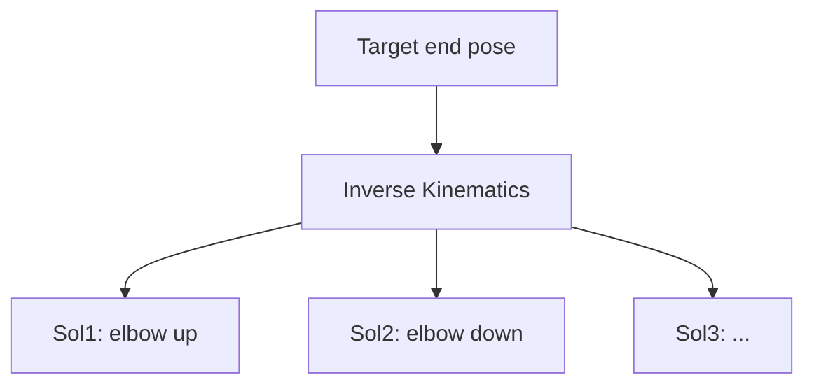

# Lecture 14 — Inverse Kinematics: Multiplicity & Other Difficulties

> **Meta**
> - Date: 2026-08-27 (Wednesday)
> - Lecture / Day: Lecture 14 — Day 14 of the study plan
> - Plan anchor: `study-plan-60d.md` → **P5 Kinematics (IK)**, course episodes **057–059**
> - Goal of today: IK = given end target pose, solve joint angles; focus on WHY IK is **multi-solution**, plus singularities / joint limits / no-solution pitfalls. Builds on Day 13 FK matrices.

---

## 0. One-line summary

> **FK is unique (angles → one end); IK is multi-solution (end → several angle sets)**; IK's trouble isn't only multiplicity — there are also singularities (Jacobian degenerates, can't move), joint limits (solution out of range), and no-solution (unreachable).

---

## 1. Core knowledge (against 057–059)

### 1.1 057 Verify rotation-translation matrix in code
- Verify Day 13's FK matrix actually computes coordinates right (confirm FK before IK).

### 1.2 058 IK multiplicity
- IK = given end target pose, solve joint angles.
- **Usually multi-solution**: same end, arm can reach with "elbow up" / "elbow down" etc.
- Source of multiplicity: redundant DOF, symmetric configurations.

### 1.3 059 Other IK difficulties
- **Singularity**: Jacobian degenerates, one direction suddenly "can't move".
- **Joint limit**: solved angle exceeds hardware range.
- **No solution**: target is simply out of reach.

---

## 2. Principles to internalize

1. **FK unique, IK multi**: forward is a function; inverse is generally non-injective.
2. **Multi-solution needs selection**: by obstacle avoidance / comfort / energy.
3. **Three hard cases**: singularity, limit, no-solution.

---

## 3. One diagram: IK multiplicity

---

## 4. Today's operation steps

1. **Verify FK matrix in code** (confirm Day 13 is right).
2. **Explain "why IK is multi-solution" with geometry** (draw two poses).
3. **Explain out loud**: FK vs IK, why IK multi-solves, singularity / limit / no-solution.
4. **(Later)** run an IK solver and see which solution it picks by default.
5. **Mirror test (3 min):** *"FK vs IK ___; why is IK multi-solution ___; what are singularity / limit / no-solution ___".*

> ✅ **Definition of "done today":** explain FK/IK difference + IK multiplicity cause + three hard cases + pass mirror test.

---

## 5. Common misconceptions & easy mistakes

| # | Misconception | Reality |
|---|---|---|
| 1 | IK has one solution | Usually multi; must choose |
| 2 | Greedily take first solution | May pose weirdly or hit itself |
| 3 | Ignore joint limits | Solved angle may exceed hardware range |

---

## 6. DEA cross-link (light, not the main line)

- Rigid-arm IK solves multiplicity in "discrete angle space"; **soft / DEA arm IK solution space is a continuous deformation function space**, harder to enumerate "multi-solutions" — usually an optimizer / data-driven method finds one feasible shape (ties to Day 17 soft modeling). So soft arm's "IK" is essentially a shape-optimization problem.

---

## 7. Next steps / checkpoint

- **Checkpoint passed if:** explain FK/IK difference + IK multiplicity cause + three hard cases + pass mirror test.
- **Next lecture (Day 15):** IK solving methods — geometric vs numerical, episodes 060–062.

---

### References (for later, not required today)
- Course episodes 057–059 (B 站《黑马程序员 · 具身智能》).
- (Later) Day 15 geometric/numerical IK, Day 16 keyboard control build on this.