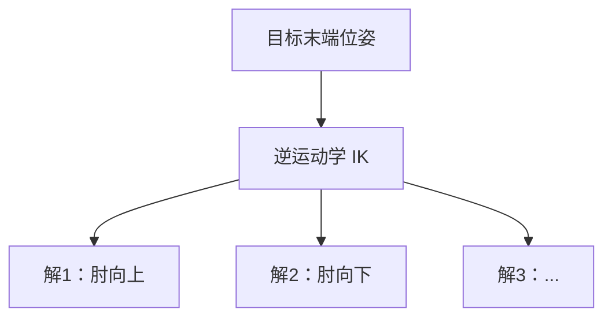

# 第十四讲 · 逆运动学：多解性与其他难题（Inverse Kinematics）

> **本讲信息**
> - 日期：2026-08-27（周三）
> - 第几讲：第十四讲（学习计划 Day 14，P5 运动学）
> - 对应计划：`study-plan-60d.md` → **P5 运动学（逆解 IK）**，课程集号 **057–059**
> - 今日目标：理解「逆运动学」= 给定末端目标位姿反求关节角；重点搞懂 IK 为什么**多解**，以及奇异点 / 关节限位 / 无解这些坑。接 Day 13 的正解矩阵。

---

## 0. 一句话总结

> **正解 FK 唯一（给角得唯一末端），逆解 IK 多解（给末端可能多个角组合）**；IK 的麻烦不止多解——还有奇异点（雅可比退化动不了）、关节限位（解超范围）、无解（够不到）。

---

## 1. 核心知识点（对照 057–059）

### 1.1 057 旋转平移矩阵的代码验证
- 用代码验证 Day 13 的正解矩阵确实把坐标算对（先确认 FK 没错，再谈 IK）。

### 1.2 058 逆运动学多解性
- IK = 给定末端目标位姿，反求各关节角。
- **通常多解**：同一个末端，臂可以「肘向上」「肘向下」等多种姿势都到达。
- 多解来源：冗余自由度、对称构型。

### 1.3 059 逆运动学的其他难题
- **奇异点（singularity）**：雅可比矩阵退化，某一方向突然「动不了」。
- **关节限位**：算出的角超出硬件范围。
- **无解**：目标点臂根本够不到。

---

## 2. 原理（先抓这几条）

1. **FK 唯一，IK 多解**：正问题是函数，反问题一般非单射。
2. **多解要选**：选哪个解取决于避障 / 舒适 / 能耗。
3. **三类硬伤**：奇异点、限位、无解。

---

## 3. 一张图：IK 多解

---

## 4. 今天的操作步骤

1. **代码验证正解矩阵**（确认 Day 13 没错）。
2. **用几何直觉解释「为什么 IK 有多解」**（画两种姿势）。
3. **口头讲清**：FK vs IK、IK 为什么多解、奇异点 / 限位 / 无解。
4. **（以后）** 跑一个 IK 求解器看它默认选哪个解。
5. **镜子测试（3 分钟）：** *「FK vs IK___；IK 为什么多解___；奇异点 / 限位 / 无解分别是什么___。」*

> ✅ **今天「做完」的标准：** 讲清 FK/IK 区别 + IK 多解原因 + 三类难题 + 过镜子测试。

---

## 5. 常见误区 & 容易踩的坑

| # | 误区 | 真相 |
|---|---|---|
| 1 | IK 只有一个解 | 通常多解，要选 |
| 2 | 贪心选第一个解 | 可能姿势怪异甚至撞自身 |
| 3 | 忽略关节限位 | 解出的角可能超硬件范围 |

---

## 6. DEA 交叉链接（轻量，非主线）

- 刚性臂 IK 在「离散角空间」里求多解；**软体 / DEA 臂的 IK 解空间是连续形变函数空间**，更难枚举「多解」——往往用优化 / 数据驱动求一个可行形变（接 Day 17 软体建模）。所以软体臂的「逆运动学」本质是形状优化问题。

---

## 7. 下一步 / 检查点

- **过了检查点 =** 讲清 FK/IK 区别 + IK 多解原因 + 三类难题 + 过镜子测试。
- **下一讲（Day 15）：** 逆解求解方法——几何法 vs 数值法，课程集号 060–062。

---

### 参考资料（先放着，今天不要求）
- 课程集号 057–059（B 站《黑马程序员 · 具身智能》）。
- （后续）Day 15 几何法/数值法 IK、Day 16 键盘控制都建立在本讲之上。
