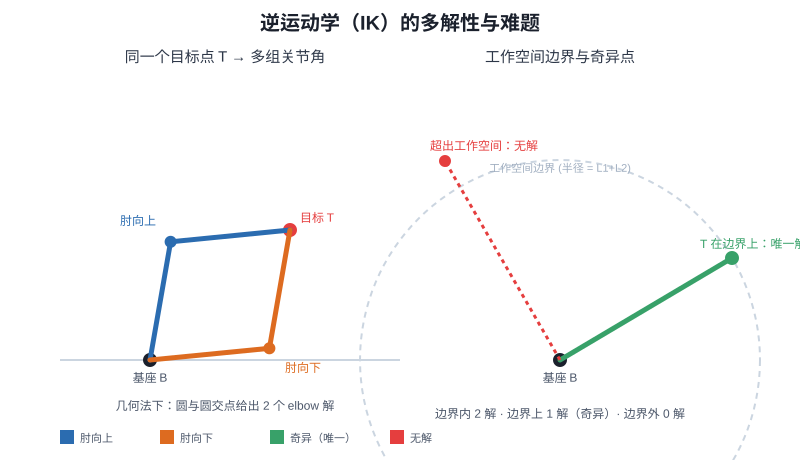

# 第十四讲 · 逆运动学：多解性与其他难题（Inverse Kinematics）

> **本讲信息**
> - 日期：2026-08-27（周四）
> - 第几讲：第十四讲（学习计划 Day 14，P5 运动学）
> - 对应计划：`study-plan-60d.md` → **P5 运动学（逆解 IK）**，课程集号 **057–059**
> - 今日目标：理解「逆运动学」= 给定末端目标位姿反求关节角；重点搞懂 IK 为什么**多解**，以及奇异点 / 关节限位 / 无解这些坑。接 Day 13 的正解矩阵。

---

## 0. 一句话总结

> **正解 FK 唯一（给角得唯一末端），逆解 IK 多解（给末端可能多个角组合）**；IK 的麻烦不止多解——还有奇异点（雅可比退化动不了）、关节限位（解超范围）、无解（够不到）。我踩过最痛的坑：**以为 IK 像 FK 一样有唯一答案，结果同一目标点臂能摆出好几种姿势**。

---

## 1. 核心知识点（对照 057–059）

### 1.1 057 旋转平移矩阵的代码验证
- 用代码验证 Day 13 的正解矩阵确实把坐标算对（先确认 FK 没错，再谈 IK）。
- 我的做法：写个 Python 函数，输入 θ1、θ2 输出 (x, y)，再拿 §2.2 的闭式解对拍，两边一致才放心。

### 1.2 058 逆运动学多解性
- IK = 给定末端目标位姿，反求各关节角。
- **通常多解**：同一个末端，臂可以「肘向上」「肘向下」等多种姿势都到达（见 §2.2）。
- 多解来源：冗余自由度、对称构型。

### 1.3 059 逆运动学的其他难题
- **奇异点（singularity）**：雅可比矩阵退化，某一方向突然「动不了」（典型：臂完全伸直时，径向推不动）。
- **关节限位**：算出的角超出硬件范围（舵机只有 ±120° 之类）。
- **无解**：目标点臂根本够不到（超出工作空间）。

---

## 2. 原理：两级平面 IK 的闭式解（几何法）

### 2.1 为什么 IK 多解：圆与圆相交
把「末端在距基座 r 的圆上」和「肘点在距基座 L1、距末端 L2 的两个圆上」一交，肘点一般有两个交点 → 两个解（肘向上 / 肘向下）。这就是多解的来源。

### 2.2 两级连杆的解析 IK 公式（我手推 + 代码验证过）
设目标 (x, y)，杆长 L1、L2，基座在原点。先算到目标距离平方 `r² = x² + y²`。
- **可达性检查**：必须满足 `|L1−L2| ≤ r ≤ L1+L2`；否则无解（够不到）或退化。
- 由余弦定理求 θ2：
  `cosθ2 = (x² + y² − L1² − L2²) / (2·L1·L2)`
  `θ2 = atan2( ±√(1 − cos²θ2), cosθ2 )`
  这里的 **± 就是肘向上 / 肘向下两个解**。
- 再求 θ1（β 是目标相对基座的方位角，γ 是第二段造成的偏角）：
  `β = atan2(y, x)`
  `γ = atan2(L2·sinθ2, L1 + L2·cosθ2)`
  `θ1 = β − γ`

> 直觉：先定「末端相对基座朝哪（β）」，再扣掉「第二段连杆把末端往回掰的那个偏角（γ）」，就是第一段该转的角度。atan2 自动处理象限，不用自己判符号。

下面这张图把「同一目标 → 两解」「工作空间边界 → 奇异/无解」都画出来了，GitHub 直接能渲染：

---

## 3. 今天的操作步骤

1. **代码验证正解矩阵**（确认 Day 13 没错）。
2. **手推上面的两级 IK 公式**，并用 Python 实现：输入 (x, y) 输出两套 (θ1, θ2)，再喂回 FK 验证能回到 (x, y)。
3. **口头讲清**：FK vs IK、IK 为什么多解、奇异点 / 限位 / 无解。
4. **（以后）** 跑一个 IK 求解器看它默认选哪个解（通常择优中选「离当前姿态最近」的那个）。
5. **镜子测试（3 分钟）：** *「FK vs IK___；IK 为什么多解___；奇异点 / 限位 / 无解分别是什么___；两级 IK 的 θ2 怎么求___。」*

> ✅ **今天「做完」的标准：** 讲清 FK/IK 区别 + IK 多解原因 + 三类难题 + 能默推两级 IK 公式 + 过镜子测试。

---

## 4. 常见误区 & 容易踩的坑

| # | 误区 | 真相 |
|---|---|---|
| 1 | IK 只有一个解 | 通常多解（肘上/肘下），要选 |
| 2 | 贪心选第一个解 | 可能姿势怪异甚至撞自身 / 超限位 |
| 3 | 忽略关节限位 | 解出的角可能超硬件范围（舵机 ±120° 等） |
| 4 | 不顾可达性直接算 | r 超出 [|L1−L2|, L1+L2] 时本就无解，要先判 |

---

## 5. DEA 交叉链接（轻量，非主线）

- 刚性臂 IK 在「离散角空间」里求多解；**软体 / DEA 臂的 IK 解空间是连续形变函数空间**，更难枚举「多解」——往往用优化 / 数据驱动求一个可行形变（接 Day 17 软体建模）。所以软体臂的「逆运动学」本质是形状优化问题。

---

## 6. 下一步 / 检查点

- **过了检查点 =** 讲清 FK/IK 区别 + IK 多解原因 + 三类难题 + 能默推两级 IK 公式 + 过镜子测试。
- **下一讲（Day 15）：** 逆解求解方法——几何法 vs 数值法，课程集号 060–062。

---

### 参考资料（先放着，今天不要求）
- 课程集号 057–059（B 站《黑马程序员 · 具身智能》）。
- （后续）Day 15 几何法/数值法 IK、Day 16 键盘控制都建立在本讲之上。
