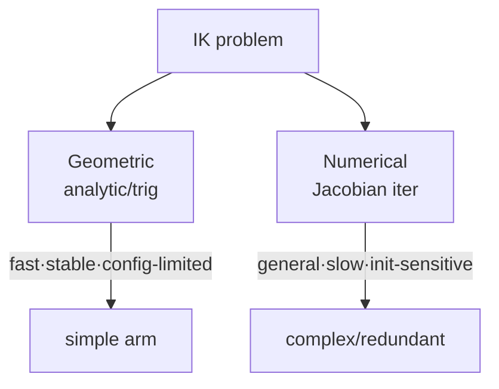

# Lecture 15 — IK Solving Methods: Geometric vs Numerical

> **Meta**
> - Date: 2026-08-28 (Thursday)
> - Lecture / Day: Lecture 15 — Day 15 of the study plan
> - Plan anchor: `study-plan-60d.md` → **P5 Kinematics (IK)**, course episodes **060–062**
> - Goal of today: two IK solvers — geometric (analytic) and numerical (iterative); know each's pros/cons and when to use which. Builds on Day 14 IK multiplicity.

---

## 0. One-line summary

> **Geometric = analytic trig solution** (fast, stable, but only simple configs); **Numerical = Jacobian iteration** (general, but slow, initialization-sensitive, may not converge). Pick by how complex your arm is.

---

## 1. Core knowledge (against 060–062)

### 1.1 060 IK solving methods
- Two families: **geometric (analytic)** and **numerical (iterative)**.

### 1.2 061 Geometric IK code demo
- Write joint angles directly via trig / analytic formulas (e.g. planar 2-link uses law of cosines).
- Pros: fast, stable, no iteration.
- Limit: only specific configs (planar arm, certain 6-axis); complex arms unsolvable.

### 1.3 062 Numerical method pros/cons
- Use **Jacobian pseudoinverse** to iterate toward target (nudge toward error-reduction each step).
- Pros: general, works for almost any config.
- Cons: slow (iterates), bad init may not converge or stuck in local min, numerically unstable near singularity.

---

## 2. Principles to internalize

1. **Geometric = closed form**: one shot.
2. **Numerical = iteration**: converge via Jacobian.
3. **Choice**: geometric for simple configs, numerical for complex / redundant.

---

## 3. One diagram: two solver families

---

## 4. Today's operation steps

1. **Run geometric IK code** (planar 2-link), compare with numerical result.
2. **Explain out loud**: two methods, pros/cons, when to use which.
3. **(Later)** change numerical init, see when it fails to converge.
4. **Mirror test (3 min):** *"Geometric ___; numerical ___; geometric pros/cons ___; numerical pros/cons ___."*

> ✅ **Definition of "done today":** explain two IK solvers + pros/cons + pass mirror test.

---

## 5. Common misconceptions & easy mistakes

| # | Misconception | Reality |
|---|---|---|
| 1 | Numerical is universal | Bad init → no convergence / local min |
| 2 | Geometric solves any arm | Only specific configs; fails on complex arms |
| 3 | IK solution is ready to use | Still must pick a solution (Day 14 multiplicity) |

---

## 6. DEA cross-link (light, not the main line)

- Rigid arms use geometric/numerical IK; **soft / DEA arms have no clean discrete joints, so geometric IK barely applies** — they lean on numerical optimization / data-driven methods for a feasible shape (ties to Day 17 soft modeling). Your direction naturally favors the "numerical + optimization" route.

---

## 7. Next steps / checkpoint

- **Checkpoint passed if:** explain two IK solvers + pros/cons + pass mirror test.
- **Next lecture (Day 16):** IK application & keyboard control — turn IK into "press key, arm moves", episodes 063–067.

---

### References (for later, not required today)
- Course episodes 060–062 (B 站《黑马程序员 · 具身智能》).
- (Later) Day 16 keyboard control, Day 20 teleoperation all build on IK.
