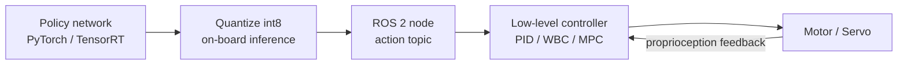
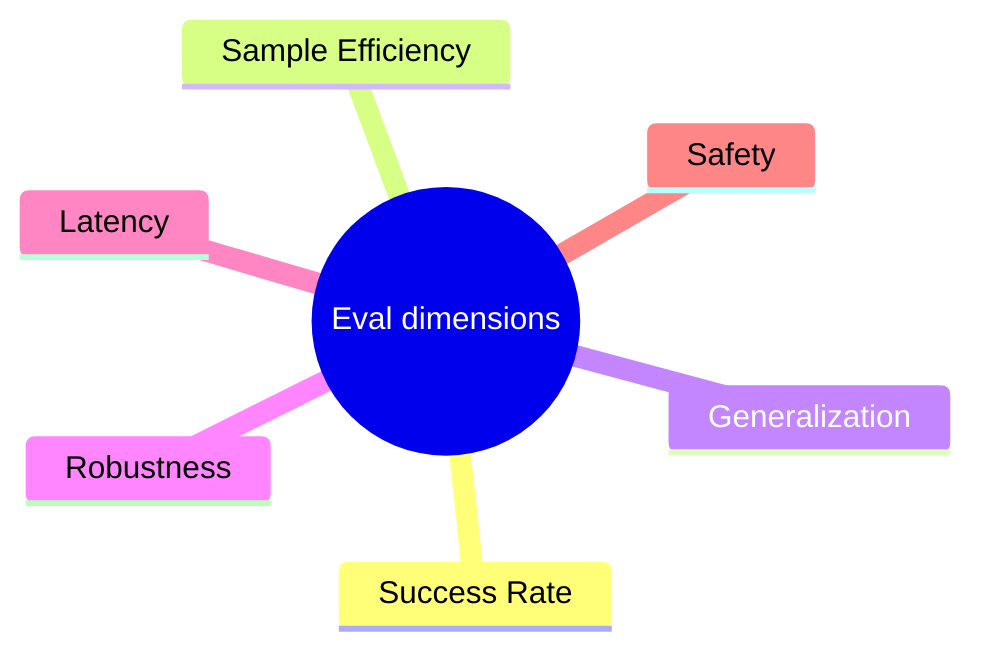

# Lecture 15 — Real-Robot Deployment & Embodied Intelligence Benchmarks

> **Meta**
> - Date: 2026-08-28 (Thursday)
> - Lecture / Day: Lecture 15 — Day 15 of the study plan
> - Plan anchor: `study-plan-60d.md` → **P6 部署与评测 (Deployment & Evaluation)**
> - Goal of today: make Day 13's Sim2Real real — how a trained policy actually gets onto the robot, how it's compressed to run on-board, and how public benchmarks turn "I think it works" into comparable numbers.

---

## 0. One-line summary

> A pretty algorithm is **incomplete if it can't run on the real robot or produce an objective score**. Today we string together a deployment chain: **policy network → quantization (int8) → ROS / real-time control loop → real execution**, and use benchmarks like **RLBench / ManiSkill / AgiBot World / DROID** to turn "can it do it" into comparable digits.

---

## 1. Core knowledge

| Stage | What it does | Pain point |
|---|---|---|
| **Sim2Real landing** | move a sim-trained policy to the real robot (Day 13 principle) | subtle gaps domain randomization missed |
| **Quantization** | float32 → int8, smaller & faster model | slight accuracy drop, needs trade-off |
| **On-board inference** | run on the robot's compute (Jetson, etc.) | limited compute, no room for latency |
| **Real-time control loop** | policy output → low-level controller (PID/WBC) → motor | control frequency must match |

### 1.1 From "model file" to "real-robot action"

> This is the **upper-layer extension** of Day 2's actuator chain: Day 2 was the small loop "command → motor → sensor → controller"; here it's the big loop "policy → ROS → controller → motor", with the two loops nested.

### 1.2 Why quantize (int8)

- Training uses float32 (accurate, memory-heavy); **deploying to edge compute like Jetson / Raspberry Pi, float32 is too slow and heavy**.
- int8 compresses weights from 32 bits to 8 — **~1/4 size, several× speed**, with a usually-acceptable small accuracy drop.
- Tools: TensorRT (NVIDIA), ONNX Runtime, TorchScript.

<mark>**📌 Slide supplement | Latency budget**: robot control is hard-real-time. SO-101, for example, runs at 50–100 Hz, meaning **an action must come out every 10–20 ms**. The total latency of policy + quantization + ROS comms must fit this budget, or the motion "can't keep up" — the robot shakes or even goes unstable. This is why on-board quantization beats cloud inference — one cloud round-trip blows the network latency budget immediately.</mark>

### 1.3 Benchmarks: turn "does it work" into numbers

| Benchmark | Focus | Form |
|---|---|---|
| **RLBench** | tabletop arm tasks (100+ tasks) | mostly sim, real interface |
| **ManiSkill** | large-scale manipulation eval | sim, GPU-parallel |
| **MetaWorld** | multi-task meta-learning | sim |
| **DROID** | real robot manipulation dataset | real data |
| **AgiBot World / RoboMIND** | large-scale real operation | real data (open) |

> Key insight: **a benchmark is not an exam, it's a "ruler"**. A paper claiming "95% success" must state *which* benchmark, *how many* demos, sim or real — otherwise the number is meaningless.

### 1.4 Why soft / DEA deployment is harder

- A rigid arm has clean forward/inverse kinematics; **soft / DEA bodies have no clean inverse solution** — the action space is a "voltage field", state is approximated via vision/capacitance.
- So soft deployment leans harder on **Day 14's world model / differentiable sim** for prediction, and is naturally unfriendly to benchmarks' "precise repetition" — an open research problem in the soft-robotics direction.

---

## 2. Principles

1. **Deployment = turning "research code" into "production-grade real-time system"** — the hard part isn't the algorithm, it's the engineering chain.
2. **Quantization has a cost; measure the error**: always regression-test after compressing, don't let accuracy drop to task failure.
3. **Benchmarks are the field's common language**: unreviewed research can't be compared or trusted.
4. **Soft robotics must build its own ruler**: general benchmarks assume rigid grippers; soft bodies need custom metrics (deformation error, contact-force compliance).

---

## 3. One diagram: embodied-evaluation dimensions

---

## 4. Today's operation steps

1. **Read this file once**.
2. **Hand-draw the §1.1 deployment diagram** (policy → quantization → ROS → controller → motor).
3. **Explain out loud**: why quantize, what latency budget is, why benchmarks matter.
4. **Watch the deployment & benchmark chapters** (1.0–1.5× speed).
5. **Mirror test (3 min):** *"Deployment has which stages ___; why quantize ___; what is latency budget ___; what are benchmarks for, name one ___; why is soft deployment hard ___."*
6. **(Later)** quantize a trained ACT policy with TensorRT and compare pre/post success rate and latency on SO-101.

> ✅ **Definition of "done today":** can explain the deployment chain + latency budget + benchmark meaning + pass the mirror test.

---

## 5. Common misconceptions & easy mistakes

| # | Misconception | Reality |
|---|---|---|
| 1 | "Training the policy finishes the job." | Can't run on real robot, no score = not done. Deployment & eval are the other half of the engineering. |
| 2 | "Just compress freely, faster is better." | Always regression-test after; accuracy drop can fail the task outright. |
| 3 | "95% success means it's great." | Must state benchmark, demo count, sim/real; otherwise incomparable. |
| 4 | "Cloud inference is easier." | One cloud round-trip blows the real-time budget; on-board quantization is the norm. |
| 5 | "Soft robots can't use existing benchmarks." | Right — so **define custom metrics**; that's exactly the soft-robotics research value. |

---

## 6. Next steps / checkpoint

- **Checkpoint passed if:** you can explain the deployment chain + latency budget + benchmarks + pass the mirror test.
- **Next lecture (Day 16):** **Frontier wrap-up** — connect the 60 days into one panorama, and land it on *your* direction: **soft actuators / DEA + military special-operations applications**, and how it enriches your resume.

---

## 7. First-person reflection (from SO-101)

1. **"Running on the real robot is the graduation bar."** In the bootcamp ACT had high sim success, but on the real SO-101 you had to tune calibration (Day 8/21), tune control frequency (Day 2 PID, Day 10 real-time) — every deployment link exposed problems.
2. **Latency really does "shake".** Watching angles over WebSocket (Day 10), if back-end inference slowed, the curve stuttered — my first intuitive grasp that "latency budget" isn't a textbook concept.

> If I were to redo it: **get it round in sim → quantize & stress-test → tune frequency on real robot**, step by step, no leaps.

---

### References (for later, not required today)
- TensorRT / ONNX Runtime docs (quantized deployment).
- RLBench (IEEE RA-L 2021), ManiSkill (NeurIPS 2023), MetaWorld (NeurIPS 2019), DROID (RSS 2024), AgiBot World (2024).
- (Later) Day 16 wraps up to soft / DEA and special-ops applications.