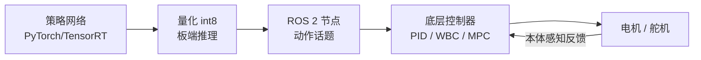
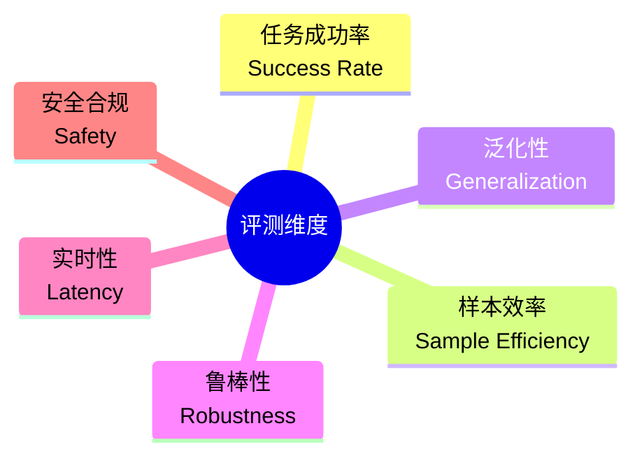

# 第十五讲 · 真实机器人部署与具身智能评测基准（Real-Robot Deployment & Embodied Benchmarks）

> **本讲信息**
> - 日期：2026-08-28（周四）
> - 第几讲：第十五讲（学习计划 Day 15）
> - 对应计划：`study-plan-60d.md` 里 **P6 部署与评测** 阶段
> - 今日目标：把 Day 13 的 Sim2Real 真正落地——训好的策略怎么搬上真机、怎么压缩到板端跑、怎么用公开 benchmark 客观打分，而不是「我觉得它行」。

---

## 0. 一句话总结

> 算法再漂亮，**上不了真机、算不出客观分数，就等于没做完**。今天串起一条部署链：**策略网络 → 量化压缩（int8）→ ROS / 实时控制环 → 真机执行**，并用 **RLBench / ManiSkill / AgiBot World / DROID** 这类 benchmark 把「会不会做」变成可比较的数字。

---

## 1. 核心知识点

| 环节 | 干什么 | 痛点 |
|---|---|---|
| **Sim2Real 落地** | 把仿真训的策略迁到真机（Day 13 讲原理） | 域随机化没覆盖到的细微差异 |
| **量化压缩** | float32 → int8，模型变小变快 | 精度掉一点，要 trade-off |
| **板端推理** | 在机器人本体的算力（Jetson 等）上跑 | 算力有限、不能拖时延 |
| **实时控制环** | 策略输出 → 底层控制器（PID/WBC）→ 电机 | 控制频率要对得上 |

### 1.1 从「模型文件」到「真机动作」的链路

> 这张图是 Day 2「执行器链路」的**上层扩展**：Day 2 是「命令→电机→传感器→控制器」的小闭环；这里是「策略→ROS→控制器→电机」的大闭环，两层闭环套在一起。

### 1.2 为什么要量化（int8）

- 训练用 float32（精度高、占显存）；**部署到 Jetson / 树莓派这类边缘算力，float32 太慢太重**。
- int8 把权重从 32 位压到 8 位，**体积 ≈ 1/4、速度数倍**，精度掉一点点但通常可接受。
- 工具：TensorRT（NVIDIA）、ONNX Runtime、TorchScript。

<mark>**📌 课件补充｜延迟预算（latency budget）**：机器人控制有硬实时要求。比如 SO-101 控制频率 50–100 Hz，意味着**每 10–20 ms 必须出一个动作**。策略网络 + 量化 + ROS 通信的总时延必须压进这个预算，否则动作「跟不上」，机器人发抖甚至失稳。这也是为什么板端量化比云端推理更常用——云端一来一回网络延迟就爆了。</mark>

### 1.3 评测基准（benchmark）：让「行不行」变成数字

| Benchmark | 侧重 | 形态 |
|---|---|---|
| **RLBench** | 桌面机械臂任务（100+ 任务） | 仿真为主，有真机接口 |
| **ManiSkill** | 大规模操作的仿真评测 | 仿真，GPU 并行 |
| **MetaWorld** | 多任务元学习 | 仿真 |
| **DROID** | 真实机器人操作数据集 | 真机数据 |
| **AgiBot World / RoboMIND** | 大规模真机操作 | 真机数据（开源） |

> 关键认知：**benchmark 不是考试，是「标尺」**。论文里说「成功率 95%」必须注明在哪个 benchmark、多少demo、真机还是仿真——否则数字没意义。

### 1.4 软体 / DEA 的部署更难在哪

- 刚性臂有精确正逆运动学；**软体/DEA 没有干净的逆解**，动作空间是「电压场」，状态靠视觉/电容近似。
- 所以软体部署更依赖 **Day 14 的世界模型 / 可微仿真** 做预测，对 benchmark 的「精确重复」天然不友好——这也是软体方向研究的开放难题。

---

## 2. 原理

1. **部署 = 把「研究代码」变成「产品级实时系统」**，难点不在算法而在工程链。
2. **量化有代价，要测误差**：压完必须回测，别让精度掉到任务失败。
3. **benchmark 是行业的共同语言**：不做评测的研究无法被比较、无法被信任。
4. **软体方向要自己造标尺**：通用 benchmark 多为刚性夹爪，软体需要自定义指标（形变误差、接触力合规）。

---

## 3. 一张图：具身智能评测维度

---

## 4. 今天的操作步骤

1. **读一遍本文件**。
2. **徒手画 §1.1 的部署链路图**（策略→量化→ROS→控制器→电机）。
3. **口头讲清**：为什么量化、延迟预算是什么、benchmark 为什么重要。
4. **对照课程看部署与 benchmark 章节**（1.0–1.5 倍速）。
5. **镜子测试（3 分钟）：** *「部署链路分哪几段___；为什么量化___；延迟预算是什么___；benchmark 是干嘛的、举个名字___；软体部署难在哪___。」*
6. **（以后再做）** 把一个训好的 ACT 策略用 TensorRT 量化，在 SO-101 上对比量化前后成功率与时延。

> ✅ **今天「做完」的标准：** 能讲清部署链 + 延迟预算 + benchmark 意义 + 过镜子测试。

---

## 5. 常见误区 & 容易踩的坑

| # | 误区 | 真相 |
|---|---|---|
| 1 | "训好策略就大功告成。" | 上不了真机、算不出分数，等于没做完。部署和评测是另一半工程。 |
| 2 | "量化随便压，快就行。" | 压完必须回测，精度掉了任务会直接失败。 |
| 3 | "成功率 95% 就是牛。" | 必须注明 benchmark、demo 数、仿真/真机；否则数字不可比。 |
| 4 | "云端推理更省事。" | 云端一来回网络延迟就爆实时预算，板端量化才是常态。 |
| 5 | "软体机器人用不了现有 benchmark。" | 对，所以要**自定义指标**，这正是软体研究的价值点。 |

---

## 6. 下一步 / 检查点

- **过了检查点 =** 讲清部署链 + 延迟预算 + benchmark + 过镜子测试。
- **下一讲（Day 16）：** **前沿方向收口**——把 60 天串成一张全景图，并落到你的方向：**软体执行器 / DEA + 军事特种作业应用**，以及它怎么充实你的简历。

---

## 7. 训练营实操回顾（来自 SO-101）

1. **「能在真机上跑起来」才是毕业标准。** 训练营里 ACT 在仿真里成功率很高，但一上 SO-101 真机，就得调标定（Day 8/21）、调控制频率（Day 2 的 PID、Day 10 的实时性）——部署链的每个环节都会暴露问题。
2. **延时是真的会「抖」。** 用 WebSocket（Day 10）看角度时，如果后端推理慢了，曲线就会卡顿；这让我第一次直观理解「延迟预算」不是书本概念。

> 让我重来一次：**仿真里跑圆 → 量化压测 → 真机调频率**，一步步来，别想一步登天。

---

### 参考资料（先放着，今天不要求）
- TensorRT / ONNX Runtime 官方文档（量化部署）。
- RLBench (IEEE RA-L 2021)、ManiSkill (NeurIPS 2023)、MetaWorld (NeurIPS 2019)、DROID (RSS 2024)、AgiBot World (2024).
- （后续）Day 16 收口到软体/DEA 与特种作业应用。