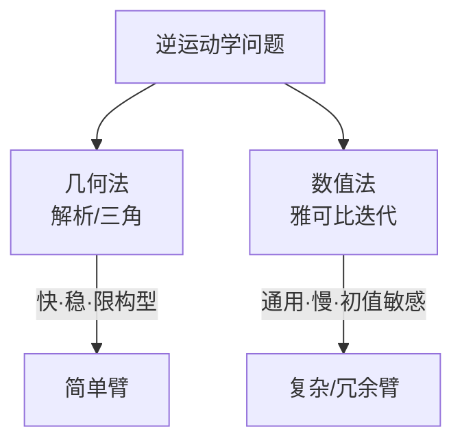

# 第十五讲 · 逆解求解方法：几何法 vs 数值法（IK Solving Methods）

> **本讲信息**
> - 日期：2026-08-28（周四）
> - 第几讲：第十五讲（学习计划 Day 15，P5 运动学）
> - 对应计划：`study-plan-60d.md` → **P5 运动学（逆解 IK）**，课程集号 **060–062**
> - 今日目标：掌握两类 IK 求解法——几何法（解析）与数值法（迭代），知道各自优缺点和适用场景。接 Day 14 的 IK 多解性。

---

## 0. 一句话总结

> **几何法 = 用三角/解析直接解**（快、稳，但只适用简单构型）；**数值法 = 雅可比迭代逼近**（通用，但慢、初值敏感、可能不收敛）。选哪个看你的臂有多复杂。

---

## 1. 核心知识点（对照 060–062）

### 1.1 060 逆向运动学的求解方法
- 两大类：**几何法（解析解）** 与 **数值法（迭代解）**。

### 1.2 061 几何法求解逆运动学代码演示
- 用三角关系 / 解析公式直接写出关节角（如平面 2 连杆用余弦定理）。
- 优点：快、稳、无迭代。
- 限制：只适用于特定构型（平面臂、特定 6 轴构型），复杂臂解不出。

### 1.3 062 数值法求解的优缺点
- 用**雅可比矩阵伪逆**迭代逼近目标（每次往误差减小的方向挪一点）。
- 优点：通用，几乎任何构型都能用。
- 缺点：慢（要迭代）、初值选差可能不收敛或卡局部极小、靠近奇异点会数值不稳。

---

## 2. 原理（先抓这几条）

1. **几何法 = 解析解**：闭式公式，一步到位。
2. **数值法 = 迭代逼近**：靠雅可比，逐步收敛。
3. **选型**：简单构型用几何法，复杂/冗余构型用数值法。

---

## 3. 一张图：两类解法

---

## 4. 今天的操作步骤

1. **跑通几何法 IK 代码**（平面 2 连杆），对比数值法结果。
2. **口头讲清**：两类方法、各自优缺点、适用场景。
3. **（以后）** 改数值法初值，看它什么时候不收敛。
4. **镜子测试（3 分钟）：** *「几何法___；数值法___；几何法优缺点___；数值法优缺点___。」*

> ✅ **今天「做完」的标准：** 讲清两类 IK 解法 + 优缺点 + 过镜子测试。

---

## 5. 常见误区 & 容易踩的坑

| # | 误区 | 真相 |
|---|---|---|
| 1 | 数值法万能 | 初值差会不收敛或卡局部极小 |
| 2 | 几何法能解所有臂 | 只适用特定构型，硬套复杂臂失败 |
| 3 | IK 解出就用 | 还要选解（Day 14 多解）|

---

## 6. DEA 交叉链接（轻量，非主线）

- 刚性臂常用几何/数值 IK；**软体 / DEA 臂没有干净离散关节，几何法基本用不了**，多用数值优化 / 数据驱动求一个可行形变（接 Day 17 软体建模）。所以你的方向天然偏向「数值 + 优化」路线。

---

## 7. 下一步 / 检查点

- **过了检查点 =** 讲清两类 IK 解法 + 优缺点 + 过镜子测试。
- **下一讲（Day 16）：** 逆解应用与键盘控制——把 IK 落地成「按键让臂动」，课程集号 063–067。

---

### 参考资料（先放着，今天不要求）
- 课程集号 060–062（B 站《黑马程序员 · 具身智能》）。
- （后续）Day 16 键盘控制、Day 20 遥操作都建立在 IK 之上。