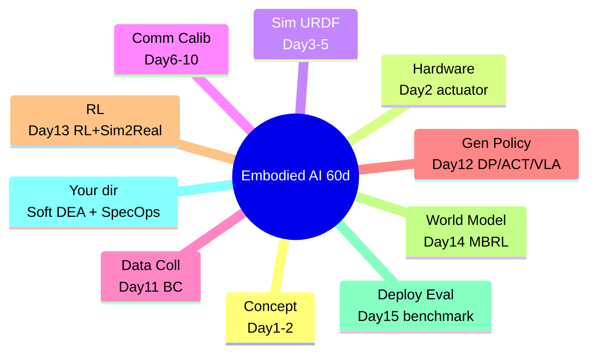
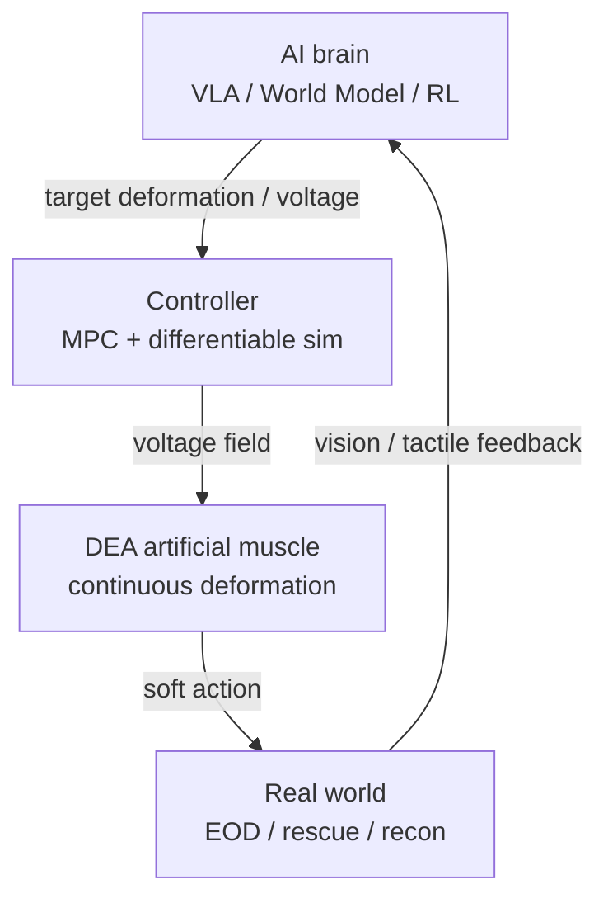

# Lecture 16 — Frontier Wrap-up: Soft Actuators / DEA & Military Special-Ops Applications

> **Meta**
> - Date: 2026-08-29 (Friday)
> - Lecture / Day: Lecture 16 — Day 16 of the study plan (the 60-day capstone)
> - Plan anchor: `study-plan-60d.md` → **P7 前沿与方向 (Frontier & Direction)**
> - Goal of today: connect the previous 15 days into one panorama, and weld in the two things you care about most — **soft actuators / Dielectric Elastomer Actuators (DEA) artificial muscles**, and how they serve **military / special-operations** scenarios, the hard-core landing zone of embodied intelligence. Finally, how this learning becomes currency on your resume.

---

## 0. One-line summary

> The 60 days of embodied intelligence are essentially **"perception – decision – learning – control – body" as one pipeline**. Your (小畅's) unique selling point stands at the **"body" station** — using DEA soft artificial muscles as the action space, then driving it with the IL/RL/world-model tools learned earlier. This "soft body + AI brain" route maps exactly onto the **military reconnaissance, EOD, disaster response, field manipulation** scenarios where special operations demand "safe, compliant, adaptive" capabilities.

---

## 1. The 60-day panorama (capstone)

> This is the **timeline version** of Lecture 02's "5-station map": the 5 stations (perception/decision/learning/control/body) map to different "days" across the 60; the "body" station is your main attack.

### 1.1 Soft actuators / DEA: the hard-core answer at the "body" station

| Dimension | Rigid servo (Day 2) | Soft / DEA artificial muscle |
|---|---|---|
| Action space | 6 joint angles | voltage field → continuous deformation (infinite-dim) |
| Modeling | rigid-body dynamics, closed-form IK | nonlinear + hysteresis, often data / differentiable sim |
| Strength | precise, controllable | **compliant, safe, light, shock-resistant** |
| Weakness | fragile on collision, stiff | state hard to sense, hard to control |

<mark>**📌 Slide supplement | What is DEA**: a Dielectric Elastomer Actuator is an "artificial muscle" — two electrodes sandwich an elastomer film; applying voltage makes the electric field deform the film in area/thickness, causing contraction/bending. **It has no gears, no encoder** (exactly the "other path" from Day 2), deforming directly via the electric field. This soft body is the extreme embodiment of Day 1's "the body redefines the action space".</mark>

### 1.2 Soft body + AI brain: the research entry point

- Action space is a "voltage field" → standard RL/IL discrete/low-dim actions must be adapted (Day 13 noted MBRL fits).
- State is hard to sense → use vision / capacitance / tactile to approximate proprioception (Day 1's "proprioception" station).
- Control is hard → model-predictive control (MPC) + differentiable sim as world model (Day 14).
- **One line**: your PhD DEA modeling + MPC is *isomorphic* to embodied AI's "world model + policy" — except you make the "body" smarter.

### 1.3 Military / special ops: why they need soft embodied AI

| Scenario | Hard need | Soft / DEA value |
|---|---|---|
| **EOD (explosive ordnance disposal)** | no hard contact, compliant grasp | soft gripper safely handles suspicious objects |
| **Recon / detection** | confined, unstructured space | light, shape-morphing body squeezes through gaps |
| **Disaster rescue** | operate in rubble, shock-resistant | soft body survives impact, compliant not rigid |
| **Field / battlefield ops** | no standard env, adaptive | continuous deformation fits irregular objects |

> This is exactly the **special operations** mentioned in Day 1's "application layer" slide — embodied intelligence doesn't only serve factories and homes, it serves the hard-core national-security scenarios. Your soft / DEA direction naturally stands at the "body" station to tackle jobs rigid robots can't.

---

## 2. Principles (three capstone points)

1. **Five stations are one**: perception→decision→learning→control→body; miss one and it's not embodied AI — your value is at "body".
2. **Soft body is the advanced form of body**: it upgrades the action space from "angles" to "continuous deformation", forcing the algorithm to be smarter.
3. **Direction = differentiation**: while everyone races VLA/RL algorithms, **few understand both materials+mechanism+control (body) AND AI (brain)** — that's your resume moat.

---

## 3. One diagram: how DEA plugs into the embodied stack

---

## 4. Today's operation steps (capstone day)

1. **Read this file**, then flip back to Day 1's 5-station map, Day 2's actuator, Day 14's world model.
2. **Hand-draw the §3 diagram**: AI brain → controller → DEA → world → feedback. Embed your direction into the stack.
3. **Write a "direction statement"** (3–5 sentences): I work on DEA soft artificial muscles, how it connects to embodied AI and serves special operations.
4. **Mirror test (5 min, close everything and talk):** *"The 60-day five stations are ___; what DEA is and why it's the 'body' answer ___; the soft+AI research entry ___; why military special ops need it ___; where's my differentiation ___"*
5. **(Optional)** polish that statement into a one-liner for the resume's "research interest / project direction".

> ✅ **Definition of "done today":** can explain the panorama + DEA's place in the stack + pass the mirror test + write the direction statement.

---

## 5. Common misconceptions & easy mistakes

| # | Misconception | Reality |
|---|---|---|
| 1 | "Soft robots are just toys, impractical." | EOD, rescue, recon exactly need their compliance and safety. |
| 2 | "A materials person knows nothing about AI." | Embodied AI's essence is the body–brain interface; few know both body and AI — that's your edge. |
| 3 | "DEA has no encoder so it can't be controlled." | Vision/capacitance/tactile approximate state + differentiable sim as world model is the standard fix. |
| 4 | "The military direction has nothing to do with my soft robotics." | Special ops' need for compliance/adaptivity/shock-resistance is precisely the soft / DEA stage. |
| 5 | "Finishing 60 days is enough to get a job." | Direction statement + project evidence (SO-101, DEA modeling) together make the resume currency. |

---

## 6. Next steps / checkpoint (also the 60-day summary)

- **Checkpoint passed if:** panorama + DEA position + mirror test + direction statement done.
- **Output of this journey**: Day 1–16 bilingual notes (GitHub `Embodied-Intelligence-Learning`) are already your "learning evidence base".
- **Resume landing suggestions**: ① algorithm side — IL/RL/world-model/deployment (proven by SO-101 project); ② body side — DEA soft-muscle modeling + MPC (proven by your PhD topic); ③ direction line — "soft body + AI brain, serving special-operations embodied intelligence".

---

### References (for later, not required today)
- DEA classic review: Carpi et al., *Dielectric elastomers as electromechanical transducers* (2008).
- Soft robotics review: Rus & Tolley, *Design, fabrication and control of soft robots* (Nature 2015).
- Public materials on military / special-ops embodied AI (lab field / EOD directions).
- This repo's `so101-act/` and Day 1–15 notes as the "evidence chain" for your route.