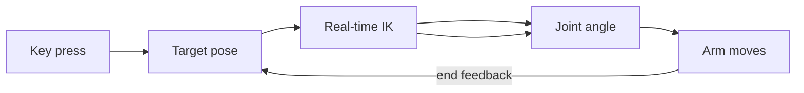

# Lecture 16 — IK Application & Keyboard Control (Turning IK into "Press Key, Arm Moves")

> **Meta**
> - Date: 2026-08-29 (Friday)
> - Lecture / Day: Lecture 16 — Day 16 of the study plan
> - Plan anchor: `study-plan-60d.md` → **P5 Kinematics (IK deployment)**, course episodes **063–067**
> - Goal of today: chain FK/IK into a live loop "key → target pose → IK → arm moves". The first time kinematics actually "moves". Builds on Day 12–15 FK/IK.

---

## 0. One-line summary

> **Keyboard control = map keys to target pose → real-time IK to joint angles → arm moves**; the inverse-control logic is "re-solve IK every frame to track the target", needing smoothing (interpolation) to avoid jitter. The first time kinematics becomes interactive operation.

---

## 1. Core knowledge (against 063–067)

### 1.1 063 IK application scenarios
- Reaching a target point: grasp, write, draw, track — all "given end target, solve how to move".

### 1.2 064 FK/IK code showcase
- Wrap Day 12 FK and Day 14–15 IK into callable functions (one gives end from angles, one gives angles from end).

### 1.3 065 Let AI generate keyboard-control code
- Use AI to map keys → target pose (e.g. W/S front-back, A/D left-right).
- Vibe Coding: verify small snippets first, then expand; don't dump one huge blob to AI.

### 1.4 066 Arm inverse-control logic
- Real-time IK: re-solve joint angles each frame so the end tracks the target.
- Key: add **smoothing / interpolation**, else the end jitters.

### 1.5 067 How FK/IK code is created
- Engineer FK + IK + control into one runnable mini-system.

---

## 2. Principles to internalize

1. **Keyboard-control loop**: key → target pose → IK → joint angle → move.
2. **Inverse control = real-time IK tracking**: re-solve when target changes.
3. **Smoothing is mandatory**: hard jumps each frame → jitter / snap.

---

## 3. One diagram: keyboard-control loop

---

## 4. Today's operation steps

1. **Use AI to generate keyboard-control code**, achieving "key → target pose → IK → move".
2. **Add smoothing / interpolation** to kill jitter.
3. **Explain out loud**: keyboard-control loop, inverse-control logic, why jitter happens.
4. **(Later)** connect this loop to a real/sim arm and try it.
5. **Mirror test (3 min):** *"Keyboard-control loop ___; inverse-control logic ___; why jitter without smoothing ___"*

> ✅ **Definition of "done today":** explain keyboard-control loop + inverse logic + jitter cause + pass mirror test.

---

## 5. Common misconceptions & easy mistakes

| # | Misconception | Reality |
|---|---|---|
| 1 | Bigger key step = faster | Too big → arm snaps, dangerous |
| 2 | Re-solving IK each frame is enough | No smoothing → jitter |
| 3 | AI generates one big blob | Unverified → don't know where to debug |

---

## 6. DEA cross-link (light, not the main line)

- Rigid-arm keyboard control outputs "joint angles"; **DEA soft-arm control quantity is "voltage / electric field"** (ties to Day 18 voltage-field action space) — no clean joint angles to map. So your direction must translate "target pose → IK → joint angle" one more step into "joint angle → desired deformation → drive voltage", an extra body-mapping layer.

---

## 7. Next steps / checkpoint

- **Checkpoint passed if:** explain keyboard-control loop + inverse logic + jitter cause + pass mirror test.
- **Next stage (Day 17+):** enter P6 **Control theory & PID** (open/closed loop, PID, calibration, teleop), episodes 068–080.

---

### References (for later, not required today)
- Course episodes 063–067 (B 站《黑马程序员 · 具身智能》).
- (Later) Day 20 teleoperation, Day 51+ behavior cloning all build on "teaching / control".
