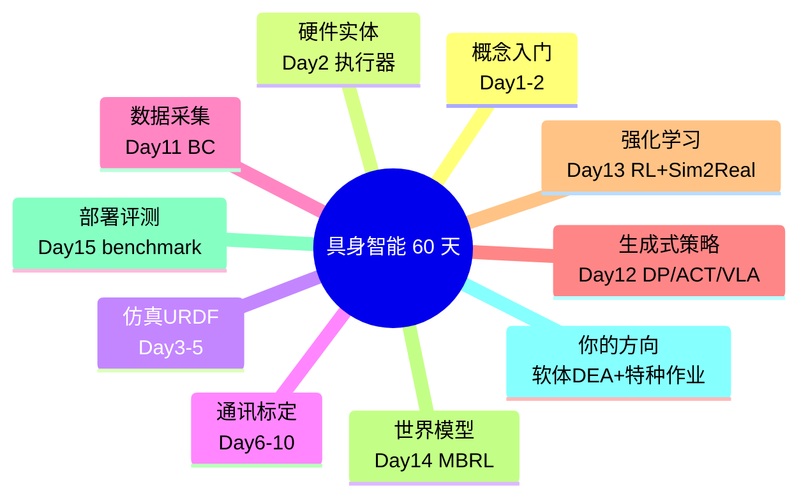
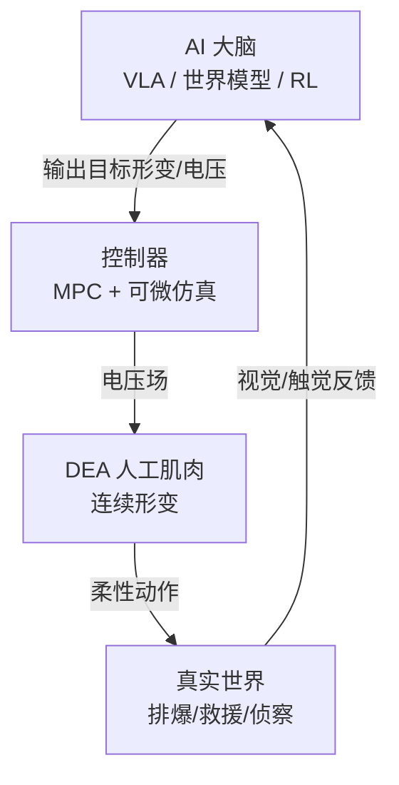

# 第十六讲 · 前沿方向收口：软体执行器 / DEA 与军事特种作业应用（Frontier & Your Direction）

> **本讲信息**
> - 日期：2026-08-29（周五）
> - 第几讲：第十六讲（学习计划 Day 16，60 天计划收口日）
> - 对应计划：`study-plan-60d.md` 里 **P7 前沿与方向** 阶段
> - 今日目标：把前面 15 天串成一张全景图，并把你最关心的两件事焊进来——**软体执行器 / 介电弹性体（DEA）人工肌肉**，以及它如何服务**军事 / 特种作业**这类「具身智能的硬核落地场景」。最后聊聊这趟学习怎么变成你简历上的筹码。

---

## 0. 一句话总结

> 60 天的具身智能，本质是**「感知–决策–学习–控制–身体」五站一条龙**。而你（小畅）的独特卖点，是站在**「身体」这一站**——用 DEA 软体人工肌肉做动作空间，再用前面学的 IL/RL/世界模型去驱动它。这条「软体身体 + AI 大脑」的路线，恰好对上**军事侦察、排爆、灾害救援、野外操作**等特种作业对「安全、柔顺、自适应」的刚需。

---

## 1. 60 天全景图（收口）

> 这张图是第 2 讲那张「5 站地图」的**时间轴版**：5 站（感知/决策/学习/控制/身体）对应 60 天里不同的「天」，而「身体」这一站，正是你的主攻。

### 1.1 软体执行器 / DEA：具身智能「身体」站的硬核答案

| 维度 | 刚性舵机（Day 2） | 软体 / DEA 人工肌肉 |
|---|---|---|
| 动作空间 | 6 个关节角度 | 电压场 → 连续形变（无限维） |
| 建模 | 刚体动力学，有闭式逆解 | 非线性 + 迟滞，常需数据/可微仿真 |
| 优势 | 精度高、可控 | **柔顺、安全、轻量、抗冲击** |
| 难点 | 怕碰撞、硬 | 状态难测、控制难 |

<mark>**📌 课件补充｜DEA 是什么**：介电弹性体驱动器（Dielectric Elastomer Actuator）是一种「人工肌肉」——两片电极夹一层弹性体薄膜，加电压后电场让薄膜在面积/厚度上变形，从而收缩/弯曲。**它没齿轮、没编码器**（正是 Day 2 说的「另一条路」），靠电场直接变形。这类「软体身体」正是 Day 1 说的「身体重新定义动作空间」的极致体现。</mark>

### 1.2 软体 + AI 大脑：研究切口

- 动作空间是「电压场」→ 标准 RL/IL 的离散/低维动作要改造（Day 13 提过 MBRL 适合）。
- 状态难测 → 用视觉 / 电容 / 触觉近似本体感知（Day 1 的「本体感知」站）。
- 控制难 → 模型预测控制（MPC）+ 可微仿真当世界模型（Day 14）。
- **一句话**：你博士做的 DEA 建模 + MPC，和具身智能的「世界模型 + 策略」是同构的，只是你把「身体」做得更聪明。

### 1.3 军事 / 特种作业：为什么需要软体具身智能

| 场景 | 刚需 | 软体/DEA 的价值 |
|---|---|---|
| **排爆（EOD）** | 不能硬碰、要柔顺包裹 | 软体夹爪安全抓取可疑物 |
| **侦察 / 探测** | 狭小、非结构空间 | 轻量、可变形机体钻缝 |
| **灾害救援** | 瓦砾中操作、抗冲击 | 软体抗砸、柔顺不与环境硬刚 |
| **野外/战场操作** | 无标准环境、自适应 | 连续形变适应不规则物体 |

> 这正是 Day 1 课件补充里「应用层」提到的**特种作业**——具身智能不只服务工厂和家庭，也服务国家安全的硬核场景。你的软体/DEA 方向，天然站在「身体」这一站，去啃刚性机器人啃不动的活。

---

## 2. 原理（收口三条）

1. **五站一体**：感知→决策→学习→控制→身体，缺一站都不叫具身智能；你的价值在「身体」。
2. **软体是身体的进阶形态**：它把「动作空间」从「角度」升级为「连续形变」，倒逼算法更聪明。
3. **方向即差异化**：当大家都在卷 VLA/RL 算法时，**懂材料+机构+控制（身体）又懂 AI（大脑）** 的人极少——这就是你简历的护城河。

---

## 3. 一张图：DEA 如何接入具身智能栈

---

## 4. 今天的操作步骤（收口日）

1. **读一遍本文件**，回头翻 Day 1 的 5 站地图、Day 2 的执行器、Day 14 的世界模型。
2. **徒手画 §3 的图**：AI 大脑 → 控制器 → DEA → 世界 → 反馈。把你的方向嵌进具身栈。
3. **写一段「方向陈述」**（3–5 句）：我是做 DEA 软体人工肌肉的，它如何对接具身智能、服务特种作业。
4. **镜子测试（5 分钟，关掉一切讲）：** *「60 天五站是___；DEA 是什么、为什么算『身体』站的答案___；软体+AI 的研究切口___；军事特种作业为什么需要它___；我的差异化在哪___。」*
5. **（可选）** 把这段方向陈述润色成简历里的「研究兴趣 / 项目方向」一句话。

> ✅ **今天「做完」的标准：** 能讲清全景图 + DEA 在栈里的位置 + 过镜子测试 + 写出方向陈述。

---

## 5. 常见误区 & 容易踩的坑

| # | 误区 | 真相 |
|---|---|---|
| 1 | "软体机器人只是玩具，不实用。" | 排爆、救援、侦察等特种作业恰恰需要它的柔顺与安全。 |
| 2 | "做材料的懂什么 AI。" | 具身智能的精髓是身体–脑接口；懂身体又懂 AI 的人极稀缺，正是你的优势。 |
| 3 | "DEA 没编码器就没法控。" | 用视觉/电容/触觉近似状态 + 可微仿真当世界模型，是标准解法。 |
| 4 | "军事方向和我做软体无关。" | 特种作业对柔顺/自适应/抗冲击的刚需，正是软体/DEA 的舞台。 |
| 5 | "学完 60 天就够找工作了。" | 方向陈述 + 项目证据（SO-101、DEA 建模）一起才构成简历筹码。 |

---

## 6. 下一步 / 检查点（也是 60 天小结）

- **过了检查点 =** 讲清全景 + DEA 位置 + 过镜子测试 + 写出方向陈述。
- **这趟学习的产出**：Day 1–16 中英双语笔记（GitHub `Embodied-Intelligence-Learning`）已是你的「学习证据库」。
- **简历落点建议**：① 算法侧——IL/RL/世界模型/部署（用 SO-101 项目证明）；② 身体侧——DEA 软体人工肌肉建模 + MPC（用你博士课题证明）；③ 方向句——「软体身体 + AI 大脑，服务特种作业具身智能」。

---

### 参考资料（先放着，今天不要求）
- 介电弹性体驱动器（DEA）经典综述：Carpi 等, *Dielectric elastomers as electromechanical transducers* (2008).
- 软体机器人综述：Rus & Tolley, *Design, fabrication and control of soft robots* (Nature 2015).
- 具身智能军事/特种应用公开资料（各实验室 robotics for field / EOD 方向）。
- 本仓库 `so101-act/` 与 Day 1–15 全部笔记，作为你这条路线的「证据链」。