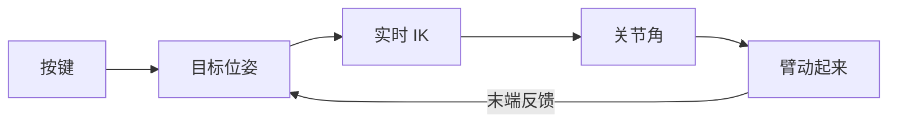

# 第十六讲 · 逆解应用与键盘控制（IK 落地成「按键让臂动」）

> **本讲信息**
> - 日期：2026-08-29（周五）
> - 第几讲：第十六讲（学习计划 Day 16，P5 运动学收口）
> - 对应计划：`study-plan-60d.md` → **P5 运动学（逆解 IK 落地）**，课程集号 **063–067**
> - 今日目标：把前面学的 FK/IK 串成「按键 → 目标位姿 → IK → 臂动起来」的实时闭环。这是运动学第一次真正「动起来」。接 Day 12–15 的正/逆解。

---

## 0. 一句话总结

> **键盘控制 = 按键映射成目标位姿 → 实时 IK 反解成关节角 → 臂动起来**；反解控制逻辑就是「每帧重算 IK 跟目标」，需要平滑（插值）避免抖动。这是运动学第一次变成可交互的操作。

---

## 1. 核心知识点（对照 063–067）

### 1.1 063 运动学逆解的应用场景分析
- 让末端到指定点：抓取、写字、画线、跟踪——本质都是「给末端目标，求怎么动」。

### 1.2 064 正逆运动学代码展示
- 把 Day 12 的 FK、Day 14–15 的 IK 写成可调用的函数（一个给角求末端，一个给末端求角）。

### 1.3 065 让 AI 帮我生成键盘控制代码
- 用 AI 生成「按键 → 目标位姿」的映射（如 W/S 控前后、A/D 控左右）。
- Vibe Coding：先小段验证再扩展，别一次让 AI 生成一大坨。

### 1.4 066 机械臂的反解控制逻辑的实现
- 实时 IK：每帧根据当前目标位姿重算关节角，让末端跟上。
- 关键：做**平滑/插值**，否则末端会抖。

### 1.5 067 机械臂反解和正解的代码是如何创建的
- 工程化把 FK + IK + 控制串成一个可运行的小系统。

---

## 2. 原理（先抓这几条）

1. **键盘控制闭环**：按键 → 目标位姿 → IK → 关节角 → 动起来。
2. **反解控制 = 实时 IK 跟随**：目标变了就重算。
3. **平滑是刚需**：每帧硬跳 → 抖动 / 突跳。

---

## 3. 一张图：键盘控制闭环

---

## 4. 今天的操作步骤

1. **用 AI 生成键盘控制代码**，实现「按键 → 目标位姿 → IK → 动起来」。
2. **加平滑/插值**，消除抖动。
3. **口头讲清**：键盘控制闭环、反解控制逻辑、为什么抖动。
4. **（以后）** 把这个闭环接到真实/仿真机械臂上试。
5. **镜子测试（3 分钟）：** *「键盘控制闭环___；反解控制逻辑___；为什么没平滑会抖动___。」*

> ✅ **今天「做完」的标准：** 讲清键盘控制闭环 + 反解逻辑 + 抖动原因 + 过镜子测试。

---

## 5. 常见误区 & 容易踩的坑

| # | 误区 | 真相 |
|---|---|---|
| 1 | 键盘步进越大越快 | 步进太大 → 臂突跳，危险 |
| 2 | IK 每帧重算就行 | 不平滑 → 抖动 |
| 3 | AI 一次生成一大坨 | 不验证 → 调试不知从哪改 |

---

## 6. DEA 交叉链接（轻量，非主线）

- 刚性臂键盘控制输出「关节角」；**DEA 软体臂的控制量是「电压 / 电场」**（接 Day 18 电压场动作空间），没有干净关节角可映射。所以你的方向要把「目标位姿 → IK → 关节角」再翻译成「关节角 → 期望形变 → 驱动电压」，多一层本体映射。

---

## 7. 下一步 / 检查点

- **过了检查点 =** 讲清键盘控制闭环 + 反解逻辑 + 抖动原因 + 过镜子测试。
- **下一阶段（Day 17 起）：** 进入 P6 **控制论与 PID**（开环/闭环、PID、标定、遥操作），课程集号 068–080。

---

### 参考资料（先放着，今天不要求）
- 课程集号 063–067（B 站《黑马程序员 · 具身智能》）。
- （后续）Day 20 遥操作、Day 51+ 行为克隆都建立在「示教/控制」之上。
