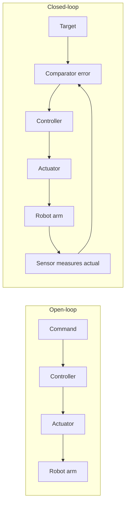

# Lecture 17 — Control Theory: Open-loop vs Closed-loop

> **Plan slot**: Day 17 (P6 Control Theory & PID) | Episodes 068 Control theory - open-loop / 069 Control theory - closed-loop
> **Series**: Heima《Embodied Intelligence》223-lecture study notes · Day 17

## 1. Where this sits in the 60-day plan
P6 (Day 17–20) enters "control theory & PID" — the bridge that turns the target angles computed by kinematics (FK/IK) into a robot arm that moves **stably and accurately**. Today we build the most fundamental concept: **open-loop vs closed-loop**.

## 2. Core knowledge

### 2.1 What control theory is about
Cybernetics studies "**how to make a system behave the way we want**". For a robot arm, the system = the arm; what we want = reach a specified angle / position.

### 2.2 Open-loop system
- Structure: command → controller → actuator → plant. **No feedback**.
- Meaning: I say "go to 30°", but I **don't look back** at whether / how far it actually went.
- Examples: old washing-machine timer, microwave timer, a plain light switch.
- Pros: cheap, simple, no sensors needed.
- Cons: **inaccurate**. If load / friction / voltage changes, the result drifts and the system can't tell.

### 2.3 Closed-loop system (feedback control)
- Structure: command → comparator (error) → controller → actuator → plant → **sensor measures actual value → feeds back to comparator**.
- Meaning: I set "target 30°"; the sensor reads "now 12°"; the comparator computes error 18°; the controller pushes harder until error ≈ 0.
- Key: use **feedback** to keep correcting the error.
- Examples: AC thermostat, cruise control, and — **a servo is itself a closed-loop system** (internal potentiometer/encoder reads angle; the driver chip keeps correcting to the target).

### 2.4 One-line contrast
Open-loop = "I command, but don't check the result"; closed-loop = "I set the target, but keep watching the result and correcting".

## 3. Hands-on
Draw two block diagrams (Mermaid below; you can draw by hand too):
- Open-loop: command → controller → actuator → arm (no line returns to the start).
- Closed-loop: add a line from "arm" through "sensor" back to "comparator", which also connects to "command".

## 4. Common pitfalls
- **Confusing "closed-loop" with "AI control"**: a PID loop is classical control (a few lines of math), no neural network needed. Closed-loop ≠ intelligent; feedback ≠ large model.
- Thinking open-loop is "simpler therefore better": for precision-sensitive positioning, open-loop is nearly unusable; you need closed-loop.
- Mis-installed / uncalibrated feedback sensor → the loop uses a "fake actual value" and diverges further.

## 5. Checkpoint (must explain by end of Day 20)
State orally: open-loop has no feedback, closed-loop uses feedback; a servo is closed-loop; PID is the most common controller in a closed loop (next lecture).

## 6. DEA cross-link (light, not the main thread)
Closing the loop on soft actuators / dielectric elastomer actuators (DEA) is **harder at the feedback step**:
- A rigid servo has an encoder reporting angle directly; a DEA is a deforming film with no ready-made "angle encoder" — you must estimate deformation/position from capacitance change, flexible strain sensing, or machine vision (soft proprioception).
- A DEA is driven by **voltage / electric field**, not joint angle; the control target is "deformation / force", and it shows clear **hysteresis** — the same voltage gives different deformation depending on history, so pure PID struggles and feed-forward or look-up-table compensation is often needed.
- Link: when studying PID, remember — "how accurate the feedback is" sets the ceiling of the loop; hard feedback on a soft body is exactly one of the core challenges of your advisor's direction (soft-robotics control).

---
*Strictly follows the 60-day plan Day 17 (P6): episodes 068–069. Zero military content.*
