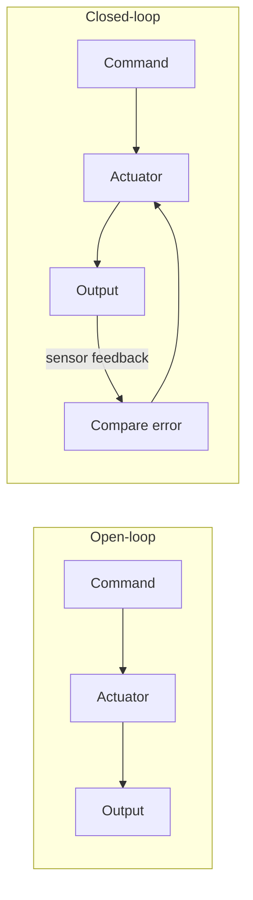

# Lecture 17 — Control Theory: Open-loop vs Closed-loop

> **Meta**
> - Date: 2026-08-30 (Saturday)
> - Lecture / Day: Lecture 17 — Day 17 of the study plan
> - Plan anchor: `study-plan-60d.md` → **P6 Control theory & PID**, course episodes **068–069**
> - Goal of today: the difference between "open-loop" and "closed-loop" — the core is **whether there is feedback**. A servo is itself closed-loop. Builds on Day 16 "arm moves", explaining why it stays stable.

---

## 0. One-line summary

> **Open-loop = send command, don't look at result (cheap but inaccurate); closed-loop = use feedback (sensor) to keep correcting error (a servo is closed-loop)**. Don't confuse "closed-loop" with "AI control" — a PID loop is classical control, no neural net needed.

---

## 1. Core knowledge (against 068–069)

### 1.1 068 Control theory — open-loop
- Given input → execute directly → output, **without checking result**.
- Cheap, simple, but error accumulates (e.g. motor load changes, position drifts).

### 1.2 069 Control theory — closed-loop
- Output fed back via **sensor** to input, compared with "target" to get error, then corrected.
- **A servo is closed-loop**: encoder reports angle in real time, controller corrects.
- Closed-loop resists disturbance, high precision.

---

## 2. Principles to internalize

1. **Open-loop: no feedback**: execute as given, ignore result.
2. **Closed-loop: has feedback**: compare to target, correct error, form a loop.
3. **Servo = closed-loop actuator**: encoder feedback gives angle.

---

## 3. One diagram: open-loop vs closed-loop

---

## 4. Today's operation steps

1. **Draw open-loop vs closed-loop block diagrams**, mark where "feedback" is.
2. **Explain out loud**: open/closed difference, why servo is closed-loop, closed-loop ≠ AI.
3. **(Later)** compare an open-loop fan vs closed-loop AC (thermostat).
4. **Mirror test (3 min):** *"Open-loop ___; closed-loop ___; why is servo closed-loop ___; closed-loop ≠ AI because ___".*

> ✅ **Definition of "done today":** draw diagrams + explain open/closed + pass mirror test.

---

## 5. Common misconceptions & easy mistakes

| # | Misconception | Reality |
|---|---|---|
| 1 | Closed-loop = AI control | PID loop is classical control, no neural net |
| 2 | Open-loop can be precise | No feedback; drifts when load changes |
| 3 | More feedback is better | Feedback has noise/latency, must be designed |

---

## 6. DEA cross-link (light, not the main line)

- Rigid arms feedback via encoder (clean angle); **soft / DEA arms feedback via flexible sensing for proprioception** (ties to Day 17 soft modeling) — noisier, more indirect. And DEA has large hysteresis, **open-loop is nearly unusable**, must be closed-loop; but closed-loop modeling is harder because "voltage → deformation" isn't a linear instant map.

---

## 7. Next steps / checkpoint

- **Checkpoint passed if:** draw diagrams + explain open/closed + pass mirror test.
- **Next lecture (Day 18):** PID algorithm — Proportional / Integral / Derivative, episodes 070–073.

---

### References (for later, not required today)
- Course episodes 068–069 (B 站《黑马程序员 · 具身智能》).
- (Later) Day 18 PID, Day 20 teleoperation all build on closed-loop.