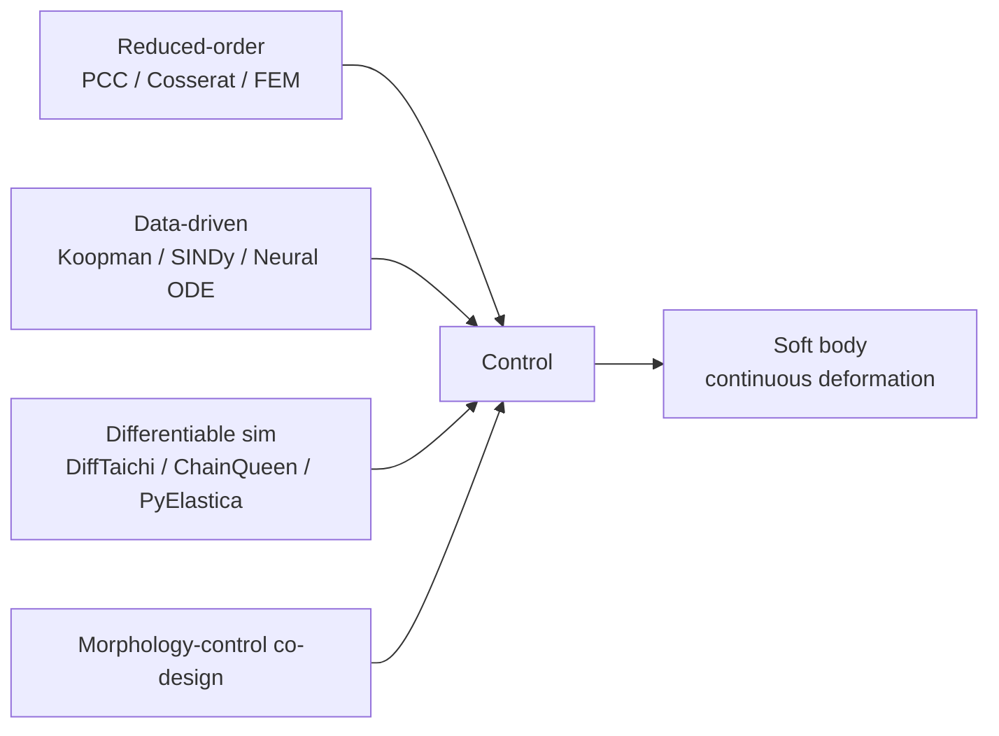
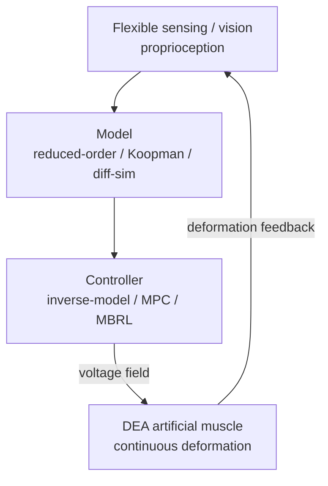

# Lecture 17 — Soft Robotics: Modeling & Control

> **Meta**
> - Date: 2026-08-30 (Saturday)
> - Lecture / Day: Lecture 17 — Day 17 of the study plan (Body-station deep-dive, day 1)
> - Plan anchor: `study-plan-60d.md` → **P7 前沿与方向 · 身体站深化 (Body-station deep-dive)**
> - Goal of today: go deep on the "body" station — the rigid-body modeling from the rigid arm (Day 2) completely breaks down for soft bodies / DEA. Understand *why* soft bodies are "hard to model, hard to control", and which route a mechanical + materials person (you) should attack first. This is where Day 14's world model / differentiable simulation lands concretely on the "soft body".

---

## 0. One-line summary

> A rigid robot is a **low-dimensional, reversible, clean** problem of "a few joint angles"; a soft body / DEA is an **infinite-dimensional, nonlinear, hysteretic, barely-observable** problem. Today gives you a "soft-robotics modeling & control roadmap", and shows that your mechanical + materials background maps exactly onto the most valuable cross-over route: **reduced-order model + data-driven + differentiable simulation**.

---

## 1. Core knowledge

### 1.1 Why soft bodies make classical robotics "blank out"

| Dimension | Rigid arm (Day 2) | Soft / DEA |
|---|---|---|
| DOF | 6 joints, finite | infinite-dimensional continuous deformation |
| Modeling | rigid-body dynamics, closed-form IK/FK | PDE, no clean inverse |
| State | encoder reads angle directly | deformation not directly measurable, needs flexible sensing |
| Character | linear approx OK | nonlinear + viscoelastic + hysteresis |

> Analogy: a rigid arm is "6 knobs controlling a robot arm"; a soft body is "a whole block of jelly you can only electrify from outside to deform as a whole" — you're commanding a continuous material dance.

### 1.2 DEA actuation physics (小畅's hard-core patch)

- A film sandwiched by two flexible electrodes; applying voltage creates **Maxwell stress** `p = ε₀εᵣE²/2` that thins & widens the film → contraction / bending (foreshadowed in Day 16).
- Three mountains of difficulty: **high voltage (kV) / breakdown / hysteresis** + viscoelastic relaxation.
- This means: a DEA is NOT "apply voltage → linear motion"; it's a strongly nonlinear "voltage → field → stress → deformation" map with memory (hysteresis).

### 1.3 Four routes to soft-body modeling (roadmap)

### 1.4 Proprioception: where does the state come from

A rigid arm uses encoders (Day 2); a soft body has none, so it relies on:
- **Vision** (external camera sees deformation), **capacitive / resistive flexible sensing** (embedded in the body), **vision-based tactile** (GelSight line), **fiber OTDR** (distributed strain).
- This is exactly Day 1's "proprioception station" on a soft body — and your first engineering entry point into the "soft + AI" loop.

<mark>**📌 Slide supplement | The easiest entry for a mechanical background**: reduced-order models (constant-curvature PCC, Cosserat rod) first "compress" the soft body into a few curves, then you talk control; among data-driven methods, the **Koopman operator** (Bruder et al., T-RO 2021) lifts a nonlinear system into a linear space and is especially good at modeling hysteresis — neither requires you to become an AI expert first; your mechanics background applies directly.</mark>

---

## 2. Principles to internalize

1. **A soft body's essence is a "field", not a "joint"**: the action space is a continuous deformation field; the discrete low-dim actions of classic IL/RL must be reworked (preview Day 18).
2. **Hysteresis is the arch-enemy**: voltage-up and voltage-down follow different paths; must be compensated by Preisach / Bouc-Wen or a data model.
3. **Differentiable simulation = white-box world model** (ties to Day 14): DiffTaichi etc. compute gradients that backprop straight into "material params + controller" — a dividend unique to soft bodies.
4. **Morphology-control co-design suits "mechanical + AI" papers best**: optimize the body shape together with the controller, not just tune control.

---

## 3. One diagram: the soft-body "sense–model–control" loop

> Contrast with Day 2's rigid loop: there it was "command → motor (with encoder) → controller"; here sensing is flexible, the model is approximate, the actuator is DEA — all three layers are "soft".

---

## 4. Today's operation steps

1. **Read this file once**, flipping back to Day 2 (rigid actuator) and Day 14 (world model / differentiable sim).
2. **Hand-draw the §1.3 / §3 diagrams**: four modeling routes → control → soft body; sense → model → control → DEA → feedback.
3. **Explain out loud**: why soft bodies are hard to model, DEA's three mountains, what hysteresis is, why differentiable sim is a soft-body dividend.
4. **(Later)** run a PyElastica or SOFA + SoftRobots soft-rod sim to feel "infinite-dimensional" first-hand.
5. **Mirror test (3 min):** *"How does soft-body modeling differ from rigid ___; DEA physics & three mountains ___; what is hysteresis, how to fix ___; why differentiable sim is a soft dividend ___; why co-design fits your papers ___"*

> ✅ **Definition of "done today":** can explain soft-body modeling difficulty + DEA physics + differentiable-sim dividend + pass the mirror test.

---

## 5. Common misconceptions & easy mistakes

| # | Misconception | Reality |
|---|---|---|
| 1 | "A soft body is just a rigid arm with different material." | Infinite-dim + hysteresis + unobservable state — the whole methodology must restart. |
| 2 | "Just throw PPO at the soft body." | Samples are expensive + it ages / breaks down; pure MFRL is usually impractical, go model-based. |
| 3 | "A DEA moves linearly when you apply voltage." | Maxwell stress is quadratic + hysteretic — strongly nonlinear with memory. |
| 4 | "No encoder means uncontrollable." | Flexible sensing + vision approximate state; a solvable standard problem. |
| 5 | "A mechanical background can't do soft-body AI." | Reduced-order / Koopman / co-design are exactly where mechanics shines. |

---

## 6. Next steps / checkpoint

- **Checkpoint passed if:** you can explain soft-body modeling difficulty + DEA physics + differentiable-sim dividend + pass the mirror test.
- **Next lecture (Day 18):** **DEA artificial muscle as the embodied action space** — how the voltage field rewrites IL/RL, how MPC + world model drive soft bodies, wiring in Day 11 / 13 / 14.

---

## 7. First-person reflection (from SO-101, a contrast)

1. **SO-101 is the sweet spot of a "clean rigid world".** 6 servo angles + encoders, ACT/DP learn directly; this let you feel how comfortable "low-dim reversible" is.
2. **But the real thesis is the opposite pole.** Your DEA has no encoder, its action is a voltage field, its deformation is barely observable — the bootcamp's "comfort" highlights both the difficulty of the soft direction and the scarcity value of your mechanical + materials background.

> If I were to redo it: **master the rigid side first (done), then drill the soft side (starting now)** — understand both extremes and you're a real "body" expert of embodied AI.

---

### References (for later, not required today)
- Rus & Tolley (2015). *Design, fabrication and control of soft robots*. Nature.
- Carpi et al. (2008). *Dielectric elastomers as electromechanical transducers*.
- Bruder et al. (2021). *Koopman-based modeling for soft robotics*. IEEE T-RO.
- Differentiable sim: DiffTaichi (SIGGRAPH 2021), ChainQueen (RSS 2019), PyElastica, SoMo, DiSECt.
- Modeling: constant-curvature PCC, Cosserat rod, SOFA + SoftRobots plugin.