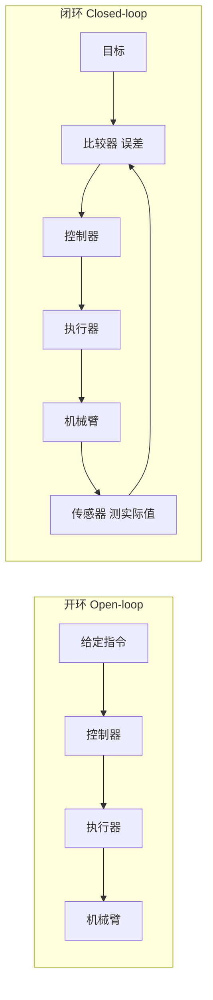

# 第十七讲 · 控制论：开环系统与闭环系统（Control Theory: Open-loop vs Closed-loop）

> **计划定位**：Day 17（P6 控制论与 PID）｜对应课程 068 控制论-开环系统 / 069 控制论-闭环系统
> **系列**：黑马程序员《具身智能》223 节学习笔记 · 第 17 天

## 1. 本讲在 60 天计划里的位置
P6（Day 17–20）正式进入“控制论与 PID”——这是把前面运动学（FK/IK 算出的目标角度）真正变成“机械臂稳定、准确动起来”的桥梁。今天先建立最底层的概念：**开环 vs 闭环**。

## 2. 核心知识点

### 2.1 控制论在说什么
控制论（Cybernetics）研究的是“**如何让一个系统按我们想要的方式运行**”。在机械臂里，系统 = 机械臂，我们想要的方式 = 到达指定角度 / 位置。

### 2.2 开环系统（Open-loop）
- 结构：给定指令 → 控制器 → 执行器 → 被控对象。**没有反馈**。
- 含义：我发“转到 30°”，至于它到底转到没、转到多少，我**不回头看**。
- 例子：老式洗衣机定时、微波炉定时加热、普通灯开关。
- 优点：便宜、结构简单、不依赖传感器。
- 缺点：**不准**。负载变了、摩擦变了、电压掉了，结果就偏了，系统自己发现不了。

### 2.3 闭环系统（Closed-loop / 反馈控制）
- 结构：给定指令 → 比较器（算误差） → 控制器 → 执行器 → 被控对象 → **传感器测实际值 → 反馈回比较器**。
- 含义：我发“目标 30°”，传感器实时测“现在 12°”，比较器算出误差 18°，控制器据误差加大输出，直到误差≈0。
- 关键：靠**反馈（feedback）**不断纠正误差。
- 例子：空调恒温、巡航定速，以及——**舵机本身就是一个闭环系统**（内部电位器/编码器测角度，驱动芯片不断纠偏到目标角）。

### 2.4 一句话对比
开环 = “我说了算，但不看结果”；闭环 = “我说目标，但一直盯着结果纠偏”。

## 3. 动手操作
画两张框图（下面给了 Mermaid，徒手也能画）：
- 开环：给定 → 控制器 → 执行器 → 机械臂（终点没有线回到起点）。
- 闭环：在开环基础上，从“机械臂”接一根线经“传感器”回到“比较器”，比较器再连“给定”。

## 4. 易错点（前人踩坑）
- **把“闭环”和“AI 控制”混淆**：PID 闭环是经典控制（几行公式），不需要神经网络。闭环 ≠ 智能，反馈 ≠ 大模型。
- 误以为开环“更简单所以更好”：在机械臂定位这种对精度敏感的场景，开环几乎不可用，必须用闭环。
- 反馈传感器装错/没标定 → 闭环用的是“假的实际值”，越纠越偏。

## 5. 阶段检查点（Day 20 末要能讲清）
能口述：开环不反馈、闭环靠反馈；舵机是闭环；PID 是闭环里最常用的控制器（下一天讲）。

## 6. DEA 交叉链接（轻量，非主线）
软体执行器 / 介电弹性体（DEA）做闭环控制时，**反馈这一步更难**：
- 刚性舵机有编码器直接报角度；DEA 是薄膜形变，没有现成“角度编码器”，要靠电容变化、柔性应变传感或机器视觉来估计形变/位置（即 soft proprioception）。
- DEA 的驱动量是**电压/电场**而非关节角，控制目标是“形变/出力”，且存在明显**迟滞（hysteresis）**——同一电压对应不同形变取决于历史，纯 PID 难压住，常需加前馈或查表补偿。
- 衔接：学 PID 时记住——“反馈准不准”决定了闭环上限；软体本体的反馈难，正是你导师方向（软体机器人控制）的核心难题之一。

---
*本讲严格对应《60 天计划》Day 17（P6）：068 控制论-开环系统 / 069 控制论-闭环系统。全程零军事内容。*
