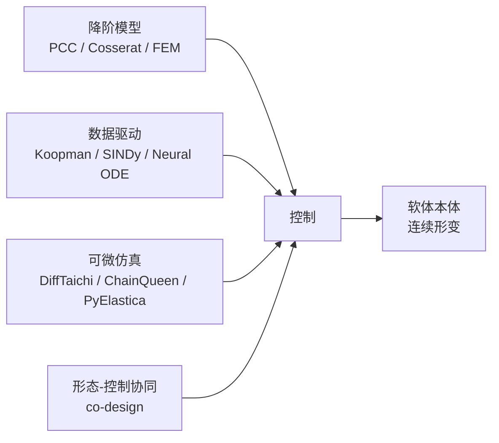
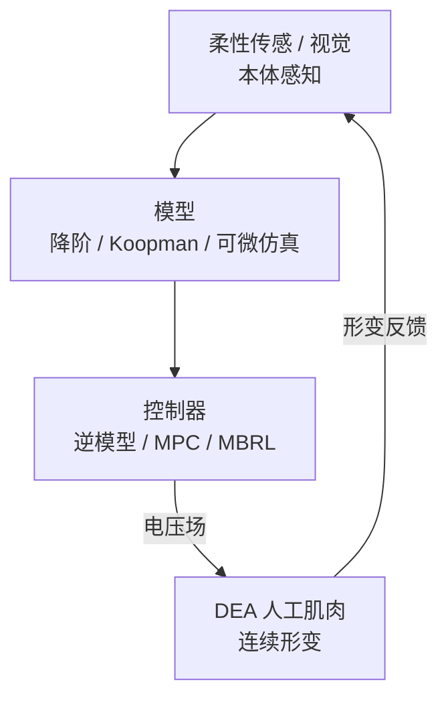

# 第十七讲 · 软体机器人建模与控制基础（Soft Robotics: Modeling & Control）

> **本讲信息**
> - 日期：2026-08-30（周六）
> - 第几讲：第十七讲（学习计划 Day 17，身体站深化第 1 天）
> - 对应计划：`study-plan-60d.md` 里 **P7 前沿与方向 · 身体站深化** 阶段
> - 今日目标：把「身体」这一站做深——刚性臂（Day 2）那套刚体建模在软体 / DEA 上彻底失效。今天搞懂软体为什么「难建模、难控制」，以及你（机械 + 材料底子）最该从哪条路切入。这是 Day 14 世界模型 / 可微仿真在「软体身体」上的具体落地。

---

## 0. 一句话总结

> 刚性机器人是「有限个关节角度」的**低维、可逆、干净**问题；软体 / DEA 是**无穷维、非线性、带迟滞（hysteresis）、状态还测不准**的问题。今天给你一张「软体建模与控制路线地图」，并指出：你的机械 + 材料底子，正好能吃下「降阶模型 + 数据驱动 + 可微仿真」这条最吃香的交叉路。

---

## 1. 核心知识点

### 1.1 为什么软体让经典机器人学「傻眼」

| 维度 | 刚性臂（Day 2） | 软体 / DEA |
|---|---|---|
| 自由度 | 6 个关节，有限 | 无穷维连续形变 |
| 建模 | 刚体动力学，闭式正逆解 | 偏微分方程，无干净逆解 |
| 状态 | 编码器直接读角度 | 形变不可直接测，需柔性传感近似 |
| 特性 | 线性近似够用 | 非线性 + 粘弹性 + 迟滞 |

> 类比：刚性臂像「用 6 个旋钮控制一根机械臂」；软体像「一整块果冻，你只能在外面通电让它整体变形」——你控制的是一场连续的物质舞蹈。

### 1.2 DEA 的驱动物理（给小畅的硬核补丁）

- 薄膜夹两层柔性电极，加电压后 **Maxwell 应力** `p = ε₀εᵣE²/2` 使膜变薄展宽 → 收缩 / 弯曲（Day 16 已铺垫）。
- 难点三座大山：**高压(kV) / 击穿 / 迟滞** + 粘弹性松弛。
- 这决定了：DEA 不是「给个电压就线性动」，而是「电压 → 电场 → 应力 → 形变」的强非线性映射，还带记忆效应（迟滞）。

### 1.3 软体建模的四条路（路线地图）

### 1.4 本体感知（proprioception）：状态从哪来

刚性臂靠编码器（Day 2）；软体没有编码器，靠：
- **视觉**（外摄相机看形变）、**电容 / 电阻式柔性传感**（嵌入本体）、**视触觉**（GelSight 路线）、**光纤 OTDR**（分布式应变）。
- 这正是 Day 1「本体感知站」在软体上的体现——也是你做「软体 + AI」闭环的第一个工程切口。

<mark>**📌 课件补充｜机械背景的最易上手切口**：降阶模型（常曲率 PCC、Cosserat 杆）先把软体「压成几条曲线」再谈控制；数据驱动里 **Koopman 算子**（Bruder et al., T-RO 2021）把非线性系统提升到线性空间，特别适合建模迟滞——这两类都不要求你先成为 AI 专家，机械 / 力学底子直接能用。</mark>

---

## 2. 原理（先抓这几条）

1. **软体的本质是「场」不是「关节」**：动作空间是连续形变场，传统 IL/RL 的离散低维动作要改造（预告 Day 18）。
2. **迟滞是天敌**：电压↑和电压↓走不同路径，必须 Preisach / Bouc-Wen 或数据模型补偿。
3. **可微仿真 = 白盒世界模型**（接 Day 14）：DiffTaichi 等能算梯度，直接反传优化「材料参数 + 控制器」，这是软体独有的红利。
4. **形态-控制协同设计（co-design）最适合「机械 + AI」发论文**：连本体形状一起优化，而非只调控制。

---

## 3. 一张图：软体控制的「感知–模型–控制」闭环

> 对比 Day 2 刚性闭环：那里是「指令 → 电机(有编码器) → 控制器」；这里传感是柔性的、模型是近似的、执行器是 DEA——三层都「软」了。

---

## 4. 今天的操作步骤

1. **读一遍本文件**，回看 Day 2（刚性执行器）和 Day 14（世界模型 / 可微仿真）。
2. **徒手画 §1.3 / §3 的图**：建模四路 → 控制 → 软体；感知 → 模型 → 控制 → DEA → 反馈。
3. **口头讲清**：软体为什么难建模、DEA 的三座大山、迟滞是什么、可微仿真为何是软体红利。
4. **（以后）** 跑一个 PyElastica 或 SOFA + SoftRobots 的软杆仿真，直观感受「无穷维」。
5. **镜子测试（3 分钟）：** *「软体和刚性臂建模差在哪___；DEA 驱动物理与三座大山___；迟滞是什么、怎么治___；可微仿真为什么是软体红利___；形态-控制协同为什么适合你发论文___。」*

> ✅ **今天「做完」的标准：** 能讲清软体建模难点 + DEA 物理 + 可微仿真红利 + 过镜子测试。

---

## 5. 常见误区 & 容易踩的坑

| # | 误区 | 真相 |
|---|---|---|
| 1 | "软体就是刚性臂换种材料。" | 无穷维 + 迟滞 + 状态测不准，整套方法论要重来。 |
| 2 | "直接上 PPO 训软体就行。" | 样本贵 + 会老化 / 击穿，纯 MFRL 通常不现实，要走 model-based。 |
| 3 | "DEA 给电压就线性动。" | Maxwell 应力平方关系 + 迟滞，强非线性带记忆。 |
| 4 | "没有编码器就没法控。" | 柔性传感 + 视觉近似状态，是可解的标准问题。 |
| 5 | "机械背景做不了软体 AI。" | 降阶模型 / Koopman / co-design 正是机械底子最吃香的交叉。 |

---

## 6. 下一步 / 检查点

- **过了检查点 =** 讲清软体建模难点 + DEA 物理 + 可微仿真红利 + 过镜子测试。
- **下一讲（Day 18）：** **DEA 人工肌肉的具身智能接口**——电压场动作空间如何重写 IL/RL，MPC + 世界模型怎么驱动软体，把 Day 11 / 13 / 14 全接进来。

---

## 7. 训练营实操回顾（来自 SO-101，反差对照）

1. **SO-101 是「干净刚性世界」的甜区。** 6 个舵机角度 + 编码器，ACT/DP 直接学；这让你体会了「低维可逆」有多舒服。
2. **但真实课题是另一极。** 你的 DEA 没有编码器、动作是电压场、形变测不准——训练营的「舒服」正衬托出软体方向的难，也衬托出你机械 + 材料底子的稀缺价值。

> 让我重来一次：**先吃透刚性那套（已做），再钻软体这套（现在开始）**——两极端都懂，才算具身智能的「身体」专家。

---

### 参考资料（先放着，今天不要求）
- Rus & Tolley (2015). *Design, fabrication and control of soft robots*. Nature.
- Carpi et al. (2008). *Dielectric elastomers as electromechanical transducers*.
- Bruder et al. (2021). *Koopman-based modeling for soft robotics*. IEEE T-RO.
- 可微仿真：DiffTaichi (SIGGRAPH 2021)、ChainQueen (RSS 2019)、PyElastica、SoMo、DiSECt.
- 建模：常曲率 PCC、Cosserat 杆、SOFA + SoftRobots 插件.